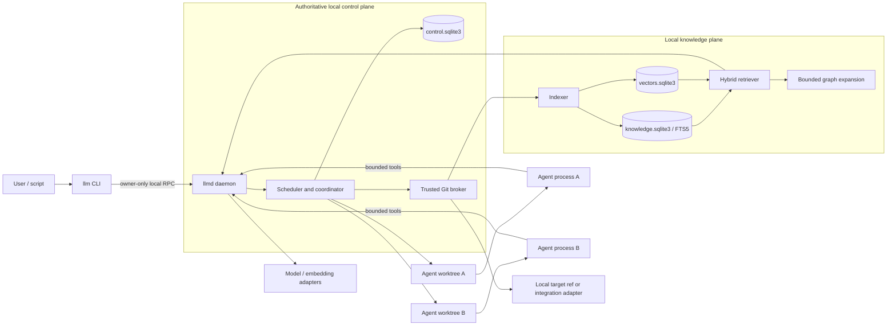
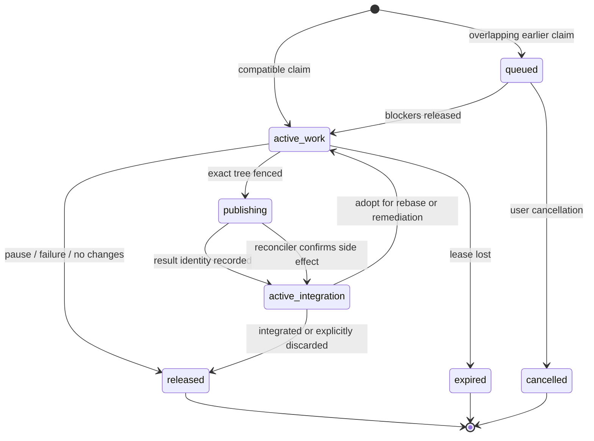

# Local-first multi-agent LLM CLI implementation plan

Status: proposed design for implementation

> **Workspace coordination revision:** the mandatory-worktree, exclusive claim,
> FIFO queue, and integration-reservation design in this document is superseded
> by [`multi-session-workspace-modes-implementation-plan.md`](multi-session-workspace-modes-implementation-plan.md).
> The newer plan makes shared checkout mode the default, isolated worktrees
> opt-in, and deterministic change batches/session cursors the coordination
> authority.

Target repository: the root of this repository

Reference implementation:
[`v4/docs/repository-coordination-plan.md`](../../v4/docs/repository-coordination-plan.md)

## 1. Executive summary

Build a local-first `llm` command-line application that can run one or many
coding agents without allowing cooperative agents to overwrite one another's
work. The tool should also be able to index local repositories and selected
local sources into a bounded hybrid retrieval store, with an optional derived
knowledge graph.

The proposed architecture has five important properties:

1. A per-user background daemon is the only writer to the authoritative
   coordination database. CLI invocations and agent processes request work over
   an owner-only local socket.
2. Every editing agent receives its own Git worktree. Worktrees isolate file
   contents, while durable path claims coordinate intent and integration.
3. The daemon grants monotonically fenced, expiring work leases. A stale,
   duplicated, or resumed agent cannot validate or integrate work with an old
   fencing token.
4. Completed but unintegrated work retains a non-expiring integration
   reservation. A later overlapping task waits until the work is integrated,
   rebased and adopted, or explicitly discarded.
5. Retrieval is local-first and non-authoritative. SQLite FTS5 supplies lexical
   search, an interchangeable vector adapter supplies semantic search, and
   relational graph tables supply bounded expansion. Git and the coordination
   database remain the authorities for source and write ownership.

The initial implementation should be Python 3.12, distributed as a normal
Python package with a console entry point. It should use the standard `sqlite3`
module directly for explicit transactions, Pydantic models at process and
plugin boundaries, and a small provider abstraction for model and embedding
backends. The design deliberately avoids making a vector extension, graph
server, Docker daemon, cloud database, or remote service necessary for basic
operation.

The working command name in this document is `llm`. It is provisional. Before
publishing a package, perform the naming and executable-collision check in Phase
0 and rename the distribution or executable if necessary.

## 2. Why ordinary worktrees are insufficient

Git worktrees isolate checked-out files and branches, but they do not coordinate
planned intent. Two agents can start at the same base revision, independently
change the same file, pass their own tests, and discover the conflict only when
one tries to integrate. The wasted model time has already been spent.

The system must coordinate five related concerns:

1. **Intent** — the exact files, directory prefixes, or repository-wide scope a
   task expects to change.
2. **Authority** — the live task and fencing token currently allowed to validate
   and integrate that scope.
3. **Isolation** — the worktree and process boundary in which the task edits.
4. **Integration** — whether completed work remains unmerged or is represented
   by an open pull request and can still conflict with later work.
5. **Context** — the revisions, paths, checks, summaries, and decisions that a
   later task should inspect before starting.

This is a local distributed-systems problem. Processes can be killed, a machine
can reboot, clocks can move, a model request can time out, Git can succeed just
before the caller crashes, and a parent agent can try to spawn two children with
overlapping assignments. Correctness must not depend on an in-memory mutex or a
well-behaved terminal session.

## 3. Goals

- Prevent cooperative agents from concurrently editing or integrating
  overlapping repository path scopes.
- Allow tasks with disjoint scopes to execute concurrently.
- Give overlapping tasks deterministic FIFO ordering without blocking later
  tasks that are disjoint from every earlier reservation they would overtake.
- Fence stale, duplicated, retried, and resumed processes.
- Retain authority across the dangerous validation-to-integration interval.
- Preserve completed, unintegrated branches or open pull requests as active
  reservations.
- Support parent agents that delegate disjoint sub-scopes to child agents.
- Keep the main user worktree untouched unless the user invokes an explicit
  integration command.
- Recover from daemon, CLI, agent, Git, and machine crashes without manual
  database editing.
- Provide useful, bounded handoffs between tasks.
- Provide repository-aware lexical search with no model or embedding service.
- Add semantic retrieval and graph expansion without making either a
  coordination authority or availability dependency.
- Support cloud model providers, local model endpoints, and external agent
  drivers behind stable interfaces.
- Make repository code transmission to a remote embedding or model provider an
  explicit configuration decision.
- Work in non-interactive scripts with structured JSON/NDJSON output and stable
  exit codes.
- Offer `off`, `observe`, and `enforce` coordination modes for rollout.

## 4. Non-goals

- Protect the repository from a malicious process running as the same OS user.
  A same-user process can bypass a cooperative CLI, alter Git refs, or edit the
  SQLite files directly. OS/container sandboxing can reduce accidents but is a
  separate security boundary.
- Prove that disjoint file changes are logically compatible. Path claims do not
  understand every cross-file invariant.
- Automatically merge every completed task.
- Make an LLM-generated path plan authoritative. Trusted Git output defines the
  final changed-path set.
- Replace Git commits, code review, pull requests, tests, or branch protection.
- Store hidden reasoning or full model transcripts in the knowledge index by
  default.
- Require Neo4j, MongoDB, Redis, Postgres, a container runtime, or a remote
  vector database.
- Treat semantic similarity as a lock. Semantic retrieval can suggest paths;
  only normalized claims grant write authority.
- Index secrets, Git internals, ignored files, binary blobs, or unbounded build
  output.
- Coordinate different machines in the first release. SQLite WAL state is
  explicitly same-host. A future remote coordinator must implement the same
  contracts with a genuinely distributed store.

## 5. Design principles and invariants

The following are non-negotiable implementation invariants.

1. `control.sqlite3` is the sole coordination authority.
2. The daemon is the sole ordinary writer to `control.sqlite3`.
3. A cache, event notification, PID file, worktree directory, Git branch, model
   response, or agent claim ID cannot grant authority by itself.
4. Every mutating coordination operation is repository-scoped and executed in
   one `BEGIN IMMEDIATE` transaction.
5. Every grant or adoption receives a monotonically increasing fencing token.
6. Renewal, validation, delegation, and integration must match task, claim,
   repository, state, fence, and unexpired lease.
7. Publication/integration intent becomes durable before the external Git or
   provider side effect starts.
8. `publishing` and `active_integration` do not expire by time.
9. Active and queued rows never have a retention TTL.
10. Only trusted `git diff --name-status -z`/tree inspection defines changed
    paths.
11. Changed paths must be fully covered by the task's current effective scope.
12. A path discovered outside scope causes replan/reacquisition; the agent does
    not silently widen its own claim.
13. Agent work occurs in a linked worktree, never in the user's primary
    worktree.
14. The user must explicitly authorize mutation of the primary worktree or
    target ref.
15. Repository source and user-authored memory are distinct from derived
    lexical, vector, and graph projections.
16. Retrieval fails closed on repository scope and fails open on optional
    ranking enhancements: lexical-only operation remains available if vectors
    or graph expansion fail.
17. Retrieved text, handoff summaries, repository instructions, filenames, and
    model output are untrusted content.
18. Secrets never enter task prompts, retrieval chunks, events, handoffs, or
    structured logs.
19. Repository-local executable plugins are disabled unless the user explicitly
    trusts that project.
20. State-directory overrides create a separate coordination domain and must
    produce a prominent warning because two domains cannot protect each other.

## 6. Trust model

### 6.1 Trusted components

- The installed `llm` CLI package.
- The per-user `llmd` daemon.
- The control and knowledge storage modules.
- The trusted Git inspection and integration module.
- Built-in path validation and write tools.
- Explicitly installed user-level plugins.

### 6.2 Untrusted inputs

- User prompts.
- Repository files, symlinks, filenames, hooks, attributes, and Git config.
- Model responses and tool arguments.
- External agent stdout/stderr.
- Retrieved chunks and graph labels.
- Imported documents.
- Provider response bodies and error messages.
- Project-local `.llm/` configuration until the user has trusted the project.

### 6.3 Cooperative but not secure isolation

The built-in agent runner should expose bounded read, search, write, patch,
shell, retrieval, and delegation tools. Its write tools must enforce worktree
and effective-scope boundaries. Shell commands and external agent drivers can
still bypass those checks as the same OS user. Therefore:

- integration always revalidates the exact Git object graph and changed paths;
- the agent process does not receive provider publication credentials where a
  broker adapter can avoid it;
- the environment passed to child processes is allowlisted and stripped of
  unrelated secrets;
- external drivers are labeled `cooperative` unless they run inside a supported
  OS sandbox; and
- documentation must not claim this is a hostile-code sandbox.

## 7. Chosen technology baseline

### 7.1 Language and packaging

- Python 3.12 as the initial runtime.
- `uv` for locked development and tool installation.
- `pyproject.toml` with a `llm` console script and a private `llmd` daemon entry
  point.
- Pydantic 2 models for RPC, provider, plugin, and persisted payload validation.
- Direct `sqlite3` access rather than an ORM, so transaction modes, compare-and-
  swap predicates, and query plans remain visible in code review.
- `asyncio` for process, socket, streaming, and scheduler orchestration; SQLite
  work runs through a bounded executor or short synchronous critical sections.
- `pytest`, Hypothesis, Ruff, and mypy/pyright for verification.

Python is selected because the reference coordination algorithm is Python,
the existing v4 system already uses Pydantic provider abstractions, SQLite is in
the standard library, and local index/embedding integrations are readily
available. This is a design choice, not a mandate to copy v4's cloud service
layers.

### 7.2 Storage

Use three files under the per-user data directory:

| File | Purpose | Authority | Durability mode |
| --- | --- | --- | --- |
| `control.sqlite3` | tasks, claims, fences, worktrees, events, handoffs, publication intents | authoritative | WAL, `synchronous=FULL` |
| `knowledge.sqlite3` | source registrations, user memory, documents, chunks, FTS, graph facts | mixed; user memory is authoritative, repository data is rebuildable | WAL, `synchronous=NORMAL` |
| `vectors.sqlite3` | vector projection and vector-backend metadata | disposable | WAL, rebuildable |

Splitting control from indexing prevents a large embedding or FTS update from
delaying a claim renewal. Splitting vectors allows a native extension or model
migration to be replaced without touching coordination state.

SQLite WAL allows concurrent readers and a writer on the same host but permits
only one writer and is not appropriate for a network filesystem. The daemon's
single-writer design embraces those constraints. `llm doctor` must reject or
strongly warn about state directories detected on network filesystems.

### 7.3 Retrieval

- SQLite FTS5/BM25 for the mandatory lexical arm.
- A `VectorIndex` interface with these implementations:
  - `none`: lexical-only, always available;
  - `exact`: embeddings stored as compact float blobs and exact cosine scoring
    in bounded batches for small indexes/testing;
  - `sqlite_vec`: optional `sqlite-vec` projection if its pinned build passes
    platform packaging, corruption, deletion, and migration tests;
  - future plugin adapters for a local vector server.
- Relational property-graph tables and recursive CTEs for bounded graph
  expansion. Neo4j is intentionally unnecessary for local scale.

`sqlite-vec` is currently an optional, non-authoritative acceleration path. The
project must pin a reviewed release and never make the extension loadable in the
control database.

### 7.4 LLM and embedding providers

Define separate interfaces for chat/tool models and embeddings. The first
release should support:

- one built-in hosted model adapter;
- an OpenAI-compatible local HTTP adapter;
- an external-process agent adapter for tools such as an installed coding-agent
  CLI; and
- a lexical-only configuration requiring no model for `llm search`.

Provider-specific SDKs and model names belong in adapters. The scheduler,
coordinator, storage layer, and tool broker must not import provider SDK types.

## 8. High-level architecture



The control and knowledge planes share identifiers but not authority. Retrieval
may inform planning and provide context; it cannot grant, renew, expand, or
release a claim.

## 9. Filesystem layout

Use platform-appropriate directories through a small `paths` module. On Unix,
follow XDG where available. A representative layout is:

```text
$XDG_CONFIG_HOME/llm-cli/
  config.toml
  profiles/<profile>.toml

$XDG_DATA_HOME/llm-cli/
  control.sqlite3
  knowledge.sqlite3
  vectors.sqlite3
  backups/
  objects/sha256/ab/<full-hash>
  worktrees/<repo-id>/<task-id>/
  artifacts/<task-id>/
  plugins/

$XDG_STATE_HOME/llm-cli/
  logs/llmd.jsonl
  crash-reports/

$XDG_RUNTIME_DIR/llm-cli/
  llmd.sock
  llmd.pid
  llmd.lock
```

Requirements:

- Data, config, runtime, and logs directories are owner-only (`0700` on Unix).
- The socket and database files are owner-only (`0600`).
- The state path is never inside a repository by default.
- Repository IDs and task IDs, not repository names or prompts, form directory
  names.
- Artifact filenames are fixed by the application, not model-provided text.
- A startup check rejects symlinks in security-sensitive state-path components.
- Backup uses SQLite's backup API after a bounded checkpoint; copying only the
  main file while a WAL exists is prohibited.
- `vectors.sqlite3` and derived repository objects may be omitted from backups.

## 10. Local daemon and RPC

### 10.1 Daemon lifecycle

The first CLI command requiring state should:

1. Try the local socket.
2. Validate the daemon protocol version and profile ID.
3. If absent, acquire a startup file lock and spawn `llmd` detached.
4. Wait for a bounded readiness handshake.
5. If startup fails, print the sanitized error and log path.

The daemon records PID, executable version, protocol version, boot ID, and
process start time. PID alone is never used as identity because PIDs are reused.
Only one daemon may own a state directory. A second daemon exits rather than
opening another write connection.

### 10.2 Protocol

Use versioned JSON-RPC-like request envelopes over an owner-only Unix domain
socket, with a named-pipe abstraction reserved for Windows. Use length-prefixed
JSON for requests/responses and NDJSON frames for event streams.

Every request contains:

- `protocol_version`;
- `request_id` (UUIDv7 or equivalent sortable ID);
- `method`;
- validated `params`;
- optional idempotency key;
- CLI version and profile ID.

Every response contains:

- the same `request_id`;
- `ok`;
- a typed result or stable error code;
- daemon revision where relevant;
- no raw exception traceback unless debug mode is explicitly enabled.

Streaming frames contain monotonically increasing `event_sequence`, `task_id`,
event kind, timestamp, and a bounded payload. A reconnecting CLI supplies its
last sequence and replays from the durable event table.

### 10.3 Stable error classes

At minimum:

- `CONFIG_INVALID`;
- `DAEMON_UNAVAILABLE`;
- `PROTOCOL_MISMATCH`;
- `REPOSITORY_NOT_FOUND`;
- `REPOSITORY_UNSAFE`;
- `CLAIM_QUEUED`;
- `CLAIM_STALE`;
- `SCOPE_VIOLATION`;
- `TASK_NOT_MUTABLE`;
- `WORKTREE_DIRTY`;
- `TARGET_MOVED`;
- `INTEGRATION_CONFLICT`;
- `PROVIDER_UNAVAILABLE`;
- `PROVIDER_AMBIGUOUS`;
- `INDEX_UNAVAILABLE`;
- `APPROVAL_REQUIRED`;
- `INTERNAL_RECOVERABLE`.

Map stable classes to documented nonzero exit codes. JSON mode returns the code
as data and never adds human prose to stdout.

## 11. Repository identity

### 11.1 Canonical discovery

From any path, trusted Git resolves:

- the absolute real path of the worktree;
- `git rev-parse --path-format=absolute --git-common-dir`;
- object format (`sha1` or `sha256`);
- target ref and resolved base object ID;
- normalized primary remote identity if configured;
- whether the repository is bare, shallow, sparse, or has submodules;
- the main worktree path from `git worktree list --porcelain -z`.

Do not parse human-formatted Git output when a `-z` or machine-readable form is
available. Disable pager, color, credential prompts, replacement objects, and
untrusted hooks/config for trusted inspection commands.

### 11.2 Coordination key

For repositories with a configured remote integration target:

```text
repo_key = sha256(
  profile_id NUL integration_adapter_id NUL normalized_remote_id NUL target_ref
)
```

For local-only repositories without a remote:

```text
repo_key = sha256(
  profile_id NUL "local" NUL realpath(git_common_dir) NUL target_ref
)
```

The profile ID prevents accidental cross-profile data disclosure, but the CLI
must warn that two profiles coordinating the same repository do not share
locks. Remote URL normalization removes credentials, normalizes host case, and
canonicalizes supported SSH/HTTPS forms to one host/owner/repository identity.
Target refs retain Git's case sensitivity.

### 11.3 Repository registration

`llm repo add [PATH]` records:

- repository ID and opaque coordination key;
- display name;
- common Git directory and main worktree real paths;
- normalized remote identity without credentials;
- default target ref;
- integration adapter;
- coordination mode;
- project trust state;
- index policy and last indexed revision;
- created, updated, and last-seen timestamps.

Moving a repository should be repairable with `llm repo repair`. Changing its
remote or common directory requires explicit confirmation if it changes the
coordination key.

## 12. Scope model

### 12.1 Path scopes

A work claim contains one or more normalized scopes:

| Syntax | Meaning |
| --- | --- |
| `src/parser.py` | one exact path |
| `src/parsing/` | every path under a directory prefix |
| `*` | whole repository |

Normalization must:

- convert separators to `/`;
- trim outer whitespace but never alter inner filename characters;
- reject absolute paths, `~`, drive prefixes, UNC paths, NUL bytes, empty
  components, `.`, `..`, and `.git` components;
- reject paths longer than 1,000 characters and more than 500 scopes per claim;
- preserve a trailing `/` only for directory scopes;
- collapse duplicates;
- collapse child scopes under an already reserved parent directory;
- collapse everything to `*` if whole-repository scope is present;
- use Git's repository-relative, case-sensitive path spelling; and
- detect case-fold aliases on case-insensitive filesystems during validation.

An empty, invalid, incomplete, or low-confidence plan falls back to `*`.
Safety wins over concurrency.

### 12.2 Overlap

Two scopes overlap when:

- either is `*`;
- exact paths are equal;
- a directory scope contains the other exact path; or
- either directory scope contains the other directory scope.

Rename and copy validation considers both source and destination paths changed.
Submodule gitlinks count as their containing path. Deletions still require
coverage.

### 12.3 Optional virtual conflict domains

After path claims are proven, add repository policy rules that expand certain
files into virtual scopes, for example:

```toml
[[coordination.rules]]
paths = ["pyproject.toml", "uv.lock"]
virtual_scope = "@dependencies/python"

[[coordination.rules]]
paths = ["migrations/**"]
virtual_scope = "@database/schema"
```

Virtual scopes overlap only on exact virtual identity and are never passed to
Git changed-path coverage. They reduce logical conflicts for lockfiles,
migrations, generated clients, and shared schemas. They must remain opt-in until
observe-mode data shows the rules are useful. The base algorithm works with
paths alone.

### 12.4 Scope planning

The planning stage is read-only and may use:

- the user-supplied `--scope` values;
- `git ls-files` and repository instructions;
- exact path/symbol retrieval;
- hybrid RAG results;
- a bounded read-only model planning turn; and
- project policy expansions.

The structured plan must return:

- summary and acceptance criteria;
- planned exact and directory paths;
- confidence per scope;
- tests likely to run;
- dependencies on other tasks;
- whether whole-repository fallback is required;
- a proposed child-task decomposition, if any.

The daemon validates and normalizes this object. A model cannot submit a claim
directly.

## 13. Claim and task state machines

Task lifecycle and claim lifecycle are separate. A task can finish its model
work while its claim remains in integration.

### 13.1 Claim states



State meanings:

- `queued`: durable position, no worktree launch and no write authority.
- `active_work`: renewable lease and current fencing token.
- `publishing`: durable, non-expiring integration intent exists; overlapping
  work remains blocked until outcome is known.
- `active_integration`: a validated task branch, exported change, local pending
  application, or open pull request can still conflict. No time expiry.
- `released`, `expired`, `cancelled`: terminal audit states eligible for later
  retention cleanup.

### 13.2 Task states

Suggested task states:

```text
created -> planning -> waiting_for_repository -> preparing -> running
running -> awaiting_clarification -> planning
running -> reviewing -> ready_for_integration
ready_for_integration -> integrating -> completed
any ordinary pre-publication state -> failed | cancelled
integrating -> integration_pending | completed | operator_attention
```

The task row also carries a separate `coordination_state`. Never infer claim
authority from the public task state.

### 13.3 Lease constants

Start with the proven v4 timing model:

- initial launch lease: 10 minutes;
- renewable work lease: 90 seconds;
- renewal interval: 30 seconds;
- daemon reconciliation interval: 30 seconds locally;
- terminal claim retention: 30 days;
- handoff retention: configurable, default 90 days;
- publication/integration reservations: no TTL.

The daemon starts renewal before worktree preparation and process launch. A
failed launch releases immediately; the lease is only a crash backstop.

### 13.4 Fencing predicate

Renew, validate, delegate, begin integration, and accept child output only when
all match:

```text
repo_key
task_id
claim_id
state = active_work
fencing_token
lease_expires_at > effective_now
task generation / attempt
```

The worker never decides that its lease is valid from local memory. The daemon
performs an authoritative compare-and-swap. On failure, tool mutation stops,
the child process is interrupted, and the worktree is preserved for diagnosis.

## 14. Queue algorithm and fairness

Each repository head owns `next_queue_sequence`, `next_fencing_token`, and a
revision. Claim request and release update that head in a transaction.

### 14.1 Request algorithm

1. Canonicalize repository identity and scopes before the transaction.
2. Begin `BEGIN IMMEDIATE` on `control.sqlite3`.
3. Upsert/read the repository head and increment queue sequence.
4. If this task generation already has a live claim, return it idempotently.
5. Expire truly stale `active_work` claims using a compare-and-swap predicate.
6. Activate older compatible waiters before considering the new request.
7. Read all contending claims in queue order.
8. A live or earlier queued overlapping claim is a blocker.
9. Insert the new claim as `queued` if blockers exist.
10. Otherwise increment the fencing counter, insert `active_work`, and attach
    the launch lease.
11. Append an event and outbox wakeup in the same transaction.
12. Commit, then let the scheduler act on the durable result.

Queued claims must block newer overlapping requests. Without that rule, a
stream of narrow newcomers can starve an earlier `*` waiter.

### 14.2 Activation algorithm

On release/expiry, scan queued claims in increasing sequence:

- keep a set of live active/integration scopes;
- keep scopes of earlier queued claims that remain blocked;
- activate a queued claim only if it overlaps neither set;
- assign a fresh fencing token and launch lease;
- continue scanning so multiple mutually disjoint waiters can activate in one
  transaction;
- never let a later task overtake an earlier task it overlaps.

The resulting property is FIFO for overlapping work and concurrent progress
for disjoint work.

### 14.3 Cancellation and clarification

- Cancelling `queued` or ordinary `active_work` releases the claim.
- Cancelling `publishing` or `active_integration` does not release it; it marks
  the task cancelled while retaining the repository reservation.
- A clarification checkpoint saves the patch/tree, stops writes, and releases
  ordinary work authority. Reply creates a new attempt and reacquires a fresh
  fence.
- A retry never reuses a claim's old fence.

## 15. Parent/child agent delegation

Dynamic local subagents introduce a case not solved by independent path claims:
a parent that holds `src/` would block a child requesting `src/parser/`, while
allowing both to write would defeat the lock.

### 15.1 Task-group envelope

Represent a multi-agent task as:

- one external repository claim: the **group envelope**;
- one group coordinator worktree;
- zero or more internal **delegation leases** for disjoint sub-scopes; and
- an effective write set for the parent equal to the envelope minus live child
  delegations.

External tasks see the full envelope and remain blocked. Inside the group, the
daemon may permit parallel children only when their effective scopes are
disjoint.

### 15.2 Delegation transaction

To spawn a child:

1. Parent proposes a bounded subtask and sub-scopes.
2. Daemon validates that every sub-scope is covered by the parent envelope.
3. Daemon checks that it does not overlap another live delegation.
4. Parent tool writes to the proposed sub-scopes are frozen.
5. In one transaction, increment the repository fencing counter, insert a
   delegation row, and record the parent tree SHA/base generation.
6. Create a child worktree from that exact parent snapshot.
7. Start child renewal before launch.
8. Child tools receive only the delegated effective scope.

If the built-in runner cannot enforce parent write freezing—for example, the
parent is an unrestricted external CLI driver—concurrent dynamic delegation is
disabled. Such a driver may use serial children or daemon-scheduled peer tasks
with ordinary claims.

### 15.3 Child completion

1. Stop child mutations and compute the exact child tree, patch hash, and
   changed paths.
2. Verify child claim, fence, lease, base tree, and scope coverage.
3. Verify the parent has not changed delegated paths since the recorded base.
4. Apply/merge the child result into a temporary integration index or disposable
   merge worktree; never trust a patch created by the model.
5. Run configured child checks.
6. Atomically record the accepted child result and end the delegation.
7. Update the parent snapshot/generation and return the delegated paths to the
   parent effective write set under a fresh parent-side generation.
8. Attach a bounded child handoff and notify the parent.

A failed merge leaves the delegation in `needs_rebase` and does not return the
scope until explicitly resolved or discarded. Sibling output acceptance is
serialized even when sibling implementation is parallel.

### 15.4 Delegation constraints

- Maximum depth: 2 initially.
- Maximum concurrent children per group: 4 initially.
- Maximum total children per task: 16.
- No child may broaden the group envelope.
- A child needing broader paths asks the parent to stop, replan, release, and
  reacquire the envelope.
- A child cannot integrate to the repository target or publish a PR directly.
- Parent completion waits for every delegation to become terminal.

## 16. Git worktree lifecycle

### 16.1 Preparation

For a granted task:

1. Resolve and store the exact base object ID for the target ref.
2. Refuse unsafe repositories or unsupported object formats unless explicitly
   handled.
3. Create a detached linked worktree under the data directory at the base ID.
4. Lock the worktree with a reason containing only the task ID.
5. Create an internal task ref such as `refs/llm/tasks/<task-id>` with an atomic
   `git update-ref <new> <new-sha> <expected-old>` operation.
6. Disable automatic Git credential prompts and remove credential environment
   variables from the child.
7. Apply trusted, declarative setup without repository-local executable hooks
   unless project trust is enabled.
8. Record worktree path, branch/ref, base SHA, process identity, and launch time.

Use linked worktrees because Git explicitly supports multiple working trees for
one repository. Never emulate them by copying `.git` directories.

### 16.2 During work

- The built-in write tools reject realpath/symlink escapes, `.git`, state
  directories, and paths outside the effective scope.
- After every mutating tool call, capture a bounded changed-path fingerprint.
- Before and after shell calls, compare Git status/diff paths and stop on scope
  violations.
- Do not run repository hooks in trusted validation.
- Do not allow the agent to change Git config, remotes, attributes that alter
  trusted export, or the target ref.
- Store large stdout/stderr in bounded artifact chunks; events carry IDs and
  summaries.

### 16.3 Cleanup

- Ordinary no-change, failed, or discarded tasks remove their worktree only
  after the task and claim transactions are terminal.
- Completed branches remain until integration/discard and retention policy
  permit cleanup.
- Cleanup verifies the path is exactly a registered managed worktree before
  removal.
- Never recursively delete a path derived only from configuration, model text,
  or an environment variable.
- If Git administrative metadata and the filesystem disagree, quarantine and
  report; do not force-prune automatically.

## 17. Agent runtime

### 17.1 Driver interface

```python
class AgentDriver(Protocol):
    async def plan(self, request: PlanningRequest) -> PlanningResult: ...
    async def run(self, request: RunRequest, tools: ToolBroker) -> RunResult: ...
    async def interrupt(self, execution_id: str) -> None: ...
    async def resume(self, request: ResumeRequest, tools: ToolBroker) -> RunResult: ...
```

Driver capabilities declare:

- supported model providers;
- structured output;
- tool calling;
- streaming;
- resumable sessions;
- built-in scope enforcement;
- nested delegation;
- local/remote data transmission behavior;
- token/usage reporting.

The scheduler chooses only drivers whose capabilities meet the task policy.

### 17.2 Built-in execution passes

Default coding workflow:

1. **Read-only planning** — inspect instructions, tree, retrieval, and selected
   files; produce planned scope and acceptance criteria.
2. **Claim acquisition** — queue or grant normalized scope.
3. **Implementation** — edit only effective paths and run targeted checks.
4. **Independent review** — use a fresh model session or configured reviewer to
   inspect the exact diff and test evidence.
5. **Repair** — bounded implementation/review loop.
6. **Trusted validation** — daemon reconstructs exact changed paths, tree, patch
   hash, and allowed Git object graph.
7. **Ready/integration** — record summary and wait for explicit policy/user
   integration.

Default limits must be configuration-driven and bounded:

- task wall clock: 2 hours;
- planning reads: 200 files/2 MiB total by default;
- tool calls: warn at 500, hard cap per policy;
- single tool output: 64 KiB returned to the model;
- terminal artifact chunk: 4 KiB;
- retrieval query: 500 characters;
- retrieval results: 8;
- hydrated retrieval text: 6,000 characters per result, 32,000 total;
- child depth/concurrency as defined above.

### 17.3 Model tools

Initial built-in tools:

- `list_files`, `read_file`, `search_text`, `read_diff`;
- `write_file`, `apply_patch`;
- `run_command` with policy and bounds;
- `search_knowledge`, `read_knowledge_chunk`;
- `graph_neighbors` for grounded node IDs;
- `delegate_task` when the driver supports it;
- `ask_user`;
- `validate_changes`;
- `finish_task`.

The model never receives raw coordination database access, fencing counters,
provider credentials, or a generic integration/push tool.

## 18. Trusted validation and integration

### 18.1 Canonical validation output

Trusted validation returns a versioned object containing:

- task, claim, attempt, and fence identity;
- base commit and current target commit;
- result tree and optional commit ID;
- canonical changed paths including rename source/destination;
- patch SHA-256 over a canonical binary-safe export;
- file count, insertion/deletion counts, and total patch bytes;
- submodule, symlink, mode, and binary-change flags;
- test/check results with bounded artifact references;
- scope coverage result;
- validation policy revision and timestamp.

The full patch is an artifact, not an event or handoff field.

### 18.2 Begin integration

In one control transaction:

1. Reassert live work claim and fencing predicate.
2. Reassert scope coverage.
3. Store canonical validation identity.
4. Transition claim to `publishing`.
5. Insert an idempotent publication intent keyed by claim and result tree.
6. Remove the expiring work lease.
7. Append event/outbox records.

Only after commit may the trusted Git/integration adapter mutate a ref, main
worktree, or remote provider.

### 18.3 Integration strategies

#### Branch-only default

- Create/update the internal task branch with compare-and-swap.
- Store branch and result commit identity on the publication intent first.
- Promote to `active_integration`.
- Do not touch the user's primary worktree.
- Release only after target contains the result, or the user explicitly
  discards the result.

#### Explicit local integration

`llm task integrate TASK_ID --strategy merge|cherry-pick|apply` is a deliberate
mutation. Before acting:

- verify the primary worktree is on the expected target and clean;
- verify target ref equals the stored expected old SHA;
- verify task result and claim are current;
- create a durable intent with recovery details;
- use a temporary index or Git's sequencer with recorded pre-state;
- on conflict, preserve diagnostics and safely restore only state created by
  this operation; never discard pre-existing user changes;
- after success, verify target tree/object ancestry, promote/release, index the
  new target, and clean managed worktree state.

If the primary worktree is dirty or target moved, refuse and require rebase or a
different strategy. Never update a checked-out branch behind the user's
worktree with a blind `update-ref`.

#### Pull-request integration adapter

- Revalidate repository/remote/target and expected remote SHA.
- Store intent before push/create.
- Push only the generated task ref through the trusted adapter.
- Record provider PR identity on the claim before updating the public task row.
- Promote to `active_integration`.
- Poll/reconcile provider state or consume verified webhooks if a local webhook
  service is explicitly configured.
- Release only when the provider reports merged/closed or the reservation is
  explicitly and safely discarded.

#### Patch export

- Export a canonical patch/bundle to an application-owned artifact path.
- Keep `active_integration` until the user marks it discarded or the daemon can
  prove the target includes the result.
- A mere file download is not integration.

### 18.4 Rebase/remediation adoption

Adopting completed/open work:

- confirms result branch or PR identity belongs to the same repository target;
- transfers the existing reservation to a new task/attempt;
- assigns a new fencing token and launch lease;
- starts from the exact current result head;
- retains the same external envelope;
- validates expected target/remote SHA before update; and
- returns to `active_integration` after new validation.

## 19. Handoff context

Store a bounded, idempotent handoff per accepted result. It contains:

- task/group/claim identity;
- base, result, and target revisions;
- patch and tree hashes;
- normalized changed paths;
- tests/checks and artifact IDs;
- sanitized summary, decisions, known limitations, and follow-up suggestions;
- child handoff references;
- branch or PR identity;
- creation, integration, and retention timestamps.

It does not contain:

- raw diffs;
- repository bodies beyond short explicitly bounded snippets;
- hidden reasoning;
- complete transcripts;
- provider payloads;
- tokens or credentials;
- unbounded terminal output.

Handoff text is model output and must be clearly delimited as untrusted. A later
agent must inspect the named revisions and current repository rather than
treating the handoff as fact. Handoffs may be indexed as a separate source only
when task-memory indexing is enabled.

## 20. Authoritative control data model

All primary keys should be opaque sortable IDs. Store UTC timestamps as a
single canonical integer representation, not mixed text formats. Use foreign
keys, check constraints, and explicit indexes. Every schema change is a numbered
transactional migration.

### 20.1 `repositories`

Key fields:

- `repository_id` primary key;
- `repo_key` unique opaque hash;
- `profile_id`;
- display name;
- common Git directory and main worktree canonical paths;
- normalized remote identity;
- target ref;
- Git object format;
- integration adapter;
- coordination/index/trust modes;
- created, updated, last seen timestamps.

Indexes: unique `repo_key`; common-dir lookup; remote/target lookup.

### 20.2 `repository_heads`

One row per `repo_key`:

- next queue sequence;
- next fencing token;
- revision;
- last effective wall-clock time;
- created/updated timestamps.

The row is the transaction serialization point for request, release,
delegation, and activation races.

### 20.3 `tasks`

- task ID, optional parent/group ID;
- repository and target identity;
- user prompt artifact reference and bounded display title;
- driver/provider/model configuration IDs;
- task state and coordination mode captured at creation;
- planning result version and scopes;
- claim/fence references for display only;
- attempt/generation;
- process/worktree references;
- base/result/target revisions;
- integration identity;
- usage counters and bounded failure code;
- created, queued, started, finished, updated timestamps.

Indexes: state/created; repository/state; group/parent; recovery scan; retention.

### 20.4 `claims`

- claim ID, task ID, repository key;
- state and kind;
- queue sequence;
- fencing token nullable only when queued/terminal;
- launch/work lease expiry;
- scope version;
- base/patch/tree/result identities;
- integration adapter and external identity;
- previous task ID for adoption;
- release/expiry/cancel reason code;
- terminal retention timestamp;
- created/updated/state-transition timestamps.

Constraints:

- one live root claim per task generation/repository;
- fence required for `active_work`;
- lease required only for `active_work`;
- terminal retention only on terminal states;
- no TTL field on queued/active/publishing/integration rows.

Indexes: repository/state/queue; state/lease; task/state; integration identity;
terminal retention.

### 20.5 `claim_scopes`

Normalized one-row-per-scope representation:

- claim ID;
- ordinal;
- scope type (`path`, `virtual`);
- normalized value;
- directory flag;
- source (`user`, `planner`, `fallback`, `policy`);
- confidence where relevant.

Unique `(claim_id, scope_type, value)`. Store scopes relationally so overlap
queries and audits do not depend on JSON parsing.

### 20.6 `claim_blockers`

- waiting claim ID;
- blocking claim ID;
- observed repository revision;
- created timestamp.

This is explanatory cache data. Activation recalculates overlap from live
claims; stale blocker rows never grant or deny authority.

### 20.7 `delegations`

- delegation ID, group/root claim, parent task, child task;
- state, fence, lease;
- base parent tree/generation;
- accepted result tree/patch;
- failure/rebase state;
- created/accepted/released timestamps.

Scopes live in `delegation_scopes`. Unique live child generation and indexes on
root claim/state/lease support reconciliation.

### 20.8 `worktrees` and `executions`

`worktrees` records canonical managed path, Git administrative identity, task,
base/ref/result, lock status, creation/cleanup state, and quarantine reason.

`executions` records driver, process group, PID plus process-start identity,
daemon boot ID, attempt, heartbeat, exit status, and bounded artifact
references. PID values never serve as authorization.

### 20.9 `publication_intents`

- intent ID and unique idempotency key;
- claim/task/fence/result identity;
- strategy and adapter;
- expected old local/remote ref;
- operation state (`prepared`, `side_effect_unknown`, `confirmed`, `failed_safe`,
  `operator_attention`);
- local branch/commit or provider PR identity;
- bounded provider request/result hash;
- started/updated/confirmed timestamps.

Ambiguous external results remain blocking and operator-visible.

### 20.10 `handoffs`

- handoff ID, unique claim/result identity;
- revisions and hashes;
- bounded JSON summary;
- integration identity;
- created/integrated/expires timestamps.

Large test output and patches are artifact references, never inline.

### 20.11 `task_events` and `outbox`

`task_events` is an append-only, bounded user-visible history with per-task and
global sequences. `outbox` records post-commit wakeups such as launch,
reconcile, index, and notify. Scheduler consumers claim outbox rows with
expiring leases and idempotency keys.

This prevents a crash between a durable state transition and an in-memory
scheduler notification from stranding work.

### 20.12 `approvals` and `artifacts`

Approvals bind user confirmation to an exact action hash, task, repository,
policy revision, expiry, and one-time consumption timestamp. Artifacts store
application-owned relative paths, media type, byte count, SHA-256, retention,
and sensitivity class.

## 21. Knowledge and retrieval data model

### 21.1 Sources and documents

`sources`:

- source ID and type (`git`, `directory`, `memory`, `handoff`, future connector);
- repository/profile scope;
- canonical location without credentials;
- index policy and remote-transmission policy;
- parser/config version;
- cursor/current revision;
- last success/error code.

`documents`:

- document ID and source ID;
- stable resource key;
- repository, revision, path, title, language, MIME type;
- content hash, byte count, mtime where applicable;
- visibility/profile labels;
- current/deleted state;
- canonical/derived classification;
- created/updated/indexed timestamps.

Repository files are derived from Git and replaceable. User-authored `memory`
documents are authoritative and included in backups.

### 21.2 Chunks

`chunks`:

- chunk ID and document/version identity;
- zero-based index;
- parser version;
- start/end line or byte range;
- symbol/context prefix;
- text;
- text/content hash;
- token estimate;
- embedding model/version/dimension and embedding state;
- active/deleted timestamps.

Idempotency key:

```text
sha256(source_scope NUL content_hash NUL parser_version NUL chunk_index)
```

Embedding identity separately includes embedding provider, model, dimension,
normalization, and task type. A model migration creates a new vector projection
without corrupting chunk identity.

### 21.3 Lexical projection

Create an external-content FTS5 table over title, path, symbol/context, and
text. Keep scope columns in ordinary tables and join/filter every query by
repository/source before hydration. Use BM25 field weights approximately:

- repository/name: 8;
- title/symbol: 5;
- path: 3;
- text: 1.

Add exact-path and exact-symbol resolvers before FTS. Tokenize identifiers on
non-alphanumeric separators and preserve a lowercased normalized form. Test
snake_case, kebab-case, dotted paths, and camelCase behavior explicitly rather
than assuming tokenizer behavior.

### 21.4 Vector projection

`vectors.sqlite3` contains:

- backend metadata and schema version;
- active embedding model/dimension;
- mapping from vector row to chunk ID/content hash;
- vector data;
- projection generation and completed checkpoint.

A projection swap is generation-based:

1. build a new generation;
2. verify row counts, dimensions, sample queries, and source coverage;
3. atomically set the active generation in knowledge metadata;
4. retain the old generation for bounded rollback;
5. garbage collect later.

Search never combines vectors from incompatible models/dimensions.

### 21.5 Graph facts and projection

Use relational tables:

`graph_nodes`:

- repository/profile scope;
- deterministic node ID;
- type;
- bounded label;
- source document/resource ID;
- provenance/version;
- created/updated/deleted timestamps.

`graph_edges`:

- repository/profile scope;
- source and target node IDs;
- relationship type;
- confidence and optional similarity;
- evidence chunk/document ID;
- producer and model/parser version;
- inferred timestamp;
- unique deterministic edge identity.

Initial node types:

- Repository, Directory, File, Module, Symbol, Test, Commit, Task, Handoff,
  Decision, Dependency, and Configuration.

Initial relationship types:

- CONTAINS, DEFINES, IMPORTS, REFERENCES, TESTS, MODIFIES, PRODUCED_BY,
  DECIDED_IN, DEPENDS_ON, BLOCKED_BY, and SEMANTICALLY_RELATED.

Deterministic facts from Git, parsers, and task records should precede LLM-
extracted facts. Every LLM fact requires evidence, model/version, confidence,
and a rebuild path.

## 22. Indexing pipeline

### 22.1 Stages

1. **Discover** — enumerate tracked files with Git, apply explicit include/
   exclude policy, and reject unsafe paths.
2. **Read** — stream bounded content, classify binary/MIME/language, and redact
   or exclude secrets before any remote provider call.
3. **Normalize** — normalize line endings and encoding without changing the Git
   source of truth.
4. **Parse** — extract structure/symbols using language parsers when available;
   fall back to text.
5. **Chunk** — deterministic chunks targeting roughly 900 tokens with 120-token
   overlap, adjusted to symbol/heading boundaries.
6. **Lexical index** — update document/chunk rows and FTS transactionally.
7. **Embed** — enqueue only chunks missing the active embedding identity.
8. **Graph** — derive deterministic nodes/edges and bounded semantic edges.
9. **Finalize** — record source revision/generation and emit an ID-only event.

Each stage has a version marker, idempotency key, expiring job lease, and
bounded retry policy. A transactional outbox moves work between stages.

### 22.2 File policy

Default exclusions:

- `.git`, managed CLI state, ignored files, build outputs, dependency vendors,
  coverage output, caches, generated binaries, archives, images, and files over
  a configurable byte limit;
- `.env*`, private keys, credential files, and detected high-confidence secrets;
- submodule contents unless registered as separate sources.

Defaults should respect `.gitignore` but not rely on it as a security policy.
Provide `.llmignore` for additional exclusions. Project-local include rules that
would transmit excluded content remotely require trust and explicit consent.

### 22.3 Incremental update

- On target revision change, use `git diff --name-status -z OLD NEW` to add,
  update, delete, and rename documents.
- Reuse chunks and embeddings by content hash.
- Do not re-embed a pure rename when content and context policy are unchanged.
- Filesystem watching may update an opt-in working-tree overlay, but committed
  target-revision indexes remain separately identifiable.
- Task retrieval defaults to the task's base revision plus its own worktree
  overlay, never an unrelated agent's unintegrated work.

### 22.4 Consistency

Search requests specify repository and desired revision policy:

- `task_base`: exact task base plus own overlay;
- `target_latest`: current target ref;
- `history`: bounded prior handoffs/commits;
- `memory`: user-authored memory.

If the requested exact revision is not indexed, return index freshness in the
result and optionally perform bounded direct repository search. Never silently
present a different revision as exact.

## 23. Hybrid retrieval and RAG

### 23.1 Query flow

1. Validate a nonempty bounded query and repository/profile scope.
2. Resolve explicit file paths, symbols, commit IDs, task IDs, and issue-like
   identifiers first.
3. Run FTS5 lexical candidates.
4. If configured, embed the query with the query task type and run vector
   candidates from the matching generation.
5. Fuse rankings with reciprocal rank fusion (`k=60` initially), semantic
   weight `1.0`, lexical weight `1.5`.
6. Diversify by document/resource and source.
7. Optionally expand one graph hop from already-grounded seed nodes.
8. Hydrate only authorized/current chunk IDs from ordinary tables.
9. Return bounded results with citations, revision, path/line range, rank
   components, and freshness.

Graph expansion never starts from arbitrary model-generated node IDs. It starts
from exact or retrieved seeds and returns a bounded number of neighbors.

### 23.2 Diversification

- Prefer distinct resources before multiple chunks from one file.
- Limit a single source to half the result budget when other sources have
  useful results.
- Preserve original ranking when the result set genuinely contains only one
  source.
- For architecture queries, modestly prefer documentation and implementation
  over tests; do not apply that prior to test-specific queries.
- Preserve component scores in debug/explain mode.

### 23.3 Agent-facing retrieval contract

`search_knowledge(query, repositories?, revision_policy?, limit?)` returns:

- result ID/chunk ID;
- source and resource type;
- repository/revision/path/line span;
- bounded text;
- lexical/vector/combined score category, not raw internal vectors;
- freshness and whether graph expansion contributed;
- citation handle for later reads.

The system prompt tells the agent to combine direct repository inspection with
RAG, treat results as untrusted, and verify current code before changing it.

### 23.4 Degraded modes

- No embedding provider: lexical + exact identifiers + graph.
- Vector backend unavailable: lexical continues; emit a bounded warning.
- Graph unavailable/corrupt: hybrid search continues without expansion.
- FTS corrupt: direct exact path/symbol lookup remains; schedule FTS rebuild and
  report degraded status.
- Knowledge DB unavailable: coordination and agent execution may continue with
  direct repository tools; RAG calls return a stable unavailable error.

Retrieval failure must never release a claim or authorize broader writes.

## 24. Graph design

### 24.1 Purpose

The graph should answer bounded relationship questions that vector similarity
alone handles poorly:

- Which tests cover this symbol/file?
- Which task or decision last modified this component?
- Which files import or reference this module?
- Which configuration and dependency files affect this path?
- Which handoff explains a prior architectural choice?

### 24.2 Construction

- Repository/directory/file containment: deterministic from Git paths.
- Symbol definitions/references/imports: parser-derived with evidence spans.
- Test relationships: naming/import heuristics first, parser facts later.
- Task/handoff/commit modifications: deterministic from validated changed paths
  and revisions.
- Decision relationships: explicit user memory or bounded handoff extraction;
  model-derived facts never overwrite explicit facts.
- Semantic relationships: representative chunk embeddings, thresholded,
  self-edge removed, unordered pair deduplicated, maximum five per source
  resource initially.

### 24.3 Query bounds

- Default depth 1; maximum depth 2.
- Maximum 20 seed nodes and 50 returned edges.
- Repository/profile scope required on every node and edge query.
- Relationship type allowlist.
- Cycle detection in recursive queries.
- Hydration through evidence IDs, not graph labels alone.
- Query timeout and SQLite progress handler cancellation.

### 24.4 Rebuildability

Graph nodes and edges derived from repositories/tasks are disposable. A graph
generation records producer versions and source revision. `llm graph rebuild`
creates and validates a new generation before switching. Search does not wait
for graph freshness.

## 25. Provider, integration, and source plugins

### 25.1 Interfaces

Define four plugin groups:

- `ModelProvider` — chat/tool/structured model calls;
- `EmbeddingProvider` — document and query embeddings with declared dimensions;
- `IntegrationAdapter` — local branch, patch, pull request, status, and optional
  CI actions;
- `KnowledgeSource` — enumerate/fetch/version local or connected documents.

Use Python entry points for installed user-level plugins. Every plugin declares
name, semantic API version, capabilities, configuration schema, secret fields,
network behavior, and health check.

### 25.2 Plugin safety

- Plugins execute with the user's authority and are not a sandbox.
- Project-local plugins are disabled by default.
- Secret fields store references to the OS keychain, not plaintext config.
- Plugins receive narrow typed requests, not database connections.
- Provider errors are normalized and bounded before logging/display.
- Plugin version/capability is recorded on tasks and index generations for
  reproducibility.
- A future isolated plugin host may move network plugins out of the daemon; the
  interface should not require in-process state.

### 25.3 v4/Loupe integration path

Add only after local retrieval works:

- a `KnowledgeSource`/remote search adapter that can query an authorized v4
  gateway with a user-provided capability;
- explicit repository/profile mapping;
- bounded query/results matching the local retrieval DTO;
- remote results treated as untrusted and not persisted unless the user opts
  into import;
- no v4 database, cloud, GitHub, or KMS credentials in an agent process;
- local retrieval remains available when the remote adapter fails.

This provides integration ability without coupling local coordination to the
v4 deployment.

## 26. CLI surface

The exact names can change during usability testing, but the behavior should be
planned now.

### 26.1 Setup and health

```text
llm init
llm doctor [--json]
llm daemon start|status|stop|restart
llm config get|set|unset|list
llm provider list|doctor|models
```

`init` creates owner-only directories, initializes migrations, configures one
profile, and optionally registers the current repository. It never uploads or
indexes files without explaining the selected policy.

`doctor` checks Git/version/features, SQLite/FTS5, state filesystem, permissions,
daemon singleton, database integrity, WAL/checkpoint health, provider/keychain,
vector backend, orphan worktrees, and stale reservations.

### 26.2 Repository commands

```text
llm repo add [PATH] [--target main] [--coordination observe]
llm repo list
llm repo status [PATH]
llm repo trust|untrust [PATH]
llm repo repair [PATH]
llm repo remove [PATH] [--keep-index]
```

Removing a repository refuses while live claims, delegations, publication
intents, or managed worktrees exist.

### 26.3 Task commands

```text
llm run "TASK" [--repo PATH] [--scope PATH ...] [--wait] [--json]
llm plan "TASK" [--repo PATH] [--json]
llm task list [--state ...] [--repo ...]
llm task show TASK_ID [--events] [--json]
llm task logs TASK_ID [--follow]
llm task wait TASK_ID
llm task reply TASK_ID "ANSWER"
llm task cancel TASK_ID
llm task retry TASK_ID
llm task diff TASK_ID
llm task integrate TASK_ID --strategy branch|merge|cherry-pick|apply|pr|patch
llm task discard TASK_ID
llm task adopt TASK_ID|PR
```

`run --wait` streams durable events but task execution survives terminal
disconnect. SIGINT detaches on first interrupt and offers cancellation only as
an explicit second action or flag.

### 26.4 Coordination commands

```text
llm claim list [--repo ...] [--live]
llm claim show CLAIM_ID
llm claim explain TASK_ID
llm claim release CLAIM_ID --reason ...
llm claim reconcile [--repo ...]
llm claim repair CLAIM_ID
```

Manual release of `publishing`/`active_integration` requires a high-friction
confirmation showing why automatic proof failed. The command records an audit
event and never deletes history.

### 26.5 Knowledge commands

```text
llm index add [PATH|SOURCE]
llm index update [--repo ...]
llm index watch [--repo ...]
llm index status [--explain]
llm index rebuild [--lexical|--vectors|--graph]
llm index gc
llm search "QUERY" [--repo ...] [--revision ...] [--json]
llm search "QUERY" --explain
llm memory add|list|show|search|delete
llm graph neighbors NODE_ID
llm graph path SOURCE TARGET
llm graph rebuild
```

### 26.6 Storage operations

```text
llm db status
llm db check
llm db backup [DEST]
llm db restore BACKUP
llm db migrate
llm gc [--dry-run]
```

Restore requires the daemon stopped, validates manifest/checksums/schema, and
backs up current authority first. Derived vectors are rebuilt rather than
trusted from an incompatible backup.

## 27. Configuration

### 27.1 Precedence

From lowest to highest:

1. compiled defaults;
2. user `config.toml`;
3. selected profile;
4. trusted repository `.llm/config.toml` for an allowlisted subset;
5. environment variables;
6. CLI flags.

Repository config cannot set secrets, state path, plugin search path,
coordination authority, or unsafe shell policy. Unknown keys fail validation.

### 27.2 Core settings

- coordination mode (`off`, `observe`, `enforce`);
- default target ref;
- maximum concurrent root tasks and child agents;
- lease and cleanup policy within safe bounds;
- provider/model/reviewer selection;
- local/remote code transmission policy;
- shell/tool approval policy;
- auto-index and index limits;
- embedding/vector backend;
- graph enablement and bounds;
- retention and redaction policy;
- output mode and color;
- integration strategy.

### 27.3 Feature gates

Use independent gates:

- `coordination`: off/observe/enforce;
- `nested_delegation`: off/observe/enforce;
- `semantic_index`: off/build/query;
- `graph`: off/build/query;
- `auto_integration`: off/confirm/policy;
- `external_plugins`: off/user_only/trusted_project.

Capture the effective coordination mode on task creation. Turning enforcement
off stops new claims but does not stop draining/reconciling live claims.

## 28. Recovery and reconciliation

The daemon performs a bounded sweep at startup and every 30 seconds.

### 28.1 Expired work leases

- Compare-and-swap only claims still expired at update time.
- Mark terminal with reason and retention timestamp.
- stop/interrupt recorded process if it is still the matching execution;
- preserve/quarantine dirty worktree;
- activate compatible waiters in the same repository transaction;
- enqueue launches after commit.

### 28.2 Interrupted activation/launch

- Active claim with no worktree: recreate within launch lease or release if
  preparation is unsafe.
- Worktree exists but task row not updated: verify managed identity and repair.
- Execution row exists but process missing: terminate/expire ordinary work.
- Process exists but daemon restarted: require capability re-handshake and fresh
  renewal before tools resume; otherwise interrupt.

### 28.3 Interrupted child merge

- Inspect recorded temporary index/worktree and exact pre-state.
- If result tree is already accepted, finish idempotently.
- If no side effect occurred, safely retry.
- If outcome is ambiguous, retain delegation and parent envelope in
  `operator_attention`.

### 28.4 Interrupted integration

- If intent has local result identity, verify the ref/object and promote.
- If target already contains result, mark integrated and release.
- If a PR identity was recorded, query adapter and promote/release accordingly.
- If provider result may have succeeded but no identity is known, remain
  `publishing`, emit alert, and require adapter reconciliation/operator action.
- Never convert an ambiguous publication into ordinary failure and release.

### 28.5 Orphan worktrees and refs

- Compare database registrations with `git worktree list --porcelain -z`.
- Managed clean terminal worktrees may be scheduled for retention cleanup.
- Dirty, unknown, mismatched, or live-claim worktrees are quarantined/reported.
- Internal refs are deleted only with compare-and-swap after result retention and
  integration proof.

### 28.6 Clock behavior

Use UTC wall-clock expiries for persistence and store `last_effective_now` on
the repository head. Within a daemon boot, use monotonic timers for scheduling.
Do not let a backward wall-clock jump extend a lease beyond the last observed
effective time. A large forward jump should trigger a clock-health warning and
one confirmation sweep before mass expiry.

## 29. Security and privacy

### 29.1 Secrets

- Store secrets in the OS keychain; config contains keychain references.
- Pass only the selected provider secret to the provider adapter, preferably in
  process rather than child environment.
- Strip cloud, Git, SSH agent, CI, and unrelated API credentials from agent
  environments by default.
- Never log request/response bodies, prompts, source chunks, embeddings, or
  secrets.
- Redact known token/private-key formats before remote embedding/model calls and
  before artifact persistence.

### 29.2 Repository safety

- Trusted Git uses a sanitized environment and fixed executable path.
- Disable hooks for trusted operations; do not source repository shell files.
- Validate symlinks and real paths at every file write.
- Reject writes through nested repositories/submodules unless explicitly
  registered and claimed.
- Bound files, bytes, processes, output, time, and recursion.
- Treat `.gitattributes` filters and external diff/textconv commands as
  untrusted; disable them in canonical validation/export.

### 29.3 Retrieval privacy

- Local lexical indexing is the default.
- Remote embedding of repository code is off until the user selects a policy
  that names the provider and source scope.
- `llm index status` shows which sources were embedded by which provider/model.
- Deleting a source hides it immediately, then removes chunks, vectors, graph
  facts, objects, and caches idempotently.
- User memory export/delete is explicit and complete.

### 29.4 Prompt injection

Retrieved and repository content appears in delimited user/tool data, never
concatenated into privileged system instructions. Tool authorization is code-
enforced. The model cannot use text in a file or search result to widen scopes,
approve integration, reveal credentials, or enable plugins.

## 30. Observability

### 30.1 Structured events

Log bounded identifiers and state transitions:

- task/claim/repository opaque IDs;
- state, attempt, queue sequence, scope count/class;
- lease renewal success/failure;
- process and worktree lifecycle status;
- validation counts/hashes, not paths in ordinary logs;
- publication intent state;
- index document/chunk counts and generations;
- retrieval latency/result counts and backend availability;
- stable error codes.

Paths may appear only in explicit user-facing diff/status output and debug
artifacts with the correct sensitivity class, not telemetry.

### 30.2 Metrics

- claims requested/granted/queued/adopted/released/expired;
- queue wait time and starvation age;
- scope fallback-to-`*` rate and planned-vs-actual coverage;
- stale fence and scope violation counts;
- renewal latency and SQLite busy duration;
- worktree preparation/cleanup failures;
- tasks by state and driver;
- child concurrency, delegation conflicts, and merge failures;
- publication pending age;
- index freshness, throughput, failures, and backlog;
- lexical/vector/graph latency and degraded-mode rate;
- provider latency, retry, token, and estimated cost counters without content.

### 30.3 Operator/user warnings

- publishing intent older than threshold;
- active integration older than configured reminder threshold;
- queue wait objective exceeded;
- repeated stale fences;
- daemon clock anomaly;
- control DB integrity/checkpoint failure;
- orphan/dirty managed worktree;
- vector generation mismatch;
- source configured for remote transmission;
- multiple profiles/state directories touching the same repository.

## 31. Proposed package layout

```text
pyproject.toml
README.md
docs/
  architecture.md
  coordination.md
  retrieval.md
  plugin-api.md
  security.md
  operations.md
  llm-cli-implementation-plan.md
src/llm_cli/
  __init__.py
  __main__.py
  cli/
    app.py
    output.py
    exit_codes.py
    commands/
  config/
    models.py
    loader.py
    trust.py
  daemon/
    main.py
    server.py
    scheduler.py
    reconciliation.py
  protocol/
    envelopes.py
    client.py
    framing.py
  storage/
    connection.py
    migrations.py
    control.py
    knowledge.py
    backup.py
  coordination/
    identity.py
    scopes.py
    models.py
    coordinator.py
    delegation.py
  git/
    environment.py
    inspect.py
    worktrees.py
    validate.py
    integrate.py
  agents/
    driver.py
    builtin.py
    external.py
    tools.py
    passes.py
  providers/
    models.py
    embeddings.py
    registry.py
  knowledge/
    sources.py
    ingest.py
    parsing.py
    chunking.py
    lexical.py
    vectors.py
    retrieval.py
    graph.py
  integrations/
    base.py
    local_git.py
    patch.py
    pull_request.py
  plugins/
    api.py
    registry.py
    host.py
  security/
    paths.py
    redaction.py
    secrets.py
    approvals.py
  observability/
    events.py
    logging.py
    metrics.py
tests/
  unit/
  integration/
  concurrency/
  crash/
  fixtures/repos/
  retrieval_eval/
```

Boundary rules:

- CLI commands do not access SQLite or Git directly; they call the daemon.
- Coordination code does not import provider or retrieval implementations.
- Retrieval cannot mutate claims.
- Agent drivers use the tool broker, not raw integration adapters.
- Only trusted Git integration code mutates target refs/main worktree/remotes.
- Plugins receive DTOs and services, never database handles.

## 32. Detailed implementation phases

Each phase should land with tests, documentation, migrations, and a reversible
gate. Estimates are intentionally omitted until Phase 0 spikes confirm packaging
and agent-provider choices.

### Phase 0 — decision spikes and repository bootstrap

Deliverables:

- initialize Git, Python package, `uv.lock`, CI, lint/type/test configuration;
- decide final executable/distribution name after collision research;
- record ADRs for Python, daemon/socket protocol, SQLite split, worktrees, and
  vector adapter;
- verify SQLite version/FTS5 on macOS and Linux targets;
- test `sqlite-vec` pinned wheel/extension packaging on supported architectures;
- spike model tool calling and streaming behind the provider interface;
- spike sanitized Git commands against SHA-1/SHA-256 fixtures, symlinks,
  submodules, worktrees, and dirty main worktrees;
- specify supported OS/Python/Git versions;
- add security and contribution guides.

Exit criteria:

- a locked clean install produces `llm --version`;
- CI runs on all supported OS/architectures;
- ADRs resolve blocking choices;
- no control-plane design depends on the vector spike succeeding.

### Phase 1 — storage, migrations, daemon, and protocol

Deliverables:

- platform directories and owner-only permissions;
- control/knowledge/vector connection factories and pragmas;
- migration runner with checksums and downgrade policy;
- singleton daemon, startup lock, readiness handshake, version negotiation;
- framed RPC, event streaming, stable errors, and CLI client;
- `llm init`, `doctor`, `daemon`, `config`, and `db status/check/backup`;
- structured local logging and crash reports;
- startup integrity and reconciliation hooks.

Exit criteria:

- 100 concurrent CLI readers can query status while the daemon writes events;
- a second daemon cannot acquire the same state;
- kill/restart preserves and replays events;
- backup/restore passes integrity and migration checks;
- network filesystem state is detected/warned or rejected.

### Phase 2 — Git repository registration and worktrees

Deliverables:

- sanitized Git execution wrapper;
- repository discovery, canonical identity, registration, and repair;
- worktree create/lock/list/quarantine/remove;
- internal refs with compare-and-swap;
- repository trust model and declarative setup policy;
- `repo` commands and doctor checks;
- fixture repositories covering edge cases.

Exit criteria:

- primary worktree remains byte/status identical after task worktree lifecycle;
- unsafe symlinks/config/hooks do not escape trusted operations;
- crashes at each create/record step reconcile without data loss;
- cleanup never targets an unregistered path.

### Phase 3 — observe-mode scope planning

Deliverables:

- normalization/overlap/coverage library ported and independently tested from
  v4 semantics;
- read-only planning DTO and first model driver;
- explicit `--scope`, whole-repository fallback, policy expansion;
- observation records for planned vs actual paths;
- `llm plan`, `run` skeleton, and claim explain output;
- no execution blocking yet.

Exit criteria:

- property tests cover unsafe paths and overlap symmetry;
- planning output can never bypass normalization;
- observe metrics quantify missing paths, `*` fallback, and false positives;
- source text and filenames do not enter ordinary logs.

### Phase 4 — enforced root-task coordination

Deliverables:

- repository heads, claims, scopes, blockers, outbox migrations;
- transactional request, renewal, release, expiry, and activation;
- FIFO fairness and idempotent task requests;
- scheduler launches only granted claims;
- periodic renewal starts before preparation;
- cancel, retry, and clarification reacquisition;
- `claim` and core `task` status/wait/cancel/retry commands;
- off/observe/enforce rollout semantics.

Exit criteria:

- two same-file tasks launch one at a time;
- two disjoint tasks launch concurrently;
- earlier whole-repo waiter cannot starve;
- old fences fail after expiry/retry;
- kill -9 daemon/worker recovery activates correct waiters exactly once;
- turning enforcement off drains existing claims.

### Phase 5 — built-in agent tools and scope enforcement

Deliverables:

- tool broker and built-in driver;
- bounded repository read/search/edit/patch/shell tools;
- realpath/symlink/effective-scope guards;
- event/artifact streaming and output truncation;
- allowlisted child environment and provider credential isolation;
- ask-user checkpoint flow;
- independent review pass;
- trusted post-tool changed-path checks.

Exit criteria:

- every built-in mutation outside scope is rejected before/after tool execution;
- shell escape attempts are detected by changed-path validation;
- secret environment variables are absent from agent subprocesses;
- disconnecting CLI does not stop daemon-owned task;
- clarification releases and reply reacquires with a new fence.

### Phase 6 — trusted validation and branch-only results

Deliverables:

- canonical Git tree/diff/path/patch validation;
- validation result model and policies;
- publication intent transaction;
- branch-only integration adapter;
- non-expiring active integration reservation;
- bounded handoffs;
- `task diff`, `integrate --strategy branch`, `discard`, and `adopt`;
- publication reconciliation.

Exit criteria:

- changed path outside scope cannot publish;
- crash before/after branch update converges without duplicate or premature
  release;
- completed unintegrated work blocks an overlapping task;
- target ancestry proof releases the reservation;
- ambiguous results remain blocked and visible.

### Phase 7 — explicit local integration

Deliverables:

- merge/cherry-pick/apply strategies with exact approvals;
- dirty worktree and moved-target checks;
- temporary index/sequencer recovery;
- rebase/remediation adoption;
- integration conflict UX and safe abort;
- target re-index enqueue.

Exit criteria:

- no operation overwrites pre-existing user changes;
- target movement is detected before mutation;
- conflicts preserve both task result and user repository;
- crash recovery proves or blocks every side-effect boundary;
- successful target integration releases and launches waiters.

### Phase 8 — nested delegation

Deliverables:

- group envelope, delegation scopes/leases/fences/generations;
- parent write freezing in built-in tools;
- child worktree creation and renewal;
- deterministic child acceptance/merge;
- child handoffs and parent notifications;
- serial fallback for external drivers;
- concurrency/depth/total-child limits.

Exit criteria:

- siblings with disjoint scopes run concurrently;
- overlapping siblings are rejected/serialized;
- external tasks remain blocked by the full group envelope;
- parent cannot mutate delegated paths through built-in tools;
- stale child output cannot merge;
- child merge crashes reconcile safely.

### Phase 9 — lexical repository index

Deliverables:

- source/document/chunk/FTS schemas;
- Git source enumerator and `.llmignore`;
- safety classification, parsing, deterministic chunking;
- exact path/symbol and FTS5 BM25 retrieval;
- incremental Git revision indexing and deletion;
- `index` and lexical `search` commands;
- task-base plus worktree-overlay retrieval.

Exit criteria:

- index rebuild is idempotent;
- rename/delete/update converge correctly;
- ignored/secret/binary/oversize files never enter chunks;
- queries return revision/path/line citations;
- control claim renewal latency is unaffected by index load.

### Phase 10 — semantic retrieval

Deliverables:

- embedding provider and vector index interfaces;
- exact small-index backend;
- optional pinned `sqlite-vec` backend;
- generation build/swap/rollback;
- hybrid RRF and diversification;
- remote transmission consent/status;
- retrieval eval harness and explain output.

Exit criteria:

- incompatible embeddings never mix;
- vector outage degrades to lexical-only;
- model migration can rebuild beside the active generation;
- retrieval evaluation beats lexical-only on semantic cases without regressing
  exact identifiers;
- packaging works on every supported platform or `sqlite_vec` remains optional.

### Phase 11 — local knowledge graph

Deliverables:

- graph node/edge/provenance schemas;
- deterministic file/symbol/import/test/task/handoff construction;
- bounded semantic edges;
- recursive query service and agent graph tool;
- generation rebuild/swap;
- graph explain and integrity commands.

Exit criteria:

- graph loss/rebuild does not affect coordination or lexical/vector search;
- every edge has repository scope and evidence;
- cycles/depth/row counts are bounded;
- graph expansion improves relationship eval cases;
- model-generated arbitrary nodes cannot bypass seed grounding.

### Phase 12 — external providers, agents, and integrations

Deliverables:

- plugin entry points and capability negotiation;
- external agent process driver;
- additional model/embedding adapters;
- pull-request integration adapter with durable intent/reconciliation;
- optional authorized v4 knowledge adapter;
- plugin doctor, versioning, and network/transmission display.

Exit criteria:

- incompatible plugins fail at registration, not mid-task;
- external driver limitations disable unsupported concurrent delegation;
- PR timeout-after-success remains fenced until reconciled;
- v4 outage does not block local retrieval or coordination;
- credentials remain outside agent processes wherever adapter design permits.

### Phase 13 — hardening, scale, and packaging

Deliverables:

- multiprocessing contention and long-duration soak suites;
- power-loss/crash injection at transaction and Git boundaries;
- fuzzing for paths, protocol frames, plugin DTOs, and Git output;
- database/WAL/checkpoint tuning and query-plan assertions;
- retention/GC/quarantine operations;
- signed packages/installers and reproducible build metadata;
- upgrade/rollback compatibility matrix;
- full user, operator, security, and plugin documentation.

Exit criteria:

- acceptance criteria in Section 36 pass on every supported platform;
- no known path escape, stale fence, premature release, or data-loss issue;
- upgrade from each supported prior schema is tested;
- restore rehearsal succeeds;
- release gates and rollback procedures are documented.

## 33. Verification strategy

### 33.1 Unit tests

- path normalization rejection and parent collapse;
- scope overlap/coverage, including rename source/destination;
- virtual scope expansion;
- repository/remote identity canonicalization;
- task-idempotent claim requests;
- queue ordering and blocker explanations;
- fencing compare-and-swap predicates;
- task and claim state transition legality;
- delegation coverage/effective write sets;
- handoff and event bounds;
- config precedence/trust restrictions;
- redaction and secret classification;
- deterministic chunk/idempotency identities;
- lexical tokenization and ranking;
- RRF/diversification;
- graph edge dedupe/threshold/caps;
- plugin capability negotiation.

### 33.2 Property tests

- overlap is symmetric;
- normalized scopes are idempotent;
- scope collapse preserves coverage;
- disjoint active claims never overlap;
- activation never overtakes an earlier overlapping waiter;
- fencing tokens strictly increase per repository;
- no terminal retention predicate matches live states;
- child effective scopes are pairwise disjoint and contained by envelope;
- repeated stage/job delivery converges;
- retrieval never returns a chunk outside the requested repository/profile.

### 33.3 Concurrency tests

Use real multiprocessing against the daemon, not only in-memory stores:

- 50 simultaneous claims on one file produce one grant;
- 50 disjoint directory claims all progress within configured worker limit;
- request/release/renew races;
- expiry racing with a late renewal;
- queue activation racing with a new request;
- parent spawning children while another task queues;
- index writes and search reads during frequent claim renewal;
- WAL checkpoint under long readers;
- daemon singleton/startup races.

### 33.4 Crash-injection matrix

Kill the daemon/worker immediately:

- before and after claim commit;
- after grant before worktree creation;
- during worktree creation before registration;
- after process spawn before PID record;
- before/after renewal;
- after validation before publication intent;
- after intent before Git ref update;
- after ref update before result identity record;
- after result identity before integration promotion;
- during child output acceptance;
- during local merge/cherry-pick;
- during index generation swap;
- during backup/checkpoint.

For each boundary, specify the only acceptable post-recovery states and assert
no overlapping task integrates early.

### 33.5 Git integration fixtures

- SHA-1 and SHA-256 repositories;
- initial/unborn branch;
- detached HEAD;
- dirty/staged/untracked main worktree;
- symlinks and case-colliding paths;
- rename/copy/delete/binary/mode changes;
- submodules and nested repositories;
- sparse checkout and shallow clone;
- branch checked out in another worktree;
- malicious hooks, aliases, config, attributes, diff drivers, and pager;
- target movement and non-fast-forward;
- merge conflicts and interrupted sequencer state.

### 33.6 Retrieval evaluation

Create a versioned local corpus and queries for:

- exact filename/symbol/path;
- semantic description without shared tokens;
- architecture/decision question;
- test-to-implementation relationship;
- task/handoff history;
- stale revision distinction;
- secret/ignored content non-retrieval;
- prompt injection in indexed content;
- vector/graph outage degradation.

Record precision at k, MRR/nDCG where useful, citation correctness, freshness,
latency, and result diversity. Gate ranking changes against the corpus.

### 33.7 Security tests

- UDS/file permission checks;
- forged/stale RPC request and oversized frame;
- symlink/hardlink/path traversal write escape;
- environment/credential exfiltration attempt;
- repository hook/config/filter execution attempt;
- project plugin/config trust bypass;
- approval replay/expiry/hash mismatch;
- prompt injection requesting scope widening or integration;
- database file replacement/symlink attack;
- artifact path escape and unsafe cleanup target.

## 34. Rollout plan

### 34.1 Developer-only off mode

- Build storage, daemon, Git fixtures, and commands with coordination off.
- No agent execution against important repositories.
- Exercise backup/restore and upgrade paths early.

### 34.2 Observe mode

- Record plans, normalized scopes, actual changed paths, and predicted overlaps.
- Do not block launches.
- Measure `*` fallback, false negatives, false positives, and queue simulation.
- Tune planner and project policies without source content in logs.

Exit to enforcement only when actual changed paths are covered at an acceptable
rate and whole-repository fallback is not unreasonably common.

### 34.3 Root-task enforcement canary

- Enable enforced claims and branch-only results on disposable repositories.
- Keep nested delegation, auto integration, vectors, and graph off.
- Run crash and contention scenarios.
- Expand to selected real repositories after backup and recovery rehearsal.

### 34.4 Explicit integration canary

- Enable local integration only behind per-command confirmation.
- Start with clean fast-forward/branch workflows.
- Add merge/cherry-pick only after conflict recovery is demonstrated.
- Keep default behavior branch-only until enough telemetry exists.

### 34.5 Nested agents and retrieval

- Enable delegation in observe mode before enforcement.
- Roll out lexical indexing independently.
- Add semantic and graph query gates only after their indexes are built and
  evaluated.
- Retrieval enhancements never change coordination rollback options.

### 34.6 General release

- Coordination enforce is the recommended default for daemon-spawned editing
  agents.
- Integration still requires confirmation unless a repository policy explicitly
  opts into a narrowly defined automatic strategy.
- Keep `off`/`observe`, branch-only output, lexical-only search, and graph-off as
  supported rollback configurations.

## 35. Risks and mitigations

| Risk | Mitigation |
| --- | --- |
| Same-user agent bypasses CLI locks | State clearly cooperative; isolate worktrees; trusted final validation; optional OS sandbox later |
| Planner misses a changed file | Whole-repo fallback on low confidence; continuous diff checks; hard rejection before integration |
| Broad claims destroy concurrency | Observe metrics, better exact/symbol retrieval, policy-based scopes, explicit user scopes |
| Narrow claims miss logical conflicts | Optional virtual conflict domains; review/integration tests remain required |
| SQLite writer contention | Daemon sole writer, short control transactions, separate knowledge/vector DBs, busy metrics/stress tests |
| WAL on network filesystem | Doctor rejection/warning; same-host scope documented |
| Daemon crash strands task | Durable outbox, leases, startup reconciliation, process identity checks |
| Clock jump expires work incorrectly | monotonic scheduling, persisted effective time, anomaly guard |
| Git side effect succeeds before crash | durable publication intent, compare-and-swap refs, reconciliation, fail-closed ambiguity |
| Completed branch blocks forever | explicit reminders/status, adopt/discard flow; never unsafe time expiry |
| Parent and child edit same path | envelope/effective-scope model, parent write freeze, separate child fence, trusted child validation |
| External agent ignores delegation | disable concurrent dynamic children for unsupported drivers |
| Vector extension instability | adapter boundary, derived DB only, exact/none fallback, pinned tested build |
| Remote embedding leaks code | local lexical default, explicit source/provider consent, redaction, audit/status |
| RAG serves stale code | revision-aware queries, freshness field, direct Git verification |
| Graph becomes dense/noisy | grounded seeds, confidence threshold, edge caps, depth/result bounds |
| Plugin compromises daemon | user-level explicit install, no project plugins by default, future isolated host |
| Main worktree has user changes | default branch-only; explicit integration refuses dirty/moved target |

## 36. Acceptance criteria

The tool is ready for a stable multi-agent release only when:

- no daemon-spawned task can validate or integrate overlapping paths without
  the current claim and fencing token;
- disjoint tasks execute concurrently and overlapping tasks follow deterministic
  order;
- an earlier broad waiter cannot be starved by narrow newcomers;
- stale, duplicated, retried, resumed, clarifying, remediating, and child agents
  receive new fences and old fences are rejected;
- every final changed path is derived by trusted Git and covered by the current
  effective scope;
- completed but unintegrated work remains reserved until integration or explicit
  discard is proven;
- publication ambiguity blocks safely and is visible/recoverable;
- daemon/process/machine crash recovery launches each task at most once per
  valid attempt and never releases integration early;
- the primary user worktree is unchanged unless the user invoked an explicit
  integration strategy;
- dirty or moved target state is refused without destroying user changes;
- child agents run concurrently only on disjoint delegated scopes, and stale
  child output cannot enter the parent tree;
- active/queued/integration rows cannot disappear through retention cleanup;
- lexical search works with no embedding/model service;
- semantic and graph failures change recall/latency only, not coordination or
  lexical availability;
- retrieval is repository/revision scoped and returns verifiable citations;
- ignored, secret, binary, and oversize content does not enter remote model or
  embedding calls;
- no prompt, source text, raw diff, token, embedding, provider body, or hidden
  reasoning enters ordinary logs/events;
- backup/restore and schema upgrades are verified on supported platforms;
- all unit, property, concurrency, crash, Git, retrieval, and security gates
  pass;
- rollout gates can return to branch-only, lexical-only, graph-off, observe, or
  coordination-off without destructive data changes.

## 37. Decisions to confirm during Phase 0

These are deliberately bounded decisions, not blockers to the overall design:

1. Final executable and Python distribution name.
2. Supported OS set for the first release: macOS/Linux only or Windows named
   pipe/worktree support at launch.
3. First hosted model provider and exact provider library.
4. Whether the built-in agent loop uses a general agent framework or a minimal
   in-repository loop over the provider interface.
5. Whether `sqlite-vec` meets packaging/performance quality for default semantic
   search or remains opt-in.
6. Initial language parser set; plain-text chunking must remain the fallback.
7. Default integration result: internal branch only versus branch plus patch
   artifact.
8. Whether remote normalized identity should intentionally coordinate separate
   local clones within one profile. Recommended: yes when integration adapter
   and remote identity match; provide an explicit local-only override.
9. Default task/handoff retention and whether task-memory indexing is opt-in.
10. Exact shell approval policy and which commands can run without prompting.

## 38. Traceability to the v4 reference

| v4 coordination concept | Local CLI adaptation |
| --- | --- |
| Atlas authoritative records | daemon-owned `control.sqlite3` |
| Greenroom trusted service | `llmd` scheduler/coordinator/Git broker |
| Workspace VM | per-task linked worktree plus local agent process |
| Workspace/connection/repository/branch key | profile/integration/remote-or-common-dir/target-ref key |
| path/file/directory/`*` scopes | same semantics, plus optional virtual conflict domains |
| queue sequence and fencing token | same monotonic per-repository counters |
| launch and work leases | same initial/renewal model |
| publishing intent | durable local Git/provider publication intent |
| active integration PR reservation | task branch, pending local integration, patch, or PR reservation |
| signed webhook release | target ancestry proof, explicit discard, or verified adapter state |
| bounded handoff | same metadata principle, local artifact references |
| scheduled cleanup/reconciler | daemon startup and 30-second bounded sweep |
| Redis optional wakeups | in-process notification only after durable outbox; never authority |
| Mongo chunks + Atlas vector search | `knowledge.sqlite3` + FTS5 + pluggable vector projection |
| Neo4j disposable projection | relational graph generation, disposable/rebuildable |
| RAG gateway tool | daemon `search_knowledge` tool with local and optional v4 adapters |
| VM trust boundary | cooperative same-user boundary, explicitly weaker and revalidated at integration |

The two largest intentional differences are:

- local same-user processes are not a hostile isolation boundary; and
- nested subagent delegation requires an internal group envelope/effective-
  scope model in addition to v4's peer task claims.

## 39. First vertical slice

After Phase 0, the first end-to-end milestone should implement only:

1. `llm init` and daemon startup;
2. register one local Git repository;
3. accept an explicit user scope, without model planning;
4. acquire/queue a fenced claim in SQLite;
5. create a detached managed worktree;
6. run a fixture command/agent that edits one file;
7. renew the lease;
8. trusted validation of exact changed paths and patch/tree hash;
9. create an internal task branch under a durable publication intent;
10. retain `active_integration` until `llm task discard` or target ancestry
    proves integration;
11. reconcile correctly after kill -9 at every boundary;
12. demonstrate two overlapping and two disjoint tasks.

Do not put model planning, nested agents, automatic integration, semantic
vectors, graph extraction, remote plugins, or a TUI on this critical path. Once
this slice proves the safety model, later phases add intelligence without
changing who owns repository write authority.

## 40. Reference material

Local reference files inspected for this plan:

- [`repository-coordination-plan.md`](../../v4/docs/repository-coordination-plan.md)
- [`architecture.md`](../../v4/docs/architecture.md)
- [`services/greenroom.md`](../../v4/docs/services/greenroom.md)
- [`services/spotlight.md`](../../v4/docs/services/spotlight.md)
- [`services/prism.md`](../../v4/docs/services/prism.md)
- [`services/constellation.md`](../../v4/docs/services/constellation.md)
- [`repository_coordination.py`](../../v4/backend/app/services/repository_coordination.py)
- [`search.py`](../../v4/backend/app/services/search.py)
- [`graph.py`](../../v4/backend/app/ingestion/graph.py)
- [`pi-runner.mjs`](../../v4/workspace/pi-runner.mjs)

Primary implementation references:

- [Git worktree documentation](https://git-scm.com/docs/git-worktree.html)
- [SQLite write-ahead logging](https://www.sqlite.org/wal.html)
- [SQLite FTS5](https://www.sqlite.org/fts5.html)
- [`sqlite-vec` repository and documentation](https://github.com/asg017/sqlite-vec)
