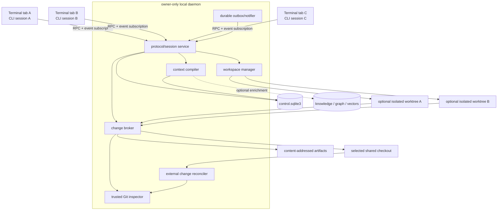
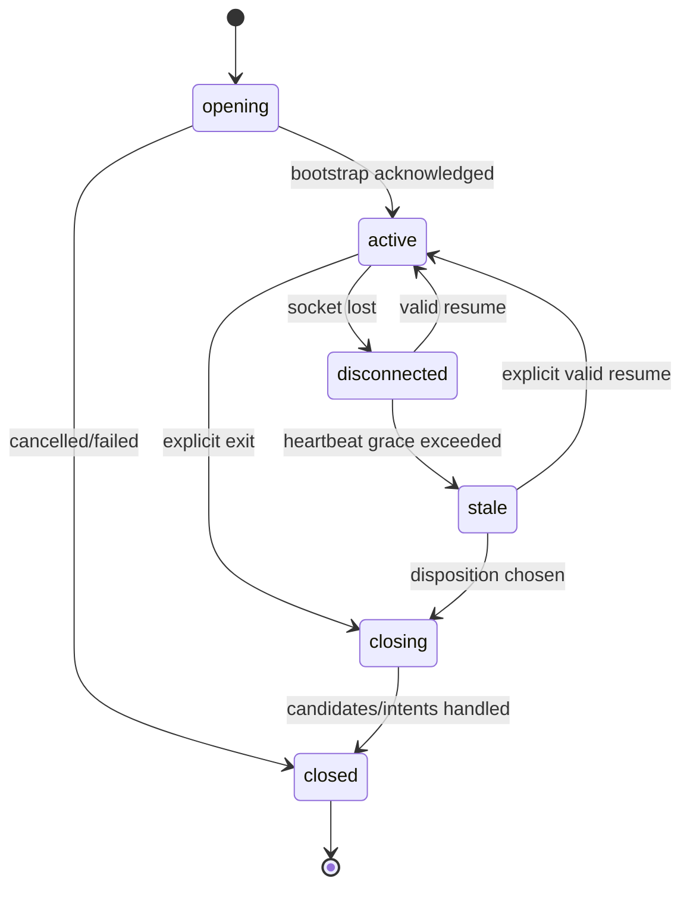
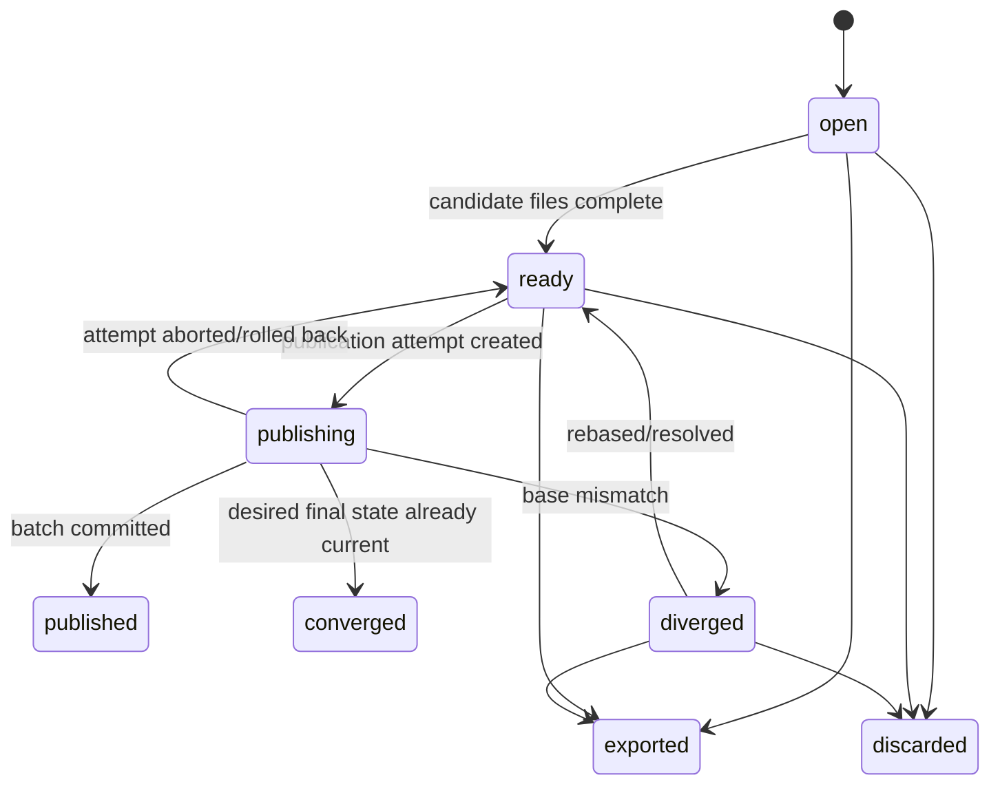

# Multi-session workspace modes and deterministic change coordination plan

Status: implementation underway. Durable sessions, checkout records, intents,
exact file identities, shared-session harness integration, bounded regular
UTF-8 multi-file publication, and optimistic scheduling for new eligible shared
tasks are active. Shared model requests now refresh durable change and intent
metadata using a checkpointed model-visible cursor. Pre-migration attempts and
overlapping work involving exclusive claims retain FIFO scheduling. These are
incremental slices; verified context-packet acknowledgments, the full
cross-profile authority-regime cutover, external-change reconciliation,
broader file operations, and isolated-mode hydration remain planned. See
implementation-status.md for the executable boundaries.

Target repository: the root of this repository

Date: 2026-08-23

Related documents:

- [`llm-cli-implementation-plan.md`](llm-cli-implementation-plan.md)
- [`implementation-status.md`](implementation-status.md)
- [`ADR 0002: daemon RPC`](adr/0002-daemon-rpc.md)
- [`ADR 0003: storage split`](adr/0003-storage-split.md)
- [`ADR 0004: linked worktrees`](adr/0004-linked-worktrees.md)
- [`ADR 0006: product defaults`](adr/0006-product-defaults.md)

This document supersedes the mandatory-worktree, exclusive queued-claim,
internal-task-branch default, and remote-derived-single-checkout-stream parts of
the original plan and affected decisions in ADRs 0004/0006. It retains the
choices for the Python runtime, owner-only daemon, SQLite storage split, bounded
local protocol, trusted Git inspection, artifact integrity, privacy, optional
knowledge features, and the principle of stable identity—while separating
logical project, local Git store, and physical checkout identities.

## 1. Decision summary

The CLI will offer two explicit workspace modes for each top-level chat/session:

1. **`shared`** is the default. The session works against the user's actual
   checkout. CLI-managed edits are prepared outside the visible checkout and
   published as complete, optimistic-concurrency-checked change batches. Every
   connected session learns about committed batches through a durable checkout
   event sequence.
2. **`isolated`** is opt-in. The session receives a linked Git worktree plus an
   automatically hydrated snapshot of the selected shared checkout's existing
   ignored runtime files. Non-ignored untracked source is reconstructed from the
   exact source baseline, not treated as runtime. No project manifest is
   required. Completed tracked/source changes publish through the same
   deterministic change-batch protocol used by shared mode.

The following policy choices are fixed for the first implementation:

| Concern | Decision |
| --- | --- |
| Default workspace mode | `shared` |
| Per-session override | `--workspace shared\|isolated` |
| Checkout/project default override | user-controlled local configuration |
| Required project manifest | none |
| Optional hydration overrides | supported later, never required |
| Cross-tab authority | owner-only daemon plus `control.sqlite3` |
| Cross-tab delivery | durable sequence replay plus socket notification |
| Change authority | exact change-batch metadata and content-addressed artifacts |
| Same-file coordination | optimistic base hashes and explicit divergence |
| Long-lived path locks | none |
| Publication serialization | short checkout publication barrier only |
| Commit/merge behavior | left to the user by default |
| Automatic user-branch commits | prohibited by default |
| RAG role | optional discovery; never coordination authority |
| Deterministic graph role | optional path/symbol/dependency enrichment only |
| External editor guarantees | detected best-effort; not transactionally controlled |

The core mental model is:

```text
terminal tab A / session A ----\
terminal tab B / session B -----+--> per-user daemon --> control.sqlite3
terminal tab C / session C ----/          |                    |
                                          |                    +--> ordered events
                                          +--> change broker   +--> exact metadata
                                          +--> notifier        +--> artifact hashes

shared session   --> staged candidate --> short publish --> selected checkout
isolated session --> hydrated worktree --> short publish --> selected checkout
```

Agents never wait for another agent to finish a path before beginning useful
work. They instead receive active intentions, completed changes, exact overlap
information, and divergence notifications. Only the final publication step is
serialized long enough to validate and apply a batch safely.

## 2. Terminology

This document uses precise terms to avoid overloading "agent", "task", and
"workspace".

### 2.1 Session

A **session** is one top-level CLI chat instance. A session normally lives in
one terminal tab, has a unique random `session_id`, maintains its own event
cursor, and may run for minutes or hours. Two tabs are always different
sessions unless the user explicitly resumes a prior session.

A session ID is identity and correlation metadata, not an authorization secret.
The owner-only socket and filesystem permissions are the local access boundary.

### 2.2 Task

A **task** is a user-visible unit of work within a session. A session may have
one active task at a time in the first release, but the schema must not assume
that forever. A task records the request, bounded status, artifacts, validation,
and final disposition.

### 2.3 Intent

An **intent** is an advisory declaration of files, directories, symbols, or
operations a session expects to touch. Intent improves awareness and conflict
prediction. It does not grant exclusive authority and never blocks another
session from starting or continuing.

### 2.4 Candidate

A **candidate** is a session-private proposed file state that has not yet been
published into the shared checkout. Shared mode keeps CLI-managed candidates in
daemon-owned staging. Isolated mode keeps them in the session worktree.

### 2.5 Change batch

A **change batch** is the smallest completed unit visible to other coordinated
sessions. It contains one or more file operations, exact base identities, exact
result identities, a committed workspace revision, the sequence of its terminal
checkout event, and content-addressed patch or blob artifacts. Other sessions
never receive a "completed" event until the entire batch has reached a
recoverable committed state.

### 2.6 Checkout event sequence

A **checkout event sequence** is the gapless, monotonic transport/replay order
for every durable checkout-scoped event: session and intent changes, warnings,
Git-state observations, divergence, recovery, and committed change batches. It
advances even when materialized files do not change. A session cursor always
refers to this sequence.

### 2.7 Workspace revision

A **workspace revision** is a daemon-assigned monotonic sequence for committed
change batches and externally reconciled changes. It is not a Git commit and
does not move a branch. The revision provides deterministic ordering for dirty
working-tree changes between manual Git commits. It advances only when the
accepted materialized manifest changes, is globally monotonic per checkout, and
does not reset when the epoch changes. A committed materialization cites both
its workspace revision and terminal checkout event sequence; the counters are
independent and must never be inferred from each other.

### 2.8 Workspace epoch

A **workspace epoch** changes when the daemon observes a structural operation
that invalidates ordinary incremental assumptions, such as checkout, reset,
branch switch, worktree replacement, repository repair, or an unreconciled
external rewrite. File-level publications within one stable workspace use the
same epoch and increasing revisions.

### 2.9 Divergence

A **divergence** occurs when a session proposes a path from base identity `A`
but the shared workspace contains a different identity `B` at publication or
sync time. Divergence is explicit durable state, not a generic error string and
not a reason to block unrelated paths.

### 2.10 Coordination context

**Coordination context** is the deterministic context packet constructed from
the authoritative ledger: current revision, all unacknowledged batch metadata,
active intentions, exact relevant diffs, divergences, and Git state changes.
It is distinct from semantic retrieval and must be available when all RAG,
embedding, graph, and model services are disabled.

## 3. User stories

The implementation must support the following concrete workflows.

### 3.1 Two shared sessions on different files

1. The user opens two terminal tabs in the same repository.
2. Each starts a new CLI chat and receives a distinct session ID.
3. Session A declares intent for `src/api.py`; session B declares intent for
   `tests/test_api.py`.
4. Both prepare edits concurrently.
5. A publishes revision 101 and B publishes revision 102.
6. Each tab receives the other's completed batch metadata.
7. Neither session waits for path availability.
8. The actual checkout contains both complete changes, still uncommitted unless
   the user commits them.

### 3.2 Two shared sessions on the same file

1. Both sessions read `src/service.py` at content identity `H0`.
2. Their active intents immediately show an overlap warning.
3. Session A publishes `H0 -> H1`.
4. Session B receives the event before its next model/tool boundary.
5. If B has no candidate, it refreshes to `H1` and continues.
6. If B has a candidate `H0 -> H2`, its publication is rejected as a
   divergence; `H2` remains preserved in private staging.
7. B receives the exact `H0 -> H1` diff and may rebase or merge its candidate.
8. Unrelated files remain editable and publishable throughout.

### 3.3 An isolated session that needs `.env`

1. The user selects `--workspace isolated`.
2. Git creates a linked worktree for tracked content.
3. The coordinator reconstructs non-ignored untracked source from the exact
   ledger baseline, then inventories actual ignored runtime entries in the
   selected shared checkout, including `.env`.
4. It snapshots those entries using copy-on-write when available and normal
   copying otherwise.
5. The session runs tests inside the hydrated worktree without requiring a
   committed project manifest.
6. Secret content never enters events, logs, patches, RAG, or prompts merely
   because it was hydrated.
7. Completed source changes publish to the selected checkout as an ordinary
   change batch; `.env` changes remain isolated by default.

### 3.4 A new tab joins ongoing work

1. Sessions A and B already have active intents and have published revisions
   40 through 47.
2. Session C starts in a new terminal tab.
3. The daemon identifies the repository and opens a new session at the current
   epoch.
4. C receives the current workspace manifest, current Git state, active
   sessions/intents, and relevant recent change metadata.
5. C does not need another session's process memory or terminal history.
6. C acknowledges the delivered cursor and receives subsequent changes by
   subscription or replay.

### 3.5 A terminal disconnects and reconnects

1. Session A last transport-acknowledged checkout event sequence 187, consumed
   deterministic context through event 185, and observed workspace revision 87.
2. Its terminal closes or the socket disconnects.
3. Other activity emits checkout events 188 through 205; among them, completed
   batches advance workspace revisions 88 through 93.
4. A reconnects with its session resume token and event cursor 187.
5. The daemon replays checkout events 188 through 205 in order, then issues and
   receives consumption acknowledgment for deterministic context through event
   205 before allowing A to publish.
6. If A cannot resume, a new session still sees its stale intent and preserved
   candidate/disposition metadata according to retention policy.

### 3.6 The user commits manually

1. Several sessions publish completed batches into the selected shared checkout.
2. The user reviews the combined diff and runs `git add`/`git commit` manually.
3. The daemon detects the index/HEAD transition and records a Git-state event.
4. It associates already known file identities with the new commit where
   possible without inventing duplicate change batches.
5. Sessions refresh their Git baseline; no daemon-created user branch or merge
   is required.

### 3.7 An external editor changes a file

1. An editor outside the CLI modifies a file in the selected shared checkout.
2. A filesystem notification schedules a bounded rescan.
3. The daemon waits for a stability window, computes exact before/after state,
   and records an `external_change` batch or an ambiguous workspace epoch.
4. All sessions receive the event.
5. The system documents that an unmanaged external process may have exposed
   partial writes before the stability boundary; it does not claim stronger
   isolation than it provides.

## 4. Goals

- Let independent CLI chats in separate terminal tabs collaborate through one
  durable physical-checkout-scoped coordination domain.
- Make `shared` and `isolated` explicit user-selectable workspace modes.
- Avoid long-lived exclusive path claims, FIFO wait queues, and "run when path
  becomes available" behavior.
- Preserve the exact combined set of completed agent changes in the user's
  working tree without automatically committing or merging user branches.
- Make completed changes visible to every session through ordered deterministic
  metadata and exact artifacts.
- Preserve unpublished candidates when optimistic publication fails.
- Detect same-file and rename/path-structure divergences without preventing
  unrelated work.
- Keep RAG and embeddings out of the coordination correctness path.
- Support isolated test execution without predicting project-specific `.env`,
  ignored runtime, non-ignored untracked source, dependency, fixture, or
  generated requirements.
- Recover from daemon crashes at every filesystem/database side-effect boundary.
- Handle manual Git activity as first-class external state rather than treating
  the daemon as the repository owner.
- Retain owner-only local privacy and avoid logging source bodies, patches,
  secrets, or hidden reasoning.
- Provide machine-readable JSON/NDJSON and human terminal UX with identical
  semantics.
- Allow a later agent driver, TUI, or editor integration to consume the same
  protocol without changing authority rules.

## 5. Non-goals

- Prevent a malicious same-user process from modifying files, Git refs, the
  socket, or local databases.
- Provide a transactionally atomic view to arbitrary processes that read files
  directly while a multi-file batch is being renamed into place.
- Infer with certainty when an arbitrary external editor has semantically
  "finished" a change.
- Automatically resolve semantic conflicts merely because line-level merging
  succeeds.
- Automatically commit, merge, rebase, cherry-pick, push, or create a pull
  request on the user's behalf by default.
- Require every project to add coordinator configuration to its repository.
- Copy ignored files to a remote service, knowledge database, prompt, or event
  stream.
- Make a vector database, embedding model, graph database, or RAG retriever
  necessary for cross-session awareness.
- Coordinate the same repository across different machines in the first
  release. SQLite and Unix sockets remain a same-host design.
- Guarantee pre-publication tests in `shared` mode. A session needing a complete
  private filesystem for arbitrary mutation and testing should select
  `isolated`.

## 6. Workspace mode contract

### 6.1 Mode names and scope

`workspace_mode` is an execution choice, separate from any rollout policy such
as `coordination = off|observe|enforce`. The first release exposes exactly:

```text
shared
isolated
```

Read-only planning is a task capability, not a third workspace mode.

The selected mode is captured on the session and each task attempt. Changing a
repository default does not retroactively move active sessions.

### 6.2 Mode comparison

| Property | `shared` | `isolated` |
| --- | --- | --- |
| Filesystem root | user's current checkout | managed linked worktree |
| Non-ignored untracked source | already present; ordinary source ledger | reconstructed from exact source baseline |
| Ignored runtime files | already present; runtime-only | dynamically hydrated; runtime-only |
| CLI-managed candidate location | daemon staging | isolated worktree |
| Other completed batches | visible in checkout | applied during sync |
| Pre-publication arbitrary tests | limited | supported |
| Mutating formatter/generator safety | publish controlled edits or switch mode | supported inside worktree |
| Startup cost | minimal | Git worktree plus hydration |
| Disk usage | staging only | tracked checkout plus runtime snapshot/build output |
| Manual Git ownership | user | user in primary; isolated Git mutation is monitored |
| Publication | optimistic batch to shared checkout | same optimistic batch to shared checkout |
| Long-lived path lock | none | none |

### 6.3 Selection precedence

From lowest to highest priority:

1. compiled default: `shared`;
2. user profile default;
3. user-local per-checkout/project default stored outside the repository;
4. trusted optional project suggestion;
5. CLI `--workspace` flag;
6. explicit interactive selection for the new session.

A project file may suggest a mode only after repository trust. It cannot force
`isolated`, enable secret capture, or weaken publication validation.

### 6.4 Mode switching

Mode switching is allowed only at a durable checkpoint:

- no batch is in `staging`, `applying`, or `recovery_required`;
- no unresolved private candidate is omitted from the switch decision;
- the session has consumed all required checkout events;
- the current Git/workspace epoch is known;
- isolated hydration or cleanup can be resumed idempotently.

`shared -> isolated` creates a new isolated workspace at the current committed
workspace revision, then imports any explicitly selected private candidate.

`isolated -> shared` requires the user/session to publish, export, preserve, or
discard every isolated source change. Runtime-only hydrated changes never enter
ordinary source publication; they remain private or may be explicitly exported
through a protected local-copy flow. Cleanup happens only after the disposition
record commits.

No automatic mode switch occurs in the middle of a command. The CLI may suggest
isolated mode when it detects an arbitrary mutating command, but changing mode
requires an explicit user or trusted policy decision.

## 7. Correctness invariants

The implementation must preserve all of the following.

1. `control.sqlite3` is the sole authority for session identity, event order,
   change-batch state, divergence state, workspace records, and recovery.
2. The daemon is the only ordinary writer to `control.sqlite3`.
3. Every checkout event receives a monotonic per-checkout sequence in a
   committed SQLite transaction.
4. A socket notification is only a wake-up hint. Missing it cannot lose state.
5. An integrated session cannot begin a managed mutation until it cites an
   acknowledged context packet through the mandatory sequence captured at that
   mutation boundary. Exact expected path identities are still required for
   publication; they are not a substitute for context consumption. Events that
   commit during the in-flight action are handled by overlap checks and the next
   safe context boundary.
6. Publication uses expected path identity compare-and-swap for cooperative
   brokered writers, not a model's assertion that a file is unchanged. Portable
   filesystems do not provide hash-conditional rename against unmanaged writers;
   the final recheck only narrows that external TOCTOU window.
7. Disjoint stale workspace revisions may still publish when every affected
   path identity and structural precondition remains valid.
8. A base mismatch detected among cooperative brokered writers preserves the
   candidate and creates or updates a divergence; the broker never deliberately
   overwrites the mismatching shared file. Unmanaged writers retain the narrow
   external TOCTOU boundary in invariant 6.
9. Active intentions are advisory and never create a long-running scheduling
   queue.
10. Coordinated sessions do not read through a checkout publication barrier;
    they resume only after the batch is committed or recovery state is known.
11. For cooperative writers, a completed event is emitted only after all target
    file states verify as the batch result and the durable record can be
    reconciled after a crash. An unmanaged write in the verification/commit
    window is recorded as soon as observed but cannot be excluded portably.
12. A failed or ambiguous multi-file application blocks further publication
    only for recovery; it does not erase candidates or falsely mark completion.
13. Raw external filesystem readers may observe an in-progress multi-file
    application. Documentation and APIs must not claim otherwise.
14. Git HEAD, index, and working tree are distinct state dimensions. A manual
    commit does not itself imply new file content, and a file batch does not
    imply a commit.
15. Shared-mode trusted operations do not run `git add`, mutate the user's
    index, create commits, move refs, or switch branches by default.
16. Trusted Git validation that needs an index uses a temporary `GIT_INDEX_FILE`
    outside the user's index.
17. Isolated hydration inventories the actual source checkout. It never
    requires a predeclared list of `.env` or runtime files.
18. A hydrated ignored-runtime baseline is not automatically published back to
    the selected shared checkout. Non-ignored untracked source remains ordinary
    source and participates in candidates/publication.
19. Secret-classified content never enters ordinary event payloads, logs,
    prompts, knowledge chunks, diffs, or remote requests.
20. Exact source patches and blobs are content-addressed and checksum-verified;
    database rows never point to unchecked mutable artifact paths.
21. Coordination context is derived from the deterministic ledger and current
    repository state. RAG output cannot suppress or replace mandatory context.
22. Session process ID, terminal path, socket connection, in-memory task, or
    event subscription cannot grant write authority by itself.
23. Idempotency keys make retries safe across lost responses and daemon
    restarts.
24. Logical project/target identity preserves profile, target, adapter, and
    remote policy, while physical checkout identity uses exact local Git/path
    administration evidence. Clone grouping never collapses working-file
    streams.
25. Cleanup targets only recorded coordinator-owned staging/worktree paths
    after canonical path and ownership validation.
26. Retention never deletes unresolved divergences, recovery journals, active
    sessions with preserved candidates, or unacknowledged mandatory artifacts.

## 8. High-level architecture

### 8.1 Components



### 8.2 Authority boundaries

The control plane has three authorities:

1. **SQLite authority** decides event order, batch lifecycle, session cursors,
   recovery state, and whether an optimistic publication may start.
2. **Filesystem authority** is the exact observed type, mode, and content of
   each path in the physical checkout or isolated workspace.
3. **Git authority** supplies repository identity, tracked/untracked state,
   object IDs, HEAD/index information, rename-aware diffs, and manual Git
   transition evidence.

No single one can substitute for the others. SQLite cannot claim a file was
applied without checking the filesystem. A filesystem watcher cannot assign
durable ordering. Git does not represent every dirty, ignored, or secret local
file and does not identify a terminal session.

The optional knowledge plane may provide deterministic import/symbol
relationships or semantic discovery. It is never consulted to decide whether a
batch is current, complete, conflicting, visible, or acknowledged.

### 8.3 Reusable implementation

The following current components should be retained and evolved:

- `AppPaths` owner-only data/config/runtime directory handling;
- the daemon startup, boot ID, Unix socket, and profile validation;
- bounded length-prefixed JSON framing and stable error model;
- `ControlStore`, transactional migrations, WAL configuration, backup, and
  integrity checks;
- canonical repository inspection and sanitized Git environment;
- exact path normalization and NUL-delimited Git output parsing;
- patch/tree hashing and content-addressed artifact concepts;
- durable task events, outbox direction, and background task execution outside
  the request lock;
- separate control, knowledge, and vector databases;
- fixture repositories and the existing unit/integration/concurrency test
  harness.

The following current assumptions must be replaced:

- one mandatory linked worktree for every editing task;
- queued `ClaimState.QUEUED` path reservations;
- active claim leases as edit authority;
- FIFO overlap activation;
- completed integration reservations blocking later overlapping work;
- internal task commits/refs as the default result;
- task-only events as the only cross-session stream;
- a one-request-per-socket protocol with no persistent subscription;
- an in-memory background task map as sufficient durable scheduling;
- one `main_worktree_path` stored on a logical remote-derived repository row.

## 9. Repository, checkout, and workspace identity

### 9.1 Separate logical project identity from physical checkout identity

The current `repo_key` may intentionally coordinate clones that share a remote
and target, but a change stream cannot be shared blindly across physical
checkouts. Two clones may have different dirty files, branches, ignored assets,
or users' manual operations. The new schema must separate:

- **project identity**: an optional logical relationship across clones, based on
  normalized remote plus integration target when configured;
- **local Git-store identity**: one canonical common Git directory whose object
  store, refs, config, and worktree registry are shared by local worktrees;
- **checkout identity**: one canonical physical Git working tree registration
  on this host;
- **workspace identity**: the selected shared checkout or one isolated worktree attached
  to a checkout;
- **session identity**: one CLI chat operating in one selected workspace.

All working-file workspace revisions, change-event sequences, file versions,
batches, cursors, publication barriers, and external scans are checkout-scoped.
Shared Git-store ref/config events use a separate store-scoped sequence and are
projected to attached checkout sessions. Neither stream is remote/project-scoped.

A user-created Git worktree selected as the root of a new shared chat is a
physical checkout with its own stream. A coordinator-managed isolated worktree
is the deliberate exception: it remains a `workspace` attached to its source
checkout and publishes into that source stream. Repository discovery excludes
recorded managed isolated roots from automatic shared-checkout registration.

### 9.2 Checkout key

Compute a stable opaque `checkout_key` from:

- profile ID;
- local Git-store ID;
- canonical selected checkout/worktree real path;
- canonical Git worktree administrative directory;
- Git object format;
- a persisted random non-secret registration ID.

`checkout_key` names the profile-local registration; it is not the cross-profile
lock/deduplication key. Paths normally distinguish clones and linked worktrees,
but aliases may not create a second registration. Before allocating the random
ID, resolve the Section 14.4 verified physical identity key and reuse an existing
row reached through a symlink/bind-mount alias. The registration ID separates
registrations but is not, by itself, physical recreation evidence. Bind it to
persisted `lstat` device/inode plus available
birth/generation evidence for the checkout root, Git common directory, Git
worktree administrative directory, and stable administrative sentinels such as
the object-store/config directory identities. `checkout_key` and
`registration_id` are stored directly and never need to be recomputed from a
hash-only nonce after restart. An owner-only registration binding record stores
that evidence/hash outside the repository.

Startup verifies the full binding before accepting the stored registration. A
root or Git administration replacement/reinitialization yields
`CHECKOUT_IDENTITY_CHANGED`, a new epoch/quarantine, and explicit `repo
repair/rebind`; it never silently inherits the ledger. On a filesystem lacking
stable inode/birth evidence, disappearance across daemon observations or an
administrative fingerprint mismatch makes identity `unverified` and requires
confirmation rather than relying on canonical path/object format alone.

Moving a checkout requires `repo repair/move`, which proves the old and new Git
identity, updates paths transactionally, increments the workspace epoch, and
emits a checkout event.

### 9.3 Local Git-store key

Compute `git_store_key` once from profile ID, canonical common Git directory,
object format, and a persisted random non-secret registration ID; persist both
the key and ID directly. Every ordinary or user-created
linked worktree under that common directory has a distinct checkout but points
to the same `git_store_id`.

Registration first resolves/canonicalizes the common directory and performs one
SQLite CAS/upsert on its verified underlying physical key, with path as a
secondary alias index. Only the winner creates a registration ID/key; a
concurrent caller or bind-mount alias reuses that row. A matching path with
changed physical evidence, or insufficient evidence that could split a global
lock, is quarantined for explicit rebind; it is never inserted as a parallel
active Git store or silently overwritten.

Scope state as follows:

- working-file versions, batches, workspace revisions, sessions, and external
  file scans are checkout-scoped;
- common refs, Git config, object-store health, worktree registrations, and
  optional branch/ref publication are Git-store-scoped;
- logical discovery/history across independent clones is project-scoped.

A common-ref/config event is allocated in the Git-store stream and projected as
mandatory context to every active checkout/session attached to that store. It
does not imply that sibling working trees have identical file contents.

Optional operations that mutate shared refs/config acquire a short Git-store
operation lock in addition to their checkout checks. Ordinary file publication
does not move refs and needs only the checkout barrier.

### 9.4 Project key

`project_key` is nullable. When enabled, it groups clones for search, history,
or future remote coordination, but cannot grant cross-checkout publication or
cursor authority. A future explicit cross-clone synchronization adapter must
exchange commits/patches and create normal local batches in each target
checkout.

### 9.5 Shared workspace record

Every physical checkout has exactly one shared workspace record:

```text
workspace_kind = shared_checkout
mode = shared
canonical_path = checkout.root_path
owner_session_id = null
```

An isolated workspace has:

```text
workspace_kind = linked_worktree
mode = isolated
canonical_path = coordinator-managed path
owner_session_id = one session
source_workspace_id = shared workspace ID
source_epoch and source_revision = hydration baseline
```

### 9.6 Repository state fingerprint

At registration and every structural rescan, capture:

- canonical common Git directory;
- canonical selected checkout/worktree root;
- canonical Git worktree administrative path;
- object format;
- HEAD symbolic ref or detached state;
- HEAD commit or unborn state;
- index identity/fingerprint;
- working-tree status hash;
- sparse-checkout mode and patterns identity;
- submodule registrations;
- case-sensitivity probe result;
- filesystem device IDs relevant to atomic rename and copy-on-write;
- Git version and required feature support.

This fingerprint is evidence for change detection, not a stable repository ID.

## 10. Daemon and separate-terminal session model

### 10.1 Daemon topology

The first CLI chat in any terminal tab starts or connects to the per-profile
daemon. Every later tab connects to the same owner-only socket. The daemon may
coordinate many checkouts, but all mutation and event methods include an exact
`checkout_id`.

The daemon must not rely on:

- a terminal's current directory after session open;
- shared process memory between CLI tabs;
- shell PID or TTY path as durable identity;
- Unix process signals sent directly between tabs;
- a client staying connected while its task runs.

### 10.2 Session creation

`session.open` performs:

1. Validate protocol, profile, client version, and requested capabilities.
2. Inspect the supplied current directory and resolve one checkout.
3. Register or validate the exact selected checkout and shared workspace.
4. Accept a client-generated 256-bit resume-secret digest and open idempotency
   key, then allocate a random sortable `session_id`. The raw secret is created
   and owner-only persisted by the initiating wrapper before it sends the
   request; it never needs to cross in a response.
5. Capture mode, task/driver identity, client PID/start identity, TTY metadata,
   and daemon boot ID for diagnostics only.
6. Record the session with state `opening`.
7. Snapshot the current workspace epoch/revision and Git state.
8. Build the deterministic bootstrap context.
9. Transition to `active` only after bootstrap delivery is acknowledged.

The daemon stores only the resume-secret digest and never logs it. If the open
response is lost, the client retries the same key/request/digest and receives
the already allocated session/bootstrap; no irreproducible raw token is lost.
Token rotation supplies a new client-generated digest plus proof of the old
secret in a CAS/idempotent request, and the wrapper commits its local secret
replacement only after the response. A new CLI chat normally creates a new
session even if it runs in the same TTY. Explicit `--resume SESSION_ID` requires
the secret or an owner-confirmed recovery path.

### 10.3 Long-running and one-shot clients

A long-running chat process owns the session and one persistent event
subscription. Child tool processes inherit `LLM_COORD_SESSION_ID` and a bounded
local capability token where needed, but they do not become separate sessions.

One-shot administrative commands such as `repo status` use an ephemeral client
identity and do not appear as active editing sessions. A one-shot `run` command
creates a durable session/task if it can continue after terminal disconnect.

### 10.4 Session state machine



Session states do not revoke or rewrite already committed changes. A stale
session's active intent is visibly marked stale and eventually closed by
retention policy only after its private candidates have a durable disposition.

### 10.5 Heartbeats

- Active event connections send heartbeat frames every 15 seconds by default.
- The daemon records heartbeats at a write-coalesced interval, not for every
  frame.
- Missing three intervals marks the connection disconnected, not the session
  dead.
- A configurable grace period marks the session stale.
- Heartbeats never renew path authority because no long-lived path authority
  exists.
- Publication already in `applying` is reconciled independently of session
  liveness.

### 10.6 Per-checkout event cursor

Each session has a separate cursor for every checkout it observes:

- `transport_received_sequence`: highest contiguous sequence the client durably
  spooled and acknowledged at the transport layer;
- `context_consumed_sequence`: highest contiguous sequence covered by a fully
  verified, final-page context packet that the integrated driver processed at a
  model/tool boundary;
- `mandatory_sequence`: high-water captured for the most recently issued
  mutation-required context packet;
- `last_context_packet_id` and hash.

Transport receipt does not authorize a mutation. The daemon rejects a transport
ACK that skips an undelivered gap and rejects context consumption unless every
page/artifact requirement for an actually issued packet verifies. Metadata
pagination must finish before `context_consumed_sequence` advances. Mutation
readiness requires consumption through the cited packet's mandatory high-water;
consumption may legitimately be greater than an older `mandatory_sequence`.

### 10.7 New-session bootstrap

Bootstrap does not replay an unbounded repository lifetime and does not invent
an initial cursor. Every fresh session receives a durable
`context_resync(purpose=bootstrap)` even when all old events are still retained.
`session.open` first creates the session in `opening` and its selected workspace
binding in `preparing`; the bootstrap packet is scoped to that binding. The
final verified ACK transaction initializes the cursors, activates that exact
binding/session (and task attempt when present), and only then issues editing
capabilities. Failure terminalizes the preparing binding without ever granting
mutation authority.
It binds the latest verified checkpoint, exact current active state, and retained
suffix through high-water `H`; the final verified ACK initializes both transport
and context cursors through `H` in one CAS and is required before the session
becomes active. It returns:

1. current checkout identity and trust state;
2. workspace epoch and revision;
3. HEAD/index/dirty summary;
4. deterministic current file-version manifest root hash;
5. all active/disconnected/stale session summaries and intents;
6. all unresolved divergences and recovery conditions;
7. ordered recent batch metadata after the latest retained checkpoint;
8. exact diffs for paths required by the initial task or explicitly requested;
9. artifact references for additional exact inspection;
10. a bootstrap resync ID/generation that is acknowledged only after immutable
    pages, checkpoint, suffix, and required artifacts are client-verified.

Older history is represented by a deterministic compaction checkpoint, not an
LLM summary or semantic search result.

## 11. Persistent RPC and event delivery

### 11.1 Protocol evolution

The current server reads one request, writes one response, and closes the
connection. Retain that path for simple administrative calls, and add a
persistent bidirectional connection for sessions.

Frame envelopes gain a required `frame_type`:

```text
hello
hello_ack
request
response
event
ack
heartbeat
cancel
flow_control
```

Every persistent frame after the handshake contains protocol version,
daemon-assigned connection ID, and bounded payload size. `hello` is the sole
exemption: it has no connection ID. `hello_ack` assigns a fresh random
`connection_id`, and every later client frame must echo it; a mismatch closes
the connection. Request/response correlation remains based on request ID.

Wire cutover is explicit:

1. The common four-byte length prefix remains unchanged.
2. A decoded object with `protocol_version = 1` and no `frame_type` is a legacy
   one-shot request. A compatible new daemon dispatches it through the v1 table
   and returns a v1 response without `frame_type`.
3. A v2 persistent connection begins with `frame_type = hello`, protocol/profile
   identity, client version, and requested capabilities, but no connection ID.
   The daemon returns `hello_ack` with its fresh connection ID and supported
   capabilities before any subscription/session frame.
4. A v2 frame without a successful hello is rejected.
5. The runtime daemon record advertises protocol/schema/boot ID. A new client
   discovering an old daemon uses only the legacy v1 ping/status path and
   returns `DAEMON_UPGRADE_REQUIRED` for v2 features.
6. Automatic restart of an old daemon occurs only after a legacy status method
   proves no live execution/publication and the startup lock is acquired;
   otherwise the user explicitly drains/restarts it.
7. An old client talking to a new daemon receives v1 behavior during the
   documented compatibility window. Unsupported new state is summarized as a
   stable capability error, not malformed v1 data.
8. Protocol v1 support is removed only after its database/CLI compatibility
   window and migration telemetry are complete.

### 11.2 Repository event envelope

```json
{
  "frame_type": "event",
  "protocol_version": 2,
  "checkout_id": "checkout_...",
  "sequence": 184,
  "event_id": "event_...",
  "event_type": "change.committed",
  "aggregate_type": "change_batch",
  "aggregate_id": "batch_...",
  "caused_by_session_id": "session_...",
  "workspace_epoch": 7,
  "workspace_revision": 93,
  "created_at_ms": 1787490000000,
  "payload": {
    "changed_path_count": 2,
    "changed_paths": ["src/api.py", "tests/test_api.py"],
    "metadata_hash": "sha256:..."
  }
}
```

Event payloads remain bounded and contain no raw source patch. Clients fetch
exact metadata/artifacts by ID and checksum.

### 11.3 Notification and replay

The write transaction that commits a visible state transition also:

1. allocates the checkout sequence;
2. inserts the checkout event;
3. inserts an idempotent outbox row.

After commit, the notifier wakes subscribed connections. Reconnect always asks
SQLite for `sequence > transport_received_sequence`; in-memory fan-out never
serves as history. Replaying transport does not advance
`context_consumed_sequence`; the client must still verify and consume an issued
context packet before a managed mutation.

### 11.4 Flow control

- Each connection has bounded outgoing event count and byte limits.
- A slow client receives `flow_control` and must replay from its cursor.
- The daemon drops the connection rather than retaining unbounded memory.
- Events remain available according to durable retention/checkpoint rules.
- Raw artifacts are streamed separately in bounded chunks with total size and
  digest verification.

### 11.5 Terminal presentation

An event arriving in another tab is queued by that tab's own CLI process. The
daemon never writes directly to another terminal device. The CLI presents
notifications only at safe UI/model boundaries:

- before the next model invocation;
- before a write or shell tool starts;
- after the current tool call finishes;
- immediately in an idle prompt/TUI status area;
- on explicit `session changes` or `--follow`.

If an event arrives during model generation, the CLI records it and sets a
"workspace changed" marker. It does not splice untrusted text into a partially
generated prompt. The next boundary constructs a new deterministic context
packet.

### 11.6 Initial RPC methods

```text
session.open
session.resume
session.heartbeat
session.show
session.list
session.close
session.set_intent
session.clear_intent
session.context
session.context_resync
session.ack

events.subscribe
events.list
events.get

workspace.status
workspace.select_mode
workspace.switch_mode
workspace.scan
workspace.sync
workspace.recover

file.stat
file.read
file.read_many

artifact.open
artifact.read

protected_access.request
protected_access.approve
protected_access.deny
protected_access.revoke
protected_access.show
protected_access.list

candidate.upload_open
candidate.upload_chunk
candidate.upload_finalize
candidate.upload_abort

change.prepare
change.stage
change.validate
change.publish
change.abandon
change.show
change.list
change.diff
change.export

divergence.list
divergence.show
divergence.resolve
divergence.abandon
```

Every mutating method accepts an idempotency key. `change.publish` additionally
requires session, checkout, workspace, epoch, batch, candidate, and expected
path-version identities.
`change.abandon` requires the exact candidate generation and expected lifecycle
`state_version`, refuses while an attempt/journal is nonterminal, records
`discarded` and its audit event idempotently, and releases artifact/protected
pins only after recovery and retention references are gone. It never deletes a
visible checkout path.

The `protected_access.*` namespace is an owner/operator control plane, not a
child-capability API. The daemon or owner-side wrapper creates an idempotent
request; the agent receives at most `PROTECTED_APPROVAL_REQUIRED` plus an opaque
request ID. `approve`, `deny`, and `revoke` require the authenticated owner
connection/local operator credential that the wrapper never exports to its
child process tree. `show`/`list` return only purpose, sensitivity class,
operation names, count/byte class, expiry, session/workspace scope, and a
redacted display label—never protected values, raw digests, preview bytes, or a
shell-reusable secret. Approval returns the grant ID only to the owner wrapper
and broker; it issues a narrower child capability when needed rather than
putting the grant in the environment.

Broker/read and transfer contracts are explicit:

- `file.stat/read/read_many` require a scoped child capability, normalized
  checkout-relative paths, byte/count limits, and optional expected epoch.
  They execute the Section 15.3 read-barrier protocol and return object kind,
  mode, byte count, exact base identity/equality token, epoch/revision, and
  either bounded inline bytes or a read handle. `purpose=edit` additionally
  returns a `read_observation_id` and pins the exact base
  artifact/protected reference in the immutable current binding scope;
  `purpose=read` does not retain a body. A multi-read uses one barrier boundary
  and one manifest hash.
- `artifact.open` requires artifact ID, purpose (`context`, `diff`, `recovery`,
  or `export`), session/capability, and expected digest when known. It returns a
  short-lived opaque handle, total bytes, ordinary object digest, maximum chunk,
  and policy decision. `artifact.read` takes handle, offset, and length; chunks
  are bounded and clients verify the final total/digest. It is offset-stateless,
  so a reconnect can reopen and resume without trusting partial daemon memory.
- Protected artifacts return `ARTIFACT_POLICY_DENIED` to ordinary/context
  opens. A distinct protected-read/upload capability is issued only after the
  local approval policy; responses omit public digest/preview and stay within
  the protected-output broker.
- `candidate.upload_open/chunk/finalize` declare checkout/workspace/path, cited
  binding/version/mode/local generation, context packet, edit-purpose
  `read_observation_id`, exact base identity, object kind/mode, sensitivity,
  total bytes, and ordinary expected digest or protected approval. An explicit
  verified-base upload may atomically create a current-binding edit observation
  instead; it cannot reuse an observation created under another binding. Chunk
  offsets must be contiguous or exact idempotent retransmissions. Finalize
  verifies total content, atomically creates the ordinary/protected object plus
  candidate-file reference, and returns candidate generation/result identity.
  `change.stage` attaches only finalized uploads to a batch; it never accepts an
  arbitrary daemon filesystem path.
- Ordinary interrupted uploads persist bounded owner/session metadata and may
  resume by upload ID after capability revalidation. Protected uploads survive
  restart only when the approved encrypted protected store is active; otherwise
  they abort safely and require re-approval/retransmission. Expired partials are
  journaled GC inputs, never working-tree files.

Context consumption cannot be acknowledged until every required ordinary
artifact handle has reached its verified total or a durable explicit policy
outcome exists. RPC tests cover chunk duplication, truncation, offset gaps,
digest mismatch, reconnect, capability expiry, quota exhaustion, and protected
denial without leaking content.

## 12. Deterministic change ledger

### 12.1 The ledger, not RAG, is coordination context

The authoritative record of completed work is an ordered relational ledger
plus checksum-verified content artifacts. The ledger answers exact questions:

- which session completed a change;
- which checkout and workspace it came from;
- when it became visible;
- which paths, path types, modes, and identities changed;
- what each path's expected base was;
- what each result identity is;
- whether the change was CLI-managed, isolated, external, or Git-structural;
- which exact patch/blob artifact proves the change;
- which sessions have acknowledged it;
- whether it created or resolved a divergence.

No ranking, embedding, natural-language summary, or graph traversal is required
to answer these questions.

### 12.2 File identity

Use an application content identity that works for tracked and untracked files:

```text
sha256(
  identity_version || NUL ||
  object_kind || NUL ||
  normalized_mode || NUL ||
  content_bytes_or_symlink_target
)
```

Supported object kinds initially:

```text
absent
regular
symlink
directory_marker
gitlink
```

Directories are represented through their affected children plus structural
markers where an empty directory matters to coordinator state. Git does not
track empty directories; publication must not imply that it does.

Record the native Git blob/tree ID when available, but do not use it as the only
identity because ignored/untracked content and mode semantics may not be Git
objects. SHA-1 and SHA-256 repositories remain supported.

For secret/runtime-only paths, never store a reversible or dictionary-attackable
content digest in ordinary metadata. Use a daemon-secret-keyed HMAC only when a
stable equality check is operationally necessary; otherwise store only state,
size class, and change time.

### 12.3 Change-file record

Each file operation records:

- stable `change_file_id` and `batch_id`;
- normalized source path and destination path where applicable;
- operation: `add`, `modify`, `delete`, `rename`, `copy`, `mode_change`,
  `type_change`, or `gitlink_change`;
- ordinal in the batch;
- expected/base object kind, mode, content identity, and optional Git object ID;
- result object kind, mode, content identity, and optional Git object ID;
- exact ordinary patch artifact ID where a non-protected textual patch is
  appropriate;
- before/after ordinary blob artifact IDs or before/after protected artifact
  IDs, with typed XOR constraints for each content-bearing side;
- binary flag and media type classification;
- deterministic line ranges from the canonical patch;
- deterministic symbol names only when obtained from a pinned parser and tied
  to exact evidence;
- sensitivity class and redaction policy;
- byte counts and artifact checksums;
- validation status and failure code.

For `protected`/`secret` source, patch artifact, preview, line-range, and symbol
fields are absent. Expected/result identity uses versioned keyed equality
evidence. An add requires an authorized protected result reference, a delete an
authorized protected before reference, and a modify/type change both. Without
the material needed for deterministic apply and rollback, preparation refuses;
it never degrades into an unrecoverable protected publication.

Rename and copy records retain both source and destination identities. Case-only
renames on case-insensitive filesystems receive a platform-safe two-step journal
operation.

### 12.4 Batch metadata

Each batch records:

- `batch_id`, `checkout_id`, source `workspace_id`, and `session_id`;
- optional task/attempt and tool-call IDs;
- workspace epoch;
- source baseline revision and source local generation;
- committed workspace revision when visible;
- state and state version;
- idempotency key;
- ordered path-set hash;
- metadata manifest hash;
- optional whole-batch patch artifact;
- source class: `shared_broker`, `isolated_publish`, `external_reconcile`,
  `manual_git`, `recovery`, or `import`;
- user/model-generated bounded summary as untrusted optional display metadata;
- exact validation/check artifact references;
- prepare/apply/commit timestamps;
- recovery and terminal disposition fields.

The model summary may help a person scan history, but exact metadata and
artifacts remain authoritative when the summary is absent or wrong.

### 12.5 Source artifact policy

Store large patches and file bodies in an owner-only content-addressed object
store:

```text
$DATA_DIR/objects/sha256/ab/<full-digest>
```

Object creation protocol:

1. Stream bytes through a bounded-size policy while hashing.
2. Write to a new owner-only temporary file.
3. Flush and fsync according to durability policy.
4. Verify expected byte count and digest.
5. Atomically install by digest if absent.
6. Treat an existing matching digest as idempotent success.
7. Insert/reference the artifact row in the same transaction as the owning
   durable intent where possible.

Artifact filenames never contain repository paths or model text. Secret and
runtime-only bodies are ineligible for ordinary source artifacts.

### 12.6 Deterministic compaction

Event retention cannot depend on keeping every event inline forever. Periodic
compaction creates a signed/checksummed checkpoint at sequence `N` containing:

- checkout and epoch;
- exact file-version manifest root;
- current Git state fingerprint;
- unresolved divergence IDs and hashes;
- active session/intent IDs and versions;
- last batch ID per path where retained;
- prior checkpoint hash, forming a local hash chain.

After every relevant non-stale session's `context_consumed_sequence` is beyond
`N` and retention rules permit it, old event payload rows may be compacted.
`transport_received_sequence` alone never permits compaction. Issued but
unconsumed context packets/pages, disconnected-session grace, candidates,
divergences, incoming sync, and recovery state pin their required events and
artifacts. Batch/file/artifact records needed for unresolved work, audit
retention, manual review, or reconstruction remain. Compaction is deterministic
and does not use an LLM summary.

For a fresh bootstrap regardless of retention, or if a resumed session returns
below the retained event floor, ordinary packet issuance does not fabricate the
missing suffix or permanently deadlock. The daemon:

1. selects and verifies the newest immutable checkpoint covering the compacted
   prefix, including its prior-checkpoint hash chain;
2. issues a durable `context_resync` generation whose immutable packet pages
   contain that checkpoint's exact manifest/Git state, current active
   session/intent/divergence/candidate/recovery state, and every retained event
   after the checkpoint through captured high-water `H`;
3. records the exact superseded missing range and pins all pages/artifacts;
4. requires the client to persist/verify every page, checkpoint hash, suffix,
   and required artifact/policy outcome;
5. accepts one final resync ACK only if session, prior cursor, generation,
   packet/final-manifest hash, and active connection ownership all match;
6. in one CAS transaction marks the resync consumed, records bootstrap
   initialization or the superseded retention-gap range/audit evidence, and
   advances transport/context cursors through `H`;
7. leaves ordinary mutation blocked until that transaction commits.

This is an evidence-backed checkpoint transition, not an unverified cursor
jump. Lost ACKs return the same resync generation/idempotent result; a changed
checkpoint or active-state snapshot creates a new generation.

### 12.7 Initial checkout baseline

The first registration cannot assume a clean HEAD or an empty working tree. It
must establish revision 0/epoch 1 deterministically:

1. Start the invalidation watcher before scanning when available. Before the
   full watcher phase, use a two-pass baseline plus mandatory affected-path/full
   rescan before each canary action and mark external-history coverage
   `snapshot_only`; do not claim preservation of intermediate external edits.
2. Inspect exact selected checkout, HEAD, index, sparse/submodule state, tracked
   dirty files, non-ignored untracked source, ignored/runtime entries, and
   unsupported paths.
3. Perform a second bounded verification pass for paths that changed during the
   scan.
4. Use Git objects for clean tracked files only after attributes/config
   inspection proves the Git object materializes to the exact current
   working-tree bytes without filters, LFS substitution, working-tree encoding,
   or EOL conversion. Before committing the checkpoint, copy every selected
   eligible ordinary object into a Section 14.11 sealed object-set artifact;
   the mutable live Git object database is never its only reconstruction pin.
   For transformed clean files, capture stable current working bytes as an
   ordinary/protected artifact or mark the path `SOURCE_FILTER_UNSUPPORTED`;
   Section 18.10 defines the full policy.
5. Store exact artifacts for non-secret tracked dirty/transformed content and
   non-ignored untracked source needed to reconstruct the combined workspace. A path
   classified secret follows the protected-snapshot/refusal policy in Section
   12.8; until one of those dispositions is durable, the checkout is not
   exact-reconstruction-ready. It is never silently placed in an ordinary
   artifact.
6. Store only redacted runtime metadata for ignored/secret content.
7. Build `file_versions` and a checkpoint manifest root.
8. Record the baseline Git state and watcher generation in one SQLite
   transaction.
9. Replay watcher invalidations observed during the scan and create normal
   external batches or repeat unstable paths.
10. Mark the checkout publish-ready only when every coordinated source path is
    represented or explicitly unsupported/ambiguous.

This baseline is a factual current snapshot, not a daemon-generated Git commit.
It lets a later isolated workspace reconstruct dirty tracked and non-ignored
untracked source without copying another session's in-progress brokered apply.

There is one explicit bootstrap ordering exception for protected source that
needs local approval. `session.open` first creates its idempotent durable row in
`opening`, without an editing child capability or mutation authority. The
owner-side wrapper may then issue a short-lived `source_snapshot`
`protected_access_grant` scoped to that opening session and checkout. The
single-checkout baseline builder consumes the grant, installs/verifies the
protected snapshot, commits the exact checkpoint, and only then issues the
binding-scoped bootstrap packet. The session becomes `active` only after that
packet is consumed. Denial/expiry closes the opening session with
`PROTECTED_SOURCE_SNAPSHOT_REQUIRED`; it never creates a weaker baseline.
Concurrent opens join the same baseline-build progress but retain distinct
opening session/grant/packet identities. Thus the session foreign key on the
grant does not create a bootstrap cycle, and an opening row never implies edit
authority.

### 12.8 Protected source snapshots

Sensitivity does not change whether a path is source. Exact isolated
reconstruction follows this policy:

- a clean tracked protected/secret source path may be read immediately from its
  existing Git object subject to local model-read policy, but an authoritative
  reconstructible checkpoint requires an approved protected reconstruction
  object; it is never copied into the ordinary sealed Git pack;
- a dirty tracked or non-ignored untracked protected/secret source path requires
  a private protected snapshot captured at the exact baseline boundary;
- if the user/policy does not authorize that protected snapshot, isolated
  startup fails with `PROTECTED_SOURCE_SNAPSHOT_REQUIRED` and names only the
  affected paths/sensitivity classes;
- protected source is never inserted into an ordinary content-addressed patch
  object or optional synthetic Git tree/ref;
- OCC uses daemon-keyed equality evidence plus direct revalidation, not a public
  raw content hash;
- protected snapshot bytes are stored under random opaque IDs in a distinct
  owner-only protected object area, encrypted with a per-profile local key when
  the protected-artifact feature is available;
- if protected encryption/key access is unavailable, the safe default is to
  refuse persistence; a user may explicitly approve a `0600` local-only
  degraded snapshot for the current session;
- snapshots are pinned by the isolated workspace, candidate, divergence, or
  recovery journal and removed after all such references terminate;
- ordinary backups exclude protected snapshots by default and record that an
  isolated workspace cannot be reconstructed after restore; explicitly enabled
  protected backups must be encrypted and separately verified;
- cleanup promises removal of the reachable file only, not secure erasure from
  SSD/COW storage.

The database stores opaque protected object IDs, keyed evidence, byte-count
class, sensitivity, and lifecycle. It never stores secret bytes, raw digest, or
preview.

#### 12.8.1 Local approval handshake

The owner-side wrapper, never the spawned agent process, drives this state
machine:

```text
needed -> requested -> approved -> consumed|expired|revoked
                    -> denied
```

1. The daemon detects a protected operation and returns a bounded requirement
   to the wrapper; it does not send protected content to the model to ask.
2. The wrapper calls idempotent `protected_access.request` with principal
   shape, purpose, exact keyed scope evidence, requested operations/output
   policy, expiry, and a canonical request hash. A lost response returns the
   same request.
3. The wrapper displays only the redacted scope summary and consequence (local
   snapshot, model-visible read, command output, export, or encrypted backup).
4. `approve` or `deny` is accepted only on the owner/operator channel after a
   fresh local confirmation. Approval may narrow but never broaden scope,
   operations, output policy, lifetime, or use count; a broader choice requires
   a new request.
5. Approval atomically creates the Section 14.15 grant and returns its opaque
   ID to the broker. If an agent needs access, the wrapper asks the daemon for a
   short-lived capability limited to that grant's already approved operation;
   neither credential is inherited by unrelated tabs.
6. Every broker use consumes/revalidates the grant transactionally. Revocation
   prevents the next byte/chunk from being released and revokes derived child
   capabilities; already materialized output is reported for explicit cleanup.

Pending requests survive restart as unapproved facts, but restart never
converts them into grants. `until_daemon_restart` grants become revoked during
startup. Opening-session source-snapshot approval uses the same flow before a
child capability exists. `protected_access.show/list` and audit events remain
redacted even in JSON mode.

## 13. Deterministic coordination context

### 13.1 Context packet

Before each model turn and mutation boundary, compile:

```json
{
  "schema_version": 1,
  "checkout_id": "checkout_...",
  "workspace_id": "workspace_...",
  "binding_id": "binding_...",
  "binding_version": 3,
  "session_id": "session_...",
  "task_attempt_id": "attempt_...",
  "workspace_mode": "shared",
  "workspace_epoch": 7,
  "workspace_revision": 93,
  "workspace_local_generation": null,
  "transport_received_sequence": 179,
  "context_consumed_sequence": 176,
  "packet_through_sequence": 184,
  "mandatory_high_water": 184,
  "git": {
    "head_ref": "refs/heads/main",
    "head_oid": "...",
    "index_changed": false,
    "manual_operation": null
  },
  "completed_batches": [],
  "active_intents": [],
  "path_versions": {},
  "divergences": [],
  "recovery_conditions": [],
  "artifact_fetches_required": []
}
```

The serialized packet has a canonical JSON hash stored with the task/model
invocation. This makes it possible to prove which coordination facts were
available without storing hidden reasoning or complete prompts.

### 13.2 Mandatory inclusion algorithm

The compiler deterministically includes:

1. every checkout event after the session's
   `context_consumed_sequence`, in order;
2. current state of every active/disconnected/stale session intent;
3. every unresolved divergence involving the current session or its intended
   paths;
4. every active publication/recovery condition;
5. exact current file identities for paths the session has read, intends to
   change, or has staged;
6. exact change metadata for batches touching those paths;
7. exact patch artifacts for direct overlaps, subject only to secret and size
   policy;
8. current Git epoch/HEAD/index/manual-operation state;
9. isolated incoming-sync state when applicable.

If the metadata does not fit one frame or model context, paginate without
skipping sequence numbers. Exhaustive metadata is processed by the CLI before a
bounded model-facing rendering is produced. The CLI may collapse unaffected
events into deterministic counts and hashes for the model, but it must retain
them locally and must never collapse direct path overlaps or unresolved
divergences.

### 13.3 Deterministic relevance

Additional exact context may be selected through deterministic relationships:

- identical normalized path;
- ancestor/directory rename relationship;
- import/include edges generated by pinned parsers;
- symbol definition/reference edges with exact source evidence;
- build/test mapping from explicit project files;
- task-declared intent relationships.

Every included relationship carries evidence and parser/version identity. If
the graph is missing, stale, or disabled, mandatory path and sequence context is
unchanged.

### 13.4 RAG boundary

RAG may answer optional historical questions such as:

- "Which prior task discussed this authentication decision?"
- "Find similar migrations in this repository."
- "What earlier test failures mentioned this error?"

RAG may not answer authoritative questions such as:

- "Did another session modify this file?"
- "What is the current base hash?"
- "Can this candidate publish safely?"
- "Which events has this session acknowledged?"
- "Is an isolated worktree synchronized?"

If semantic retrieval is disabled or fails, session coordination remains fully
functional.

### 13.5 Context acknowledgement

Transport ACK means only that an event was durably spooled by the client. A
separate context-consumed ACK authorizes the next integrated mutation boundary
and is accepted only for a packet/page set durably issued to that session.

The client marks a context packet consumed only after:

1. verifying its canonical hash;
2. persisting required metadata/artifact references locally or in daemon state;
3. applying mandatory sync operations for its workspace mode;
4. presenting or injecting the bounded context at the correct turn boundary;
5. recording any explicit inability to consume an artifact.

An artifact policy failure creates a visible blocked-context condition for the
affected path; it does not silently advance the cursor.

Packet issuance algorithm:

1. In one SQLite read/write transaction, capture checkout event high-water `H`,
   the immutable session workspace/binding ID and version/mode, current attempt
   boundary, epoch/revision and isolated workspace-local plus accepted-baseline/
   local-current manifest generations, task
   attempt, session's prior consumed cursor, and required artifact manifest.
2. Insert `context_packets` plus deterministic page rows covering the exact
   contiguous interval `(context_consumed_sequence, H]` and current active-state
   snapshot.
3. Set the cursor's `mandatory_sequence = max(existing, H)` only when the packet
   is required for a mutation/model boundary.
4. Deliver pages; transport receipt may advance independently.
5. Accept final context consumption only with packet ID, final manifest hash,
   every page hash, required artifact outcomes, owning connection, and the
   unchanged packet binding scope (except the explicitly preparing target
   binding of one mode switch).
6. In one transaction mark the packet consumed and advance
   `context_consumed_sequence` to `H`.

Candidates and publication attempts store the cited `context_packet_id` and
`context_through_sequence`. Post-`H` events are classified, not treated alike:

- a material file-version event on an affected path is resolved by exact OCC:
  mismatching desired/base states create divergence or converged disposition;
- an epoch-changing Git structural event, active recovery/quarantine, or
  authority-regime change returns `CONTEXT_STALE` and requires a new packet;
- session, intent, overlap-warning, notification, and other advisory events do
  not deny an otherwise valid publication, even if their metadata names the
  path; they are queued for the next safe context boundary;
- unrelated later material events do not invalidate affected-path OCC but are
  mandatory at the next safe boundary.

Thus stale context and base divergence are distinct stable outcomes, and intent
state never becomes write authority.

### 13.6 Optional local graph/RAG projection contract

The existing three-store split remains the integration seam:

| Store | Role | Authority/restore status |
| --- | --- | --- |
| `control.sqlite3` | sessions, ledger, exact artifacts/references, cursors, recovery | authoritative |
| `knowledge.sqlite3` | registered sources, canonical chunks, FTS5, deterministic graph, opt-in user memory | repository projection is rebuildable; explicit user memory follows its own backup policy |
| `vectors.sqlite3` | embedding identities/vectors/backend generations | disposable and rebuildable |

The initial local knowledge schema contains:

- `knowledge_sources`: source kind, checkout/project scope, visibility/privacy
  policy, enabled state, and deletion generation;
- `knowledge_documents`: checkout/path identity, exact file content identity,
  source workspace revision, parser identity, and current/tombstoned generation;
- `knowledge_chunks`: document/content hash, deterministic ordinal/range/symbol
  evidence, chunker version, bounded text, and context eligibility;
- an external-content FTS5 table keyed to chunk ID for lexical/BM25 retrieval;
- `graph_nodes` and `graph_edges`: typed file/symbol/test/task nodes and
  import/defines/tests/changed-by/depends-on relationships, each tied to exact
  batch/file/parser evidence and projection generation;
- `projection_jobs`, per-checkout high-water cursors, retry/error state, and
  generation-swap metadata.

`vectors.sqlite3` maps chunk ID/content hash to embedding provider/model,
document/query task type, dimension, normalization, vector-backend version, and
projection generation. The built-in `none` backend keeps lexical/graph only;
the bounded `exact` backend stores normalized typed blobs and performs exact
cosine scoring for small/local indexes. Optional native/local-server adapters
remain isolated from the control connection and never mix incompatible model,
dimension, normalization, or task-type generations.

Projection is identifier-driven and asynchronous:

1. A committed material change/event records only IDs in a projection outbox in
   the control transaction; it never writes a knowledge/vector database while
   holding the publication barrier.
2. The indexer reads the exact accepted `change_path_states`/artifacts at a
   bounded revision, rejects ignored runtime and protected/secret-ineligible
   content, and computes document/chunk identities deterministically.
3. It stages document, FTS, and deterministic graph rows under a new generation,
   verifies counts/hashes, then atomically advances the knowledge high-water.
4. Embedding jobs deduplicate by `(chunk_content_hash, provider, model,
   dimension, normalization, task_type)` and atomically swap the vector
   generation only after completeness checks.
5. Superseded/deleted paths become invisible immediately through source/document
   generation filters; bounded GC later removes orphan chunks/vectors/edges.
6. Retry is idempotent. Knowledge/vector failure or lag records health and does
   not roll back a batch, block a cursor, or change OCC/divergence decisions.

Queries always require checkout/project/source visibility filters before
ranking. Retrieval runs exact identifier/path filters and FTS first, optionally
adds vector candidates, fuses bounded ranks (initially reciprocal-rank fusion),
then performs bounded deterministic graph expansion. Every result cites source,
path, content identity, indexed revision/generation, chunk ID/range, and
lexical/vector/graph reason. Stale results are labeled and cannot masquerade as
current file state. Model-facing RAG appears only in an explicitly labeled
`optional_retrieval` block after mandatory coordination context.

Local repository indexing and lexical search require no network. Remote
embedding is off until the user selects a source/provider policy; no ignored,
protected, secret, prompt, tool-output, or raw event data is sent implicitly.
Task/chat memory is opt-in and is not silently created from session transcripts.
Deletion, backup, export, and doctor/status expose knowledge and vector
generations independently.

Representative commands/RPCs are:

```text
llm-coord index status|build|rebuild|drop [--lexical|--vectors|--graph]
llm-coord search lexical|semantic|hybrid QUERY [--repo PATH] [--explain]
llm-coord graph neighbors NODE_ID [--edge TYPE] [--depth N]

index.status / index.enqueue / index.rebuild
search.lexical / search.semantic / search.hybrid
graph.neighbors / graph.explain
```

This contract refines, rather than duplicates, the detailed knowledge/vector
design in the superseded plan: only its former claim/worktree assumptions are
replaced. Phase 12 implements these projections after the deterministic ledger
is stable.

## 14. Authoritative control schema

### 14.1 Migration strategy

Add the new schema through numbered, transactional, forward-only migrations.
Do not rewrite current claim rows in place during initial rollout. New tables
operate beside the existing v5 schema until dual-read migration checks pass.

Recommended migration sequence:

- v6: immutable control-database/state-generation identity, logical
  projects/targets, local Git stores, physical checkouts, and base workspaces
  plus clean-marker reconciliation intent headers (no forward references to
  session/hydration/event/artifact tables);
- v7: sessions, connections, session-workspace bindings, the empty isolated
  physical-binding parent registry/nullable binding FKs, cursors, intents,
  capability tokens, immutable task attempts, and the minimal
  `agent_executions` record needed by the first shared runner;
- v8: immutable objects, artifact references, protected artifacts, and
  protected-access request/grant records;
- v9: checkout/Git-store events, issued context packets/pages, change
  batches/files, candidates/files/uploads, file versions, read observations,
  outbox evolution, checkpoints, checkpoint reconstruction-path rows, sealed
  Git object sets, reconciliation result edges, and authority-cutover intents.
  This
  migration creates every table in the cyclic event/batch relationship before
  performing any backfill or insert; artifact parents already exist from v8;
- v10: checkout staging-root registrations plus publication journals, path
  states, primitive steps, and entries;
- v11: divergences and resolutions;
- v12: external scans, Git-state transitions, v2 export intents, and watcher
  checkpoints;
- v13: isolated physical/staging-root activation, worktree-creation intents,
  snapshots/files, paired accepted-baseline/local-current manifests, runtime
  source observations, hydration plans/entries, runtime-baseline/refresh
  journals, isolated edit transitions, incoming sync dispositions, managed
  process results, mode-switch/cleanup intents, and hydration decisions. Create
  all mutually referring parents first, then child FKs/validators, before any
  writer feature flag can activate;
- v14: old-claim migration markers and deprecation metadata.

Each migration has a checksum, an idempotent verification query/callback,
backup/restore fixture, and upgrade test from every supported prior schema.
Preserve the current v1-v5 `schema_migrations.checksum = SHA256(sql)` values and
SQL bytes exactly. Extend `Migration` with optional `verify_sql` or a versioned
verification callback, but store its independent identity/checksum in a new
`schema_migration_verifiers(version, verifier_version, verifier_checksum,
verified_at, outcome)` record. Never fold verifier identity into an already
applied migration's SQL checksum. A changed verifier gets a new verifier version
(or a new forward migration), while v1-v5 runtime checks continue validating
their original SQL checksums. Until this separate framework lands, verification
is an explicit upgrade-test assertion rather than a claimed runtime feature.

### 14.1.1 Control database and state-generation identity

The profile ID is not sufficient to prove that an opened SQLite file owns a
publication journal. v6 creates one cryptographically random identity tuple for
the installed control database and its stable state-generation directory:

```text
control_database_instances(
  database_instance_id PK,
  profile_id,
  state_generation_id,
  parent_database_instance_id FK nullable,
  creation_reason: initial_v6|restore|repair_rebind,
  created_at,
  retired_at nullable,
  identity_record_hash,
  UNIQUE(profile_id, database_instance_id, state_generation_id)
)

control_database_identity(
  singleton_key PK CHECK(singleton_key = 1),
  profile_id,
  database_instance_id,
  state_generation_id,
  identity_version,
  state_version,
  updated_at,
  FOREIGN KEY(profile_id, database_instance_id, state_generation_id)
    REFERENCES control_database_instances(profile_id, database_instance_id, state_generation_id)
)
```

The selected owner-only generation directory also has a manifest containing the
same profile/database-instance/state-generation tuple, schema/install version,
an **offline installation-image checksum**, and manifest checksum; the external
`CURRENT` pointer names that generation. The tuple is a composite FK as shown,
so independent instance/generation values cannot be paired accidentally.
Startup requires tuple agreement among `CURRENT`, the generation manifest, and
the singleton row before it opens checkout authority. It verifies SQLite
integrity/WAL recovery normally, but never compares the mutable live DB/WAL to
the static installation checksum. That checksum proves only the closed,
checkpointed image staged during initial install/restore and is retained as
provenance/audit evidence. The selected generation's database/WAL is live and
mutable; its directory identity/layout and tuple are stable. Once deselected,
the old generation is sealed read-only after checkpoint/manifest verification.
A raw-copied database or state directory with missing/mismatched evidence is
quarantined and requires explicit `repair/rebind`.

Each `control_database_instances` row is immutable. An explicit restore never
lets the backed-up tuple impersonate its source: before pointer selection, the
restore process opens the fully copied database off-line, inserts a fresh
`database_instance_id` and `state_generation_id` with the backed-up instance as
parent, CAS-updates the singleton, checkpoints/fsyncs SQLite, and writes those
new IDs into the new generation manifest and restore superblock. Repair/rebind
does the same under all physical locks. Ordinary daemon restart keeps both IDs.
Backup manifests record but do not grant authority to the source tuple.

The first v5-to-v6 startup also performs the fixed-path-to-generation cutover;
`AppPaths.control_db` cannot keep opening the legacy filename:

1. Acquire the profile maintenance lock and write/fsync a fixed-root migration
   superblock with old path identity, target generation, and state.
2. Use SQLite's online backup API to stage the legacy database into the new
   generation, apply/verify v6 there, create the new tuple, checkpoint/close it,
   and fsync its installation manifest and directory. Preserve a verified
   rollback image separately.
3. Atomically replace the legacy `control.sqlite3` path with a small non-SQLite
   owner-only tombstone naming the migration superblock/target generation and
   fsync its parent. This prevents an older binary from opening or recreating a
   second authority database.
4. Atomically install/fsync `CURRENT`, then mark/fsync the migration superblock
   completed. A crash before the tombstone leaves the old database authoritative;
   a crash after it is resumed from the superblock and can only select the
   already verified new generation.
5. From this point, `AppPaths.control_db` resolves `CURRENT` first and refuses
   the legacy path. Missing/corrupt `CURRENT` with a tombstone/superblock is
   recovery, never permission to create an empty database. Downgrade sees the
   non-SQLite tombstone and fails closed.

### 14.2 `projects`

Purpose: optional logical grouping across clones.

Key columns:

```text
project_id PK
profile_id
project_key UNIQUE nullable
normalized_remote nullable
display_name
created_at
updated_at
```

No checkout event sequence, workspace revision, epoch, or publication state is
project-scoped.

`project_targets` preserves the current identity dimensions that are not merely
the remote:

```text
project_target_id PK
project_id FK
target_ref
integration_adapter
identity_policy: remote_target|local_only
legacy_repo_key nullable
created_at
updated_at
UNIQUE(project_id, target_ref, integration_adapter, identity_policy)
```

Tasks, attempts, and explicit exports reference `project_target_id`; mutable
checkout `head_ref` never replaces configured target identity.

`legacy_repository_mappings` is the v6 bridge from the current remote-derived
authority to a physical checkout:

```text
legacy_repository_id FK repositories
legacy_repo_key
project_target_id FK
legacy_primary_checkout_id FK checkouts nullable
provenance: exact|inferred|ambiguous
state: proposed|confirmed|blocked
reason_code nullable
evidence_hash
created_at
updated_at
PRIMARY KEY(legacy_repository_id, project_target_id)
```

`exact|confirmed` requires a non-null primary checkout. `ambiguous` requires
`blocked` and cannot authorize legacy execution or workspace cutover until the
user/operator resolves it. Inferred evidence is displayed and must be confirmed
before a destructive or authority-changing transition; historical overwritten
clone paths are never relabeled exact without evidence.

### 14.3 `git_stores`

Purpose: one local common Git directory shared by one or more worktrees.

```text
git_store_id PK
project_id FK nullable
profile_id
git_store_key UNIQUE
registration_id
git_common_dir
common_dir_device
common_dir_identity
common_dir_birth_generation nullable
common_dir_mount_identity
physical_git_store_identity_key
physical_git_store_lock_key
admin_sentinel_identity_hash
object_format
state
state_version
next_event_sequence
refs_fingerprint nullable
config_fingerprint nullable
worktree_registry_fingerprint nullable
created_at
updated_at
last_seen_at
```

Enforce active uniqueness on canonical `(profile_id, git_common_dir)` and on
non-null verified `(profile_id, physical_git_store_identity_key)` in addition
to `git_store_key`. The physical key is computed from underlying common-dir
device/directory/birth evidence plus stable admin sentinels/object format, not
the pathname or mount alias; mount identity is recorded to validate local
filesystem semantics. Symlink and bind-mount aliases therefore coalesce on the
same row. If the underlying tuple is incomplete/ambiguous or two aliases expose
incompatible semantics, registration fails closed rather than minting parallel
verified stores. Move/rebind is a
state-versioned operation that temporarily removes the old row from the active
partial unique index only after all attached checkouts are quiescent. Every
registration, move, rebind, and state transition uses a
`WHERE state_version = expected` CAS and increments the version; a loser
re-resolves physical identity instead of overwriting the winner's binding.

Common-ref/config/object/worktree-registry events are serialized here. A clone
of the same remote has a different `git_store_id`; linked worktrees from one
clone share it.

### 14.4 `checkouts`

Purpose: one selected physical Git working tree and its authoritative local
working-file stream.

Key columns:

```text
checkout_id PK
git_store_id FK
profile_id
checkout_key UNIQUE
registration_id
physical_lock_key
physical_checkout_identity_key
root_path
git_worktree_admin_dir
object_format
case_sensitivity
filesystem_device
filesystem_root_identity
filesystem_root_birth_generation nullable
filesystem_mount_identity
git_admin_device
git_admin_identity
git_admin_birth_generation nullable
git_admin_mount_identity
registration_binding_hash
identity_state: verified|unverified|changed
trust_state
state
state_version
baseline_state: uninitialized|provisional|exact|ambiguous
external_coverage: none|snapshot_only|watching|degraded
baseline_scan_generation nullable
watcher_generation nullable
authority_regime: legacy|transition|workspace
authority_regime_generation
legacy_clearance_at nullable
workspace_epoch
workspace_revision
next_event_sequence
manifest_root_hash
head_ref nullable
head_oid nullable
index_fingerprint nullable
last_scan_id nullable
created_at
updated_at
last_seen_at
```

Constraints and indexes:

- unique canonical `(profile_id, root_path, git_worktree_admin_dir)`;
- active unique `(profile_id, physical_checkout_identity_key)` for every
  `verified` row; the key is non-null only after underlying root and Git-admin
  object identities/birth evidence are sufficient;
- nonnegative epoch/revision/sequence;
- state in `active`, `moved`, `missing`, `recovery_required`, `removed`;
- indexes on Git store, state, root, and last seen.

`next_event_sequence` and `state_version` form the SQLite serialization point
for checkout events. Filesystem application remains protected by a separate
short per-checkout publication barrier plus durable journal.

Registration resolves paths for display but deduplicates by the verified
underlying physical tuple. A symlink, hard path alias, or bind mount that reaches
the same root/Git-admin objects reuses the existing checkout row and lock; it
cannot create a second event/revision stream. Mount identities and capability
probes are retained per observed alias, and an alias with incompatible atomic-
rename/fsync/case behavior is refused. Canonical path is never a fallback
authority: when object evidence is insufficient, the checkout remains
`unverified`/publish-disabled until explicit confirmation or a supported probe.

v6 also provides the durable parent for clean-marker offline reconciliation:

```text
checkout_reconciliation_intents(
  reconciliation_intent_id PK,
  checkout_id FK,
  physical_lock_key,
  owner_profile_id,
  owner_database_instance_id FK,
  owner_state_generation_id,
  old_marker_generation,
  old_authority_regime,
  old_regime_generation,
  old_handoff_manifest_hash,
  frozen_base_workspace_epoch,
  frozen_base_workspace_revision,
  frozen_base_event_sequence,
  frozen_base_manifest_hash,
  stable_scan_generation,
  stable_scan_evidence_hash,
  observed_current_manifest_hash,
  resolution_kind: exact_external_batches|history_gap_checkpoint|provisional_rescan,
  target_workspace_epoch nullable,
  target_workspace_revision nullable,
  target_event_sequence nullable,
  state: requested|scanning|recovery_marker_written|db_reconciled|clean_marker_written|completed|attention,
  state_version,
  idempotency_key UNIQUE,
  created_at,
  updated_at,
  terminal_at nullable,
  failure_code nullable
)
```

v9 adds the exact authoritative result edges after their parents exist:

```text
checkout_reconciliation_results(
  reconciliation_intent_id PK FK,
  scan_manifest_artifact_id FK,
  expected_batch_count,
  ordered_batch_set_hash,
  checkpoint_id FK nullable,
  terminal_checkout_event_id FK nullable,
  result_manifest_hash,
  result_handoff_manifest_hash,
  committed_at
)

checkout_reconciliation_batches(
  reconciliation_intent_id FK,
  batch_ordinal,
  batch_id FK change_batches,
  terminal_checkout_event_id FK checkout_events,
  expected_prior_manifest_hash,
  result_manifest_hash,
  member_hash,
  PRIMARY KEY(reconciliation_intent_id, batch_ordinal),
  UNIQUE(reconciliation_intent_id, batch_id),
  UNIQUE(reconciliation_intent_id, terminal_checkout_event_id)
)
```

The intent owner tuple/physical key must match the held lock and marker. A v6
`provisional_rescan` cannot make a checkout exact/publish-ready. It freezes the
Phase-1 provisional base/scan/target evidence in the v6 header and needs no v9
child: recovery may complete it only by revalidating that exact stable scan,
CAS-updating the provisional target counters/manifest evidence, and then
cleaning the marker. It cannot claim file history, an exact checkpoint, or an
external batch.

Once v9 authority is active, exact/history-gap reconciliation requires one
result row and a contiguous zero-based membership set. Each member copies its
intent/ordinal into the batch, names that batch's one terminal event, and forms
a manifest chain from the frozen base to the result. `expected_batch_count`,
the canonical ordered `member_hash` list hash, terminal checkpoint/event,
epoch/revision/event high-waters, and final manifest must all agree before
`db_reconciled` or marker cleanup. A zero-batch exact reconciliation is valid
only when the frozen and observed manifest match and the result records an
empty-set hash. Prefix commits are therefore resumable by the next missing
ordinal; unrelated or interleaved batches can never be mistaken for members.
The final result/checkpoint/terminal event is committed only after every member
exists and verifies, and retry returns that same immutable set.

Startup dispatches a marker `reconciliation_intent_id` to this state machine
(not the publication-journal dispatcher), branches by `resolution_kind` and
available schema capability, verifies the applicable outcome first, and only
then CASes/fsyncs the marker clean. A missing/mismatched intent, member, or
artifact is foreign recovery/attention, never an excuse to synthesize a
baseline.

`checkout_ownership_records` is diagnostic/audit evidence for the
profile-independent OS lock:

```text
physical_lock_key PK
checkout_id FK
profile_id
database_instance_id FK
state_generation_id
daemon_boot_id
process_id
process_start_identity
socket_path
acquired_at
last_verified_at
released_at nullable
```

The row never grants ownership without the corresponding held OS lock
descriptor. Its database/state-generation tuple must equal the validated
singleton from Section 14.1.1; a copied or restored database cannot inherit the
old row's authority merely by sharing `profile_id`.

### 14.5 `workspaces`

```text
workspace_id PK
checkout_id FK
kind: shared_checkout|linked_worktree
mode: shared|isolated
state: creating|active|command_running|syncing|switching|cleaning|quarantined|removed
state_version
canonical_path
git_dir nullable
source_workspace_id FK nullable
source_epoch
source_revision
local_generation
current_baseline_manifest_generation nullable  # v13 isolated accepted shared state
current_local_manifest_generation nullable  # v13 exact isolated worktree source
current_runtime_baseline_generation nullable  # v13, ignored/runtime only
incoming_sequence
created_at
updated_at
last_verified_at
quarantine_reason nullable
```

Uniqueness:

- one shared workspace per checkout;
- one live isolated workspace per owning session through the v7 binding table;
- unique canonical path across live workspace rows.

### 14.5.1 Isolated workspace physical bindings (v7 parent, v13 activation)

`workspaces.canonical_path` is display/routing metadata, not proof that a
managed worktree path still names the same object. v7 creates this parent table
and the nullable binding foreign keys before any v7 child table is created;
shared-mode rows leave them null. v13 activates/populates an immutable-
generation physical binding for every isolated workspace:

```text
workspace_physical_bindings(
  workspace_physical_binding_id PK,
  workspace_id FK,
  binding_generation,
  canonical_root_path,
  root_filesystem_device,
  root_directory_identity,
  root_birth_generation nullable,
  git_worktree_admin_path,
  git_worktree_admin_identity,
  git_worktree_admin_birth_generation nullable,
  git_store_id FK,
  git_common_dir_identity,
  worktree_registration_hash,
  worktree_registration_generation,
  mount_identity,
  state: creating|active|changed|removing|removed|quarantined,
  state_version,
  created_at,
  last_verified_at,
  retired_at nullable,
  UNIQUE(workspace_id, binding_generation)
)
```

A partial unique index permits one `active` generation per workspace. Creation
opens/verifies root and Git-admin descriptors, exact Git-store/common-dir
membership, and the registered worktree record before activation. Startup and
every hydration, sync, process launch, brokered filesystem operation, mode
switch, and cleanup revalidate those descriptor identities plus registration
hash with `state_version` CAS. A missing, moved, symlink-aliased, removed, or
recreated root/admin directory moves the generation to `changed`/`quarantined`;
the same pathname never proves continuity. Rebind creates a new generation only
through explicit recovery and never retargets old attempts, candidates,
processes, sync rows, or cleanup journals.

All isolated v13 aggregates that can cause I/O store
`workspace_physical_binding_id` plus `binding_generation`: snapshots/hydration
plans and entries, managed processes, incoming sync batches, mode-switch target
state, and cleanup intents. Earlier session-scoped aggregates cite an immutable
`session_workspace_bindings` row containing the same pair; candidate generations
also copy the pair so retained work remains attributable after binding release.

### 14.6 `sessions`

```text
session_id PK
checkout_id FK
resume_token_hash
mode
state
state_version
client_kind
client_version
driver nullable
task_id nullable
tty_label nullable
process_id nullable
process_start_identity nullable
daemon_boot_id
opened_at
last_heartbeat_at
disconnected_at nullable
stale_at nullable
closed_at nullable
close_reason nullable
```

Do not store terminal environment values. Retain only safe capability/version
diagnostics and a redacted environment fingerprint if needed.

`session_workspace_bindings` lands after both parent tables:

```text
binding_id PK
session_id FK
workspace_id FK
binding_version
state_version
mode
workspace_physical_binding_id FK nullable
workspace_physical_binding_generation nullable
state: preparing|active|releasing|released
bound_at
released_at nullable
UNIQUE(session_id, binding_version)
```

Partial unique indexes allow one active editing binding per session and one
active owner for an isolated workspace. The shared workspace permits many active
session bindings. Shared bindings require null physical-binding fields;
isolated bindings require the exact active Section 14.5.1 ID/generation.
Those fields are immutable after insertion even when binding lifecycle state
changes.

### 14.7 `session_connections`

Tracks reconnectable protocol state separately from durable session state. A
connection is transport identity only; delivery position belongs to each
checkout stream carried on that connection:

```text
connection_id PK
session_id FK
daemon_boot_id
state
state_version
protocol_version
opened_at
last_frame_at
closed_at nullable
close_reason nullable

connection_checkout_streams(
  connection_id FK,
  checkout_id FK,
  subscription_generation,
  sent_from_sequence_exclusive,
  sent_high_water,
  transport_acked_high_water,
  state: opening|active|draining|closed,
  state_version,
  opened_at,
  closed_at nullable,
  PRIMARY KEY(connection_id, checkout_id, subscription_generation)
)
```

Each stream's `sent_high_water` is connection-local diagnostic/delivery
evidence and never resets a session cursor. Event delivery for one checkout is
a contiguous suffix from that stream's `sent_from_sequence_exclusive`.
Transport ACKs identify `(connection_id, checkout_id,
subscription_generation)`; the daemon accepts them only from the active owning
connection, only monotonically within that checkout's independent sequence
space, and never beyond that stream's sent high-water. A single connection may
observe several checkouts without conflating their counters. After disconnect,
each checkout's unacknowledged suffix is replayed from its durable
`session_cursors` row on the replacement connection before it can be ACKed.
Re-subscribing the same connection increments `subscription_generation`, so a
delayed ACK from an earlier subscription cannot advance the new stream.
Multiple historical connection rows may belong to one resumed session; at most
one connection may own the active editing capability unless explicit mirrored
clients are implemented later.

Enforce that ownership with `session_connection_owners`:

```text
session_id PK FK
connection_id UNIQUE FK
owner_version
acquired_at
released_at nullable
```

Acquire/release uses state-version CAS. A second connection may observe but
cannot mutate/ACK context as the active driver until ownership transfers.

The wrapper retains the resume token and issues short-lived scoped child
capabilities:

```text
session_capability_tokens(
  capability_id PK,
  capability_kind: ordinary|protected_derived,
  session_id FK,
  checkout_id FK,
  workspace_id FK,
  binding_id FK,
  binding_version,
  attempt_boundary_id FK nullable,
  mode: shared|isolated,
  workspace_epoch,
  workspace_local_generation nullable,
  baseline_manifest_generation nullable,
  local_manifest_generation nullable,
  token_digest UNIQUE,
  expires_at,
  revoked_at nullable,
  max_uses nullable,
  uses,
  audience,
  created_at
)
capability_methods(capability_id FK, method, PRIMARY KEY(capability_id, method))

capability_protected_scopes(
  capability_id PK FK,
  protected_approval_id FK,
  path_scope_evidence,
  allowed_operations,
  output_policy_hash,
  maximum_uses,
  uses,
  created_at,
  revoked_at nullable,
  UNIQUE(capability_id, protected_approval_id)
)
```

A child capability may read/context/edit only its workspace as configured. It
cannot resume/close the session, transfer connection ownership, forge context
consumption, or perform administration. Authorization compares the immutable
checkout/workspace/binding ID+version/mode/epoch/local-generation/baseline-
manifest/local-manifest claims, not
merely the session's current binding. Mode switch, binding transfer, isolated
generation change, epoch-invalidating operation, or session closure revokes
affected child capabilities; an old child token can never acquire authority
over the session's replacement workspace.

An ordinary capability has no protected-scope row and is categorically denied
by every protected broker path even if a broad method name was accidentally
listed. A `protected_derived` capability has exactly one scope row copied as a
strict subset of one active Section 14.15 grant. Every protected read, upload,
command-output chunk, export, or artifact-handle operation supplies both IDs;
authorization joins capability -> protected scope -> grant and compares keyed
path scope, operation, output policy, binding, expiry, and use counters in one
transaction. The request cannot substitute another valid grant from the same
session. Grant revoke/expiry/exhaustion atomically revokes all derived scope
rows/tokens and open handles before another byte is released.

`task_attempts` captures immutable execution context per retry/mode:

```text
task_attempt_id PK
task_id FK
attempt_number
project_target_id FK
session_id FK
checkout_id FK
workspace_id FK
binding_id FK
binding_version
mode: shared|isolated
workspace_epoch
baseline_revision
initial_workspace_local_generation nullable
initial_baseline_manifest_generation nullable
initial_local_manifest_generation nullable
driver
state
created_at
terminal_at nullable
UNIQUE(task_id, attempt_number)
```

The mutable counter on legacy `tasks` remains compatibility metadata; it cannot
represent historical workspace/mode identity by itself.

Attempt creation copies the complete immutable binding scope while the binding
is `preparing`/`active`; a composite validation trigger requires checkout,
session, workspace, binding ID/version, and mode to match that binding row.
Shared attempts store null local generation; isolated attempts freeze the exact
generation from which execution starts. The attempt itself never rewrites that
historical starting scope. Continued work across isolated generations uses
immutable attempt boundaries:

```text
task_attempt_workspace_boundaries(
  attempt_boundary_id PK,
  task_attempt_id FK,
  boundary_number,
  parent_boundary_id FK nullable,
  checkout_id FK,
  workspace_id FK,
  binding_id FK,
  binding_version,
  mode: shared|isolated,
  workspace_epoch,
  workspace_physical_binding_id FK nullable,
  workspace_physical_binding_generation nullable,
  workspace_local_generation nullable,
  baseline_manifest_generation nullable,
  local_manifest_generation nullable,
  reason: initial|local_edit|incoming_sync|command_reconcile|publish_rebase,
  state: current|superseded|closed,
  state_version,
  created_at,
  superseded_at nullable,
  UNIQUE(task_attempt_id, boundary_number)
)
```

One partial unique index permits one `current` boundary per attempt. Boundary 0
copies the attempt/binding starting scope. When an isolated local edit,
completed command reconciliation, incoming sync, or publish rebase commits a
new workspace-local and baseline/local-manifest state, the same transaction creates
the next boundary, marks the prior boundary superseded by CAS, and updates the
execution's current boundary. Old boundaries remain immutable audit/retention
parents. Mode switch creates a new attempt rather than crossing modes here.
Shared mode normally stays on boundary 0 until an epoch/mode transition.

### 14.8 `session_cursors`

```text
session_id FK
checkout_id FK
transport_received_sequence
context_consumed_sequence
mandatory_sequence
last_context_packet_id nullable
last_context_hash nullable
updated_at
PRIMARY KEY(session_id, checkout_id)
```

Check constraints enforce:

```text
0 <= transport_received_sequence <= checkout event high-water
0 <= context_consumed_sequence <= transport_received_sequence
0 <= mandatory_sequence
```

The checkout high-water bounds every field at write time. It is valid for
`context_consumed_sequence` to exceed an older `mandatory_sequence`. Transport
and context updates use separate compare-and-swap predicates.

### 14.8.1 Durable RPC idempotency

Every mutating RPC is backed by one common v7 record, even when its aggregate
also has a natural unique key:

```text
rpc_operations(
  rpc_operation_id PK,
  profile_id,
  principal_kind: bootstrap|session|capability|operator,
  principal_scope_key,
  method,
  idempotency_key,
  canonical_request_hash,
  state: prepared|executing|succeeded|failed_terminal|attention,
  result_aggregate_type nullable,
  result_aggregate_id nullable,
  safe_response_json nullable,
  error_code nullable,
  created_at,
  updated_at,
  terminal_at nullable,
  UNIQUE(profile_id, principal_kind, principal_scope_key, method, idempotency_key)
)
```

`principal_scope_key` is always non-null (for example a persisted client
installation ID for bootstrap, session ID, capability ID, or operator scope),
avoiding SQLite's multiple-NULL uniqueness behavior.

The first transaction inserts this row and the owning intent/aggregate together.
A duplicate key plus identical request hash resumes or returns the same safe
result; a different hash returns `IDEMPOTENCY_KEY_REUSED`. Responses never store
raw resume/capability secrets, protected content, provider payloads, or large
artifacts. Aggregate-specific uniqueness still protects session binding,
candidate generation, context ACK/resync, sync, cleanup, publication, and export
transitions.

Resume and child capability secrets are generated by the client/wrapper; issue
RPCs register only their digest and immutable scope, so lost responses are
retryable. `agent_executions` adds `idempotency_key UNIQUE`, request hash,
launch-generation, and launch-nonce digest. A spawned child blocks on a private
launcher handshake until the durable execution row is `running`; a crash
between spawn/recording becomes a recoverable `attention` process identity, not
a second launch. RPC-operation retention lasts at least as long as client retry
and every referenced nonterminal aggregate.

### 14.9 `session_intents` and `intent_paths`

`session_intents`:

```text
intent_id PK
session_id FK
checkout_id FK
task_id nullable
version
state: active|completed|cancelled|stale
summary bounded
operation_kind nullable
created_at
updated_at
completed_at nullable
```

`intent_paths`:

```text
intent_id FK
ordinal
scope_kind: file|directory|symbol|virtual
normalized_value
base_identity nullable
source: user|agent|tool|derived
PRIMARY KEY(intent_id, ordinal)
```

Overlap queries create warning events only. No blocker/queue row is inserted.

### 14.10 `checkout_events` and `git_store_events`

Checkout event stream:

```text
event_id PK
checkout_id FK
source_git_store_event_id FK nullable
sequence
event_type
aggregate_type
aggregate_id
terminal_batch_id FK nullable
caused_by_session_id nullable
workspace_epoch
workspace_revision nullable
payload_json bounded
payload_hash
created_at
UNIQUE(checkout_id, sequence)
```

Index by aggregate, event type/time, and causing session. Event insertion and
outbox insertion occur in the same transaction. One partial unique index on
`terminal_batch_id WHERE terminal_batch_id IS NOT NULL` guarantees exactly one
terminal event per material, external, reconciliation, or converged batch while
allowing multiple lifecycle events with a null terminal link. A CHECK permits a
non-null link only for the closed terminal event-type set
`change.committed|change.external_committed|change.reconciled|change.converged`.
The batch lifecycle prevents one batch from being both committed and converged.
`workspace_revision` is present only when the event describes or is anchored to
a materialized revision; ordinary intent/session/warning events leave it null.
For material terminal events the revision must equal the batch's
`committed_revision`; a converged terminal event and batch both keep it null.
Allocating an event sequence never implicitly allocates a workspace revision.

Git-store event stream:

```text
git_store_event_id PK
git_store_id FK
sequence
event_type
aggregate_type
aggregate_id
payload_json bounded
payload_hash
created_at
UNIQUE(git_store_id, sequence)
```

A Git-store event is projected into each currently attached checkout stream in
the same transaction, referencing `source_git_store_event_id`. Sessions keep a
single checkout cursor. A checkout registered later receives current Git-store
state in bootstrap rather than a fabricated historical projection.

Issued context evidence is durable:

```text
context_packets(
  context_packet_id PK,
  session_id FK,
  checkout_id FK,
  workspace_id FK,
  binding_id FK,
  binding_version,
  attempt_boundary_id FK nullable,
  mode: shared|isolated,
  task_attempt_id FK nullable,
  from_sequence_exclusive,
  through_sequence,
  mandatory_high_water,
  workspace_epoch,
  workspace_revision,
  workspace_local_generation nullable,
  baseline_manifest_generation nullable,
  local_manifest_generation nullable,
  state: issued|delivering|blocked|consumed|expired|failed,
  final_manifest_hash,
  created_at,
  consumed_at nullable
)

context_packet_pages(
  context_packet_id FK,
  page_number,
  from_sequence_exclusive,
  through_sequence,
  page_hash,
  page_artifact_id FK,
  byte_count,
  delivered_at nullable,
  transport_acked_at nullable,
  PRIMARY KEY(context_packet_id, page_number)
)

context_packet_items(
  context_packet_id FK,
  item_ordinal,
  page_number FK,
  item_kind: event|active_state|file_version|divergence|recovery|artifact_requirement|policy_outcome,
  source_type,
  source_id,
  canonical_item_hash,
  referenced_artifact_id FK nullable,
  referenced_protected_artifact_id FK nullable,
  required,
  PRIMARY KEY(context_packet_id, item_ordinal)
)

context_packet_artifact_requirements(
  context_packet_id FK,
  requirement_ordinal,
  item_ordinal FK,
  reference_kind: ordinary|protected,
  artifact_id FK nullable,
  protected_artifact_id FK nullable,
  required_access: metadata_equality|content,
  expected_digest nullable,
  expected_byte_count nullable,
  expected_protected_equality_evidence nullable,
  expected_byte_count_class nullable,
  required_output_policy_hash nullable,
  required,
  PRIMARY KEY(context_packet_id, requirement_ordinal)
)

context_packet_artifact_outcomes(
  context_packet_id FK,
  requirement_ordinal FK,
  capability_id FK nullable,
  protected_approval_id FK nullable,
  state: pending|ordinary_fetched_verified|protected_metadata_verified|protected_content_verified|policy_denied|size_deferred|failed,
  verified_digest nullable,
  verified_protected_equality_evidence nullable,
  verified_byte_count_or_class,
  output_policy_hash nullable,
  grant_use_ordinal nullable,
  outcome_hash,
  updated_at,
  PRIMARY KEY(context_packet_id, requirement_ordinal)
)
```

Constraints require contiguous page ranges, one final manifest, and a packet
range within the captured event high-water. Consumption is final-packet-level;
individual transport ACKs never authorize mutation. Each `page_artifact_id`
pins the immutable canonical serialized page so restart/redelivery cannot
recompile mutable active state under an old hash. Item rows bind page content to
source aggregates and required artifact/outcome rows. Pages, items, and required
artifacts remain retention-pinned until packet consumption/expiry plus the
configured recovery grace.

An item row has zero or one body reference and never both: bodyless event,
state, recovery, or policy items are valid. A requirement row has exactly one
ordinary/protected reference matching `reference_kind`; a metadata-only
protected requirement still references its protected metadata record without
exposing bytes.
Protected bytes never enter canonical page artifacts: the page contains a
redacted fact, keyed equality evidence identifier, and requirement ordinal.
`required_access=metadata_equality` is sufficient only for awareness/OCC facts
whose algorithm needs identity but not content; the daemon revalidates the
protected keyed evidence and records `protected_metadata_verified` without an
approval or byte release. A merge, edit base, command output, or explicitly
requested exact body uses `required_access=content` and can reach
`protected_content_verified` only through a matching active
capability-to-grant scope, output policy, transactional grant-use record, and
brokered byte-count-class/equality verification. The compiler may not downgrade
a content requirement merely to advance the cursor.

Packet issuance snapshots one immutable session-workspace binding, not merely
the session's then-current checkout. Issuance validates that `workspace_id`,
`binding_id`, `binding_version`, `attempt_boundary_id`, `mode`, epoch, and
isolated local/baseline-manifest/local-manifest generations agree with the
current boundary being
prepared. Consumption, edit preparation,
candidate upload, staging, and publication revalidate those exact fields. A
released or replaced binding makes its unconsumed packets ineligible for
mutation and they expire with an audit event; a packet from a shared binding
can never authorize an isolated edit, or vice versa. During an explicit mode
switch, the daemon uses the same fresh-open pattern and may issue exactly one
bootstrap packet against the durable target binding while it is `preparing`,
tied to that switch's target attempt.
Only the owner connection may consume it, and it cannot authorize target edits
until the confirmation transaction activates that same binding and attempt.

A required artifact reaches consumption only as
`ordinary_fetched_verified`, `protected_metadata_verified`, or
`protected_content_verified` matching its declared access. A required
`policy_denied`, `size_deferred`, or `failed` outcome moves the packet to
`blocked` and leaves `context_consumed_sequence` unchanged until a replacement
packet/authorized outcome resolves it. Optional derived artifacts may record a
non-success policy outcome without blocking, but direct overlap/recovery/base
evidence is never optional.

Retention-gap recovery is durable:

```text
context_resyncs(
  resync_id PK,
  session_id FK,
  checkout_id FK,
  purpose: bootstrap|retention_gap,
  resync_generation,
  checkpoint_id FK,
  checkpoint_hash,
  superseded_from_sequence_exclusive nullable,
  superseded_through_sequence nullable,
  suffix_through_sequence,
  context_packet_id FK,
  state: issued|consumed|expired|failed,
  created_at,
  consumed_at nullable,
  UNIQUE(session_id, checkout_id, resync_generation)
)
```

### 14.11 `repository_checkpoints`

```text
checkpoint_id PK
checkout_id FK
workspace_epoch
through_sequence
workspace_revision
manifest_artifact_id FK
manifest_root_hash
git_state_hash
prior_checkpoint_hash nullable
created_at
eligible_for_event_gc_at nullable
UNIQUE(checkout_id, through_sequence)

sealed_git_object_sets(
  git_reconstruction_pin_id PK,
  git_store_id FK,
  object_format,
  selected_object_manifest_artifact_id FK,
  pack_artifact_id FK,
  selected_object_set_hash,
  working_tree_equivalence_policy_hash,
  state: building|verified|quarantined,
  created_at,
  verified_at nullable
)

repository_checkpoint_paths(
  checkpoint_id FK,
  path_ordinal,
  path_identity_key,
  raw_path_encoding,
  display_path,
  source_class: tracked_clean|tracked_dirty|untracked_source|runtime_redacted,
  object_kind: absent|regular|directory|symlink|gitlink,
  mode,
  content_identity nullable,
  protected_equality_evidence nullable,
  git_object_id nullable,
  git_reconstruction_pin_id FK sealed_git_object_sets nullable,
  artifact_id FK nullable,
  protected_artifact_id FK nullable,
  sensitivity_class,
  reconstruction_source: absent|sealed_git_pin|ordinary_artifact|protected_artifact|metadata_only,
  reconstruction_state: available|redacted_runtime|unsupported,
  entry_hash,
  PRIMARY KEY(checkpoint_id, path_ordinal),
  UNIQUE(checkpoint_id, path_identity_key)
)
```

`repository_checkpoint_paths` is the relational reconstruction manifest, not
merely a search index. Operation-aware CHECK constraints require exactly the
body source named by `reconstruction_source`: a verified sealed Git-object set
plus object ID for eligible ordinary clean tracked content, one ordinary
artifact for reconstructible non-protected dirty/transformed/untracked content,
or one protected artifact for authorized protected content. Ordinary,
protected, and sealed-Git references are mutually exclusive;
absent/directories/runtime-redacted metadata carry no body. An `available`
source row cannot omit required reconstruction evidence.

A live `.git/objects` entry or object ID alone is never a retention pin. Before
the checkpoint commits, the coordinator writes the selected ordinary blob/
symlink objects (not unrelated commits/trees or protected blobs) into a
checksum-verified standalone Git pack stored as `pack_artifact_id`, plus a
canonical selected-object manifest. The equivalence-policy hash proves why each
object materializes to the recorded working bytes. GC and manual history/ref
rewrites in the user's Git store cannot delete this sealed copy. Hidden refs or
live object lookup may accelerate hydration, but are never the sole authority.
Protected tracked content is excluded from ordinary packs and requires an
authorized protected reconstruction object; otherwise the exact checkpoint
does not activate.

The canonical `manifest_artifact_id` serializes the same ordered rows, and its
root must equal the deterministic tree of their `entry_hash` values before the
checkpoint commits. The rows independently pin every ordinary/protected body.
An isolated snapshot reconstructs the requested revision from the latest
eligible checkpoint path rows plus ordered change-path states/artifacts; it
never assumes that `file_versions.content_identity` is itself retrievable
content. GC, backup, restore, integrity checks, and checkpoint compaction walk
the path artifacts and sealed-pack/selected-manifest foreign keys transitively.
Backup therefore includes reconstructible Git bytes rather than assuming the
user's live object database will exist after restore. A newer checkpoint may release an older one
only after all cursors/workspaces/recovery/backup pins and its reachable bodies
are transferred or expired under policy.

### 14.12 `file_versions`

Current materialized identity per normalized path:

```text
checkout_id FK
path_identity_key
raw_path_encoding
display_path
object_kind
mode
content_identity nullable
git_object_id nullable
last_batch_id FK nullable
last_workspace_revision
state_version
sensitivity_class
observed_at
PRIMARY KEY(checkout_id, path_identity_key)
```

Absence may be represented either by a tombstone row retained through a bounded
history window or by an explicit expected-absent identity in the batch. The
implementation must prevent add/add races.

`path_identity_key` is derived using the actual checkout case/Unicode policy;
it makes `Foo.py`/`foo.py` collide where the filesystem does. `raw_path_encoding`
retains exact supported bytes independently of the escaped display form.

Brokered reads create bounded observations:

```text
read_observation_id PK
session_id FK
checkout_id FK
workspace_id FK
binding_id FK
binding_version
attempt_boundary_id FK nullable
mode: shared|isolated
path_identity_key
observed_identity
workspace_epoch
workspace_revision
workspace_local_generation nullable
baseline_manifest_generation nullable
local_manifest_generation nullable
base_artifact_id FK nullable
base_protected_artifact_id FK nullable
purpose: read|edit
observed_at
invalidated_at nullable
invalidating_batch_id FK nullable
```

Ordinary read-only observations store no body. An edit-purpose observation pins
exactly one ordinary/protected base object (absent has none) so a later
divergence retains `H0`; its row stores only the reference, never inline body.
These rows drive deterministic context relevance and cache invalidation. An
edit-purpose observation is authority only inside its immutable
checkout/workspace/binding/mode/epoch scope. Isolated observations additionally
require the exact `workspace_local_generation`; any later isolated local write
invalidates the old generation for new edit construction even if the bytes
happen to compare equal. Binding release or mode switch invalidates all
unconsumed edit observations from that binding. Read-only historical rows may
remain for relevance/audit, but never become edit authority again.

`file_versions.state_version` increases on every identity/mode/kind/tombstone
update and is the row-level CAS token. Expected absence uses a versioned
path-tombstone/manifest proof so add/add checks cannot confuse a missing row
with an unobserved path.

### 14.13 `change_batches`

```text
batch_id PK
checkout_id FK
workspace_id FK
binding_id FK nullable
binding_version nullable
mode: shared|isolated|external
workspace_physical_binding_id FK nullable
workspace_physical_binding_generation nullable
session_id FK nullable
candidate_id FK nullable
candidate_generation nullable
discovered_by_batch_id FK change_batches nullable
reconciliation_key nullable
reconciliation_intent_id FK checkout_reconciliation_intents nullable
reconciliation_ordinal nullable
task_id nullable
task_attempt_id FK nullable
attempt_boundary_id FK nullable
tool_call_id nullable
context_packet_id FK nullable
context_through_sequence nullable
idempotency_key
source_class: session_publish|isolated_publish|external_reconcile|offline_reconcile|watcher_external|managed_command
state: prepared|staged|applying|recovery_required|committed|converged|diverged|rolled_back|quarantined|failed
state_version
workspace_epoch
source_revision
committed_revision nullable
terminal_event_id FK nullable
terminal_event_sequence nullable
workspace_local_generation nullable
baseline_manifest_generation nullable
local_manifest_generation nullable
path_set_hash
metadata_hash
patch_artifact_id FK nullable
summary nullable
failure_code nullable
prepared_at
applying_at nullable
committed_at nullable
terminal_at nullable
UNIQUE(checkout_id, idempotency_key)
UNIQUE(checkout_id, reconciliation_key) WHERE reconciliation_key IS NOT NULL
UNIQUE(reconciliation_intent_id, reconciliation_ordinal)
```

Partial unique indexes enforce one committed batch per
`(checkout_id, committed_revision)` and one non-null terminal event ID/sequence
per batch; the event's unique `terminal_batch_id` closes the reciprocal link. A
committed revision is globally monotonic for the checkout and does not reset
when epoch increments; callers still cite both epoch and revision for structural
context.

An `external_reconcile` batch discovered while validating a candidate requires
non-null `discovered_by_batch_id` and `reconciliation_key`. The key is a
daemon-computed canonical hash of version, checkout, discovering publication
batch/candidate generation, sorted candidate operation/path IDs, prior
`file_versions.state_version` values, and the stable observed live final-state
hash. Other source classes require both fields null.

Offline-drift members instead require the pair
`(reconciliation_intent_id, reconciliation_ordinal)` and a matching
`checkout_reconciliation_batches` row; their canonical idempotency key is
derived from that pair plus the frozen scan-member hash. Ordinary publication,
candidate-discovered `external_reconcile`, and unrelated external batches keep
both columns null. A validation trigger prevents mixing the two reconciliation
mechanisms or attaching a member to a different checkout/base chain.

Candidate linkage is independently relational:

```text
candidate_convergence_reconciliations(
  candidate_id FK,
  candidate_generation FK,
  operation_ordinal,
  discovering_publication_batch_id FK,
  reconciliation_batch_id FK,
  reconciliation_key,
  observed_state_hash,
  created_at,
  PRIMARY KEY(candidate_id, candidate_generation, operation_ordinal),
  UNIQUE(reconciliation_batch_id, candidate_id, candidate_generation, operation_ordinal),
  UNIQUE(reconciliation_key, candidate_id, candidate_generation, operation_ordinal)
)
```

The external batch/event/file-version CAS, these linkage rows, and mirrored
candidate-file disposition/link fields commit in the same SQLite transaction;
a failed candidate-generation/state-version CAS rolls back all of it. Retry
looks up the candidate-operation linkage before reclassifying live equality.
It therefore returns the already committed reconcile batch even though
`file_versions` now equals desired, and cannot lose attribution or allocate a
duplicate after response loss.

### 14.14 `change_files`

Use the exact fields in Section 12.3, normalized into typed columns rather than
one opaque JSON payload. Each row has `change_file_id PK`, `batch_id FK`, and
`ordinal`, plus `path_identity_key` and raw/display path. Unique
`(batch_id, ordinal)` and indexes on checkout path/base/result identity support
overlap and history queries. Content-bearing columns are
`before_artifact_id`/`after_artifact_id` and
`before_protected_artifact_id`/`after_protected_artifact_id`; operation-aware
CHECK constraints enforce the per-side XOR/body requirements from Section 12.3.
`patch_artifact_id` must be null whenever either protected column is present.

`change_path_states` is the terminal, journal-independent evidence for every
path touched by one operation:

```text
change_file_id FK
path_ordinal
path_identity_key
display_path
role: source|destination|both
initial_object_kind
initial_mode
initial_identity
initial_git_object_id nullable
final_object_kind
final_mode
final_identity
final_git_object_id nullable
initial_artifact_id FK nullable
final_artifact_id FK nullable
initial_protected_artifact_id FK nullable
final_protected_artifact_id FK nullable
disposition: materialized|already_current
PRIMARY KEY(change_file_id, path_ordinal)
```

The same operation-aware ordinary/protected XOR rules apply. Rename/copy
source and destination, overwritten destinations, swaps/cycles, and case-only
states remain exactly reconstructible after publication journals age out.
Candidate path states freeze into these rows; journal path states are their
temporary recovery execution projection.

### 14.15 `artifacts`

Separate immutable bytes from usage policy:

```text
objects(
  object_id PK,
  sha256 UNIQUE,
  byte_count,
  storage_class,
  relative_object_path,
  maximum_sensitivity,
  created_at,
  last_verified_at
)

artifacts(
  artifact_id PK,
  object_id FK,
  media_type,
  sensitivity_class,
  context_eligibility,
  retention_class,
  created_at,
  retain_until nullable
)
```

Object sensitivity can only monotonically upgrade to the strictest referencing
classification and never downgrade. Access checks use both object maximum and
reference policy. Secret/low-entropy protected bytes bypass this SHA-addressed
store entirely and use `protected_artifacts` below.

References are relational. Garbage collection proves no live batch,
divergence, journal, checkpoint, candidate, task, or export references the
artifact/object before deleting it.

Protected source snapshots use a separate `protected_artifacts` table/store:

```text
protected_artifact_id PK
profile_id
opaque_storage_id UNIQUE
keyed_equality_evidence nullable
equality_key_id nullable
equality_key_version nullable
byte_count_class
sensitivity_class
encryption_key_id nullable
storage_mode: encrypted|approved_local_0600
backup_eligibility
created_at
retain_until nullable
```

Protected operations cite a bounded local approval rather than a boolean:

```text
protected_access_requests(
  protected_request_id PK,
  rpc_operation_id UNIQUE FK,
  principal_kind: opening_session|active_binding|operator,
  session_id FK nullable,
  checkout_id FK,
  workspace_id FK nullable,
  binding_id FK nullable,
  binding_version nullable,
  mode: shared|isolated nullable,
  workspace_epoch nullable,
  workspace_local_generation nullable,
  baseline_manifest_generation nullable,
  local_manifest_generation nullable,
  purpose: source_snapshot|edit|upload|read|command_output|export|backup,
  path_scope_evidence,
  redacted_scope_summary,
  requested_operations,
  requested_output_policy,
  state: requested|approved|denied|expired|revoked,
  state_version,
  requested_at,
  expires_at,
  decided_at nullable,
  operator_decision_evidence_hash nullable,
  denial_reason_code nullable
)

protected_access_grants(
  protected_approval_id PK,
  protected_request_id UNIQUE FK,
  principal_kind: opening_session|active_binding|operator,
  session_id FK nullable,
  checkout_id FK,
  workspace_id FK nullable,
  binding_id FK nullable,
  binding_version nullable,
  mode: shared|isolated nullable,
  workspace_epoch nullable,
  workspace_local_generation nullable,
  baseline_manifest_generation nullable,
  local_manifest_generation nullable,
  purpose: source_snapshot|edit|upload|read|command_output|export|backup,
  path_scope_evidence,
  allowed_operations,
  output_policy,
  lifetime_policy: one_operation|until_expiry|until_daemon_restart,
  max_uses,
  uses,
  issued_at,
  expires_at,
  revoked_at nullable,
  confirmation_evidence_hash
)
```

Conditional CHECKs enforce three shapes. `opening_session` requires a real
session in `opening`, permits only checkout-scoped `source_snapshot`, and has no
workspace/binding fields. `active_binding` requires non-null session,
workspace, binding ID/version, mode, epoch, and the applicable isolated local
generation plus accepted-baseline/local-current generations, all matching one
active attempt boundary. `operator` is a locally
authenticated one-shot owner action with null session/binding fields and is
limited initially to checkout-scoped `source_snapshot` or `backup`; it cannot
be converted into model edit/read authority.

Requests and grants contain no protected value, preview, public digest, or raw
path. `path_scope_evidence` is a daemon-keyed exact matcher; the separate
`redacted_scope_summary` contains only safe class/count labels for display.
Approval copies a subset of the requested operations/output policy into an
immutable grant in one CAS transaction and records an audit event. Denial,
expiry, exhaustion, or revoke is terminal and idempotent. An active-binding
grant is revoked on binding release, mode switch, incompatible epoch/local
or manifest generation, or session closure. A daemon restart revokes every
`until_daemon_restart` grant and aborts in-flight unpersisted protected output;
other grants survive only if encrypted storage and explicit policy permit it.
Protected artifact/upload/reference creation revalidates principal shape,
purpose, current scope, expiry, remaining uses, and output policy in the same
transaction that consumes a use.

There is deliberately no public SHA-256, media preview, or ordinary artifact
path. `workspace_snapshot_files`, change files, candidate files, incoming sync,
divergence, and recovery journals use explicit protected foreign keys to provide
retention pins. For every before/result content slot, a CHECK constraint permits
one ordinary reference or one protected reference, never both; both may be null
only when the operation kind provably needs no body (for example `absent` or a
metadata-only state).

### 14.16 `candidates` and `candidate_files`

Candidates preserve unpublished shared-mode work and isolated publication
proposals:

Restart-resumable upload state is durable before candidate finalization:

```text
candidate_uploads(
  upload_id PK,
  session_id FK,
  capability_id FK,
  checkout_id FK,
  workspace_id FK,
  binding_id FK,
  binding_version,
  attempt_boundary_id FK nullable,
  mode: shared|isolated,
  workspace_epoch,
  workspace_local_generation nullable,
  baseline_manifest_generation nullable,
  local_manifest_generation nullable,
  context_packet_id FK,
  base_read_observation_id FK nullable,
  normalized_path,
  operation,
  base_identity,
  base_artifact_id FK nullable,
  base_protected_artifact_id FK nullable,
  result_object_kind,
  result_mode,
  sensitivity_class,
  expected_byte_count,
  expected_digest nullable,
  expected_protected_equality_evidence nullable,
  equality_key_id nullable,
  equality_key_version nullable,
  protected_approval_id FK protected_access_grants nullable,
  received_byte_count,
  partial_storage_token nullable,
  state: open|receiving|verifying|finalized|aborted|expired|quarantined,
  state_version,
  idempotency_key UNIQUE,
  canonical_request_hash,
  finalized_artifact_id FK nullable,
  finalized_protected_artifact_id FK nullable,
  candidate_id FK nullable,
  candidate_generation nullable,
  created_at,
  expires_at,
  updated_at
)

candidate_upload_chunks(
  upload_id FK,
  offset,
  byte_count,
  chunk_digest_or_keyed_evidence,
  state: written|verified,
  created_at,
  PRIMARY KEY(upload_id, offset)
)
```

The partial token resolves only under a registered owner-only upload root in the
profile data generation, never a checkout or caller path. Chunk data is flushed
before a row becomes verified; recovery verifies the contiguous prefix and
truncates/quarantines unrecorded tails. Finalize atomically links exactly one
ordinary/protected result and candidate generation. Encrypted protected uploads
may resume; approved memory-only protected uploads become `aborted` on restart.
Nonterminal uploads pin base/context objects; expiry/abort enters journaled GC
and never deletes a finalized candidate reference.

```text
candidate_id PK
session_id FK
workspace_id FK
binding_id FK
binding_version
mode: shared|isolated
current_generation
state: open|ready|publishing|diverged|published|converged|exported|discarded
state_version
created_at
updated_at
terminal_at nullable

candidate_generations(
  candidate_id FK,
  candidate_generation,
  parent_generation nullable,
  task_attempt_id FK nullable,
  input_attempt_boundary_id FK nullable,
  base_epoch,
  base_revision,
  input_workspace_local_generation nullable,
  input_baseline_manifest_generation nullable,
  input_local_manifest_generation nullable,
  result_attempt_boundary_id FK nullable,
  result_workspace_local_generation nullable,
  result_baseline_manifest_generation nullable,
  result_local_manifest_generation nullable,
  workspace_physical_binding_id FK nullable,
  workspace_physical_binding_generation nullable,
  context_packet_id FK,
  context_through_sequence,
  manifest_hash,
  state: open|ready|frozen|superseded|terminal,
  state_version,
  created_at,
  frozen_at nullable,
  PRIMARY KEY(candidate_id, candidate_generation)
)
```

For isolated brokered edits, v13 adds the crash-recoverable generation bridge:

```text
isolated_edit_transitions(
  isolated_edit_transition_id PK,
  workspace_id FK,
  candidate_id FK,
  candidate_generation,
  input_attempt_boundary_id FK,
  input_workspace_local_generation,
  input_baseline_manifest_generation,
  input_local_manifest_generation,
  result_attempt_boundary_id FK nullable,
  result_workspace_local_generation nullable,
  result_baseline_manifest_generation nullable,
  result_local_manifest_generation nullable,
  workspace_physical_binding_id FK,
  workspace_physical_binding_generation,
  before_manifest_hash,
  expected_after_manifest_hash,
  state: prepared|applying|verifying|committed|rolled_back|attention,
  state_version,
  idempotency_key UNIQUE,
  created_at,
  terminal_at nullable,
  failure_code nullable,
  UNIQUE(candidate_id, candidate_generation)
)

isolated_edit_transition_steps(
  isolated_edit_transition_id FK,
  step_ordinal,
  candidate_operation_ordinal,
  primitive: materialize|mkdir|rmdir|rename|unlink|chmod|create_symlink|fsync_file|fsync_dir|verify,
  source_locator_kind: candidate_initial_ordinary|candidate_result_ordinary|candidate_initial_protected|candidate_result_protected|workspace_path|staging_token|trash_token|intermediate_token|none,
  source_candidate_path_ordinal nullable,
  source_workspace_staging_root_id FK workspace_staging_roots nullable,
  source_opaque_token nullable,
  destination_locator_kind: workspace_path|staging_token|trash_token|intermediate_token|none,
  destination_candidate_path_ordinal nullable,
  destination_workspace_staging_root_id FK workspace_staging_roots nullable,
  destination_opaque_token nullable,
  expected_source_before_kind nullable,
  expected_source_before_mode nullable,
  expected_source_before_identity nullable,
  expected_source_after_kind nullable,
  expected_source_after_mode nullable,
  expected_source_after_identity nullable,
  expected_destination_before_kind nullable,
  expected_destination_before_mode nullable,
  expected_destination_before_identity nullable,
  expected_destination_after_kind nullable,
  expected_destination_after_mode nullable,
  expected_destination_after_identity nullable,
  observed_source_identity nullable,
  observed_destination_identity nullable,
  depends_on_step_ordinal nullable,
  reverse_step_ordinal nullable,
  recovery_direction: forward|reverse nullable,
  state: planned|executing|effect_observed|verified|reversing|reversed|third_state|attention,
  state_version,
  updated_at,
  PRIMARY KEY(isolated_edit_transition_id, step_ordinal)
)
```

The transition copies candidate path-state identities; it never reconstructs a
source/destination pair from a filename. Each workspace-path locator requires
exactly its independent candidate path ordinal. Each token locator requires an
exact active `workspace_staging_roots` row and daemon-created opaque token;
artifact locators select the matching immutable ordinary/protected candidate
side; `none` requires every associated locator field null. Composite validators
bind both path ordinals to the transition's candidate ID/generation/operation.
Dependencies form an acyclic plan, reverse links are complete before apply, and
every applied effect has typed source and destination before/after evidence.
Replacement rename/copy, case-only rename, swaps/cycles, trash moves, type
changes, and rollback therefore decompose losslessly into primitives. A third
state enters attention without guessing a direction. No structural edit is
routed through a simpler unjournaled file-write path.

Finalize validates every request-side packet/capability/observation/upload
against the **input** boundary/generation and creates a prepared transition with
fully pinned candidate before/result path states. Under the workspace barrier,
it revalidates the physical binding and G, applies/verifies the typed steps,
then one transaction creates local manifest/workspace generation G+1 while
retaining the same accepted-baseline manifest, creates the result attempt
boundary, supersedes the input boundary, fills the immutable candidate result
fields, advances the execution boundary, and commits the transition. Only then
is the isolated candidate `ready`/publishable. A crash
resumes from exact step identities; rollback preserves the input boundary and
candidate artifacts. Shared candidates have no local filesystem transition:
input and result boundary are the same and local/manifest fields remain null.

`candidate_files` is explicit:

```text
candidate_id FK
candidate_generation FK
ordinal
operation: add|modify|delete|rename|copy|mode_change|type_change|gitlink_change
source_path_identity_key nullable
source_raw_path_encoding nullable
source_display_path nullable
destination_path_identity_key
destination_raw_path_encoding
destination_display_path
state: open|ready|potentially_diverged|diverged|published|already_current|discarded
state_version
base_object_kind
base_mode
base_identity
base_git_object_id nullable
base_read_observation_id FK nullable
destination_expected_identity nullable
result_object_kind
result_mode
result_identity
result_git_object_id nullable
base_artifact_id FK nullable
result_artifact_id FK nullable
patch_artifact_id FK nullable
base_protected_artifact_id FK nullable
result_protected_artifact_id FK nullable
incoming_change_batch_id FK change_batches nullable
convergence_reconciliation_batch_id FK change_batches nullable
updated_at
PRIMARY KEY(candidate_id, candidate_generation, ordinal)
```

Candidate files never rely on a mutable staging filename as authority. Protected
candidate files require the ordinary/protected XOR checks above, prohibit a
patch artifact, and retain the protected before/result objects through terminal
disposition and recovery retention. Despite the historical table name, each row
is a complete typed operation with the Section 12.3 source/destination,
kind/mode/symlink/gitlink, expected-absence, and case-only metadata. A rename or
copy cannot be represented as a result blob plus one path; freeze into
`change_files` is a lossless validated transformation of this shape.
An `already_current` operation caused by previously unreconciled live state
retains its non-null `convergence_reconciliation_batch_id`; ordinary no-ops
leave it null. The corresponding frozen `change_files` metadata preserves the
same link so audit/history never attributes that external material transition
to the converged agent batch.

Every operation also owns complete affected-path states:

```text
candidate_path_states(
  candidate_id FK,
  candidate_generation FK,
  operation_ordinal FK,
  path_ordinal,
  path_identity_key,
  display_path,
  role: source|destination|both,
  initial_object_kind,
  initial_mode,
  initial_identity,
  initial_git_object_id nullable,
  initial_read_observation_id FK nullable,
  final_object_kind,
  final_mode,
  final_identity,
  final_git_object_id nullable,
  initial_artifact_id FK nullable,
  final_artifact_id FK nullable,
  initial_protected_artifact_id FK nullable,
  final_protected_artifact_id FK nullable,
  PRIMARY KEY(candidate_id, candidate_generation, operation_ordinal, path_ordinal)
)
```

Candidate generation operation/content columns are immutable snapshots. An edit/upload finalize creates
or fills only the current `open` generation, then recomputes its manifest; once
`ready`/`frozen`, its files/path state bodies and identities never update;
explicit per-file lifecycle/disposition moves use their own `state_version`.
Extending or rebasing uses a copy-on-write next generation whose
`parent_generation` names the prior snapshot. The parent
`candidates.current_generation` and lifecycle state move
only with `WHERE state_version = expected`, incrementing `state_version`.
Freeze, stage, publish, abandon, split, and divergence records always cite the
exact `(candidate_id, candidate_generation)`; uploads reserve that generation
before accepting bytes, and batches copy it at prepare. Concurrent finalize,
abandon, or publish therefore has one CAS winner, while losing work remains
referenced by its immutable generation/artifacts rather than being overwritten.

Per-side ordinary/protected XOR and body requirements apply. Destination
expected kind/mode/content and rollback material are therefore explicit for
replacement renames, copy-overwrite, swaps/cycles, type changes, and case-only
operations. Publication refuses a structural operation whose complete path
state/pinned material cannot be represented; journal paths are a checked copy
of these frozen states, not a reconstruction from filenames.

For every pre-existing affected path, the frozen candidate operation retains
the edit-purpose observation that supplied its initial state. Foreign-key
triggers/transactional validators require candidate, upload, context packet,
observation, task attempt boundary, capability, and session binding to name the
same checkout/workspace/binding version/mode/epoch. For isolated edits, all
request-side evidence must name the candidate generation's input boundary/G;
the verified transition records its distinct result boundary/G+1.
Adds cite a versioned expected-absence observation. `change.prepare` copies the
candidate's result boundary, workspace local generation, and exact
baseline/local manifest generations to the batch, and
`change.publish` rejects a session-authored batch whose binding is no longer
active even if its byte identities still match. Recovery may finish an already
`applying` journal without a live binding because its frozen journal, handoff
marker, and before/after evidence—not the old capability—are then authority.

### 14.17 `publication_journals` and `publication_journal_entries`

v10 first registers the only roots from which journal tokens may resolve:

```text
checkout_staging_roots(
  staging_root_id PK,
  checkout_id FK,
  physical_lock_key,
  canonical_root_path,
  filesystem_device,
  mount_root_identity,
  root_directory_identity,
  root_birth_generation nullable,
  owner_uid,
  required_mode,
  binding_generation,
  capability_probe_version,
  atomic_rename_evidence_hash,
  state: active|changed|unavailable|quarantined,
  state_version,
  last_verified_at,
  UNIQUE(checkout_id, filesystem_device, binding_generation)
)
```

An active partial unique index permits one current root per
checkout/filesystem. Registration proves the root is owner-only, outside every
Git worktree/coordinator data generation, on the expected mount, and supports
the required atomic rename. Every use/restart revalidates root identity and
binding generation; mismatch quarantines tokens rather than resolving them at a
new path. Journal step source/destination staging-root columns are real FKs to
this table.

Journal header:

```text
journal_id PK
batch_id UNIQUE FK
checkout_id FK
state: prepared|applying|verifying|committed|rolling_back|rolled_back|converged|quarantined
state_version
plan_generation
owner_boot_id
owner_database_instance_id FK
owner_state_generation_id
workspace_epoch
expected_revision
recovery_direction: forward|rollback nullable
operation_count
before_manifest_hash
after_manifest_hash
plan_hash
replanned_from_manifest_hash nullable
created_at
updated_at
reconciled_at nullable
failure_code nullable
```

Entry:

```text
journal_id FK
plan_generation
ordinal
operation
source_path nullable
destination_path
expected_before_identity
expected_after_identity
before_artifact_id nullable
after_artifact_id nullable
before_protected_artifact_id FK nullable
after_protected_artifact_id FK nullable
apply_state: prepared|executing|verified|restored|quarantined
last_verified_identity nullable
updated_at
PRIMARY KEY(journal_id, ordinal)
```

Logical entries decompose into every affected path and crashable primitive.

```text
publication_journal_paths(
  journal_id FK,
  plan_generation,
  path_ordinal,
  entry_ordinal FK,
  path_identity_key,
  display_path,
  role: source|destination|both,
  expected_initial_identity,
  expected_final_identity,
  before_artifact_id FK nullable,
  after_artifact_id FK nullable,
  before_protected_artifact_id FK nullable,
  after_protected_artifact_id FK nullable,
  observed_identity nullable,
  state: initial|transitioning|final|restored|third_state,
  PRIMARY KEY(journal_id, path_ordinal)
)

publication_journal_steps(
  journal_id FK,
  plan_generation,
  step_ordinal,
  entry_ordinal FK,
  primitive: materialize|mkdir|rmdir|rename|unlink|chmod|create_symlink|fsync_file|fsync_dir,
  source_locator_kind: target_path|staging_token|trash_token|intermediate_token|none,
  source_path_ordinal nullable,
  source_staging_root_id nullable,
  source_opaque_token nullable,
  destination_locator_kind: target_path|staging_token|trash_token|intermediate_token|none,
  destination_path_ordinal nullable,
  destination_staging_root_id nullable,
  destination_opaque_token nullable,
  expected_source_before nullable,
  expected_source_after nullable,
  expected_destination_before nullable,
  expected_destination_after nullable,
  depends_on_step_ordinal nullable,
  reverse_step_ordinal nullable,
  state: prepared|executing|applied|verified|reversing|reversed|quarantined,
  updated_at,
  PRIMARY KEY(journal_id, step_ordinal)
)
```

Rename, copy-plus-delete, case-only rename, swaps/cycles, trash moves, and mode
changes must decompose into these primitives. A logical entry with one
`apply_state` never stands in for the two or more path states it mutates.
Each source and destination locator independently obeys a CHECK/XOR rule:
`target_path` requires exactly its path ordinal; a token kind requires exactly
its registered staging-root ID plus opaque token; `none` requires all locator
fields null. One path-state row may have role `both` and be reused across
source/destination steps in a cycle.
Temporary/trash/intermediate tokens are application-generated and resolved only
inside a pre-registered owner-only checkout-external staging root on the target
filesystem. Never persist an arbitrary model-provided absolute path.

Database constraints reject states outside these sets. Transition methods use
`state_version` compare-and-swap; a journal may not become `committed` until
every entry is `verified`, and may not become `rolled_back` until every
installed entry/path is restored/proven equal to its before identity and every
applied primitive is reversed or made irrelevant by that proof. Any entry/path
that requires quarantine makes the journal and batch `quarantined` instead. It
may become `converged` only after proving no target primitive began, every
target equals the classified desired state, and every external staging token is
absent/verified; that terminal CAS includes the unique convergence event.

### 14.18 `divergences`

```text
divergence_id PK
checkout_id FK
session_id FK
workspace_id FK
binding_id FK
binding_version
attempt_boundary_id FK nullable
mode: shared|isolated
workspace_local_generation nullable
baseline_manifest_generation nullable
local_manifest_generation nullable
workspace_physical_binding_id FK nullable
workspace_physical_binding_generation nullable
candidate_id FK nullable
candidate_generation nullable
incoming_change_batch_id FK change_batches nullable
normalized_path
path_identity_key
base_identity
shared_identity
candidate_identity
divergence_key
base_artifact_id FK nullable
shared_artifact_id FK nullable
candidate_artifact_id FK nullable
base_protected_artifact_id FK nullable
shared_protected_artifact_id FK nullable
candidate_protected_artifact_id FK nullable
material_state: complete|protected_material_unavailable
state: open|resolving|resolved|superseded|abandoned
resolution_kind nullable
resolution_batch_id FK nullable
created_at
updated_at
resolved_at nullable
UNIQUE(checkout_id, divergence_key)
```

Each available competing side follows the ordinary/protected XOR rule. If
protected capture was not authorized, the divergence remains exact at the
keyed-identity level but `protected_material_unavailable`; automatic merge,
rollback, or export of that side is prohibited until an authorized direct
rescan supplies the protected material.

`divergence_key` is the hash of a version tag plus checkout, session, immutable
workspace/binding ID+version/boundary/mode and isolated workspace-local,
accepted-baseline, local-current, and physical-binding generations, candidate ID
and immutable candidate generation,
path identity key, base/shared/candidate identities (including typed kind/mode
and protected keyed equality), and the incoming batch ID or explicit no-batch
sentinel. All those source
columns are retained and re-hashed by a CHECK/verification callback; the hash
is not caller supplied. Retrying the same mismatch converges on one row, while a
later candidate generation or a distinct incoming batch remains separate even
when its visible ours/theirs bytes equal an older resolved conflict. State is
not part of the key, so a retry cannot manufacture a second open copy of the
same factual divergence.

### 14.19 Hydration and isolated-workspace tables

Every isolated filesystem journal resolves temporary/trash/intermediate tokens
through a binding-scoped owner-only root on the target filesystem:

```text
workspace_staging_roots(
  workspace_staging_root_id PK,
  workspace_id FK,
  workspace_physical_binding_id FK,
  workspace_physical_binding_generation,
  canonical_root_path,
  filesystem_device,
  mount_root_identity,
  root_directory_identity,
  root_birth_generation nullable,
  owner_uid,
  required_mode,
  capability_probe_version,
  atomic_rename_evidence_hash,
  state: active|changed|unavailable|quarantined|retired,
  state_version,
  last_verified_at,
  UNIQUE(workspace_id, workspace_physical_binding_generation, filesystem_device)
)
```

The root is outside the managed worktree and every user checkout but on the
destination device. Registration and every resolution revalidate the exact
physical-binding tuple, directory identity, owner/mode, mount, and atomic-rename
probe. Tokens are daemon-generated relative names; no persisted token can
resolve after binding/root generation changes. Isolated edit, incoming sync,
runtime refresh, and cleanup journals use this table rather than a shared-
checkout staging root.

The isolated source baseline evolves through immutable, reconstructible
manifest generations:

```text
workspace_manifest_generations(
  workspace_id FK,
  manifest_generation,
  manifest_role: accepted_baseline|local_current,
  parent_manifest_generation nullable,
  paired_baseline_manifest_generation nullable,
  workspace_local_generation,
  workspace_physical_binding_id FK,
  workspace_physical_binding_generation,
  origin_kind: initial_snapshot|local_edit|incoming_batch|publish_rebase|manual_reconcile,
  source_checkpoint_id FK nullable,
  source_incoming_change_batch_id FK nullable,
  source_candidate_id FK nullable,
  source_candidate_generation nullable,
  through_incoming_sequence,
  manifest_root_hash,
  entry_count,
  completeness: exact|attention,
  created_at,
  PRIMARY KEY(workspace_id, manifest_generation),
  UNIQUE(workspace_id, manifest_role, workspace_local_generation)
)

workspace_manifest_paths(
  workspace_id FK,
  manifest_generation FK,
  path_ordinal,
  path_identity_key,
  raw_path_encoding,
  display_path,
  source_class: tracked_source|nonignored_untracked_source,
  object_kind: absent|regular|directory|symlink|gitlink,
  mode,
  content_identity nullable,
  protected_equality_evidence nullable,
  git_object_id nullable,
  git_reconstruction_pin_id FK sealed_git_object_sets nullable,
  artifact_id FK nullable,
  protected_artifact_id FK nullable,
  origin_change_file_id FK nullable,
  origin_change_path_ordinal nullable,
  entry_hash,
  PRIMARY KEY(workspace_id, manifest_generation, path_ordinal),
  UNIQUE(workspace_id, manifest_generation, path_identity_key),
  FOREIGN KEY(workspace_id, manifest_generation)
    REFERENCES workspace_manifest_generations
)
```

Each generation is a complete logical source manifest of exactly one role. An
implementation may physically deduplicate unchanged rows with a persistent
trie/delta projection, but the transactional API must resolve the same immutable
full path set and root hash. Body-source XOR rules match
`repository_checkpoint_paths`: an eligible ordinary Git object retains its
sealed reconstruction pin; dirty/untracked ordinary and protected content retain
their exact artifacts. Initial hydration creates one accepted-baseline and one
local-current generation from the same source checkpoint/root and pins its
sealed packs; the local generation points to its paired baseline.

The two pointers never conflate accepted shared state with local work. A local
edit advances only `current_local_manifest_generation`; its new local manifest
retains the accepted baseline from which publication delta is computed.
Incoming sync creates a new accepted-baseline manifest for the incoming shared
result and a new local manifest: applied/already-current paths take the incoming
result, while diverged paths retain their exact local identity and pin the old
base in the divergence. Publication compares a frozen local manifest to its
accepted baseline. After success it advances the baseline only for confirmed
paths; post-freeze local edits remain in a later local manifest. Manual
reconcile uses the same explicit two-manifest transition.

The transaction that verifies a transition CAS-updates
`workspaces.local_generation`, the applicable baseline/local pointers, and the
incoming cursor/batch disposition together. An incomplete/attention manifest
never becomes current. Incoming sync before/after fields are composite FKs to
the appropriate manifest role. Isolated candidate freeze/publication cites
both exact manifest generations; cleanup cites both current generations and
cannot reconstruct from mutable worktree bytes alone.

Creating a linked worktree is itself a recoverable external side effect. Direct
`session.open --mode isolated` and shared-to-isolated mode switch both create
this intent before invoking Git:

```text
workspace_creation_intents(
  workspace_creation_intent_id PK,
  creation_kind: direct_open|mode_switch,
  session_id FK,
  mode_switch_intent_id FK nullable,
  source_checkout_id FK,
  source_workspace_id FK,
  source_binding_id FK nullable,
  source_binding_version nullable,
  source_attempt_boundary_id FK nullable,
  target_workspace_id FK,
  git_store_id FK,
  intended_root_path,
  intended_parent_directory_identity,
  intended_filesystem_device,
  intended_git_worktree_admin_locator,
  source_head_ref nullable,
  source_head_oid nullable,
  source_checkpoint_id FK,
  source_epoch,
  source_revision,
  source_manifest_hash,
  snapshot_id FK nullable,
  created_physical_binding_id FK nullable,
  created_physical_binding_generation nullable,
  pre_worktree_registry_fingerprint,
  post_worktree_registry_fingerprint nullable,
  state: planned|command_started|registration_observed|binding_verified|snapshot_materializing|hydrating|ready|rolling_back|rolled_back|attention,
  state_version,
  idempotency_key UNIQUE,
  canonical_request_hash,
  created_at,
  updated_at,
  terminal_at nullable,
  failure_code nullable
)

workspace_creation_steps(
  workspace_creation_intent_id FK,
  step_ordinal,
  primitive: verify_target_absent|git_worktree_add|observe_registration|bind_physical_root|materialize_snapshot|apply_hydration|activate_workspace|git_worktree_remove|verify_absence,
  command_argv_hash nullable,
  command_precondition_hash,
  expected_postcondition_hash,
  observed_root_identity nullable,
  observed_git_admin_identity nullable,
  observed_registration_hash nullable,
  state: planned|executing|effect_observed|verified|reversing|reversed|third_state|attention,
  state_version,
  started_at nullable,
  verified_at nullable,
  failure_code nullable,
  PRIMARY KEY(workspace_creation_intent_id, step_ordinal)
)
```

The target workspace row exists in `creating` state before `git worktree add`.
For `creation_kind=direct_open`, the session must still be `opening`, the source
is the checkout's one shared workspace, and mode-switch/source-binding/attempt
fields are null; the opening owner principal freezes checkpoint, epoch,
revision, manifest, HEAD, and checkout identity directly. It cannot borrow
another session's binding. For `creation_kind=mode_switch`, the exact active
source binding/boundary and matching mode-switch intent are mandatory. Both
shapes share the same immutable target and recovery flow.
The command step is durably `executing` with exact intended root, Git store,
HEAD/unborn decision, registry pre-fingerprint, and command/postcondition hashes
before spawn. Recovery identifies the side effect by the intended root plus
exact common-dir registration/admin identities; it never assumes command exit
means success and never adopts a user worktree merely because the path exists.
After registration, it creates and verifies one physical-binding generation,
then records that immutable pair in all later steps. Rollback uses only the
recorded exact registration and non-force removal. Any root/registration third
state enters attention. The same locator works after the initiating terminal
tab disappears.

Source snapshots and every reconstructible child are concrete immutable
aggregates:

```text
workspace_snapshots(
  snapshot_id PK,
  workspace_id FK,
  workspace_creation_intent_id FK,
  source_checkout_id FK,
  source_workspace_id FK,
  source_checkpoint_id FK,
  source_epoch,
  source_revision,
  source_event_sequence,
  source_manifest_hash,
  snapshot_manifest_hash,
  optional_git_tree_oid nullable,
  optional_internal_commit_oid nullable,
  optional_internal_ref nullable,
  workspace_physical_binding_id FK,
  workspace_physical_binding_generation,
  initial_baseline_manifest_generation,
  initial_local_manifest_generation,
  entry_count,
  state: planned|materializing|verifying|complete|rolling_back|rolled_back|attention,
  state_version,
  idempotency_key UNIQUE,
  created_at,
  completed_at nullable,
  failure_code nullable,
  UNIQUE(workspace_id, snapshot_manifest_hash)
)

workspace_snapshot_files(
  snapshot_id FK,
  workspace_id FK,
  path_ordinal,
  path_identity_key,
  raw_path_encoding,
  display_path,
  baseline_manifest_generation,
  baseline_manifest_path_ordinal,
  object_kind,
  mode,
  content_identity nullable,
  protected_equality_evidence nullable,
  git_object_id nullable,
  git_reconstruction_pin_id FK sealed_git_object_sets nullable,
  artifact_id FK nullable,
  protected_artifact_id FK nullable,
  reconstruction_source: absent|sealed_git_pin|ordinary_artifact|protected_artifact|metadata_only,
  expected_installed_identity nullable,
  observed_installed_identity nullable,
  state: planned|materializing|installed|verified|restored|attention,
  state_version,
  updated_at,
  PRIMARY KEY(snapshot_id, path_ordinal),
  UNIQUE(snapshot_id, path_identity_key),
  FOREIGN KEY(workspace_id, baseline_manifest_generation, baseline_manifest_path_ordinal)
    REFERENCES workspace_manifest_paths(workspace_id, manifest_generation, path_ordinal)
)
```

In the actual normalized schema the child carries the snapshot's immutable
`workspace_id` (shown in the composite FK) or uses an equivalent validated
composite parent key; it cannot substitute a path from another workspace.
Operation-aware XOR constraints require the declared reconstruction source.
Each row retains its sealed-pack pin or exact ordinary/protected object when a
live Git object is insufficient. The complete snapshot CAS-validates the source
checkpoint, ordered child hash, baseline/local manifests and their paired roles,
physical binding, and every installed identity. The snapshot and workspace pin
all transitive bodies until cleanup/retention releases them.

Ignored/runtime discovery is dynamic and project-specific; no bootstrap
manifest is required. One stable source observation freezes only typed metadata
and equality evidence:

```text
runtime_source_observations(
  runtime_source_observation_id PK,
  source_checkout_id FK,
  observation_generation,
  parent_observation_id FK nullable,
  source_physical_checkout_identity_key,
  source_workspace_epoch,
  source_workspace_revision,
  stable_scan_started_at,
  stable_scan_completed_at,
  ignore_sources_fingerprint,
  attributes_fingerprint,
  exclude_fingerprint,
  inventory_keyed_root_hash,
  entry_count,
  state: scanning|stable|invalidated|unstable|attention,
  state_version,
  created_at,
  UNIQUE(source_checkout_id, observation_generation)
)

runtime_source_observation_paths(
  runtime_source_observation_id FK,
  path_ordinal,
  path_identity_key,
  normalized_relative_path,
  object_kind,
  mode,
  keyed_content_equality_evidence nullable,
  equality_key_id nullable,
  equality_key_version nullable,
  byte_count_class,
  allocation_class,
  sensitivity_class,
  ignore_provenance_hash,
  alias_or_escape_classification,
  special_file_classification nullable,
  entry_hash,
  PRIMARY KEY(runtime_source_observation_id, path_ordinal),
  UNIQUE(runtime_source_observation_id, path_identity_key)
)
```

Every content-bearing runtime file uses daemon-secret-keyed equality evidence;
there is no public/raw content digest even when classification is not secret.
Directories, supported special metadata, and explicit absence carry no content
equality value. Equality key ID/version allow rotation without treating a
missing comparable key as equality. Protected rows expose only redacted
classification and size class. A scan is `stable` only after pre/post directory and ignore-source
evidence agrees; copy/refresh revalidates the selected source row before and
after reading through the protected broker when required.

Hydration plans, entries, and their state machines are durable before the first
copy/clone/rebuild effect:

```text
hydration_plans(
  hydration_plan_id PK,
  workspace_id FK,
  snapshot_id FK,
  runtime_source_observation_id FK,
  workspace_physical_binding_id FK,
  workspace_physical_binding_generation,
  source_device_identity,
  destination_device_identity,
  capability_probe_hash,
  inventory_keyed_root_hash,
  ignore_sources_fingerprint,
  maximum_entries,
  maximum_logical_bytes,
  maximum_allocated_bytes,
  estimated_entries,
  estimated_logical_bytes,
  estimated_allocated_bytes,
  user_decision_required,
  decision_set_hash nullable,
  result_runtime_baseline_generation nullable,
  state: planned|awaiting_decision|approved|applying|verifying|complete|cancelled|attention,
  state_version,
  idempotency_key UNIQUE,
  canonical_plan_hash,
  created_at,
  updated_at,
  terminal_at nullable,
  failure_code nullable
)

hydration_entries(
  hydration_plan_id FK,
  entry_ordinal,
  source_path_ordinal FK,
  path_identity_key,
  normalized_relative_path,
  object_kind,
  mode,
  source_keyed_equality_evidence nullable,
  source_equality_key_id nullable,
  source_equality_key_version nullable,
  byte_count_class,
  allocation_class,
  sensitivity_class,
  ignore_provenance_hash,
  selected_action: clone|reflink|sparse_copy|copy|mkdir|symlink|rebuild|skip|refuse,
  user_decision_id FK nullable,
  expected_destination_before_kind,
  expected_destination_before_mode nullable,
  expected_destination_before_keyed_equality nullable,
  expected_installed_keyed_equality nullable,
  observed_installed_keyed_equality nullable,
  outcome: pending|installed|rebuilt|skipped|refused|source_changed|third_state|attention,
  state: planned|executing|effect_observed|verified|reversing|reversed|attention,
  state_version,
  error_code nullable,
  updated_at,
  PRIMARY KEY(hydration_plan_id, entry_ordinal),
  UNIQUE(hydration_plan_id, path_identity_key)
)
```

The plan/entry pair never stores ignored file bytes. It stores enough typed
before/effect/after evidence to resume after every entry, revalidates the exact
workspace physical binding and source observation on each effect, and treats a
third state as attention. Plan completion verifies budgets, child terminal
states, keyed inventory root, and the new runtime-baseline root in one CAS.

The installed runtime baseline is independent of both source manifests:

```text
workspace_runtime_baseline_generations(
  workspace_id FK,
  runtime_baseline_generation,
  parent_runtime_baseline_generation nullable,
  workspace_physical_binding_id FK,
  workspace_physical_binding_generation,
  hydration_plan_id FK nullable,
  runtime_refresh_intent_id FK nullable,
  source_observation_id FK,
  origin_kind: initial_hydration|source_refresh|manual_reconcile,
  keyed_root_hash,
  entry_count,
  completeness: exact|attention,
  created_at,
  PRIMARY KEY(workspace_id, runtime_baseline_generation)
)

workspace_runtime_baseline_paths(
  workspace_id FK,
  runtime_baseline_generation FK,
  path_ordinal,
  path_identity_key,
  normalized_relative_path,
  object_kind,
  mode,
  installed_keyed_equality_evidence nullable,
  equality_key_id nullable,
  equality_key_version nullable,
  sensitivity_class,
  ignore_provenance_hash,
  hydration_action,
  hydration_outcome,
  source_observation_id FK,
  source_observation_path_ordinal,
  source_evidence_state: exact|redacted_pending|unavailable,
  superseded_by_refresh_intent_id FK nullable,
  entry_hash,
  PRIMARY KEY(workspace_id, runtime_baseline_generation, path_ordinal),
  UNIQUE(workspace_id, runtime_baseline_generation, path_identity_key),
  FOREIGN KEY(workspace_id, runtime_baseline_generation)
    REFERENCES workspace_runtime_baseline_generations
)
```

Protected baseline rows retain only keyed equality and redacted provenance,
never raw values or public content digests. Logical runtime cleanliness compares
the isolated worktree to this complete immutable generation, not to the current
source checkout or a newly guessed `.env` list.

Runtime refresh uses its own forward-recovery journal:

```text
runtime_refresh_intents(
  runtime_refresh_intent_id PK,
  workspace_id FK,
  session_id FK,
  binding_id FK,
  binding_version,
  workspace_physical_binding_id FK,
  workspace_physical_binding_generation,
  workspace_local_generation,
  baseline_manifest_generation,
  local_manifest_generation,
  runtime_baseline_generation_before,
  runtime_baseline_generation_after nullable,
  source_observation_id FK,
  ignore_sources_fingerprint,
  attributes_fingerprint,
  classification_policy_hash,
  before_keyed_root_hash,
  expected_after_keyed_root_hash,
  state: planned|applying|verifying|complete|attention|cancelled,
  state_version,
  idempotency_key UNIQUE,
  created_at,
  terminal_at nullable,
  failure_code nullable
)

runtime_refresh_paths(
  runtime_refresh_intent_id FK,
  path_ordinal,
  path_identity_key,
  baseline_kind,
  baseline_mode,
  baseline_keyed_equality nullable,
  observed_local_kind,
  observed_local_mode,
  observed_local_keyed_equality nullable,
  observed_source_kind,
  observed_source_mode,
  observed_source_keyed_equality nullable,
  disposition: refresh|already_current|local_divergence_preserved|source_removed|attention,
  installed_keyed_equality nullable,
  redacted_pending_source_evidence_hash nullable,
  state: planned|executing|verified|divergence_preserved|third_state|attention,
  state_version,
  PRIMARY KEY(runtime_refresh_intent_id, path_ordinal),
  UNIQUE(runtime_refresh_intent_id, path_identity_key)
)

runtime_refresh_steps(
  runtime_refresh_intent_id FK,
  step_ordinal,
  path_ordinal FK,
  primitive: materialize|mkdir|rmdir|rename|unlink|chmod|create_symlink|verify,
  source_locator_kind: observed_source|workspace_path|staging_token|trash_token|none,
  source_workspace_staging_root_id FK workspace_staging_roots nullable,
  source_opaque_token nullable,
  destination_locator_kind: workspace_path|staging_token|trash_token|none,
  destination_workspace_staging_root_id FK workspace_staging_roots nullable,
  destination_opaque_token nullable,
  expected_before_keyed_equality nullable,
  expected_after_keyed_equality nullable,
  observed_keyed_equality nullable,
  depends_on_step_ordinal nullable,
  reverse_step_ordinal nullable,
  state: planned|executing|effect_observed|verified|reversing|reversed|third_state|attention,
  state_version,
  PRIMARY KEY(runtime_refresh_intent_id, step_ordinal)
)
```

A refresh overwrites a runtime path only if its stable current identity equals
the cited stored baseline and the exact workspace-local/baseline-manifest/
local-manifest/ignore/attributes/classification scope still matches. Any source
edit or policy change that can reclassify a path loses the header CAS and
requires a fresh observation/plan. If current differs, it preserves the local bytes and
records `local_divergence_preserved`; protected pending source evidence stays
redacted/keyed. After verified installs, one transaction creates the complete
next runtime baseline and advances `workspaces.current_runtime_baseline_generation`.
An attention/incomplete generation never becomes current. All step staging roots
must match the intent workspace and physical-binding generation.

Managed commands are also durable aggregates, not PID-only observations:

```text
managed_processes(
  managed_process_id PK,
  workspace_id FK,
  session_id FK,
  task_attempt_id FK nullable,
  attempt_boundary_id FK nullable,
  binding_id FK,
  binding_version,
  workspace_physical_binding_id FK,
  workspace_physical_binding_generation,
  workspace_local_generation,
  baseline_manifest_generation,
  local_manifest_generation,
  runtime_baseline_generation,
  normalized_working_directory,
  redacted_argv_shape,
  command_hash,
  environment_policy_hash,
  launch_generation,
  launch_nonce_digest,
  daemon_boot_id,
  launcher_process_id,
  launcher_process_start_identity,
  process_id nullable,
  process_start_identity nullable,
  process_group_id nullable,
  process_group_evidence_hash nullable,
  state: planned|starting|running|exit_observed|reconciling|completed|lost|terminated|attention,
  state_version,
  idempotency_key UNIQUE,
  canonical_request_hash,
  created_at,
  started_at nullable,
  exited_at nullable,
  exit_code nullable,
  terminal_reason nullable
)

managed_process_results(
  managed_process_id PK FK,
  launch_generation,
  exit_observation_hash,
  result_exit_scan_id FK managed_process_exit_scans,
  result_candidate_id FK nullable,
  result_candidate_generation nullable,
  result_change_batch_id FK nullable,
  result_attempt_boundary_id FK,
  result_workspace_local_generation,
  result_baseline_manifest_generation,
  result_local_manifest_generation,
  result_runtime_baseline_generation,
  git_state_result_hash,
  runtime_inventory_keyed_root_hash,
  command_output_disposition_hash,
  terminal_event_id FK nullable,
  reconciliation_idempotency_key UNIQUE,
  result_hash,
  committed_at
)

managed_process_exit_scans(
  managed_process_exit_scan_id PK,
  managed_process_id FK,
  launch_generation,
  input_attempt_boundary_id FK,
  stable_scan_started_at,
  stable_scan_completed_at nullable,
  source_manifest_artifact_id FK nullable,
  source_manifest_root_hash nullable,
  runtime_inventory_keyed_root_hash nullable,
  git_before_hash,
  git_after_hash nullable,
  source_entry_count nullable,
  runtime_entry_count nullable,
  state: scanning|stable|invalidated|attention,
  state_version,
  idempotency_key UNIQUE,
  scan_hash nullable,
  created_at,
  UNIQUE(managed_process_id, launch_generation)
)
```

The `starting` row, monotonically increasing launch generation, nonce digest,
launcher boot/process identity, and immutable launch scope commit before spawn.
The daemon starts a tiny child wrapper blocked on an inherited one-shot launch
gate, then CAS-attaches exact PID/start/process-group evidence. It revalidates
every binding, manifest, runtime-baseline, and physical-binding field and
consumes the nonce before releasing the gate. EOF before release exits without
executing the command. An ambiguous `starting` row is never automatically
respawned; recovery proves the blocked child absent or moves to attention, and
an explicit retry uses a new launch generation.

Exit observation moves the row to `exit_observed`; one canonical
`reconciliation_idempotency_key = hash(managed_process_id, launch_generation,
exit_observation_hash)` owns the post-command scan. The exit-scan row freezes
the pre-command boundary, NUL-safe exact source manifest artifact, keyed runtime
inventory root, and Git before/after facts; it becomes `stable` only after its
pre/post directory evidence agrees. The result transaction links that exact
scan, candidate/change attribution, next attempt boundary, resulting
workspace-local and baseline/local/runtime manifests, Git result, output
disposition, and terminal event, then marks the process `completed`. Response-
loss retry returns this same immutable row and cannot rescan or mint another
candidate. Recovery never treats PID reuse as continuity and blocks sync/
cleanup for `starting`, `running`, `exit_observed`, `reconciling`, or identity-
ambiguous rows. No secret argument, environment value, raw output, or runtime
content hash is stored in either record.

`workspace_incoming_batches` freezes the isolated target scope for one source
batch:

```text
workspace_incoming_batches(
  workspace_id FK,
  incoming_change_batch_id FK change_batches,
  incoming_checkout_event_sequence,
  target_binding_id FK,
  target_binding_version,
  target_physical_binding_id FK,
  target_physical_binding_generation,
  target_local_generation_before,
  target_local_generation_after nullable,
  source_checkout_epoch,
  source_checkout_revision,
  source_checkout_manifest_hash,
  target_baseline_manifest_generation_before,
  target_baseline_manifest_generation_after nullable,
  target_local_manifest_generation_before,
  target_local_manifest_generation_after nullable,
  state: pending|prepared|applying|verified|divergence_preserved|attention,
  state_version,
  created_at,
  completed_at nullable,
  PRIMARY KEY(workspace_id, incoming_change_batch_id)
)

workspace_incoming_operations(
  workspace_id FK,
  incoming_change_batch_id FK,
  change_file_id FK change_files,
  operation,
  operation_ordinal,
  target_local_generation_before,
  target_local_generation_after nullable,
  target_baseline_manifest_generation_before,
  target_baseline_manifest_generation_after nullable,
  target_local_manifest_generation_before,
  target_local_manifest_generation_after nullable,
  plan_hash,
  state: pending|prepared|applying|verified|divergence_preserved|attention,
  state_version,
  updated_at,
  PRIMARY KEY(workspace_id, incoming_change_batch_id, change_file_id),
  UNIQUE(workspace_id, incoming_change_batch_id, operation_ordinal)
)

workspace_incoming_paths(
  workspace_id FK,
  incoming_change_batch_id FK,
  change_file_id FK,
  change_path_ordinal,
  path_identity_key,
  raw_path_encoding,
  display_path,
  role: source|destination|both,
  incoming_initial_kind,
  incoming_initial_mode,
  incoming_initial_identity,
  incoming_final_kind,
  incoming_final_mode,
  incoming_final_identity,
  observed_local_kind nullable,
  observed_local_mode nullable,
  observed_local_identity nullable,
  installed_kind nullable,
  installed_mode nullable,
  installed_identity nullable,
  incoming_artifact_id FK nullable,
  incoming_protected_artifact_id FK nullable,
  divergence_id FK nullable,
  target_local_generation_before,
  target_local_generation_after nullable,
  target_baseline_manifest_generation_before,
  target_baseline_manifest_generation_after nullable,
  target_local_manifest_generation_before,
  target_local_manifest_generation_after nullable,
  state: pending|prepared|applied|already_current|divergence_preserved|attention,
  state_version,
  updated_at,
  PRIMARY KEY(workspace_id, incoming_change_batch_id, change_file_id, change_path_ordinal),
  FOREIGN KEY(change_file_id, change_path_ordinal) REFERENCES change_path_states
)

workspace_incoming_steps(
  workspace_id FK,
  incoming_change_batch_id FK,
  change_file_id FK,
  step_ordinal,
  primitive: materialize|mkdir|rmdir|rename|unlink|chmod|create_symlink|verify,
  source_locator_kind: incoming_artifact|protected_artifact|workspace_path|staging_token|none,
  source_change_path_ordinal nullable,
  source_staging_root_id FK workspace_staging_roots nullable,
  source_opaque_token nullable,
  destination_locator_kind: workspace_path|staging_token|none,
  destination_change_path_ordinal nullable,
  destination_staging_root_id FK workspace_staging_roots nullable,
  destination_opaque_token nullable,
  expected_before_identity nullable,
  expected_after_identity nullable,
  observed_identity nullable,
  state: planned|executing|effect_observed|verified|third_state|attention,
  state_version,
  updated_at,
  PRIMARY KEY(workspace_id, incoming_change_batch_id, change_file_id, step_ordinal)
)
```

Every operation/path row is inserted by copying and hashing the immutable v9
`change_files`/`change_path_states` parent; triggers require the parent batch to
equal `incoming_change_batch_id` and reject caller-supplied path/kind/mode/
identity drift. Rename/copy/case-only/type operations remain grouped under one
operation and a crash-replayable primitive plan rather than becoming unrelated
free-path rows. Before each effect, sync revalidates the exact target binding,
state-versioned physical binding, workspace-local generation, and both frozen
manifest generations under the workspace barrier. Composite FKs require each
`target_baseline_*` value to name an `accepted_baseline` generation and each
`target_local_*` value to name a `local_current` generation in this workspace;
the local manifest's paired baseline must equal the cited baseline. A concurrent
local or manifest generation causes CAS loss and reclassification, never partial
adoption. Each staging-root FK must also match this workspace and the frozen
physical-binding generation.

`divergence_preserved` pins the exact ordinary/protected incoming artifact and
divergence row under the same XOR policy. Startup compares every `executing`
step to its before/effect/after identities and resumes, verifies, or enters
attention on a third state. The batch atomically records a new accepted-baseline
manifest for the shared result and a new local-current manifest preserving each
divergence, plus the next workspace-local generation, after all operations
finish. An isolated incoming cursor
advances past a batch only when every operation and path is durably `verified`,
`applied`, `already_current`, or `divergence_preserved`; `attention` does not
advance it. Divergence and candidate columns named `incoming_change_batch_id`
point directly to the v9 `change_batches` parent, not to this v13 disposition
table.

Mode switches are independently recoverable:

```text
mode_switch_intent_id PK
session_id FK
task_id FK nullable
source_task_attempt_id FK nullable
target_task_attempt_id FK nullable
source_attempt_boundary_id FK nullable
target_attempt_boundary_id FK nullable
source_checkout_id FK
source_workspace_id FK
source_binding_id FK
source_binding_version
source_workspace_local_generation nullable
source_baseline_manifest_generation nullable
source_local_manifest_generation nullable
source_runtime_baseline_generation nullable
source_physical_binding_id FK nullable
source_physical_binding_generation nullable
target_workspace_id FK nullable
target_binding_id FK nullable
target_binding_version nullable
target_workspace_local_generation nullable
target_baseline_manifest_generation nullable
target_local_manifest_generation nullable
target_runtime_baseline_generation nullable
target_physical_binding_id FK nullable
target_physical_binding_generation nullable
target_snapshot_id FK workspace_snapshots nullable
source_mode
target_mode
source_candidate_id FK nullable
source_candidate_generation nullable
baseline_epoch
baseline_revision
state
state_version
disposition
idempotency_key UNIQUE
created_at
updated_at
terminal_at nullable
```

Intent creation freezes the source binding/attempt, workspace-local generation,
accepted-baseline and local-current generations, runtime-baseline generation, and exact
candidate generation in one CAS transaction. Target creation writes the target
workspace snapshot, both target manifest generations, runtime-baseline
generation, physical binding, and preparing binding ID/version before moving to
`confirming`; retries must match those recorded identities and may not discover
them from the session's current mutable binding. Conditional checks require
candidate generation when a candidate is selected; isolated sides require the
workspace-local, accepted-baseline, local-current, runtime-baseline, snapshot,
and physical-binding tuples with role/pair validation. Shared sides require all
isolated-only fields null. Target fields remain null before target creation.
Confirmation compares both immutable scopes, activates only the recorded target
binding, and releases only the recorded source binding. Recovery treats any
rebound/mismatched binding, workspace generation, snapshot, or attempt as
`attention_required`, never as evidence that the switch already succeeded.

User-local hydration decisions are stored outside the repository:

```text
hydration_decision_id PK
project_id FK nullable
checkout_id FK nullable
path_pattern
action
policy_version
created_at
expires_at nullable
revoked_at nullable
```

They contain no runtime bytes or secret previews.

Cleanup has its own v13 forward-recovery journal; it does not overload shared
publication journals or infer deletion targets by scanning/globbing:

```text
workspace_cleanup_intents(
  cleanup_intent_id PK,
  workspace_id FK,
  session_id FK nullable,
  mode_switch_intent_id FK nullable,
  workspace_root_identity,
  workspace_physical_binding_id FK,
  workspace_physical_binding_generation,
  git_worktree_admin_identity,
  workspace_local_generation,
  baseline_manifest_generation,
  baseline_manifest_hash,
  local_manifest_generation,
  local_manifest_hash,
  runtime_baseline_generation,
  runtime_inventory_keyed_root_hash,
  disposition_manifest_hash,
  state: planned|awaiting_disposition|approved|applying_entries|verifying_root|removing_worktree|verifying_registration|completed|cancelled|attention,
  state_version,
  idempotency_key UNIQUE,
  created_at,
  approved_at nullable,
  first_destructive_step_at nullable,
  terminal_at nullable,
  terminal_outcome nullable,
  failure_code nullable
)

workspace_cleanup_entries(
  cleanup_entry_id PK,
  cleanup_intent_id FK,
  ordinal,
  path_identity_key,
  normalized_relative_path,
  classification: baseline_source|reconstructed_source|hydrated_runtime|generated_runtime|coordinator_temp|unknown,
  sensitivity_class,
  approved_disposition: restore_baseline|remove_reconstructed|remove_hydrated|export_then_remove|explicit_discard|retain_workspace,
  expected_initial_kind,
  expected_initial_mode,
  expected_initial_identity_kind: ordinary_source|runtime_keyed|metadata_only,
  expected_initial_identity,
  expected_final_kind,
  expected_final_mode nullable,
  expected_final_identity_kind: ordinary_source|runtime_keyed|metadata_only,
  expected_final_identity nullable,
  equality_key_id nullable,
  equality_key_version nullable,
  baseline_artifact_id FK nullable,
  baseline_protected_artifact_id FK nullable,
  export_intent_id FK nullable,
  observed_identity nullable,
  state: inventoried|awaiting_disposition|approved|executing|verified|third_state|attention,
  state_version,
  updated_at,
  UNIQUE(cleanup_intent_id, ordinal),
  UNIQUE(cleanup_intent_id, path_identity_key)
)

workspace_cleanup_steps(
  cleanup_intent_id FK,
  step_ordinal,
  cleanup_entry_id FK nullable,
  primitive: verify_export|materialize_baseline|mkdir|chmod|unlink|rmdir|rename_to_trash|verify_path|git_worktree_remove|verify_worktree_registration|release_workspace_pins,
  source_locator_kind: baseline_artifact|protected_artifact|workspace_path|staging_token|none,
  source_entry_id FK nullable,
  source_staging_root_id FK workspace_staging_roots nullable,
  source_opaque_token nullable,
  destination_locator_kind: workspace_path|staging_token|none,
  destination_entry_id FK nullable,
  destination_staging_root_id FK workspace_staging_roots nullable,
  destination_opaque_token nullable,
  expected_before_identity nullable,
  expected_after_identity nullable,
  command_argv_hash nullable,
  command_precondition_hash nullable,
  command_postcondition_hash nullable,
  state: planned|executing|effect_observed|verified|third_state|attention,
  state_version,
  started_at nullable,
  verified_at nullable,
  failure_code nullable,
  PRIMARY KEY(cleanup_intent_id, step_ordinal)
)
```

Entry and primitive locators resolve only relative to the revalidated managed
workspace root or a registered owner-only same-filesystem staging root; they
never contain a caller-selected absolute deletion target. Operation-aware XOR
constraints require exactly one baseline ordinary/protected body for a restore
step and a verified export intent before `export_then_remove`. Every ignored-
runtime classification, secret or not, stores only versioned keyed equality and
redacted metadata. Ordinary identity is legal only for source classifications;
CHECKs enforce identity-kind/key fields by classification. Every primitive
records exact before/after type, mode, and identity; a third state transitions
the entry/intent to `attention` without touching that path.

The state machine is forward-only after `first_destructive_step_at`; cancellation
is allowed only before then. File removal may use journaled opaque trash on the
same filesystem, but cleanup never depends on rollback to resurrect data the
user explicitly discarded. `git_worktree_remove` records the exact validated
root/admin/common-dir identities and invokes only non-force `git worktree
remove`; retry treats success as proved only when both the managed root and its
exact registration are absent. A mixed state, changed identity, refusal, or
unrelated registration produces `attention`; cleanup never runs broad
`worktree prune`, force removal, or name-based repair. `completed` requires all
entries/steps verified, exact registration absence, terminal export evidence,
and durable release of workspace pins/event in one final transaction.

Intent creation verifies composite FKs for the cited `accepted_baseline` and
`local_current` generations, their pairing, the current runtime-baseline
generation, and the exact physical binding. Every cleanup entry and staging
root is derived under that frozen tuple. Any pointer/binding change before the
first destructive step requires a new preview/intent; after it, recovery uses
the frozen rows and enters attention on any third state rather than retargeting.
Each cleanup step's `workspace_staging_roots` FK must match the intent workspace
and physical-binding generation.

### 14.20 External scan and Git state tables

`external_scans` records watcher cause, scan boundaries, before/after
fingerprints, stability retries, outcome, batch/epoch result, and ambiguity.

`git_state_events` records HEAD/ref/index/rebase/merge/cherry-pick/bisect state
transitions without copying commit messages or sensitive reflog content into
ordinary events.

New-mode execution records do not reuse claim-constrained legacy tables:

`agent_executions` is created in v7 even though it is documented here beside
process/external records; the first Phase-4 shared fixture needs a legal durable
execution row. `export_intents_v2` arrives with v12 and is not required for
ordinary publication.

```text
agent_executions(
  execution_id PK,
  task_attempt_id FK,
  initial_attempt_boundary_id FK,
  current_attempt_boundary_id FK,
  session_id FK,
  checkout_id FK,
  workspace_id FK,
  binding_id FK,
  binding_version,
  mode: shared|isolated,
  workspace_epoch,
  initial_workspace_local_generation nullable,
  driver,
  idempotency_key UNIQUE,
  canonical_request_hash,
  launch_generation,
  launch_nonce_digest,
  state,
  state_version,
  process_id nullable,
  process_start_identity nullable,
  daemon_boot_id,
  failure_code nullable,
  created_at,
  updated_at,
  terminal_at nullable
)

export_intents_v2(
  export_intent_id PK,
  checkout_id FK,
  project_target_id FK,
  session_id FK,
  candidate_id FK nullable,
  batch_id FK nullable,
  strategy,
  expected_git_store_state,
  state,
  state_version,
  idempotency_key UNIQUE,
  result_identity nullable,
  created_at,
  updated_at,
  terminal_at nullable
)
```

`agent_executions` inserts only by copying these scope fields from its immutable
`task_attempts` parent in one transaction. A validation trigger rejects any
field mismatch and launch revalidates that exact binding/attempt state before
the child handshake is released. The initial boundary is immutable; advancing
`current_attempt_boundary_id` is a state-version CAS to the next boundary of
the same attempt and occurs in the workspace-generation commit. Reconnect
updates process/lifecycle/current-boundary fields, never starting scope. A
rebound session/workspace cannot adopt an older execution row.

These may call hardened Git CAS/plumbing helpers after their own durable intent
checks; they never call claim-bound `RepositoryCoordinator.begin_publication()`.

### 14.21 Compatibility with current tables

- Keep `tasks` and `task_events`, adding nullable checkout/session/workspace and
  `project_target_id` references for compatibility. New workspace-mode task
  creation requires all applicable identities; legacy rows retain an explicit
  null/inferred mapping rather than borrowing mutable checkout HEAD as target.
- Freeze current `publication_intents` as legacy because claim/fence columns are
  mandatory. Create `export_intents_v2`/`side_effect_intents_v2` for new
  user-authorized Git/ref/provider effects; reuse hardened Git CAS functions,
  not the claim-bound coordinator path.
- Freeze current `task_executions` as legacy because claim/worktree are
  `NOT NULL` and the driver CHECK permits only `fixture_write`. Create
  `agent_executions` for session/workspace/mode drivers. A later SQLite
  rebuild/copy migration may unify them, but additive rollout does not pretend
  the old table can accept shared executions.
- Stop creating exclusive claims for new workspace-mode sessions behind a
  feature gate.
- Convert planned scopes into advisory intents.
- Keep old claims visible and reconcilable until terminal; do not reinterpret a
  live old claim silently.
- Deprecate `claim_blockers`, FIFO activation, and edit leases after migration.
- Introduce compatibility views for old status commands during one release.

### 14.22 Authority-regime cutover

Each checkout has one durable authority regime:

```text
legacy -> transition -> workspace
```

Transitions use `checkouts.state_version` compare-and-swap and are irreversible
without restore/operator migration.

v9 creates the durable DB side of cross-profile cutover before Phase 4 can use
it:

```text
authority_cutover_intents(
  authority_cutover_intent_id PK,
  checkout_id FK,
  physical_lock_key,
  owner_profile_id,
  owner_database_instance_id FK,
  owner_state_generation_id,
  from_regime,
  from_regime_generation,
  to_regime,
  to_regime_generation,
  legacy_mapping_set_hash,
  legacy_disposition_manifest_artifact_id FK nullable,
  baseline_checkpoint_id FK nullable,
  baseline_manifest_hash nullable,
  marker_generation_before,
  marker_generation_transition nullable,
  marker_generation_final nullable,
  state: requested|draining|transition_marker_written|db_workspace_committed|workspace_marker_written|completed|attention,
  state_version,
  idempotency_key UNIQUE,
  created_at,
  updated_at,
  terminal_at nullable,
  failure_code nullable
)
```

The physical key and owner database/state-generation tuple must match the held
lock/marker and Section 14.1.1 identity. Regime transitions CAS both
`checkouts.authority_regime_generation` and the intent state. The final DB
workspace commit requires the drained mapping-set/disposition evidence and
exact checkpoint; the final marker generation must equal
`to_regime_generation`. Lost responses/restarts resume the one intent rather
than allocating another generation.

- `legacy`: current claim scheduler/runner may operate; new workspace publisher
  refuses.
- `transition`: new claim requests and waiter activation are disabled for every
  legacy mapping/target whose primary checkout is this checkout; no new
  workspace publication yet.
- `workspace`: legacy execution/publication refuses; advisory intents and the
  change broker own new work.

Before entering `workspace`:

1. Enumerate and resolve the checkout's complete set of legacy mappings across
   every `repo_key`, target ref, adapter, and profile-local registration whose
   primary checkout is this checkout. Because historical
   remote-derived rows may have overwritten clone paths, mark inferred mappings
   with provenance/confidence and refuse ambiguous automatic cutover.
2. In one transition gate, stop new legacy claim creation and
   `_activate_waiters` for all of those mapping/target domains. A checkout-wide
   authority regime cannot drain only the currently selected target.
3. Give every queued claim in the full mapping set an explicit terminal disposition (`cancelled_by_mode`
   or retained legacy migration choice); never strand it silently.
4. Complete/cancel/export every `active_work` execution under legacy rules.
5. Reconcile every `publishing`/`active_integration` intent and import confirmed
   task-ref/result metadata into deterministic history.
6. Treat ambiguous publishing/integration as a hard cutover blocker.
7. Record a baseline/checkpoint and `legacy_clearance_at` in the same CAS
   transition to `workspace`.

Every first and subsequent shared publication checks `authority_regime =
workspace`; it is not merely a rollout-time assertion. Legacy task execution
checks `authority_regime = legacy`. This prevents both authorities from running
concurrently during Phases 2–10.

The authoritative regime is physical-checkout global, not just a column in one
profile database. The Section 24.2 profile-independent marker carries
`authority_regime` plus monotonic `regime_generation`; missing/older marker
versions fail closed until migrated under the physical lock. Every profile that
registers/acquires the checkout imports that pair by CAS before it may activate
legacy or workspace work. Both the legacy scheduler (including waiter
activation/publication) and new publisher re-read/validate the held-lock marker
pair at their final action boundary. A local `legacy` row can never override a
global `workspace` marker; it terminalizes/freezes its old claims through the
compatibility migration instead.

Global cutover is a recoverable two-record protocol under the physical OS lock:

1. Require a verified clean marker and local DB at `legacy/G`; stop/drain the
   complete local legacy mapping set as above and create a durable cutover
   intent.
2. CAS/fsync the marker to `transition/G+1` with that intent ID before enabling
   either new authority. All profiles now refuse both schedulers.
3. Commit/fsync the local DB transition, exact checkpoint, migrated dispositions,
   and target `workspace/G+2` evidence.
4. Verify DB/checkpoint/physical manifest, then CAS/fsync the marker to stable
   `workspace/G+2`; finally mark the local intent complete.

A crash before step 2 leaves legacy; after step 2, only the recorded transition
recovery may finish or report attention. If the DB is already workspace but the
marker is transition, verification finishes step 4. If another profile later
opens with a local older regime, it adopts the stable global generation and
cannot resurrect claims. Irreversible workspace cutover never decrements the
global generation; restore of an older profile DB reconciles to the marker
rather than rolling physical authority backward.

## 15. Shared-mode execution protocol

### 15.1 Guarantee boundary

Shared mode provides strong completed-batch visibility only for cooperative
sessions attached to the profile daemon that owns the physical-checkout OS lock
and route reads/writes through that daemon's CLI/tool broker. A non-owner
profile's independent barrier cannot provide this guarantee; it offers only
explicitly degraded snapshot/status observation or forwards a read to the owner
daemon through a future authenticated adapter. Portable filesystems generally
provide atomic replacement for one directory entry, not
an atomic transaction over arbitrary paths. Therefore:

- one brokered regular-file replacement is atomically visible;
- one brokered multi-file batch is logically atomic to cooperative sessions
  because they honor the publication barrier and completion event;
- an arbitrary editor, test process, language server, or shell command reading
  paths directly may observe a multi-file apply in progress;
- an external writer may expose partial content before the daemon can detect
  stabilization;
- isolated mode is the appropriate choice for snapshot-consistent
  pre-publication tests, broad formatters, generators, and migrations.

These limits must appear in user documentation and `workspace status`; they are
not hidden in implementation notes.

### 15.2 Shared candidate lifecycle



A candidate is content-addressed before publication. A daemon restart does not
turn a candidate into an unidentified temporary file.

### 15.3 Brokered read

Before returning a file to an integrated agent tool:

1. Resolve checkout and normalized relative path.
2. Reject path escape, unsupported symlink traversal, coordinator state, and
   policy-excluded secret access.
3. Acquire the read side of the checkout publication read/write barrier before
   examining filesystem state and hold it through the complete stable read.
4. Reconcile mandatory events and invalidate stale client caches.
5. Open without following an unexpected final symlink.
6. Read with a configured byte limit.
7. `fstat` before and after; retry if identity/size/time evidence changed.
8. Compute the application content identity.
9. Record a bounded session read observation containing path, identity,
   immutable workspace/binding/version/mode, epoch/revision, isolated local
   generation when applicable, timestamp, and purpose. For `purpose=edit`,
   atomically persist/pin the exact ordinary base artifact or authorized
   protected base object before returning; if policy/quota cannot retain a
   recoverable base, refuse an edit-capable read. `absent` needs no body.
10. Return bytes plus `read_observation_id`, exact identity, pinned base
    reference for edit-purpose reads, workspace epoch/revision, and local
    generation, then release the read side.

The read observation lets the context compiler know which later changes are
directly relevant to the session.

A brokered multi-path read acquires one read-side barrier for the full path set,
so it cannot span a coordinated multi-file apply. Context queries that use only
a coherent SQLite snapshot need no filesystem barrier; if they claim current
filesystem facts, they acquire the read side as well.

### 15.4 Brokered edit preparation

An edit/patch tool does not truncate the visible destination. It:

1. Requires the edit-purpose `read_observation_id`, base identity, and pinned
   base reference supplied by the prior brokered read (or atomically creates a
   replacement current-binding observation from a verified uploaded base whose
   bytes reproduce that identity); absent is the only body-less base. Validate
   the observation's session, checkout, workspace, binding ID/version, mode,
   epoch, and isolated local generation against the active attempt. A released
   binding's observation is never portable into its replacement binding.
2. Applies the proposed patch to that exact base in memory or daemon staging.
3. Validates encoding only when the tool claims a text operation; binary writes
   use bytes.
4. Stores the complete result as a content-addressed ordinary artifact or an
   explicitly authorized protected object under Section 12.8.
5. Computes a canonical exact patch when meaningful and non-protected;
   protected results expose keyed identity/redacted metadata only.
6. Atomically creates/updates the session candidate and candidate-file row with
   both pinned base and result references; candidate acceptance never leaves a
   recoverability gap.
7. Updates advisory intent and broadcasts bounded intent metadata.
8. Returns a preview/diff and candidate generation, or only protected redacted
   metadata when preview is prohibited.

The session may accumulate several files into one batch. The UI must show which
candidate files are unpublished.

### 15.5 Publication state machine

Batch states:

```text
preparing -> staged -> validating -> apply_prepared -> applying -> committed
preparing/staged/validating/apply_prepared -> diverged|converged|aborted
applying -> recovery_required
recovery_required -> committed|rolled_back|quarantined
applying -> rolling-back journal -> rolled_back|quarantined
any nonterminal state -> quarantined          # integrity/unsafe third state
```

Only `committed`, `diverged`, `converged`, `aborted`, `rolled_back`, and
`quarantined` are terminal for one publication attempt. `recovery_required` is nonterminal. A
diverged candidate may create a new attempt with a new idempotency key after
reconciliation. `rolling-back` is a journal action, not a persisted batch state;
the batch remains `applying` or `recovery_required` until rollback is verified.

Journal states are independent:

```text
prepared -> applying -> verifying -> committed
prepared -> rolling_back -> rolled_back    # crash-safe external-stage cleanup
applying/verifying -> rolling_back -> rolled_back
prepared/applying/verifying/rolling_back -> quarantined
```

Database CHECK constraints and compare-and-swap transition methods implement
these three separate machines. Candidate state never substitutes for batch or
journal recovery state.

### 15.6 Pre-barrier preparation

Perform expensive work before taking the short publication barrier:

1. Reconcile the session's mandatory context-consumption cursor and cite the
   issued packet authorizing preparation.
2. Freeze one candidate generation.
3. Normalize and sort every source/destination path.
4. Reject duplicate destinations, ancestor/file collisions, case-fold
   collisions, and unsupported path types.
5. Verify ordinary candidate checksums or protected keyed evidence/key access,
   plus byte limits. Refuse a protected operation unless every before/result
   body needed for apply and rollback has an authorized pinned reference.
6. Build exact before/after manifests and path-set hash.
7. Validate permissions, executable modes, symlinks, rename pairs, deletes,
   binary files, and submodule policy.
8. Inspect current Git operation state and affected staged paths.
9. Insert/update the durable batch plus a `prepared` journal header/entries,
   path states, primitive steps, random staging/trash/intermediate tokens, and
   verified ordinary/protected before/after references before creating any
   staging object.
10. Materialize replacement temporary files from immutable ordinary candidate
    objects or authorized protected objects in the validated destination
    filesystem's registered checkout-external staging root. Protected bytes
    never enter filenames, logs, events, previews, or ordinary objects.
11. Flush replacement data, verify each temp identity, and mark staging complete
    in the journal.

No publication temporary, trash, or cycle-intermediate entry may live inside a
Git working tree. At checkout registration, probe each filesystem device that
can contain a published path and register an owner-only mount-local staging root
outside the checkout. Verify ownership, mode, device identity, containment, and
atomic rename from that root to a fixture destination. Resolve only opaque
journal tokens beneath that root. If no safe checkout-external root exists on
the same filesystem, refuse publication on that path with
`SAFE_STAGING_ROOT_UNAVAILABLE`; do not fall back to a sibling that raw
`git add -A`, an IDE, or an indexer could capture. Raw Git can still capture a
prefix of final destinations during multi-file apply, as Section 16.5 states,
but it never sees coordinator staging names or protected staging bytes.

### 15.7 Short publication barrier

Use one async read/write barrier per physical checkout, not one daemon-global
lock. Brokered reads hold the read side; publication/recovery holds the write
side. The barrier protects filesystem application and recovery for that checkout
only. It is not
held during model calls, planning, artifact construction, testing, hydration,
context retrieval, or normal event delivery.

After acquiring it:

1. Refuse if another journal is `applying`, `verifying`, or `rolling_back`, if
   its batch is `recovery_required`, or if the checkout is quarantined. Multiple
   `prepared` journals may coexist because their objects are outside the
   checkout, but each must revalidate on its own apply. Recognize the current
   attempt's already durable `prepared` journal.
2. Rescan checkout epoch, HEAD, Git-operation markers, and affected index paths.
3. Take one stable typed observation of every affected current path and
   structural parent, including its authoritative `file_versions.state_version`.
4. Classify complete operations before treating a base mismatch as a conflict:
   - If every current affected path equals the candidate's expected base, keep
     the operation material and its planned primitives.
   - If every current affected path equals the operation's complete desired
     final state, classify it as potentially converged. When `file_versions`
     already names that state, mark it `already_current`. When live state is
     ahead of the ledger, first commit the Section 15.11 idempotent external-
     reconcile batch while still under the barrier, then re-read its committed
     manifest/version evidence.
   - Only an operation for which current state equals neither its complete base
     nor complete desired state becomes a divergence. Durably move the journal
     toward `rolling_back` and the batch to `recovery_required`, capture/pin
     each current mismatching body as an ordinary artifact or authorized
     protected object, and insert the exact divergence/event/outbox. If capture
     is denied or exceeds policy, record `material_unavailable` and block
     merge/rollback rather than claiming three-way inputs. Remove only verified
     external staging objects and prove target paths remain at their observed
     pre-apply identities before terminalizing the journal/candidate. A crash
     in this branch resumes cleanup under the recovery barrier.
   For a non-divergent mixed batch, atomically CAS-replan the still-`prepared`
   journal after all needed reconciliation commits: increment `plan_generation`,
   replace its current child plan in one transaction, set `before_manifest_hash`
   to the post-reconcile root, recompute `after_manifest_hash`/`plan_hash`, and
   omit primitives for converged operations while retaining their immutable
   candidate/change metadata. Child `plan_generation` must equal the header;
   no replan is legal after the first filesystem step or `state != prepared`.
   A CAS loss restarts classification from a new stable observation, so a mixed
   batch never applies against a stale pre-reconcile manifest.
5. Verify the journal's before/after ordinary/protected references, path-state
   rows, primitive plan, and recorded external staging objects still match their
   tokens/identities. Integrity failure quarantines rather than applying.
6. While holding the physical OS lock, atomically write/fsync the
   profile-independent handoff marker as `dirty`, then mark the journal
   `applying` durably. A crash between those writes is recovered as dirty with a
   still-prepared owner journal, never as a clean foreign takeover.
7. Apply entries in deterministic ordinal order.
8. After each operation, verify the result identity and durably advance the
   journal entry state.
9. Mark `verifying`, flush changed files/containing directories where supported,
   and recompute the complete after-manifest hash.
10. In one SQLite transaction:
    - allocate the next workspace revision and, independently, the next checkout
      event sequence;
    - update `file_versions`;
    - mark batch and journal committed;
    - update the candidate disposition;
    - insert the checkout event and outbox row;
    - update the checkout manifest root.
11. Verify the committed manifest/journal, atomically write/fsync the handoff
    marker `clean` with the committed manifest, then release the publication
    barrier. The profile daemon retains its checkout ownership OS-lock
    descriptor. Here `clean` means no incomplete coordinator filesystem
    transaction; external drift remains subject to scanning.
12. Notify subscribers from the committed outbox.

An unmanaged editor/Git process does not honor this barrier and can write after
step 3, between final recheck and replacement, or after verification before the
SQLite commit. Recheck watcher/filesystem generation and post-apply HEAD/index
fingerprints, but classify any detected overlap as external/Git attention. The
plan does not claim a true filesystem CAS against those processes.

Do not hold a SQLite transaction while performing the filesystem operations.
The journal bridges the unavoidable database/filesystem atomicity gap.

### 15.8 Single-file replacement details

For a regular add/modify:

- create the temporary file in the registered owner-only checkout-external
  staging root on the exact destination filesystem;
- use restrictive initial permissions;
- write all bytes, flush, and fsync when configured;
- apply the validated result mode without propagating unsafe setuid/setgid bits;
- recheck the destination base identity immediately before replacement;
- use `os.replace`/equivalent atomic rename;
- fsync the containing directory where supported;
- verify the installed type, mode, byte count, and content identity.

Never use `Path.write_text` directly on the shared destination for brokered
writes.

### 15.9 Delete, rename, symlink, mode, and binary operations

Deletion:

- preserve the before artifact or exact reconstructible evidence;
- revalidate current identity;
- rename into a journal-owned opaque trash token in the registered external
  staging root on the same filesystem before final cleanup;
- treat absent-after as success only for the same idempotent operation.

Rename:

- validate both source and destination;
- detect destination add/add races;
- preserve source before state;
- use atomic rename only when same-filesystem and semantics allow;
- otherwise perform journaled copy-plus-verify-plus-delete;
- handle case-only names/swaps/cycles through journaled opaque intermediates in
  the external staging root.

Symlink:

- store the link target bytes as the identity;
- never follow it while applying;
- reject unsafe coordinator-owned path escapes according to policy;
- atomically install a newly created external-staging symlink where supported.

Mode change:

- require unchanged content identity unless combined with modify;
- preserve executable bit semantics;
- reject setuid/setgid/sticky propagation outside explicitly supported cases.

Binary change:

- use before/after blob artifacts rather than assuming a textual patch;
- enforce configured size limits and require export/manual handling above them.

### 15.10 Multi-file visibility and limits

Multi-file publication is logically atomic only to coordinated clients. To keep
the barrier short:

- stage all bytes first;
- bound the number of operations and total replaced bytes per batch;
- split oversized work into explicit semantic checkpoints, never silent
  partial publication;
- order parent creation before children, renames before conflicting adds, and
  deletes after replacements according to a validated operation planner;
- make the entire batch terminally `committed` or recovery-visible—never emit a
  completed event for a prefix.

If a batch exceeds the initial safe limit, the CLI offers:

- publish as several user-visible batches;
- switch to isolated mode and retain the candidate;
- export an exact patch;
- raise configured limits with an explicit local policy.

### 15.11 Optimistic concurrency granularity

Publication checks affected identities, not only global revision equality. This
allows:

```text
A reads x.py at Hx0
B reads y.py at Hy0
B publishes y.py -> Hy1
A publishes x.py -> Hx1 successfully
```

even though A's global workspace revision is older.

Structural operations widen the check set:

- directory rename checks descendants and destination ancestry;
- file add checks expected absence and case-fold aliases;
- delete checks path identity and affected rename relationships;
- `.gitignore`/attributes changes may mark classification context stale;
- submodule/gitlink changes require Git-specific validation;
- branch/reset epoch changes invalidate the ordinary attempt.

#### No-op and converged disposition

Validation compares the complete desired final path-state set, not only the
candidate base. If an operation's desired kind/mode/content/absence already
equals a stable read of current shared state, it needs no filesystem primitive.
It may be marked `already_current` with no material revision only when the
authoritative `file_versions` kind/mode/content/tombstone and state-version
already describe that same final state and no watcher/scan invalidation is
pending. This covers an unchanged edit (`base == result`) and a stale candidate
whose desired result was already committed/reconciled by another session.
Rename/copy/type operations converge only when every affected
source/destination final state and authoritative version matches; one matching
result hash is insufficient.

Live-byte equality is not by itself ledger equality. If the stable live state
equals the desired result but `file_versions` still names an older identity (as
when an unmanaged editor independently produced the bytes), remain under the
write/reconciliation barrier and first commit an idempotent
`source_class=external_reconcile` batch for the exact affected path states. It
captures required ordinary/protected evidence, CAS-checks each prior
`file_versions.state_version`, allocates a material workspace revision and
terminal event, updates the manifest, and cites the candidate publication
attempt as its discovery source without attributing the filesystem write to the
agent. No filesystem journal steps are needed because the observed bytes are
already installed. The candidate operation then becomes `already_current` and
links `convergence_reconciliation_batch_id`. An unstable rescan or CAS loss
restarts classification; it never silently converges. A mixed candidate may
therefore have a preceding reconciliation batch plus its own material batch,
with explicit ordering and no false authorship.

If every operation is already current, mark batch/candidate `converged`, release
its publication staging, and emit at most one non-material
`change.converged` checkout event. Do not allocate a workspace revision, do not
update `file_versions`, and do not create a publication journal with filesystem
steps **for the candidate batch**; any required preceding external-reconcile
batch already received the revision that made the ledger truthful. For a mixed
batch, retain no-op operation rows/dispositions in exact metadata but
journal/apply only material operations and allocate one candidate revision only
if its accepted manifest changes. Idempotent retry returns the same linked
reconciliation/candidate disposition and event IDs.

The zero-effect path first CASes the prepared journal to `rolling_back` with
`recovery_direction=rollback`, then removes and verifies only its registered
external staging tokens while proving every target remains at the stable
classified identity. No target-path reverse primitive is run because no target
effect began. After cleanup, the terminal `converged` journal/batch/candidate
CAS, operation dispositions,
reconciliation links, the unique `change.converged` event, its outbox row, and
the durable `rpc_operations` safe result commit in one SQLite transaction.
Response-loss retry reads and returns the same event ID; the partial unique
index from Section 14.10 prevents a second terminal convergence event. A crash
at any cleanup point resumes the journal rollback branch and cannot leave a
`prepared` journal attached to a terminal converged batch.

### 15.12 Same-file overlap signaling

There are two signals:

1. `intent.overlap_observed` occurs as soon as two active intentions overlap. It
   contains session IDs, normalized paths/scopes, bases if known, and event
   sequence. It is advisory.
2. `change.committed` carries exact completed metadata. Every other
   session invalidates matching read observations and candidates.

The event subscription provides low latency; polling/replay by sequence is the
correctness path. A session that is currently generating text or running a tool
queues the signal and processes it at the next safe boundary.

### 15.13 Proactive candidate divergence

When A commits a path that B already has in an unpublished candidate:

- mark B's candidate file `potentially_diverged` immediately;
- attach A's batch/base/result identities;
- preserve B's result artifact;
- deliver the exact incoming patch;
- prevent B from publishing that stale file unchanged;
- allow B to keep working on unrelated candidate files;
- optionally offer a deterministic three-way candidate rebase.

If a candidate batch contains both conflicting and nonconflicting paths, do not
silently publish only a subset. Offer an explicit `change split` operation that
creates new content-addressed candidates and records the provenance.

### 15.14 Three-way candidate reconciliation

Inputs are exact:

- base artifact `H0`;
- session candidate/ours `H2`;
- current shared/theirs `H1`.

For supported text files, a deterministic pinned merge implementation may
produce a proposed `H3`. A clean textual merge is still a candidate, not an
automatic semantic approval. Record algorithm/version and all input/output
hashes. Binary, type, symlink, delete/modify, or ambiguous encoding conflicts
require explicit resolution.

Resolution creates a new candidate generation based on `H1`. The original
candidate and divergence remain auditable until retention permits cleanup.

### 15.15 Shared-mode tests and commands

Read-only commands can run directly against the shared checkout after crossing
the publication read barrier. Commands that may mutate are handled in one of
three ways:

1. run through a tool-specific broker that stages known outputs;
2. run as a managed external command with before/after scan and best-effort
   visibility guarantees;
3. require/suggest isolated mode for broad or unpredictable mutation.

Shared mode cannot run tests against an unpublished private multi-file
candidate unless the test adapter supports a virtual overlay. The first release
must say this clearly and recommend isolated mode for that workflow.

## 16. Manual Git ownership

### 16.1 Default policy

Ordinary session completion and change publication do not:

- run `git add`;
- write the user's index;
- create a user-visible commit;
- merge, cherry-pick, or rebase;
- switch branches;
- move local or remote refs;
- push or open a pull request.

The user reviews the combined working-tree changes and performs Git history
operations manually or through a separate explicit integration/export command.

### 16.2 Index interaction

Before applying a batch, inspect the affected paths in the real index:

- `.git/index.lock` or an active Git sequencer causes a retryable
  `GIT_OPERATION_ACTIVE` result;
- when `refuse_staged_paths = true`, any affected path whose stage-0 index entry
  differs from HEAD causes `INDEX_PATH_STAGED`, regardless of whether the index
  currently equals the working tree;
- any affected path with unmerged stages is always refused;
- in an unborn repository, any affected path already present in the index is
  staged relative to null HEAD and is refused by the same rule;
- the user may explicitly override the ordinary stage-0 refusal for a specific
  operation, but the CLI must preview the index, HEAD, current working-tree,
  and proposed result identities and warn that `git diff` and
  `git diff --cached` will differ; unmerged stages are not overridable;
- trusted validation that needs an index uses an isolated temporary index.

Never remove Git's lock file or abort a user's Git operation.

### 16.3 Manual commit detection

A manual commit typically changes HEAD/index identity without changing the
materialized file versions. Record `git.commit_observed` and associate known
batches with the commit when exact tree evidence supports it. Do not create
duplicate file-change batches for identical content.

If HEAD changes while file versions remain compatible, update Git baseline
without necessarily incrementing workspace epoch. If checkout/reset/merge
changes materialized files, reconcile exact changes and increment the epoch when
incremental bases are no longer trustworthy.

### 16.4 Branch switches, reset, restore, and stash

Structural commands trigger a Git-state reconciliation:

1. pause new publication barriers for the checkout;
2. allow active agents to continue reasoning and preserve candidates;
3. inspect operation completion and exact working-tree results;
4. create external change batches for attributable file deltas;
5. increment workspace epoch for invalidating transitions;
6. notify every session;
7. require candidates from the old epoch to revalidate or rebase.

The daemon never auto-applies a stash or reverses the user's operation.

### 16.5 Unmanaged Git race boundary

Raw `git add`, `commit`, `checkout`, `reset`, `restore`, `stash`, and third-party
Git clients do not honor the publication barrier. They can start after the
daemon's preflight check; a commit could therefore capture a prefix of a
multi-file apply. Portable Git/filesystem APIs provide no lock that makes these
commands transactionally subordinate to the daemon without requiring a
cooperative Git wrapper.

For every publication, capture exact HEAD, index, sequencer, and relevant Git
administrative fingerprints immediately before apply and again after result
verification. If they changed across the window, or if a raw Git operation
overlapped according to watcher/process evidence:

1. finish or recover the journal based on exact filesystem identities;
2. record `git.concurrent_operation_attention` with bounded fingerprints and
   the affected batch/path set;
3. do not confidently associate a commit with that batch or claim that the
   commit contains the complete batch;
4. rescan HEAD, index, and materialized files before another publication;
5. increment the epoch when the resulting structural state invalidates bases;
6. preserve all unpublished candidates and require revalidation.

A future cooperative `llm git ...` wrapper may close this particular boundary
for commands it launches. It cannot retroactively protect raw Git commands, so
shared mode documentation must retain this limitation.

### 16.6 Optional exports

Explicit commands may export a candidate/batch as:

- patch file;
- bundle of content-addressed artifacts plus manifest;
- internal temporary branch/ref;
- user-authorized commit or pull request in a later integration adapter.

Those side effects use new `export_intents_v2` plus reusable hardened Git CAS
helpers; they do not use the claim-constrained legacy publication table. They
are separate from ordinary workspace publication.

## 17. External edits and commands

### 17.1 Watchers are wakeups, not authority

Use FSEvents on macOS and inotify on Linux when available, with a portable
periodic scan fallback. Watcher messages only invalidate cached state and
schedule a scan. Coalescing, loss, reordering, overflow, or a change that reverts
before scanning can lose intermediate external versions/events. Periodic/full
scans recover current net drift, not complete external history. Only a captured
stable net state becomes an authoritative observed-external batch.

### 17.2 Stability scan

For an externally changed candidate path:

1. Record watcher cause and first-observed time.
2. Ignore coordinator-owned external staging-root activity. If a checkout
   journal is applying/recovering, defer its affected paths until the journal
   reaches a known disposition.
3. `lstat` and hash the path without following unsafe links.
4. Wait a short configurable quiet interval outside all database transactions
   and publication barriers.
5. Repeat identity/type/size/hash observation.
6. If preliminarily stable, take the checkout barrier's read side briefly,
   capture a coherent exact path set plus epoch/Git/file-version state versions,
   and release it. If still changing, retain `external_unstable` state, notify
   affected sessions, and retry with bounded backoff.
7. Build artifacts/metadata outside the barrier.
8. Acquire the write/reconciliation side, then recheck every observed
   filesystem identity, epoch/Git fingerprint, and referenced `file_versions`
   state version. On any mismatch, release and rescan; never commit the stale
   observation.
9. While still holding the write side, commit the external batch, materialized
   workspace revision, checkout event, file-version CAS updates, and outbox in
   one SQLite transaction; then release and notify.
10. If watcher overflow or classification ambiguity occurs, perform a full
    checkout scan through the same final read/write-barrier and CAS protocol.

A quiet interval is a heuristic completion boundary, not proof of user intent.
The event origin communicates this weaker guarantee. Unmanaged writers can
still race the final recheck/commit window, as documented for publication; the
protocol prevents stale scans from racing cooperative brokered applies.

### 17.3 Managed command boundary

When the CLI launches a possibly mutating command in shared mode:

1. capture an exact before manifest and Git state;
2. record process identity and `command.started`;
3. let the command run without pretending its writes are isolated;
4. queue notifications for the command's owning UI, while acknowledging that
   other shared sessions and external processes can still mutate the live
   checkout the command reads;
5. on exit, wait for registered descendants or mark ambiguity;
6. scan exact after state;
7. feed the after observation through the same final checkout-barrier,
   identity/file-version CAS, and external-batch commit protocol in Section
   17.2;
8. record one `managed_external_command` batch only for deltas that can be
   attributed; if another session/external writer interleaved, mark source
   `mixed`/`unknown` and preserve exact contributing batch references;
9. separately classify runtime/cache changes;
10. notify sessions after the batch commits.

Shared commands can read the checkout's ignored runtime/secrets just as isolated
commands can read hydrated copies. All stdout/stderr/tool-result handling obeys
the cross-mode protected-output policy in Section 19.2.

The UI must warn both that other direct filesystem readers may see the command's
intermediate writes and that the command itself sees a live changing checkout.
Exact command attribution/snapshot inputs require isolated mode, which should be
the recommended alternative for broad commands.

### 17.4 External attribution

When an editor or shell did not register with the daemon, record
`caused_by_session_id = null` and source `external_reconcile`. Do not guess the
session from timing, PID proximity, TTY, or intent. The UI may display likely
correlation separately as non-authoritative diagnostic information.

### 17.5 Runtime/secret external changes

Ignored runtime changes produce redacted metadata events only when isolated
workspaces need refresh awareness. Do not store content, raw hash, or diff.
When equality is operationally required, every ignored-runtime file uses
versioned daemon-secret-keyed evidence, not just likely secrets; highly
sensitive paths may omit even that evidence. A session may request a local
direct refresh from the selected shared checkout at a safe point.

### 17.6 Watcher overflow and full resync

On overflow, daemon downtime, or an untrusted baseline:

- mark the checkout scan state `resync_required`;
- pause only publication, not agent reasoning or candidate preservation;
- compare the complete current manifest to the last checkpoint;
- create exact external batches where bases are known;
- increment epoch and create a new checkpoint where history is ambiguous;
- notify clients with `CONTEXT_RESYNC_REQUIRED` rather than silently skipping
  changes.

## 18. Isolated-mode baseline construction

### 18.1 Purpose

Isolated mode gives a session a private real filesystem for arbitrary tools and
tests. It still consumes and publishes the same deterministic checkout change
stream. The worktree is isolation, not scheduling authority and not a hostile
security boundary.

### 18.2 Exact source baseline

Do not recursively copy a live shared source tree while another brokered batch
may be applying. At revision `N`:

1. Cross the publication barrier and require no recovery condition.
2. Reconcile external source changes through `N`.
3. Record HEAD and exact file-version manifest at `N`.
4. Create a detached linked worktree at the exact recorded HEAD commit. In the
   first release, isolated mode explicitly refuses an unborn repository with
   `ISOLATED_UNBORN_UNSUPPORTED`; shared mode supports null HEAD by treating all
   coordinated source through the baseline/artifact model. A future isolated
   unborn adapter requires its own ADR/tests.
5. Apply the deterministic ledger/checkpoint state needed to materialize every
   tracked and non-ignored source path exactly as of revision `N`.
6. Include non-ignored untracked source from content-addressed artifacts.
   Protected/secret dirty source instead uses the authorized protected snapshot
   protocol in Section 12.8; otherwise creation refuses explicitly.
7. Verify the resulting source manifest root.
8. Create one `accepted_baseline` and one paired `local_current` manifest from
   that same exact root, then atomically install both workspace pointers and the
   initial task-attempt boundary.

The worktree may be intentionally dirty relative to detached HEAD because the
combined workspace can contain uncommitted source changes. Isolated validation
therefore compares to the recorded baseline manifest, not merely `git diff
HEAD`.

An optional internal Git tree/commit can accelerate reconstruction, but it must
use an isolated temporary index and hidden coordinator ref, never move a user
branch, and remain an implementation artifact. The first implementation may
defer this optimization.

### 18.3 No required project manifest

After materializing source, scan the actual selected shared checkout for ignored runtime
content. The scanner, not a guessed project template, decides what exists. A
project with `.env`, `.venv`, `node_modules`, custom fixtures, local databases,
or unknown tool caches is supported without adding a repository file.

The classification is disjoint:

- `tracked_source`: tracked at the selected baseline;
- `nonignored_untracked_source`: not tracked and not ignored under the selected
  baseline rules; it is ordinary source, belongs in the exact baseline/change
  ledger, and is publishable;
- `ignored_runtime`: ignored under the selected baseline rules; it is hydrated
  for local execution but excluded from ordinary source publication;
- `unsupported_special`: reported, never silently coerced.

Sensitivity (`ordinary`, `protected`, `secret`) is an orthogonal property. A
non-ignored untracked file does not become runtime merely because it appears
sensitive, and an ignored file does not become safe merely because its name is
unusual.

Use NUL-safe Git discovery and `lstat` traversal:

```text
git ls-files -z --cached
git ls-files -z --others --exclude-standard
git ls-files -z --others -i --exclude-standard
git check-ignore -z --stdin --verbose   # when provenance is needed
```

Never follow symlinks during inventory. Always exclude Git administrative
state, coordinator-managed roots, and unsupported nested worktree internals.

Ignore classification must be evaluated against the repository rules in the
isolated source baseline at revision `N`, not whatever `.gitignore` happens to
exist later in the live checkout. Record a fingerprint of:

- baseline `.gitignore` files;
- applicable baseline attributes needed for source classification;
- common-directory `info/exclude`;
- configured global excludes file and its identity;
- Git ignore policy/version.

Inventory may read runtime bytes from the selected checkout after stability
checks, but it classifies their relative paths using that pinned rule set. If a
source batch or external operation changes any pinned repository ignore rule,
or local/global exclude configuration changes before readiness, invalidate and
rebuild the hydration plan. Never let a path silently switch between
`nonignored_untracked_source` and `ignored_runtime` during one baseline.

### 18.4 Hydration plan

Create a generated plan for every isolated workspace containing:

- normalized relative path;
- kind from `lstat`;
- ignored-rule provenance;
- apparent and allocated bytes;
- directory entry count;
- source/destination devices;
- filesystem COW capability;
- sensitivity classification;
- selected action and reason;
- estimated physical allocation;
- user-decision requirement;
- stable-observation evidence.

The plan is previewable in text and JSON. Cached inventory may accelerate it but
never replaces current verification.

### 18.5 Default hydration actions

| Actual entry | Default action |
| --- | --- |
| regular ignored file | COW/reflink clone when supported; byte copy otherwise |
| regular ignored directory | create destination container only; plan every descendant independently |
| likely secret | private byte copy with tightened mode; no link |
| relative symlink contained in hydrated tree | recreate relative symlink |
| absolute/escaping symlink | require explicit decision |
| FIFO, socket, device, special object | skip and report |
| nested `.git`/repository | skip and report; explicit adapter only |
| initialized tracked submodule | materialize through submodule adapter, no fetch |
| missing submodule objects | report; never implicit network access |
| entry exceeding file/byte budget | pause that entry and request a decision |
| coordinator state | always exclude |

Never use hardlinks for mutable files. Never silently symlink a large directory
back to the selected checkout. Such a symlink can allow isolated writes to alter
the shared checkout and defeats the mode's promise.

A directory-level decision never authorizes a blind recursive copy. Inventory
emits a normalized entry and action for every descendant, then applies policy in
this order:

1. exclude coordinator/Git administration and reject nested repositories or
   unsupported specials unless a trusted adapter owns them;
2. reject path escape, case/Unicode alias, source-baseline collision, and
   parent/child destination collision;
3. validate symlink containment without following it;
4. apply secret/protected sensitivity policy;
5. apply regular-file COW/copy action and per-entry budget;
6. create directory containers and metadata only after their selected children
   are conflict-free.

The plan rejects duplicate parent-recursive/child actions and never lets an
ignored parent cause a non-ignored source descendant, escaping symlink, socket,
or secret to bypass its own classification. Directory inventory hashes bind the
complete ordered descendant plan.

### 18.6 Copy-on-write and fallback

On macOS, probe `clonefile(2)`/APFS support per source/destination device pair.
On Linux, probe `FICLONE` reflink support. Verify that later destination writes
do not alter the source. Cache only successful capability evidence keyed by
device/mount generation.

If COW is unavailable, perform an ordinary sparse-aware copy. Resource budgets
use both apparent bytes and estimated physical allocation. Exceeding a budget:

- prompts in interactive mode;
- returns an actionable hydration plan in non-interactive mode;
- never silently changes from copy to shared symlink;
- never causes an unreported omission.

### 18.7 Secret and runtime policy

All ignored hydrated content is runtime-only by default, even if its name does
not look secret. Runtime-only content is excluded from:

- model context and ordinary model file tools;
- exact source change batches;
- patch/blob artifacts;
- lexical, vector, and graph indexing;
- handoffs and summaries;
- structured logs and remote transmission;
- normal publication back to the selected shared checkout.

Likely secrets receive stricter permissions (`0700` parents, at most `0600`
files), no raw digest, no preview, and no automatic sync-back. Shell commands in
the isolated worktree can still read them; this remains a cooperative same-user
boundary.

### 18.8 Optional overrides

Overrides are optional and use this precedence:

1. one-shot flags for this isolated session;
2. user-local per-checkout decisions in `control.sqlite3`;
3. trusted optional project manifest;
4. built-in safe dynamic policy;
5. interactive decision or non-interactive refusal.

A repository manifest is never generated or required automatically. Setup
commands from a manifest require explicit project trust and command approval.
The live filesystem is always rescanned, so a manifest cannot hide new entries.

### 18.9 Stable runtime copy

Runtime files can change while hydration runs. For each copied file:

1. capture source `lstat` evidence;
2. copy/clone without following unexpected links;
3. recapture source evidence;
4. compare content in memory where needed and persist only versioned keyed
   equality evidence for runtime files;
5. for highly sensitive content, use in-memory comparison and omit even keyed
   evidence unless deterministic refresh/cleanup requires it under policy;
6. retry boundedly if the source changed;
7. mark unresolved entries for attention rather than treating them as present.

Directory-level hydration records a root over keyed/redacted inventory entries
before and after. It does
not claim a globally atomic ignored-tree snapshot if external processes mutate
it concurrently.

### 18.10 Git filters, attributes, working-tree encodings, and LFS

The canonical isolated source state is the exact working-tree byte state at
revision `N`, not blindly the raw Git blob. Before materialization, inspect
baseline `.gitattributes`, relevant Git config, filter attributes,
`working-tree-encoding`, end-of-line conversion, and LFS pointers.

Default safety policy:

1. Create the linked worktree with a no-checkout/custom-materialization path
   when normal checkout could execute an untrusted filter or trigger network
   access.
2. Materialize ordinary unfiltered tracked paths from verified Git objects with
   exact mode/symlink handling.
3. For filtered paths whose exact current working bytes were captured in the
   baseline, materialize those verified ordinary/protected artifacts without
   executing the filter.
4. An explicitly trusted local-only filter/LFS adapter may use already present
   local objects; it never fetches implicitly.
5. If exact working bytes are unavailable and a filter/encoding cannot be
   reproduced safely, refuse isolated readiness with
   `SOURCE_FILTER_UNSUPPORTED`.
6. Never place protected source bytes into an internal synthetic Git tree/ref.
7. A later attributes/filter configuration change invalidates affected
   baselines and hydration/source plans.

Fixtures must include LFS pointers with present/missing local objects, custom
clean/smudge/process filters, `working-tree-encoding`, CRLF conversion,
attributes changes during creation, and no-network execution.

## 19. Isolated-mode execution and synchronization

### 19.1 Per-tab environment

A daemon originally launched from terminal A must not reuse terminal A's
environment for tabs B and C. The default topology is that the tab-owned CLI
process—not the background daemon—spawns the agent driver and its test/build
children. They therefore inherit that tab's actual project environment without
the coordinator guessing custom variable names.

Apply explicit process-role policy:

| Child role | Environment contract |
| --- | --- |
| agent/tool broker | inherits the initiating tab environment in memory plus scoped session capability |
| project test/build command | preserves arbitrary project variables; removes coordinator internals and credentials registered as provider/publication-only |
| model/provider adapter | receives a minimal common environment plus only the explicitly configured provider credential/proxy policy |
| Git/provider publication adapter | receives publication credentials only inside the trusted broker; never passes them to model/test commands |

Credential removal is based on the credential registry and explicit role
ownership, not an allowlist of supposedly project-relevant names. Unknown custom
variables are preserved for project test/build commands. Product-known exported
provider variables are registered/classified during provider setup. The user can
inspect the variable-name-only role plan before launch.

If a daemon-owned durable worker must spawn a process, the initiating client
sends that role's environment map ephemerally over the owner-only socket. The
daemon keeps it only in memory for that launch. Proxy variables follow the same
role policy: project commands preserve the tab's values; provider/publication
adapters receive their explicitly selected proxy configuration.

The launcher:

- never persists values or logs them;
- records only safe variable names/tool versions/redacted fingerprints;
- rewrites paths inside the selected shared checkout to the isolated path only
  when an exact hydrated equivalent exists;
- reports every rewrite in `workspace doctor`;
- requires a decision for unresolved shared-runtime paths.

Absolute paths embedded inside scripts or virtual environments cannot be
generically rewritten with certainty. Diagnostics report them; the coordinator
does not invent framework-specific setup.

Because environment values are intentionally not persisted, a daemon restart
cannot launch a replacement worker that depends on a disconnected tab's secret
environment. It preserves the task/workspace and enters
`awaiting_session_environment` until that session reconnects or the user starts
an explicitly configured environment provider. It never substitutes the
daemon's original launch environment.

### 19.2 Command output and protected-value boundary

This policy applies to shared commands reading checkout runtime and isolated
commands reading hydrated copies. Project secrets may be legitimately readable
by local test commands, so output policy is explicit:

- a human-attached local command may stream raw bytes only to the initiating
  tab when the user selected local-only output; those bytes are not persisted,
  summarized, indexed, or placed in model context;
- a model-invoked command has bounded stdout/stderr captured by the tab-owned
  tool broker, redacted before any tool result, log, artifact, context packet,
  or remote model request;
- the redactor is seeded in memory with authorized protected values and
  configured patterns, and emits only redaction counts/classes;
- transformations/encodings can defeat exact-value redaction, so a command with
  protected input either runs under explicit `protected-output` approval or
  without secret access when the policy cannot safely broker its output;
- overflow is truncated/spooled under the same sensitivity policy, never sent
  raw to the daemon by default;
- `managed_processes.command_hash` uses canonical redacted argv structure or a
  keyed HMAC; raw arguments containing secrets are never stored.

This boundary is cooperative. A same-user command can write a secret to a source
file or another process; post-command scans then classify/quarantine that result
instead of claiming perfect data-loss prevention.

### 19.3 Arbitrary command protocol

1. Ensure the isolated workspace is at a safe synchronized revision.
2. Record the exact accepted-baseline manifest, local-current manifest,
   workspace-local generation, runtime-baseline generation, HEAD, index,
   common-ref summary, and active-process baseline.
3. Mark the workspace `command_running`.
4. Queue incoming checkout events without mutating the worktree.
5. Run the command with the initiating tab's ephemeral environment.
6. Track process group and explicitly registered background children.
7. On exit, verify no ambiguous live writer remains.
8. Rescan the complete source tree against the stored local-current manifest;
   any source delta creates a new local-current generation paired to the same
   accepted baseline.
9. Inventory runtime-only changes separately.
10. Create one local candidate generation for source changes.
11. Detect unexpected common Git ref/config/worktree mutations.
12. Process queued incoming changes at the next safe point.

Incoming patches are not applied while a formatter, generator, migration, or
test command is running.

### 19.4 Background processes

Long-running watchers/dev servers must register as managed processes. An
isolated workspace with a live or ambiguous writer cannot automatically sync or
clean up. Provide:

```text
workspace process list
workspace process stop PROCESS_ID
workspace checkpoint --force-scan
```

PID plus process start identity and process group are diagnostic evidence; PID
alone is never trusted after restart.

### 19.5 Receiving another session's batch

At safe points, process batches in exact sequence order:

1. Verify event and metadata hashes.
2. Fetch and checksum required artifacts.
3. For each changed path, compare the frozen `accepted_baseline`, the
   `local_current` identity, and incoming expected/result identity.
4. If local equals the accepted/incoming base, apply incoming result to the
   worktree and next local manifest.
5. If the path is locally untouched but metadata differs for an explainable
   epoch transition, reconstruct from exact current manifest.
6. If local and incoming both changed from the same base, create a divergence
   and optionally propose a deterministic three-way merge.
7. Preserve local bytes and store incoming artifacts separately on conflict.
8. Continue applying unrelated paths.
9. Persist each path as `applied`, `already_current`, or
   `divergence_preserved`; the last state pins its incoming artifact and exact
   divergence evidence.
10. Advance the isolated incoming cursor only after every path in the batch has
    one of those durable dispositions. `attention`/missing artifacts retain the
    prior cursor.
11. Create the next accepted-baseline manifest with the incoming shared result
    for every affected path, including conflicts; create the paired next local
    manifest with applied/current results but the preserved local identity for
    conflicts. Install both pointers and the cursor in one CAS transaction.
12. Build the next deterministic context packet.

### 19.6 Runtime refresh

Primary ignored/runtime changes generate redacted refresh notices. At a safe
point, `workspace hydrate --refresh` rescans actual source entries:

- if the isolated runtime copy is unchanged from its hydration baseline, update
  it from the stable primary source;
- if both changed, preserve isolated content and report runtime divergence;
- never include the bytes in the repository change ledger;
- never overwrite a likely secret automatically unless the session explicitly
  enabled safe refresh and its local copy is unchanged;
- hydrate newly discovered entries under normal budgets.

Runtime changes cannot be promoted into the ordinary source ledger implicitly.
`workspace runtime export PATH --to DEST` is an explicit local-copy operation:

- it never targets the selected shared checkout path by default;
- it shows type/size/sensitivity and requires confirmation;
- likely secrets require protected-output/local-copy approval;
- it records only redacted disposition metadata;
- the user may then manage the exported file manually.

If a user intentionally wants an ignored file to become project source, they
must first change repository ignore/tracking policy manually; the next exact
scan classifies it as `nonignored_untracked_source`, after which ordinary OCC
publication applies.

### 19.7 Publishing isolated source changes

1. Compute delta from the frozen `local_current` manifest against its exact
   paired `accepted_baseline`, not HEAD.
2. Exclude hydrated ignored/runtime-only paths.
3. Require no active or ambiguous local writer, then freeze a candidate
   generation and store exact artifacts.
4. Reconcile all mandatory incoming batches.
5. Submit through the shared publication protocol in Section 15.
6. Route brokered edits that begin after the freeze into a new local generation;
   they never mutate the frozen artifacts.
7. On success, create a new accepted-baseline containing each confirmed shared
   result. Create a paired local-current manifest: use that result where the
   live local generation still equals the frozen candidate, and preserve any
   post-freeze local identity otherwise. Install both without overwriting bytes.
8. If unbrokered local writes are detected during publication, rescan before
   baseline update and create a new generation or attention state; never rewrite
   those bytes as cleanup.
9. On divergence, preserve the worktree and exact candidate.
10. Notify every tab from the committed checkout event.

Publication never uses the isolated index or commits as authority. An agent
running `git add` or `git commit` inside the worktree cannot hide file deltas
from manifest comparison.

### 19.8 Isolated Git safety

Linked worktrees share common objects, refs, config, and administration. The
safe command policy blocks or requires explicit approval for commands that can
mutate common refs/config/hooks/worktree registrations. After arbitrary
commands, validate:

- worktree administrative identity;
- detached/expected HEAD state;
- common ref summary;
- Git config identity;
- index changes separately from filesystem source changes.

Unexpected shared-Git mutation moves the workspace to operator attention; it is
not silently "fixed."

### 19.9 Logical cleanliness and cleanup

An isolated workspace is normally dirty relative to detached HEAD because its
source baseline may contain combined uncommitted changes and it contains
hydrated ignored runtime. Git's `clean` status is therefore not the cleanup
predicate.

Define **logical source clean** as: the current `local_current` manifest equals
its paired `accepted_baseline` after every local generation, candidate,
divergence, incoming batch, and active writer has a durable terminal
disposition. Define **logical runtime clean** path-by-path relative to the exact
current runtime-baseline generation;
generated or changed runtime is not source, but it is still user data that
cannot be discarded implicitly.

Cleanup uses a durable `workspace_cleanup_intent` and proceeds as follows:

```text
planned -> awaiting_disposition -> approved -> applying_entries
applying_entries -> verifying_root -> removing_worktree
removing_worktree -> verifying_registration -> completed
planned|awaiting_disposition|approved -> cancelled
any nonterminal state -> attention
```

1. Require no live/ambiguous writer, sync, publication, mode switch, or recovery
   journal, then acquire the isolated-workspace cleanup barrier.
2. Rescan without following symlinks and classify every entry as tracked
   baseline source, reconstructed non-ignored source, recorded hydrated runtime,
   recorded generated runtime, coordinator-owned temp, or unknown. Freeze the
   complete typed inventory into `workspace_cleanup_entries`, including exact
   root/admin identities and a deterministic disposition-manifest hash.
3. Refuse until all source changes are published, exported, explicitly
   discarded, or retained by cancelling cleanup. Never infer source discard
   from session closure.
4. For runtime changed since hydration and every generated/unknown entry,
   require `export`, `explicit_discard`, or `retain_workspace`. Show only
   redacted metadata for protected entries. Commit each decision durably;
   `retain_workspace` cancels cleanup before destructive steps rather than
   becoming a deletion action.
5. Compile the Section 14.19 typed cleanup primitive rows, validate every
   required baseline/export/protected reference, and CAS the intent to
   `approved`. Journal removal inside the validated isolated root. Remove a
   recorded entry only if its current type/identity matches the approved cleanup
   observation; a third state stops and preserves the workspace. The first
   effect marks `first_destructive_step_at`, after which recovery is forward-only.
6. After logical source disposition, restore tracked paths/index to the recorded
   detached Git baseline and remove reconstructed non-ignored source using the
   exact snapshot inventory. This affects only the managed isolated root.
7. Remove recorded hydrated/coordinator entries and explicitly discarded
   runtime; never follow or traverse a symlink target.
8. Verify that no unknown entry remains, Git administrative identity still
   matches, common refs/config did not change, and ordinary `git status` is now
   removable.
9. Durably enter `removing_worktree`, record command preconditions, and call
   validated non-force `git worktree remove`. On retry, accept an already absent
   root only when the exact Git worktree registration is also absent. If Git
   refuses, identities change, or only one side is absent, preserve the
   remaining state and mark cleanup attention; never use broad prune/force.
10. Delete the workspace registration/protected pins only after filesystem and
    Git worktree-registration removal are confirmed; then emit the terminal
    cleanup event.

`workspace cleanup --preview` is read-only. `workspace cleanup --apply` requires
the recorded dispositions and is restart-safe at every step. Cleanup never
targets a user-created worktree or the selected shared checkout. Startup resumes
from the first non-`verified` cleanup step by rechecking its recorded pre/effect/
post identities; it never repeats a destructive primitive based only on its old
`executing` state.

## 20. Workspace mode switching

### 20.1 Shared to isolated

1. Finish the current tool call.
2. Reconcile mandatory events.
3. Freeze/publish/export/preserve any shared candidate.
4. Insert `mode_switch_intent` with target `isolated`.
5. Select exact checkout epoch/revision.
6. Construct source baseline and hydration plan.
7. Create, verify, and hydrate the linked worktree.
8. Transfer only explicitly selected candidate artifacts.
9. Start the worker in the isolated directory with this tab's environment.
10. Mark switch confirmed and emit an event.

Crash recovery resumes or safely abandons from the durable intent.

### 20.2 Isolated to shared

Classify isolated state:

- clean source, clean runtime;
- clean source, runtime-only dirty;
- source candidate ready;
- source diverged;
- active/ambiguous process;
- publication/recovery active.

The switch proceeds only after the user/session selects a disposition:

- publish source candidate;
- export exact patch/artifacts;
- retain isolated workspace;
- explicitly discard source candidate;
- stop/reconcile processes;
- resolve divergence.

Runtime-only dirty state may be discarded after a redacted inventory summary.
No unpublished source is silently deleted.

### 20.3 Mode-switch state machine

```text
requested
prepared
target_creating
transferring
confirming
confirmed
rollback_pending
rolled_back
attention_required
```

Mode switching is idempotent by `switch_intent_id`; retries never create a
second worktree or duplicate a candidate publication.

An active task does not mutate one immutable attempt across modes. Switching
requires its current execution/tool call to reach a safe terminal checkpoint,
then marks the source attempt `switching` so it cannot launch new work. Target
creation durably creates exactly one next `attempt_number` in
`preparing_context` and one target binding in `preparing`, both bound to the
target workspace/mode/baseline and recorded on the switch intent. The daemon
issues and verifies a bootstrap context packet scoped to that exact target
binding; no packet or edit observation from the source binding is portable.
After the owner connection consumes the target bootstrap, one confirmation
transaction terminalizes the source attempt as `switched`, releases its
binding, activates the recorded target binding and attempt, and revokes old
capabilities/observations/packets. Batches/executions after the switch must cite
the target attempt. If target creation or bootstrap rolls back before
confirmation, the target attempt/binding become terminal and the same source
attempt returns from `switching` to active; after confirmation it is never
reopened. A lost response returns the recorded target attempt and target packet
through idempotency.

### 20.4 Session close

Closing a session requires a disposition for:

- active advisory intents;
- unpublished candidates;
- divergences;
- active processes;
- isolated worktree/runtime state;
- pending acknowledgements.

The first interrupt detaches by default. Destructive discard or process stop is
always explicit. A disconnected terminal does not imply discard.

## 21. CLI and terminal UX

### 21.1 Starting sessions in separate tabs

Preferred integrated form:

```text
llm-coord chat --workspace shared -- <agent/provider arguments>
llm-coord chat --workspace isolated -- <agent/provider arguments>
```

The wrapper opens the durable session, starts the chat/agent child, keeps the
event listener attached, and passes session capability variables only to that
child process tree:

```text
LLM_COORD_SESSION_ID
LLM_COORD_CAPABILITY_TOKEN
LLM_COORD_CHECKOUT_ID
LLM_COORD_WORKSPACE_ID
LLM_COORD_WORKSPACE_MODE
```

Every independently started wrapper in another terminal tab creates a new
session. The resume token stays in the wrapper/owner-only session client state;
children receive only the short-lived method/workspace-scoped capability. The
variables are not placed in a repository file or global shell profile.

For an agent loop built directly into this package, `llm-coord run` performs the
same session initialization internally.

### 21.2 Shell attachment

For manually launched compatible tools:

```text
eval "$(llm-coord session shell-init --workspace shared)"
```

The command prints shell-specific exports; it cannot mutate its parent shell
directly. Each invocation creates a new session unless `--resume` is explicit.
The output must be safely shell-escaped and never appear in logs.

Unattached one-shot commands receive ephemeral identities. They may inspect
status but cannot claim that a continuous model chat consumed prior context.

### 21.3 Core command surface

```text
llm-coord run "TASK" [--workspace shared|isolated] [--repo PATH]
llm-coord chat [--workspace shared|isolated] -- COMMAND...

llm-coord session open [--workspace shared|isolated]
llm-coord session list [--repo PATH] [--state ...]
llm-coord session show [SESSION_ID]
llm-coord session resume SESSION_ID
llm-coord session close [SESSION_ID]
llm-coord session watch [--after SEQUENCE]
llm-coord session context [--exact] [--resync] [--json]
llm-coord session unread

llm-coord intent set [PATH|DIRECTORY|SYMBOL ...] [--summary TEXT]
llm-coord intent show [SESSION_ID]
llm-coord intent list [--overlapping]
llm-coord intent clear

llm-coord access request --purpose PURPOSE --path PATH [--operation OP]
llm-coord access list [--state requested|approved|denied|expired|revoked]
llm-coord access show REQUEST_OR_GRANT_ID
llm-coord access approve REQUEST_ID [--ttl DURATION] [--max-uses N]
llm-coord access deny REQUEST_ID [--reason REASON_CODE]
llm-coord access revoke GRANT_ID

llm-coord change list [--after REVISION] [--session SESSION_ID]
llm-coord change show BATCH_ID
llm-coord change diff BATCH_ID [--path PATH]
llm-coord change candidate
llm-coord change publish [--candidate CANDIDATE_ID]
llm-coord change abandon CANDIDATE_ID [--generation GENERATION]
llm-coord change split CANDIDATE_ID --nonconflicting
llm-coord change export CANDIDATE_OR_BATCH [--format patch|bundle|branch]

llm-coord divergence list [--session SESSION_ID]
llm-coord divergence show DIVERGENCE_ID
llm-coord divergence resolve DIVERGENCE_ID
llm-coord divergence abandon DIVERGENCE_ID

llm-coord workspace status [--json]
llm-coord workspace mode get
llm-coord workspace default get [--repo PATH]
llm-coord workspace default set shared|isolated [--repo PATH]
llm-coord workspace switch shared|isolated
llm-coord workspace sync
llm-coord workspace scan
llm-coord workspace recover
llm-coord workspace hydrate plan [--json]
llm-coord workspace hydrate apply
llm-coord workspace hydrate refresh
llm-coord workspace runtime status
llm-coord workspace runtime export PATH --to DEST
llm-coord workspace cleanup --preview|--apply
llm-coord workspace doctor
llm-coord workspace process list|stop
```

The installed executable remains `llm-coord` while the generic `llm` name is
known to collide. Documentation may use a future product name only after a
separate naming decision.

`workspace mode get` reports the active session/attempt mode. `workspace
default set` changes only the user-local profile/checkout default for future
sessions; it never moves a running tab. `workspace switch` is the explicit
durable current-session transition in Section 20.

`access request/approve/deny/revoke` require the owner/operator control channel;
they fail with `OPERATOR_AUTH_REQUIRED` when invoked using the spawned child's
capability. Human and JSON output use the redacted request view from Section
12.8.1. The wrapper may present the same approval inline while an opening
session waits, but it executes the identical idempotent RPCs and records the
same audit evidence.

### 21.4 Notification presentation

Human notification examples:

```text
[workspace r184] session "api-refactor" completed 2 files
[overlap] session "tests" is also working on src/service.py
[diverged] your src/service.py candidate is based on r181; current is r184
[git] HEAD changed after a manual commit; context refresh required
```

Notifications include stable IDs and commands to inspect exact details. They do
not dump unbounded diffs into an active prompt.

### 21.5 TUI/prompt behavior

- Idle prompt: display unread count immediately.
- Model streaming: queue updates and show a compact changed marker.
- Before mutating tool: force context refresh and path identity validation.
- Long command: show pending event count without modifying its filesystem.
- Disconnected daemon: preserve local candidate and refuse publication; do not
  fall back to unsafe direct writes silently.
- JSON mode: stdout contains structured output only; progress goes to stderr or
  event frames.

### 21.6 Mode choice explanation

The selection UI should be short and concrete:

```text
shared   Fast; uses this checkout and its .env/runtime files. Completed edits
         become visible to other sessions. Use brokered writes.

isolated Private worktree hydrated from this checkout. Better for broad
         formatters, generators, and tests before publishing. Uses more setup
         time and disk.
```

Do not describe isolated as more "correct" or shared as unsafe without the
specific operation context.

### 21.7 Legacy command behavior

- `--scope` becomes a deprecated alias for advisory `--intent-path` in new
  sessions.
- `claim list/show` remains available for historical rows.
- new shared/isolated sessions never enter `queued` claim state.
- claim mutation commands warn and refuse new-mode session IDs.
- `task events` remains task-local; `session watch` and checkout events provide
  cross-session state.
- current `--fixture-write` is migrated to the shared broker fixture and no
  longer creates an internal commit/ref by default.

## 22. Configuration

### 22.1 Precedence

From lowest to highest:

1. compiled safe defaults;
2. user `config.toml`;
3. selected profile;
4. user-local per-checkout settings in control storage;
5. trusted repository configuration for an allowlisted subset;
6. initiating terminal environment for non-secret behavior flags;
7. CLI arguments.

Unknown keys fail validation. Repository configuration cannot change state
paths, socket ownership, artifact privacy, session authentication, or secret
capture policy.

### 22.2 Initial workspace settings

```toml
[workspace]
default_mode = "shared"
allow_mode_switch = true
context_before_model = true
context_before_write = true
external_watch = true
external_quiet_ms = 250
external_max_stabilize_ms = 5000
full_scan_interval_ms = 30000

[workspace.shared]
max_batch_paths = 256
max_batch_bytes = 67108864
refuse_staged_paths = true
allow_hardlinks = false
publication_lock_timeout_ms = 5000

[workspace.isolated]
prefer_copy_on_write = true
max_hydration_files = 250000
max_hydration_apparent_bytes = 21474836480
max_hydration_allocated_bytes = 5368709120
runtime_refresh = "notify"
retain_dirty_on_disconnect = true

[session]
heartbeat_interval_ms = 15000
disconnect_after_ms = 60000
stale_after_ms = 900000
event_poll_timeout_ms = 30000
max_unacked_events = 10000

[artifacts]
max_single_source_bytes = 67108864
max_context_inline_diff_bytes = 65536
verify_interval_ms = 86400000
```

Final numerical defaults must be confirmed through benchmarks. They are policy
bounds, not hidden constants scattered through code.

### 22.3 User-local hydration decisions

Remember user choices outside the repository, keyed by checkout/project and
normalized path pattern:

```text
copy
copy_private
skip
raise_budget_for_path
```

Each decision records who/what requested it, policy version, timestamp, and
optional expiry. A stale path no longer present is harmless and may be cleaned
by retention.

There is no `allow_shared_symlink` decision in the initial isolated mode.
Symlinking runtime back into the selected checkout would permit commands to
mutate primary files and invalidate the mode guarantee; the planner refuses it
rather than silently downgrading isolation.

### 22.4 Optional project configuration

An optional trusted file may suggest runtime hydration or tool setup, but:

- absence is normal;
- dynamic inventory still runs;
- paths are normalized and cannot escape;
- executable setup is separately approved;
- secrets cannot be marked safe for context/upload by project policy;
- a project cannot force a shared symlink or raise user resource limits.

### 22.5 Feature gates

```text
workspace_modes: off|observe|enforce
shared_broker: off|observe|enforce
isolated_hydration: off|observe|enforce
external_watcher: off|observe|enforce
event_stream: poll|stream
legacy_claims: enabled|read_only|hidden
semantic_index: off|build|query
graph: off|build|query
```

Rollout flags must not reinterpret existing active old claims or partially
applied journals.

## 23. Stable errors and retry semantics

Add stable error codes:

```text
SESSION_NOT_FOUND
SESSION_TOKEN_INVALID
SESSION_STALE
SESSION_IDENTITY_REUSED
IDEMPOTENCY_KEY_REUSED
DAEMON_UPGRADE_REQUIRED
CONTROL_DATABASE_IDENTITY_MISMATCH
CHECKOUT_NOT_FOUND
CHECKOUT_MOVED
CHECKOUT_IDENTITY_CHANGED
CHECKOUT_OWNED_BY_OTHER_PROFILE
CHECKOUT_FOREIGN_RECOVERY_REQUIRED
CHECKOUT_PROTECTED_TAKEOVER_REQUIRED
CHECKOUT_RECOVERY_REQUIRED
LEGACY_CHECKOUT_AMBIGUOUS
AUTHORITY_TRANSITION_REQUIRED
AUTHORITY_REGIME_MISMATCH
WORKSPACE_MODE_INVALID
WORKSPACE_SWITCH_NOT_READY
CONTEXT_STALE
CONTEXT_GAP
CONTEXT_RESYNC_REQUIRED
EVENT_STREAM_GAP
CANDIDATE_NOT_FOUND
CANDIDATE_DIVERGED
PATH_BASE_MISMATCH
PATH_UNSTABLE
PATH_TYPE_UNSUPPORTED
SAFE_STAGING_ROOT_UNAVAILABLE
INDEX_PATH_STAGED
GIT_OPERATION_ACTIVE
PUBLICATION_BUSY
PUBLICATION_RECOVERY_REQUIRED
HYDRATION_LIMIT_EXCEEDED
HYDRATION_PATH_UNSAFE
HYDRATION_UNSTABLE
RUNTIME_DIVERGED
PROTECTED_SOURCE_SNAPSHOT_REQUIRED
PROTECTED_APPROVAL_REQUIRED
PROTECTED_APPROVAL_DENIED
PROTECTED_GRANT_EXPIRED
PROTECTED_OUTPUT_APPROVAL_REQUIRED
OPERATOR_AUTH_REQUIRED
SOURCE_FILTER_UNSUPPORTED
ISOLATED_UNBORN_UNSUPPORTED
ARTIFACT_NOT_FOUND
ARTIFACT_INTEGRITY_FAILED
ARTIFACT_POLICY_DENIED
BACKUP_SCHEMA_UNSUPPORTED
EXTERNAL_STATE_AMBIGUOUS
RESTORE_ATOMIC_SWITCH_UNAVAILABLE
```

Retry rules:

- `PUBLICATION_BUSY`: bounded retry with jitter; do not queue the entire task.
- `CONTEXT_STALE`: fetch/ack missing context, revalidate candidate.
- `PATH_BASE_MISMATCH`: do not blind retry; reconcile exact divergence.
- `GIT_OPERATION_ACTIVE`: retry only after observed Git state changes.
- `CHECKOUT_RECOVERY_REQUIRED`: preserve candidates; operator/reconciler acts.
- `EVENT_STREAM_GAP`: replay from durable cursor.
- `HYDRATION_LIMIT_EXCEEDED`: requires user policy/selection, not blind retry.
- `PROTECTED_APPROVAL_REQUIRED`/`PROTECTED_GRANT_EXPIRED`: pause only the
  protected operation for an owner decision/new request; never let the child
  approve itself or reuse a stale grant.
- `CONTROL_DATABASE_IDENTITY_MISMATCH`: quarantine authority; explicit
  repair/rebind or recovery is required.
- `BACKUP_SCHEMA_UNSUPPORTED`: upgrade the backup/restore walker before retry;
  never downgrade to a database-only archive.
- artifact integrity failures quarantine the artifact and affected operation.

All errors include stable IDs and bounded structured details. They never expose
secret values, raw provider payloads, unsafe absolute paths in ordinary mode, or
unbounded exception text.

## 24. Security and privacy

### 24.1 Local access boundary

- Runtime, socket, SQLite, artifacts, staging, journals, tokens, and isolated
  roots are owner-only.
- Verify Unix socket peer UID with `getpeereid`/`SO_PEERCRED` where available.
- Validate daemon boot/process-start identity; clients never blindly unlink a
  socket.
- A same-UID process remains cooperative and can bypass this design.
- State on NFS/SMB/network filesystems is rejected or explicitly degraded.

### 24.2 One publisher across profiles

Different profile state directories otherwise form separate coordination
domains. `checkout_id` cannot key this lock because it includes profile-local
identity. Compute a separate profile-independent `physical_lock_key` from a
version tag and the verified underlying checkout-root and Git-admin physical
tuple: device/directory identity, available birth/generation and stable admin
sentinel evidence, object format, and the capability/mount evidence needed to
prove those handles belong together. Canonical paths are diagnostic evidence,
not key material. It contains no profile ID or registration ID, so symlink or
bind-mount aliases and two profiles resolve the same physical checkout to the
same lock. If the tuple cannot be proved, enforced publication fails closed;
path-only fallback may display status but may not mint another lock domain.

Hold an OS advisory lock (`flock`/platform equivalent) through an open descriptor
under a profile-independent owner-only **persistent physical-authority root**.
The lock inode is used for kernel arbitration; a JSON/SQLite lock record is
diagnostic only and cannot substitute for the held OS lock. Only one profile
daemon may provide managed shared publication for a checkout at a time. Another
profile may offer read-only observation labeled outside the owner's cooperative
logical-read barrier and must report `CHECKOUT_OWNED_BY_OTHER_PROFILE` for
publication. It must not label its brokered filesystem read snapshot-consistent
while the owner can apply.

Resolve this cross-profile root from the effective UID and the OS-account home
returned by `getpwuid`, plus one fixed versioned product path such as
`$ACCOUNT_HOME/.llm-coord/physical-authority/v1`. It must be persistent across
logout and reboot: never select `/tmp`, a platform per-login runtime directory,
or any location subject to ordinary runtime cleanup. It must not use profile
ID, repository/project input, current directory, `LLM_COORD_RUNTIME_DIR`,
another process environment override, or a profile-specific XDG path. If
relocation is ever supported, an owner-only canonical locator at the fixed root
is installed once with compare-and-swap and every profile must
resolve/validate the same persistent target; per-process overrides are rejected
for ownership locks/markers. Reject wrong-owner, permissive, symlinked,
volatile, or network-backed roots. This rule applies to physical checkout
locks, Git-store locks, dirty/clean handoff markers, and handoff equality keys;
profile sockets may continue using profile runtime configuration.

The lock record includes profile, PID plus process-start identity, boot ID,
socket, and acquired time. Stale ownership recovery validates process identity
and reacquires the OS lock before replacement. A separate profile-independent
Git-store lock key is derived from the verified underlying common-directory
device/directory/birth/admin-sentinel/object-format tuple, never its canonical
path. Common-dir bind-mount aliases therefore share the same ref/config/
worktree-registration lock; incomplete or conflicting alias evidence fails
closed. This lock protects the rare explicit operation that mutates shared
refs/config/worktree registration.

OS lock release after a crash is not proof that the checkout is clean. Under
the same persistent physical-authority root, maintain an atomically replaced,
directory-fsynced handoff marker keyed by `physical_lock_key`:

```text
marker_version
physical_lock_key
state: clean|dirty|recovery_required
authority_regime: legacy|transition|workspace
regime_generation
regime_transition_intent_id nullable
owner_profile_id
owner_database_instance_id
owner_state_generation_id
owner_checkout_id
journal_id nullable
reconciliation_intent_id nullable
workspace_epoch
expected_before_manifest_hash
last_verified_manifest_hash nullable
handoff_manifest_version
handoff_equality_key_id nullable
last_verified_handoff_manifest_hash nullable
marker_generation
updated_at
checksum
```

CHECK constraints require exactly one recovery locator for
`recovery_required`: `journal_id` for publication recovery or
`reconciliation_intent_id` for clean offline-drift adoption. Both are null for
stable `clean`; ordinary publication `dirty` carries its journal.

While holding the OS lock, the publishing profile writes/fsyncs `dirty` with
its recovery locator before the journal enters `applying` or any checkout path
changes. It writes `clean` only after the batch/journal is terminal, all path
states verify, and its database/event manifest is durable. A crash at any point
therefore leaves either the old clean marker before effects or a dirty marker.
Every marker rewrite also preserves or validly CAS-advances the monotonic
authority-regime fields from Section 14.22; ordinary publication cannot change
them. An unknown marker version/regime generation quarantines both legacy and
workspace mutation.

Every new/stale lock owner validates the marker before baseline, recovery, or
publication. Both database-instance and state-generation IDs must match the
validated Section 14.1.1 singleton and the referenced journal before the owner
may reconcile or clear a dirty marker. A dirty/recovery marker owned by another
profile—or by an unknown/mismatched database instance or generation in the same
profile—yields
`CHECKOUT_FOREIGN_RECOVERY_REQUIRED`: the new profile may observe with a warning
but may not create a fresh baseline or publish. It directs recovery through the
recorded owner profile; cross-profile journal import is deferred until it has a
separate authenticated design. Missing/corrupt markers for a previously
registered checkout also quarantine rather than imply clean takeover. Restore
must recover through the pre-restore generation or leave attention when a dirty
marker cites it; an older restored database may never clear that marker.
Restore and GC pin this marker through their lock handoff.

A valid **clean** marker is different: its manifest is the last coordinated
fact, not a promise that nobody edited while all daemons were down. After
validating marker checksum/version, regime generation, prior owner tuple,
handoff key/evidence, and held physical lock, the new owner performs a stable
two-pass filesystem/Git scan. Equality permits an ordinary clean handoff. A
mismatch enters an offline-drift adoption protocol rather than being refused:

1. Create/fsync an idempotent local reconciliation intent citing the old marker,
   frozen base epoch/revision/event/manifest, stable scan generation/evidence,
   observed target manifest, and resolution kind. Under v9, persist the exact
   canonical scan manifest artifact before any produced batch.
2. CAS/fsync the marker from `clean` to `recovery_required`, owned by the new
   database/state generation with `reconciliation_intent_id`; no filesystem
   journal is implied.
3. If the prior ledger is locally available, commit exact external transition
   batches from its file versions. Every batch/event is linked to the intent by
   a contiguous ordinal and expected-prior/result manifest chain. If history is
   unavailable across profiles, record an explicit history gap, increment
   epoch, and create an exact current checkpoint/baseline; never fabricate
   intermediate events or authorship.
4. Commit the immutable ordered-set result/checkpoint/terminal event and
   handoff manifest only after the declared count/hash and all member links
   verify, verify a final stable scan, then CAS/fsync a new `clean` marker with
   the new tuple/manifest and completed intent. A crash after a prefix resumes
   at the next missing ordinal and cannot absorb an interleaved batch.

A crash after step 2 leaves recoverable owner/intent evidence; all other
profiles refuse takeover until it completes. Protected path comparison uses the
handoff equality key or explicit local approval and fails closed if neither is
available. Unstable raw writers yield attention. Only a marker that was already
`dirty`/`recovery_required` for publication requires its original journal owner;
a valid clean mismatch may follow this bounded offline-drift path.

Cross-profile verification uses a separate owner-independent **handoff
manifest**, not either profile's ordinary/protected manifest hash. A single
owner-only per-UID handoff equality key is created by CAS under the canonical
global coordination root; ordinary paths use their normal identities, while
protected paths contribute only path-bound keyed equality evidence. The marker
stores key/version and the canonical handoff root hash, never protected bytes or
raw digests. Profiles are not an OS security boundary from each other under the
same UID, but this key is usable only for handoff equality—not artifact read,
context, or model access.

If the handoff key/policy is unavailable, rotated incompatibly, or protected
paths cannot be safely rescanned, a different profile refuses clean takeover
with `CHECKOUT_PROTECTED_TAKEOVER_REQUIRED` until the prior owner emits a new
verified handoff or the user explicitly authorizes a local protected rescan.
Rotation keeps old key versions while any marker references them and occurs
only under the global lock. The handoff key's encrypted backup/restore policy is
separate and explicit; absence never falls back to raw hashing or path-only
equality.

Initial registration creates the first `clean` marker only after a two-pass
physical scan proves no coordinated journal is present. This is a cooperative
same-UID boundary, but prevents two honest profile databases from losing each
other's crash-recovery authority.

### 24.3 Path safety

- Normalize repository-relative paths and reject absolute paths, `..`, NUL,
  unsupported encodings, and `.git` administration targets.
- Prefer descriptor-relative `openat`-style operations and no-follow flags.
- Revalidate parent directory identities before replacement.
- Probe case sensitivity and Unicode behavior on the actual checkout.
- Reject two batch paths that alias under the filesystem policy.
- Detect hardlinks; reject by default because replacement changes link
  semantics.
- Never follow symlinks during hydration traversal.
- Refuse sockets, devices, FIFOs, and unsupported special objects.

If non-UTF-8 Git paths cannot be supported initially, registration reports a
clear unsupported-path diagnostic. A later protocol may carry raw path bytes as
base64 plus an escaped display representation.

### 24.4 Git safety

- Use explicit argument arrays and sanitized environment.
- Disable pagers, aliases, external diff, textconv, filters, and optional hooks
  for trusted inspection/plumbing unless specifically required and sandboxed.
- Never delete `index.lock`, sequencer state, user refs, or user worktrees by
  inference.
- Internal refs/artifacts are created only by explicit export or isolated
  snapshot optimization and use compare-and-swap.
- Validate SHA-1/SHA-256 object IDs and NUL-framed output.

### 24.5 Secret handling

Secret classifiers include explicit user rules, well-known sensitive names,
Git ignored/runtime status, entropy/format heuristics for diagnostics, and
provider transmission policy. False negatives remain possible; unrestricted
shell access is cooperative.

Secret content must not enter:

- event payloads;
- ordinary logs/metrics;
- context packets;
- model prompts or tool results without explicit protected-read approval;
- knowledge/vector/graph stores;
- source patch artifacts;
- backups lacking protected-artifact policy;
- terminal notifications.

Do not promise secure erasure on SSD/COW filesystems. Cleanup removes reachable
coordinator copies and records that limited guarantee.

Keyed secret equality evidence uses a persistent per-profile key with explicit
`key_id`/version, stored in the OS keychain when available or an owner-only key
file under the protected state root. It is never boot-local. Rotation creates a
new active key, retains old keys while evidence references them, and recomputes
evidence only from directly available protected bytes. Restore without the
matching key marks old evidence unverifiable and requires a protected rescan; it
never treats a mismatch/unknown as equality. Key backup is separate, encrypted,
and opt-in.

### 24.6 Prompt safety

Diffs, filenames, comments, summaries, intents, and prior session messages are
untrusted repository/user content. Delimit them as data and never treat embedded
instructions as coordinator policy. Do not store or request hidden
chain-of-thought; retain declared intent and factual tool/change records only.

### 24.7 Quotas

Enforce per profile, checkout, session, candidate, batch, artifact, event,
hydration plan, and isolated-workspace quotas. Quota exhaustion preserves
existing work and refuses new allocation with actionable cleanup/export
options. It never triggers automatic deletion of unresolved work.

## 25. Crash recovery and reconciliation

### 25.1 Startup order

Before accepting managed writes, daemon startup performs:

1. Validate private state paths and singleton ownership.
2. Under the startup/maintenance lock, reconcile any durable restore superblock
   and atomically selected `CURRENT` state generation before opening authority.
3. Open SQLite without checkout authority, apply migrations, check migration
   checksums, validate the Section 14.1.1 singleton against `CURRENT` and its
   generation manifest, and run bounded integrity/WAL health checks. Quarantine
   identity mismatch before any marker can be cleared.
4. Mark prior-boot live connections disconnected using boot identity, not PID
   alone.
5. Acquire/validate physical checkout ownership locks and their
   profile-independent dirty/clean handoff markers; refuse foreign dirty
   takeover. A valid clean-marker mismatch runs the Section 24.2 stable
   offline-drift adoption protocol under the lock rather than failing equality
   or skipping reconciliation.
6. Reconcile every locally owned dirty/recovery marker and its journal,
   including terminal database journals whose marker-clean write may have been
   interrupted; retain a dirty marker until terminal manifest/event verification
   succeeds. A marker with `reconciliation_intent_id` is dispatched instead to
   `checkout_reconciliation_intents`. A Phase-1 `provisional_rescan` validates
   the frozen v6 base/scan/target evidence and may complete without v9 children,
   while `exact_external_batches`/`history_gap_checkpoint` require the complete
   contiguous v9 membership set, scan-manifest artifact, result, checkpoint,
   terminal event, and manifest/high-water chain before the clean-marker CAS.
7. Reconcile incomplete artifact installations.
8. Reconcile mode-switch and isolated hydration intents.
9. Validate managed worktree registrations and paths.
10. Reconcile managed process identities without assuming PID continuity.
11. Inspect Git state and operations.
12. Start watchers, capture their start generation, and perform offline-drift
    scans.
13. Reconcile durable outbox rows.
14. Mark each healthy checkout publish-ready independently.
15. Begin accepting session publications; status/context reads may be available
    earlier with recovery warnings.

A broken checkout does not prevent unrelated checkouts from operating.

### 25.2 Publication recovery matrix

For every dirty/recovery handoff marker or nonterminal journal, verify every
affected path against recorded before and after identities while holding the
checkout recovery barrier. A terminal journal does not skip this check when its
marker is still dirty. Durable journal/batch direction and primitive-step state
are evaluated before the observed identity shape; identities alone never reverse
an already recorded rollback decision:

| Observed state | Action |
| --- | --- |
| `prepared`, every path equals before | mark rolled back/aborted; remove verified external staging |
| `applying`, every path equals before and no primitive installed | set rollback direction, remove verified staging, mark rolled back/aborted, then clean marker |
| `applying`, known mixture, no third state | durably set `recovery_direction=rollback`, then reverse from recorded step/path states |
| `applying`, every path equals after | enter `verifying`; commit only after complete primitive/path/artifact and commit-ready validation succeeds, otherwise rollback/quarantine |
| `verifying`, every path equals after | commit batch/event exactly once only with durable forward/commit-ready evidence |
| `rolling_back` or `recovery_direction=rollback`, all-after or mixture | continue reverse rollback; never reinterpret all-after as successful publication |
| `rolling_back`, no target effect ever began, all targets equal classified desired state | remove/verify only registered staging tokens, then atomically terminalize journal/batch/candidate as converged with its unique event/result |
| DB journal committed/rolled back but marker dirty | verify terminal event/manifest and all final/before path states, then clean marker idempotently; mismatch quarantines |
| DB journal converged but marker/recovery cleanup incomplete | verify no target effect, stable desired identities, unique convergence event, and staging-token absence; then complete marker/cleanup without allocating a revision |
| rollback reaches all-before | mark rolled back and notify |
| any path is a third identity/type | stop, quarantine journal, require attention |
| artifact missing/corrupt | quarantine; never guess content |
| checkout epoch structurally changed | quarantine until Git/external reconciliation proves disposition |
| any state/direction/identity combination not explicitly legal above (including `verifying` with all-before/mixture) | quarantine/attention; never fall through to commit or rollback by identity shape alone |

Recovery never intentionally writes a before or after artifact over an observed
third state. This guarantee is exact against cooperative writers under the
publication barrier. Against unmanaged writers, recovery performs immediate
pre/post identity checks and quarantines detected overlap, but retains the same
portable TOCTOU limitation as ordinary publication. Operator resolution can
export all competing artifacts before choosing a disposition.

After recovery reaches verified committed/all-before rollback, update the owner
database/event state first, then atomically write/fsync the handoff marker clean.
Quarantine or unresolved attention leaves it `recovery_required`; it is never
cleared merely to allow another profile to proceed.

### 25.3 Kill-point expectations

- Before batch row: no durable operation and no visible change.
- After candidate/artifact, before journal: candidate remains; checkout
  unchanged.
- After journal prepared, before apply: all-before; safe rollback.
- After temporary file creation: remove only recorded verified temp.
- During per-file apply: known mixture; reverse rollback if no third state.
- After all files, before SQLite commit: all-after; verify and commit once.
- During SQLite commit: WAL yields old or new transaction; reconcile by state.
- After event commit, before notify: subscriber polling/replay delivers event.
- During rollback: resume reverse journal idempotently.
- During external interference: third state; quarantine.

### 25.4 Session recovery

- Prior-boot active sessions become disconnected.
- Resume validates token, checkout, mode, and preserved workspace.
- A lost session's committed changes remain ordinary history.
- Shared candidates remain content-addressed until disposition/retention.
- Dirty isolated workspaces remain retained and discoverable.
- Active intents become stale after grace but remain advisory.
- A lost heartbeat never rolls back an applying publication automatically.
- Two simultaneous model drivers resuming one token create identity-reuse
  attention; helper subprocesses remain permitted through scoped capability
  tokens.

### 25.5 Event/outbox recovery

- Events and outbox rows commit together.
- Consumers claim outbox work by idempotency key and bounded lease.
- On restart, pending/expired notification rows are reclaimed.
- Notification delivery may duplicate; client deduplicates by checkout/sequence.
- Cursor state advances only through context/event ACK, not notification send.
- Retention gaps return explicit resync, never a fabricated cursor jump.

### 25.6 External watcher recovery

Watchers miss changes while the daemon is down. Startup compares the current
manifest/Git state with the last checkpoint. Known before states create normal
external batches. Unknown/unstable changes produce an epoch/checkpoint resync
and exact current manifest, with ambiguity visible to sessions.

### 25.7 Isolated workspace recovery

| State | Recovery |
| --- | --- |
| snapshot intent, no worktree | retry or roll back intent |
| worktree created, hydration incomplete | resume entries idempotently |
| hydration destination differs unexpectedly | quarantine entry/workspace |
| command recorded and valid process still live | allow reconnect; do not sync |
| PID reused/identity unknown | preserve workspace, attention required |
| source dirty after client loss | retain candidate/worktree |
| incoming sync interrupted | compare baseline/local/incoming artifacts and resume |
| publish confirmed, local baseline stale | reconstruct baseline from result artifacts |
| cleanup before first destructive step | resume disposition/verification or cancel safely |
| cleanup entry/step `executing` after crash | compare exact before/effect/after identity; mark verified, perform once, or attention on third state |
| cleanup files verified, worktree removal not started | revalidate root/admin/common-dir identity, then run recorded non-force removal |
| worktree root absent and exact registration absent | mark Git step verified and finalize pins/event idempotently |
| root/registration mixed or changed | attention; never force/prune/infer removal |
| dirty/diverged/unknown worktree | never force-remove automatically |

### 25.8 Mode-switch recovery

The `mode_switch_intent` records source/target workspace, exact candidates,
baseline revision, and disposition. Reconciliation either completes the target,
restores the source session binding, or reports attention. It never binds a
session to both write-capable workspaces.

### 25.9 Clock behavior

Use monotonic clocks for live heartbeat timers and persisted wall-clock
milliseconds for audit/retention. A backward/forward wall-clock jump does not
itself emit a checkout event, advance workspace revision, resolve divergence,
or infer publication failure. Persist effective time guards for retention
scans.

## 26. Backup, restore, retention, and garbage collection

### 26.1 Backup set

The authoritative backup includes:

- `control.sqlite3` through SQLite backup API;
- migration/version manifest;
- every content artifact referenced by nonexpired authoritative rows;
- every `repository_checkpoint_paths` ordinary reconstruction object and each
  protected reconstruction disposition reachable from the copied database;
- every sealed Git object-set pack and selected-object manifest referenced by
  those checkpoint paths, independent of the live repository object store;
- every reconciliation intent's frozen scan manifest, ordered member set,
  member batch/event artifacts, result checkpoint, and terminal evidence;
- every publication plan generation/path/primitive before-and-after object,
  retained staging/trash token registration, divergence side, and handoff-
  marker recovery locator represented by the copied database;
- every isolated creation/snapshot/source-manifest/runtime-baseline/hydration/
  refresh/incoming-sync/mode-switch/process-result/cleanup reference, including
  physical/staging-binding evidence, sealed packs, and ordinary/protected pins;
- artifact digest/size/sensitivity manifest;
- optional encrypted protected artifacts according to user policy;
- no need to include rebuildable vectors;
- optional knowledge store depending on user-memory policy.

A database backup without every referenced ordinary exact change/recovery
artifact is incomplete. A protected reference excluded under the configured
policy is not silently treated as complete: the manifest and restore health
must report the exact affected workspace/candidate/recovery capability as
`protected_data_excluded` without revealing protected paths or values.

### 26.2 Consistent backup protocol

1. Acquire a backup/garbage-collection pin that prevents deletion of immutable
   ordinary objects and any user-authorized protected objects for the duration.
2. Reject or wait for active `applying` journals; do not hold the publication
   barrier while copying object bytes.
3. Use SQLite's online backup API to create a transactionally consistent
   database snapshot, including its event/revision high-water marks.
4. Open that copied database read-only and enumerate the exact transitive set of
   referenced `objects`, per-reference `artifacts`, checkpoint path
   reconstruction rows, journal/candidate objects, and backup-eligible protected
   artifacts using a walker whose declared schema coverage is at least the
   copied database schema. Never derive this set from the live database before
   taking the snapshot. Unknown tables/reference edges or an older walker fail
   with `BACKUP_SCHEMA_UNSUPPORTED` before a success manifest is possible.
5. Copy/link each referenced immutable ordinary object by digest. Copy protected
   objects only through the configured encrypted backup path; otherwise record
   their deliberate exclusion and restore limitation in the manifest.
6. Verify every included object digest, byte count, sensitivity/retention
   metadata, and database reference. Fail the backup if an ordinary referenced
   object is absent or corrupt.
   For every nonterminal staging/trash/intermediate token, also prove that its
   required bytes/type/mode can be recreated from a pinned before/after
   ordinary object or policy-included protected object. If not, either include
   that token payload as an explicit sensitivity-preserving recovery object or
   refuse the backup. A pathname/token alone never counts as backup data.
7. Write and fsync a canonical backup manifest last, binding the database
   checksum, schema version, object inventory, protected-artifact policy, and
   high-water marks.
8. Release the backup/GC pin.

Candidate, context, hydration, divergence, and checkpoint activity may continue
while SQLite performs its online snapshot. Such later references are outside
that snapshot by definition and belong to the next backup; immutable objects
already referenced by the copied database remain protected by the GC pin.

### 26.3 Restore

Restore requires the profile daemon stopped, but it does not leave authority
unlocked. The restore process first acquires the profile's exclusive
startup/maintenance lock (preventing client auto-start), then acquires every
affected profile-independent physical-checkout and Git-store lock in canonical
key order. If any lock is unavailable, restore fails before switching state. It
holds these locks through installation and reconciliation-only startup; lock
descriptors are transferred through an authenticated inherited-descriptor
handoff, and the restore process releases its maintenance lock only after the
new daemon confirms ownership and publish-disabled reconciliation state. A
handoff failure leaves the daemon stopped and locks with the restore process,
which rolls back/returns attention rather than exposing an unlocked half-restore.

With those locks held, restore:

1. verifies manifest, schema compatibility, and all checksums;
2. backs up current authority first;
3. stages a new owner-only state generation containing the restored database
   and its exact ordinary/protected-policy object set, computes the offline
   installation-image checksum while SQLite is closed/checkpointed, and fsyncs
   every file and the generation directory; after `CURRENT` selects it, its
   database/WAL becomes live and the installation checksum remains provenance,
   not a live equality assertion;
4. writes/fsyncs a durable restore superblock outside all replaceable
   generations, containing intent ID, old/new database-instance and state-
   generation IDs, both manifests, lock keys, state
   (`prepared|switched|reconciling|completed|attention`), and checksum;
5. atomically replaces one small `CURRENT` generation pointer from old to new
   and fsyncs its parent. Authority resolution never combines files across
   generations;
6. starts the daemon in reconciliation-only mode, which reads the superblock and
   old-or-new pointer idempotently before opening SQLite;
7. compares restored checkout facts with current physical files/Git state and
   creates new epochs or operator attention for drift;
   restored journals never reuse an old absolute staging root: recovery
   revalidates the physical checkout/workspace, registers a new generation, and
   rematerializes opaque tokens from their pinned recovery objects before a
   forward/reverse step, or returns attention when protected policy excluded
   required bytes;
8. marks/fsyncs the superblock completed only after reconciliation and lock
   handoff, retaining the old generation until the retention/rollback window;
9. does not overwrite working files merely to match an old backup.

A crash before pointer replacement leaves the old generation selected; a crash
after it leaves the fully fsynced new generation selected. Startup resumes the
superblock state under the maintenance lock in either case. If the state
filesystem/platform cannot guarantee atomic pointer replacement plus required
directory durability, restore refuses with
`RESTORE_ATOMIC_SWITCH_UNAVAILABLE`; it never performs a best-effort multi-path
swap.

### 26.4 Retention pins

Never collect data referenced by:

- nonterminal journals or mode switches;
- prepared/current journal plan generations, reconciliation intents/member
  sets, handoff markers, physical/staging-root recovery locators, and command
  launches/results awaiting recovery;
- open candidates/divergences;
- dirty/quarantined isolated workspaces;
- retained isolated snapshots, both current/attempt-pinned source manifests,
  runtime-baseline generations, hydration/refresh/sync/cleanup state, and sealed
  Git reconstruction packs;
- active or resumable session cursors;
- unexpired audit/change retention;
- patch exports or optional integration intents;
- current/retained checkpoints;
- backup in progress.

### 26.5 Garbage collection

GC is mark-and-sweep over relational references and verified object paths. It
never infers deletability from filenames alone. `gc --dry-run` lists IDs,
sensitivity, bytes, and reasons. Unknown files under coordinator-owned storage
are quarantined before deletion. User checkout files are never GC targets.

## 27. Platform and filesystem support

### 27.1 Initial support

- macOS: APFS/HFS+ local filesystems, Unix domain sockets, FSEvents adapter.
- Linux: ext4/XFS/btrfs/tmpfs local filesystems, Unix domain sockets, inotify
  adapter.
- Windows: deferred until named-pipe, path, rename, worktree, and watcher
  semantics have dedicated design/tests.

### 27.2 Capability probes

At checkout/workspace registration, probe and record:

- local versus network filesystem;
- checkout-external same-filesystem staging-root availability and atomic rename
  into every supported destination device;
- source/destination device identities;
- directory fsync behavior;
- case sensitivity;
- Unicode normalization/round-trip behavior;
- maximum name/path constraints;
- symlink and hardlink support;
- sparse-file copy behavior;
- COW/reflink support for hydration;
- watcher availability and overflow semantics;
- Git version/object format/worktree features.

Capability results are evidence with probe version/time. Mount/device change
invalidates them.

### 27.3 Degraded behavior

If atomic replacement or durability semantics cannot meet documented shared
guarantees:

- `shared` managed publication is disabled or requires explicit degraded mode;
- read-only observation remains available;
- isolated mode may remain available if its destination is safe;
- the CLI prints the exact missing capability and alternative;
- network filesystems never silently receive local-filesystem guarantees.

### 27.4 Metadata preservation

The first release guarantees ordinary file bytes, symlink targets, and
executable mode. It must not claim complete preservation of ACLs, extended
attributes, resource forks, sparse allocation, file flags, ownership, or
nanosecond timestamps until implemented and tested. Hydration diagnostics show
unsupported metadata that may affect tests.

## 28. Observability

### 28.1 Structured events

Useful repository events include:

```text
session.opened
session.disconnected
session.resumed
session.stale
session.closed
session.identity_reused
intent.updated
intent.overlap_observed
intent.completed
intent.stale
context.issued
context.acknowledged
context.resync_required
change.prepared
change.committed
change.converged
change.diverged
change.rolled_back
change.recovery_required
change.external_committed
change.reconciled
divergence.opened
divergence.resolved
git.operation_started
git.head_changed
git.index_changed
git.operation_completed
watcher.overflow
checkout.resync_started
checkout.resync_completed
checkout.reconciliation_attention
workspace.mode_switch_requested
workspace.mode_switched
isolation.snapshot_created
isolation.hydration_planned
isolation.hydration_completed
isolation.hydration_attention
isolation.quarantined
```

Events carry IDs, paths, hashes, counts, states, and bounded error codes—not raw
source, secrets, full patches, environment values, terminal output, or prompts.

### 28.2 Metrics

- active/disconnected/stale sessions per checkout;
- event delivery and ACK lag;
- context packet size/page count/build latency;
- active intent count and overlap warnings;
- candidate age/bytes;
- publication prepare/barrier/apply/fsync/commit latency;
- publication busy/transient retry count;
- divergence count, age, and resolution latency;
- external scan latency, unstable paths, watcher overflow;
- recovery journals by state and age;
- isolated creation/hydration duration, logical/allocated bytes, skipped paths;
- isolated sync lag and incoming batch count;
- artifact bytes, verification failures, GC candidates;
- SQLite transaction latency, WAL size/checkpoints, busy retries;
- checkout ownership conflicts and degraded filesystem count.

Metrics contain no source names by default. Debug path logging requires an
explicit local redaction setting.

### 28.3 Status and doctor

`workspace status` displays:

- checkout identity/path and owning profile;
- current epoch/revision/event high-water mark;
- Git HEAD/index/operation state;
- active sessions, modes, cursors, and stale intentions;
- candidates/divergences;
- publication/recovery health;
- watcher scan freshness;
- isolated hydration/sync/process state;
- filesystem capabilities/degraded guarantees;
- artifact/database health.

`doctor` verifies owner permissions, peer credential support, checkout identity,
global ownership lock, DB integrity, event gaps, journal consistency, artifact
checksums sampled/full, watcher coverage, Git safety, managed worktrees, and
hydration COW/copy capability.

## 29. Proposed package changes

### 29.1 New modules

```text
src/llm_cli/
  sessions/
    __init__.py
    models.py
    service.py
    tokens.py
    context.py
  workspaces/
    __init__.py
    models.py
    identity.py
    manager.py
    ownership.py
    shared.py
    isolated.py
    materialize.py
    synchronize.py
    watcher.py
    scans.py
    processes.py
  changes/
    __init__.py
    models.py
    identities.py
    artifacts.py
    diff.py
    candidates.py
    ledger.py
    publisher.py
    journal.py
    recovery.py
    divergences.py
    context.py
  storage/
    session_store.py
    workspace_store.py
    change_store.py
    event_store.py
  protocol/
    streaming.py
    subscriptions.py
  execution/
    shared.py
    isolated.py
    command_boundary.py
  tools/
    files.py
    shell.py
```

Module names may be consolidated after interfaces stabilize, but session,
workspace, change, artifact, and legacy-claim semantics should not be mixed in
one coordinator class.

### 29.2 Existing files to evolve

| File | Change |
| --- | --- |
| `src/llm_cli/__init__.py` | protocol/schema capability version |
| `src/llm_cli/paths.py` | object, staging, ownership-lock, workspace, quarantine paths |
| `src/llm_cli/config/models.py` | workspace/session/publication/hydration settings |
| `src/llm_cli/config/loader.py` | precedence and per-checkout overrides |
| `src/llm_cli/storage/migrations.py` | additive v6+ schema |
| `src/llm_cli/storage/control.py` | compatibility facade; split new stores |
| `src/llm_cli/protocol/envelopes.py` | session/stream frames and capabilities |
| `src/llm_cli/protocol/server.py` | persistent connections/long-poll fallback, peer checks |
| `src/llm_cli/protocol/client.py` | session attachment, reconnect, cursor replay |
| `src/llm_cli/daemon/service.py` | remove global authority lock; route per checkout |
| `src/llm_cli/daemon/main.py` | startup recovery, watchers, outbox consumers |
| `src/llm_cli/coordination/models.py` | legacy records plus new imports/compatibility |
| `src/llm_cli/coordination/scopes.py` | reuse as intent normalization/warnings |
| `src/llm_cli/git/inspect.py` | physical checkout identity and Git state |
| `src/llm_cli/git/validate.py` | split generic diff/identity from claim/worktree validation |
| `src/llm_cli/git/worktrees.py` | isolated-only creation/reconciliation |
| `src/llm_cli/git/integrate.py` | explicit export/integration only |
| `src/llm_cli/execution/runner.py` | delegate by selected workspace mode |
| `src/llm_cli/cli/app.py` | session/mode/context/change/divergence/workspace commands |
| `src/llm_cli/errors.py` | new stable codes |
| `src/llm_cli/doctor.py` | checkout/session/artifact/watcher/hydration checks |

### 29.3 Legacy coordinator boundary

Keep `RepositoryCoordinator` as a legacy compatibility component during
migration. Introduce `WorkspaceCoordinator`/`ChangePublisher` for new sessions.
Do not gradually make `request_claim()` sometimes advisory; that would create
ambiguous safety semantics.

### 29.4 Daemon concurrency model

Replace the service-wide `_authority_lock` with:

- short SQLite transactions for metadata;
- one publication/recovery lock per checkout;
- one event condition/fan-out registry per checkout;
- bounded executors for hashing/scanning/copying;
- per-workspace locks for hydration/sync/process transitions;
- no lock held across model/provider calls;
- no long poll holding a database transaction or publication lock.

### 29.5 Artifact and staging paths

Representative layout (the persistent physical-authority root is deliberately
not a child of the profile runtime root):

```text
$DATA_DIR/
  objects/sha256/ab/<digest>
  candidates/<checkout-id>/<session-id>/
  workspaces/<checkout-id>/<workspace-id>/
  quarantine/<checkout-id>/
  backups/

$PROFILE_RUNTIME_DIR/
  daemon.sock
  daemon.lock

$USER_PHYSICAL_AUTHORITY_ROOT/              # persistent across logout/reboot
  checkout-owners/<physical-lock-key>.lock
  git-stores/<physical-git-store-lock-key>.lock
  checkout-markers/<physical-lock-key>.json
  handoff-keys/<key-version>.key
  authority-root.locator                     # only if relocation is supported

$MOUNT_LOCAL_COORD_STAGING_ROOT/             # outside every Git worktree
  <physical-lock-key>/<journal-id>/<opaque-token>
```

`$USER_PHYSICAL_AUTHORITY_ROOT` is the fixed, owner-only, UID-scoped local
persistent path resolved from `getpwuid` as specified in Section 24.2 and shared
by every profile. It is not a platform runtime directory. The checkout marker,
handoff-key generations, and optional relocation locator are recovery authority
and must survive daemon crashes, terminal closure, logout, and reboot. Runtime
cleanup may remove neither this root nor any marker/key still referenced by an
active, dirty, recovery, retained, or registered checkout. Lock files may be
empty/inert when no descriptor is held, but their parent root remains
persistent; profile databases retain diagnostic records. Mount-local staging
roots are separately registered/validated, owner-only, outside Git worktrees,
and contain only journal-addressed opaque tokens. Coordinator data roots never
use repository names or prompt text.

## 30. Detailed implementation phases

Every phase must include migrations, tests, documentation, typed models, stable
errors, structured events, recovery behavior, and a reversible feature gate.
Do not remove legacy tables or behavior until the new path has passed canary and
upgrade tests.

### Phase 0 — decisions, ADRs, and executable specifications

#### Deliverables

- Mark ADR 0004 superseded by a new ADR: shared checkout default, isolated
  worktree opt-in.
- Mark the conflicting ADR 0006 decisions superseded/amended by the same
  replacement ADR: ordinary results are combined uncommitted checkout changes
  rather than internal task branches; the selected shared checkout is
  intentionally updated; and same-remote clones share only optional logical
  project identity, not a physical working-file authority stream.
- Add ADRs for:
  - deterministic change ledger and optimistic publication;
  - physical checkout identity versus logical project identity;
  - terminal session identity, durable cursors, and notification/replay;
  - dynamic ignored-runtime hydration without a required manifest.
- Update the original implementation plan, README, implementation status, and
  terminology so they do not present FIFO claims/mandatory worktrees as the
  target.
- Specify supported macOS/Linux filesystems and Git versions.
- Spike:
  - checkout-external same-filesystem atomic rename and directory fsync;
  - APFS `clonefile` and Linux reflink/fallback;
  - watcher overflow/offline reconciliation;
  - exact physical checkout identity across clones/linked worktrees;
  - temporary-index diff/tree generation without touching user index;
  - multi-file kill-point recovery journal;
  - persistent RPC versus bounded long-poll fallback.
- Record initial batch/hydration/event limits from measurements.

#### Tests

- Standalone spike fixtures on APFS and Linux CI filesystem.
- Demonstrate two clones of the same remote receive distinct checkout IDs.
- Demonstrate two terminal processes connect to one daemon with distinct session
  IDs.
- Demonstrate a single-file replace is atomic to cooperating readers.
- Demonstrate/document raw multi-file intermediate visibility.

#### Exit criteria

- No unresolved correctness decision blocks schema design.
- Product guarantees and external-process limitations are written explicitly.
- Existing v1-v5 database and tests remain unchanged/passing.

### Phase 1 — physical checkout and workspace schema

#### Deliverables

- Add migrations v6 and project/Git-store/checkout/workspace typed records.
- Implement the Section 14.1.1 maintenance-locked legacy fixed-path ->
  generation-directory cutover, migration superblock, non-SQLite downgrade
  tombstone, `CURRENT` resolver, and fail-closed `AppPaths.control_db` behavior
  before any v6 daemon can create/open authority.
- Backfill one physical checkout and shared workspace per current repository
  row.
- Stop overwriting one checkout path when the same remote-derived project is
  registered elsewhere.
- Change path resolution/task creation to bind new operations to exact
  `checkout_id`. During compatibility, legacy execution is permitted only for a
  recorded `legacy_primary_checkout_id`; a second clone/worktree is refused
  rather than routed through the old remote-derived row.
- Add legacy mapping provenance `exact|inferred|ambiguous`; historical rows whose
  selected clone was overwritten cannot be asserted exact automatically.
- Extend Git inspection to identify the exact invoked checkout/worktree root and
  administrative Git directory.
- Add checkout capability probes and health state.
- Add a two-pass provisional physical fingerprint and persist
  `baseline_state=provisional`, `external_coverage=snapshot_only`, and scan
  generation. This Phase-1 probe has no artifact/file-version/checkpoint
  authority and cannot make the checkout publish-ready; the Section 12.7 exact
  baseline is activated before sessions open in Phase 2. Full watchers remain
  later.
- Add per-checkout ownership locks across profile daemons.
- Add `repo list/status` output showing logical project versus physical
  checkout.
- Add `workspace status` skeleton.

#### Tests

- Same remote in two clones.
- Multiple linked user worktrees under one common directory.
- Symlinked paths and canonical aliases.
- Linux bind-mount aliases for the checkout root and Git common/admin
  directories deduplicate to one checkout/Git-store physical key and one global
  lock; insufficient identity fails closed.
- Moved/recreated checkout path with nonce mismatch.
- SHA-1/SHA-256, shared null-HEAD baseline, and explicit isolated-unborn refusal.
- Case-sensitive/insensitive identity.
- Cross-profile ownership contention and stale lock recovery.
- Profile A crash after marker dirty/mid-apply; profile B acquires no publication
  authority and reports foreign recovery until A reconciles/cleans the marker.
- Phase-1 provisional reconciliation crashes after intent creation, recovery-
  marker write, provisional DB reconcile, and clean-marker CAS; every restart
  verifies the frozen v6 scan/target evidence, completes or returns attention,
  and never demands a nonexistent v9 child or promotes the baseline to exact.
- v5 backup -> v6 migration -> integrity -> restore.
- Crash before/after staged backup, tombstone replacement, `CURRENT` switch,
  and superblock completion; no state permits both the old fixed path and new
  generation to accept writes, and an old binary cannot recreate the DB.
- Legacy execution from the backfilled primary versus refusal from a second
  clone/ambiguous mapping.

#### Exit criteria

- Every working-file operation requires a physical `checkout_id`.
- Registering a second clone cannot mutate the first clone's path record.
- Linked checkouts share the same `git_store_id` but distinct checkout identity;
  ref/config event projection activates in Phase 2.
- Only one profile daemon may broker shared writes to a physical checkout.

### Phase 2 — durable sessions and checkout-wide events

#### Deliverables

- Apply v7 plus the contiguous dark v8/v9 migrations. Activate session,
  connection, cursor, intent, checkout-event, context-packet, and evolved outbox
  subsets. Activate the internal v8 ordinary/protected snapshot writer and the
  v9 `file_versions`, checkpoint-manifest, context-page/item, and retention-pin
  writers needed for an authoritative bootstrap; public source/candidate
  artifact APIs, change-batch writers, and edit APIs stay dark until Phase 3.
- Build the authoritative Section 12.7 exact baseline from the Phase-1
  provisional scan before activating the first session: verify every
  coordinated source path, persist required ordinary/protected reconstruction
  evidence in `repository_checkpoint_paths`, create revision-0 file versions
  and the initial checkpoint, and transition `baseline_state` to `exact` in a
  single validated cutover. When a
  protected source requires approval, create only the idempotent `opening`
  session described in Section 12.7, attach its local grant, and withhold all
  edit capabilities until the baseline and bootstrap complete.
- Refuse durable session activation while the checkout is provisional,
  unsupported, ambiguous, or lacks a verified checkpoint/file-version manifest.
  Such a checkout remains inspectable through one-shot administrative status;
  an approval-bearing session may remain `opening`, but it does not receive a
  weaker "provisional bootstrap" that could later be mistaken for mutation
  authority.
- Before activating any v8/v9 authoritative writer, extend the Section 26
  backup/restore manifest walker to include the exact transitive ordinary
  objects, protected-policy dispositions, file-version manifests, checkpoints,
  checkpoint path reconstruction rows, context page bodies/items/outcomes, and
  their retention pins. Older backup
  code must fail closed with `BACKUP_SCHEMA_UNSUPPORTED`; it may not emit a
  valid-looking database-only archive after these references exist.
- Implement random session/resume tokens and owner-only handling.
- Implement the Section 12.8.1 owner-only approval handshake for
  `opening_session/source_snapshot` and operator backup, including durable
  requests, redacted CLI/RPC views, denial/expiry, and restart revocation. Do
  not expose approval methods through child capabilities.
- Add `session.open/resume/heartbeat/close/list/show`.
- Implement per-checkout event sequences.
- Implement bounded long polling first:
  1. query after cursor;
  2. wait on an in-memory checkout condition if empty;
  3. re-query after wake/timeout;
  4. return only database rows.
- Add persistent subscription after long-poll semantics pass, using a race-free
  replay/live handoff and bounded queues.
- Refactor daemon dispatch now so status/context/long-poll methods do not pass
  through the service-wide `_authority_lock`; use short store transactions and
  per-checkout event conditions. No long poll holds a global lock.
- Add context cursor delivery/ACK primitives.
- Add advisory intents and overlap events using existing path normalization.
- Add `session watch`, `intent`, and JSON equivalents.
- Mark old boot sessions disconnected during recovery.

#### Tests

- Separate client processes and PTYs represent independent terminal tabs.
- Disconnect before ACK, reconnect, replay exactly.
- Event commit before notification.
- Subscribe concurrently with publication; no replay/live gap.
- Slow subscriber overflow produces a gap marker and replay.
- Duplicate delivery is harmless.
- ACK cannot skip an unissued page or forge a packet hash.
- Mutable intent/session state changes after packet issue and daemon restart;
  redelivery uses the identical pinned page artifact/hash, not recompilation.
- Fresh session bootstrap is bound to the exact initial/latest checkpoint and
  file-version manifest; deleting either pin blocks open rather than advancing a
  cursor.
- Provisional, ambiguous, and protected-snapshot-denied checkouts never
  activate; an idempotently created opening session closes with stable
  diagnostics and never receives an edit capability.
- A spawned child cannot request/approve/deny/revoke a protected grant; an owner
  approval lost-response retry returns one grant, redacted views leak no fixture
  marker, and restart revokes ephemeral grants.
- Backup and restore of a Phase-2 exact baseline plus issued/unconsumed context
  packet preserve every ordinary object and report each deliberate protected
  exclusion; removing one referenced object makes backup/restore fail health
  verification.
- Rewrite/delete the source Git history and run aggressive Git object pruning;
  the sealed selected-object pack still reconstructs the checkpoint exactly,
  including after backup/restore into a repository without the original live
  object store.
- Protected context packets distinguish metadata-equality from content access;
  wrong capability/grant substitution, revoke/expiry during chunk streaming,
  and output-policy mismatch release no further bytes, never advance context
  consumption, and retain all packet/grant/object pins through recovery.
- Session token reuse by two model loops creates warning/attention.
- Lost `session.open` response retried with the same non-null bootstrap scope,
  key, and resume-secret digest returns exactly one session; changed request
  hash is rejected.
- Daemon restart preserves sessions/cursors/events.
- Intent overlap warns but never blocks.

#### Exit criteria

- Three tabs receive distinct durable session IDs and the same ordered checkout
  events.
- Linked checkouts receive projected Git-store ref/config events while retaining
  distinct working-file revision streams.
- Notification loss cannot lose a change/event.
- Every active session began from a verified exact checkpoint and immutable
  binding-scoped bootstrap; there is no Phase-2 mutation-authorizing provisional
  path.
- No long poll holds a SQLite transaction or daemon-global lock.

### Phase 3 — artifacts, file identities, and deterministic context

#### Deliverables

- Complete the v8/v9 public artifact, change-batch, candidate, upload, and
  incremental file-history writers created dark in Phase 2. Extend—but do not
  replace or weaken—the exact file-version/checkpoint/context subset already
  active for Phase-2 bootstrap.
- Implement application file identity for regular, symlink, absent, mode, and
  gitlink states.
- Refactor trusted Git diff/name-status/patch parsing into reusable primitives.
- Add change batch/file/candidate schemas and typed DTOs.
- Implement exact context packet compilation, pagination, hashing, ACK, and
  artifact fetch.
- Add mandatory selection rules for read/intent/candidate overlaps.
- Add deterministic compaction checkpoint and explicit retention-gap resync.
- Extend the Phase-2 initial checkpoint pipeline to incremental external/change
  history, richer relevance items, and bounded compaction without changing its
  exact baseline authority contract.
- Extend the Phase-2 backup manifest walker to new change, candidate, upload,
  read-observation, and incremental-history references before activating each
  corresponding writer.
- Add `change list/show/diff`, `session context`, and `artifact` internal APIs.
- Implement the Section 11.6 bounded `file.*`, `artifact.open/read`, and
  `candidate.upload_*` RPC contracts with restart/capability tests.
- Extend protected approval to active-binding edit/read/upload/output/export
  principals, enforcing binding/version/mode/epoch/local-generation scope and
  revocation on mode switch.

#### Tests

- Text, binary, add, delete, rename, copy, symlink, mode, and gitlink metadata.
- Canonical manifest/context hashing independent of insertion order.
- Artifact interrupted write, deduplication, corruption, quarantine, and GC
  pins.
- Secret/runtime content exclusion.
- Context pagination and direct-overlap exact diff inclusion.
- RAG/knowledge/vector databases absent: identical context output.
- Retention gap returns `CONTEXT_RESYNC_REQUIRED`.
- Backup contains every referenced authoritative object.

#### Exit criteria

- The daemon can deterministically describe and replay exact file changes
  without an embedding/model service.
- A model-facing rendering may be bounded, but the local client processes every
  mandatory event/metadata item.

### Phase 4 — shared brokered reads and single-file publication

#### Deliverables

- Implement brokered stable reads and read observations.
- Apply v10 plus v11. Register/probe staging roots before accepting candidates
  for publication, and activate the minimal v11 exact-divergence writer needed
  by base-mismatch handling; keep reconciliation/merge APIs gated until Phase 6.
- Before activating either writer, extend/version the backup/restore/GC walker
  for every v10/v11 edge: journal headers, current plan generations, path/
  primitive before-and-after objects, external staging/trash token evidence,
  divergence three sides, protected-policy dispositions, handoff-marker and
  recovery state. Older walkers return `BACKUP_SCHEMA_UNSUPPORTED`. Backup may
  refuse an actively applying journal, but it must preserve prepared,
  rolling-back, recovery-required, converged, and diverged states exactly.
- Implement candidate staging outside visible destinations.
- Implement `change.prepare/validate/publish/abandon` for one regular file,
  deletion, and symlink within initial support.
- Use exact expected base identity and checkout-external same-filesystem staging
  followed by atomic destination replacement.
- Add short per-checkout publication barrier.
- Add initial publication journal and startup reconciliation.
- Add Git-operation and staged-path checks.
- Require and recheck `authority_regime = workspace` for the exact checkout;
  perform the durable legacy-to-transition-to-workspace cutover before enabling
  the first canary publication.
- Migrate fixture writer to shared mode; stop creating internal commits/refs in
  ordinary fixture completion.
- Limit this phase to broker-managed writes; rescan affected paths immediately
  before context/write and advertise that continuous external history is not
  yet covered.
- Implement the minimal v9 affected-path `external_reconcile` batch required
  when live state already equals a candidate result but authoritative
  `file_versions` does not; full watcher/history attribution remains Phase 7.
- Emit checkout-wide completed events and task-local lifecycle events.
- On a base mismatch, atomically retain the candidate and insert the complete
  v11 divergence evidence/event (`H0`, current `H1`, candidate `Hc`, scope, and
  artifacts/protected references) before returning; Phase 4 never falls back to
  an ephemeral conflict error.

#### Tests

- Two processes publish same base to one file: exactly one succeeds.
- Losing candidate remains byte-for-byte available.
- The loser has one idempotent durable divergence row after response loss or
  daemon restart, even though resolution UX is not enabled yet.
- Many disjoint single-file writes all accumulate in the selected checkout.
- Destination is never truncated through direct broker write.
- Delete/add, symlink replacement, executable bit, binary within limit.
- Staged path/index lock/merge operation refusal.
- Concurrent raw `git add -A` can capture at most final-path prefixes, never a
  coordinator temp/trash/intermediate name or protected staging object.
- Publication refuses in `legacy` or `transition`; a cutover test drains or
  explicitly disposes queued/active legacy state before the first success.
- User index/HEAD/ref remain byte/identity unchanged after ordinary publish.
- Kill before/after temp write, journal, rename, SQLite commit, notification.
- External third-state during recovery produces attention, never overwrite.
- An unmanaged editor writes exactly the candidate result while
  `file_versions` is old: publication first records one material external-
  reconcile revision, then converges the candidate without claiming the write;
  response-loss retry creates neither duplicate.
- Fully converged publication killed before/after journal rollback-direction,
  each staging-token removal, journal `converged`, event/outbox, and lost
  response leaves no prepared journal and returns the same convergence event.
- Backup/restore fixtures cover every v10 journal state and v11 ordinary/
  protected divergence side, then resume recovery to the same terminal outcome;
  deletion of any referenced object or staging-root registration fails health
  verification rather than producing a partial archive.

#### Exit criteria

- Shared mode creates combined uncommitted changes with no Git history mutation.
- Stale-base writes cannot silently overwrite.
- Every kill point yields all-before, all-after/committed, rolled back, or
  explicit attention.

### Phase 5 — multi-file publication and recovery hardening

#### Deliverables

- Implement deterministic multi-operation plan for adds/modifies/deletes,
  renames, copies, directory ancestry, case-only rename, and mode changes.
- Validate every precondition before the first side effect.
- Stage all data before acquiring the barrier.
- Journal every step and reverse rollback.
- Allocate one workspace revision and one independently ordered terminal
  checkout event for the committed batch.
- Enforce path/byte limits and explicit batch splitting.
- Add repository manifest-root update and checkpointing.
- Complete per-checkout/per-workspace publication/recovery lock routing; the
  service-global lock was already removed from session/event paths in Phase 2.
- Add reconciliation-only daemon startup state.

#### Tests

- Multi-file disjoint and overlapping batches across processes.
- Rename swaps/cycles and case-only rename fixtures.
- Parent/file collisions and expected-absence add/add races.
- Kill after every journal step and rollback step.
- Raw external reader demonstrates documented non-atomicity; cooperative reader
  never crosses barrier.
- Barrier contention returns bounded retry behavior and never queues agent work.
- 256-path/64-MiB boundary and configurable limits.
- Directory fsync unavailable/degraded behavior.

#### Exit criteria

- Cooperative clients see only committed logical batches.
- Crash recovery is idempotent for every operation type.
- Publication barrier time excludes hashing/upload/staging and meets latency
  target.

### Phase 6 — divergence and deterministic reconciliation

#### Deliverables

- Complete/activate the v11 divergence state machine and APIs whose exact
  mismatch-recording core was enabled in Phase 4.
- Mark other sessions' candidates proactively when an incoming batch touches
  their bases.
- Deliver base/current/candidate artifacts and exact intervening diffs.
- Add explicit candidate split.
- Implement optional deterministic text three-way merge proposal with pinned
  algorithm/version; default requires publishing as a new candidate.
- Add `divergence list/show/resolve/abandon` and terminal UX.
- Add deterministic symbol/line metadata only as explainability enrichment.

#### Tests

- Same base with same/different results.
- Modify/modify disjoint and overlapping hunks.
- Delete/modify, rename/modify, add/add, type/mode, symlink, binary conflicts.
- Candidate with conflicting and nonconflicting files remains whole until
  explicit split.
- Resolve publishes from current shared base and references prior divergence.
- Unrelated paths/sessions continue while divergence stays open.
- No LLM/RAG call affects conflict classification.

#### Exit criteria

- Ordinary competing results/common base, and protected material whose capture
  was authorized, remain recoverable. Unavailable protected material retains
  keyed identities plus an explicit blocked-resolution state; it is never
  guessed, merged, or overwritten.
- No conflict resolution can bypass normal OCC publication.
- An open divergence never blocks unrelated publication.

### Phase 7 — external changes and manual Git reconciliation

#### Deliverables

- Apply v12 external/Git/export schema, then add macOS/Linux watcher adapters
  plus periodic/full-scan fallback.
- Add watcher checkpoint, overflow, quiet-window stability, and startup offline
  scan.
- Add managed external command boundary and process attribution.
- Add Git state monitor for HEAD/index/locks/sequencers/unmerged stages.
- Record manual commits without duplicating unchanged file batches.
- Reconcile checkout/reset/merge/rebase/stash net file changes and epochs.
- Add runtime/secret redacted refresh notices.
- Add `workspace scan/recover` and detailed status.

#### Tests

- Atomic editor save and incremental in-place writes.
- Never-quiet writer, rapid rewrites, delete/recreate, rename formatter.
- Watcher overflow/loss and daemon-offline changes.
- External writer racing prepare, apply, rollback.
- Managed formatter command produces one completion-boundary batch while
  documenting intermediate visibility.
- Commit hook changes files.
- Manual commit, checkout, hard reset, fast-forward/merge conflict, rebase,
  cherry-pick, revert, detached HEAD, staged/unstaged/untracked states.
- `.env` external change emits no bytes/hash/diff.

#### Exit criteria

- Every known external net change becomes ordered context or explicit ambiguity.
- Watcher loss never silently advances a cursor.
- The daemon never deletes Git locks or completes/aborts user Git operations.

### Phase 8 — isolated source snapshot and dynamic hydration

#### Deliverables

- Apply v13 isolated-workspace/hydration/sync/cleanup schema, then make linked
  worktrees opt-in and session-owned.
- Before the first v13 writer, extend/version the backup/restore/GC walker for
  every active v13 reference: creation intent/steps, physical and staging-root
  bindings, snapshot headers/files, both source-manifest roles, sealed-pack
  pins, source observations, hydration plans/entries, runtime-baseline
  generations/paths, refresh journals, mode-switch scope, and every ordinary/
  protected policy reference. An older walker returns
  `BACKUP_SCHEMA_UNSUPPORTED`; it never emits a database-only archive.
- Implement the durable worktree-creation intent before `git worktree add` for
  both direct isolated open and mode switch, including crash recovery from the
  recorded root/common-dir/registration/HEAD evidence.
- Materialize an exact source baseline from HEAD plus deterministic ledger at
  revision `N`.
- Add workspace snapshot/baseline manifest records.
- Implement NUL-safe non-ignored-source and ignored-runtime inventory.
- Implement COW probes and safe copy fallback.
- Implement file/byte/allocation budgets and preview.
- Implement runtime/secret classification and content exclusion.
- Implement protected snapshots/refusal for dirty tracked or non-ignored
  untracked secret source.
- Pin baseline ignore/attributes/exclude fingerprints and invalidate on change.
- Detect filters/LFS/working-tree encodings and safely materialize or refuse.
- Implement symlink/special-file/nested-repo/submodule handling.
- Implement optional user-local/project overrides without requiring either.
- Add `workspace hydrate plan/apply/refresh` and `workspace doctor`.
- Preserve per-terminal ephemeral environment and path-rewrite diagnostics.

#### Tests

- Project with no manifest and required `.env` runs local fixture test.
- Unknown-named ignored secret remains protected.
- Large `node_modules`-scale tree, `.venv` absolute paths, local fixture DB,
  sparse file, relative/escaping symlinks, FIFO/socket, nested repo, submodules.
- Ignored parent containing a protected file, escaping symlink, socket, nested
  repo, and source-path alias proves every descendant gets its own decision.
- APFS clone and cross-volume copy fallback.
- Linux reflink and unsupported fallback.
- Hydration source changes during copy.
- Limits prompt/fail explicitly; never silent symlink/omission.
- Secret bytes absent from DB/events/artifacts/context/logs/knowledge.
- A low-entropy non-secret ignored runtime fixture also leaves no raw SHA/content
  digest in DB/events/artifacts; versioned keyed equality still supports
  restart, refresh, cleanup, and explicit key-rotation attention.
- Dirty/untracked protected source snapshot authorized/refused paths.
- LFS present/missing objects, custom filters, encodings, and no-network
  materialization.
- Worktree cleanup cannot target user paths.
- Kill before/after the creation intent, `git worktree add`, registration
  observation, physical binding, snapshot header, every snapshot file, every
  hydration entry, runtime-baseline pointer install, and workspace activation;
  restart resumes/rolls back from exact identities without adopting a user
  worktree.
- Backup -> restore -> recovery covers every Phase-8 v13 reference family,
  including a snapshot whose Git history was rewritten/pruned and hydration
  with protected data deliberately excluded under policy.

#### Exit criteria

- A manifest-free project receives all stable, safe runtime content within
  declared limits.
- Skipped/ambiguous entries are explicitly visible and actionable.
- Primary checkout remains unchanged during isolated creation/execution.

### Phase 9 — isolated commands, synchronization, and publication

#### Deliverables

- Add isolated managed-process lifecycle and command boundaries.
- Before activating process/sync/refresh/mode-switch/cleanup writers, extend the
  v13 walker for managed-process attempt scopes, incoming before/after
  baseline/local pairs, primitive/staging tokens, divergences, refresh pending
  evidence, cleanup disposition/export rows, and all recovery pins. Run a
  backup -> restore -> recovery fixture for each nonterminal state; unsupported
  walker versions fail closed.
- Add per-tab role-specific environment launch and protected-output broker.
- Queue incoming events during active commands.
- Sync completed batches at safe points with durable per-path dispositions.
- Preserve local changes and create divergences for overlaps.
- Add runtime refresh without source-ledger leakage.
- Publish isolated source through the shared broker, not Git commit/ref.
- Add mode-switch and workspace-cleanup durable intents plus quarantine.
- Add `workspace process`, `workspace sync`, `workspace switch`, and
  `workspace cleanup --preview|--apply`.

#### Tests

- Shared A publishes while isolated B is idle/running a test/disconnected.
- B replays and applies exact batches in sequence.
- B local same-file changes produce divergence and preserve both.
- Isolated publish updates shared checkout but not index/HEAD/refs.
- Runtime-only changes never publish by default.
- Partial incoming batch advances its cursor only after all paths are applied,
  already current, or divergence-preserved.
- Post-freeze brokered/unbrokered writes form a new generation without baseline
  overwrite.
- Human-local versus model-invoked protected command output policies.
- Shared->isolated and isolated->shared crash at each intent boundary.
- Active/unknown background process prevents sync/cleanup.
- Kill before/after managed-command launch row, blocked-child attach, nonce
  consumption/gate release, exit observation, stable exit scan, result boundary,
  and lost response; no mutating command or candidate/scan result duplicates.
- Dirty/diverged worktree is retained after terminal loss.
- Cleanup of a logically clean workspace whose baseline is dirty relative to
  HEAD and contains hydrated runtime restores only the managed root, handles
  unknown/generated files by disposition, and survives every journal kill
  point.
- Incoming sync with a preserved local divergence restores the distinct
  before/after accepted-baseline and local-current manifests and resumes at the
  exact primitive; no restore conflates the two pointers.

#### Exit criteria

- Shared and isolated sessions participate in one deterministic checkout stream.
- Isolated tests see a stable private workspace until the next safe sync.
- Mode switching never loses unpublished source.
- Cleanup removes only a fully disposed managed worktree and never infers a
  target from repository names, globs, or Git dirtiness alone.

### Phase 10 — built-in agent and external driver integration

#### Deliverables

- Add provider-independent pre-turn/pre-write context middleware.
- Require context packet fetch/ACK before each model request and managed
  mutation.
- Queue mid-response events and inject them next turn.
- Add integrated file tools using brokered reads/candidates.
- Add shared/isolated shell policies.
- Add `chat -- COMMAND` wrapper and scoped child capability token.
- Add long-running driver reconnect/detach semantics.
- Store context packet hash with each model/tool invocation without storing
  hidden reasoning.
- Surface exact overlap/divergence context in bounded prompts.

#### Tests

- Event arrives during simulated model streaming.
- Driver must refresh before mutation and cannot cite forged/stale packet.
- Two provider CLI wrappers in separate PTYs receive distinct identities.
- Detached terminal does not stop daemon-owned task.
- Third-party driver without context integration is labeled limited and cannot
  use strong managed-write claims.
- Secrets/provider tokens absent from child environments except explicit
  narrowly required credentials.

#### Exit criteria

- Every integrated model turn receives deterministic cross-session context at
  the documented boundary.
- Mandatory base-identity validation rejects a stale cooperative write even if
  a model ignores context; unmanaged filesystem/Git races retain the explicitly
  documented best-effort boundary.

### Phase 11 — legacy migration and product-default cutover

#### Deliverables

- Apply v14 legacy markers and add conversion/status reports.
- Stop new claim creation for workspace-mode sessions.
- Convert old planned scopes into historical/advisory intent records where
  safe, retaining original rows.
- Do not activate queued legacy claims after cutover without explicit legacy
  mode decision.
- Preserve live old publishing/integration records until reconciled; shared mode
  activation refuses ambiguous legacy side effects.
- Move internal branch/ref integration behind explicit export commands.
- Update all docs, examples, help, and implementation status.
- Deprecate claim mutation CLI for one compatibility release.

#### Tests

- Upgrade with no claims.
- Upgrade with queued, active, expired, publishing, active-integration, and
  confirmed legacy rows.
- Existing internal task refs remain inspectable/exportable.
- Rollback feature flag never deletes new ledger data.
- Old/new CLI protocol compatibility returns explicit capability errors.

#### Exit criteria

- `shared` is the compiled default for new sessions.
- No active legacy state is silently reinterpreted or discarded.
- Users can inspect/export all pre-cutover work.

### Phase 12 — optional deterministic graph and RAG integration

#### Deliverables

- Implement the Section 13.6 `knowledge.sqlite3`/`vectors.sqlite3` schemas,
  projection outbox/cursors, generation swaps, CLI/RPCs, and local-only default.
- Build deterministic file/symbol/import/test/change relationships from exact
  revisions and parser evidence.
- Allow context compiler to include deterministic dependency impacts without
  changing mandatory path/event rules.
- Add optional lexical/semantic task-history discovery.
- Keep task memory opt-in and secret/ignored content excluded.
- Record projection generation and evidence for every graph edge.
- Make knowledge/vector/graph failures degrade independently.

#### Tests

- Coordination output and publication decisions identical with projections on
  and off.
- Stale/missing graph never hides direct change metadata.
- Semantic retrieval cannot ACK events or resolve divergence.
- Rebuild/drop derived databases without affecting sessions/change ledger.

#### Exit criteria

- Optional retrieval improves discovery only.
- Deterministic coordination passes with all optional knowledge features
  removed.

### Phase 13 — hardening, packaging, and scale

#### Deliverables

- Full multi-process/PTY concurrency and long-duration soak suites.
- Kill/power-loss injection at all journal, hydration, sync, mode-switch, event,
  and backup boundaries.
- Path/protocol/Git/watcher/hydration fuzzing.
- Query-plan assertions and SQLite/WAL tuning.
- Artifact retention/GC/quarantine and restore rehearsal.
- Platform installers/package metadata and upgrade matrix.
- Complete user/operator/security/troubleshooting documentation.
- Performance dashboards and release gates.

#### Tests

- Full matrices in Sections 31 and 32.
- Upgrade from every supported schema/database fixture.
- Restore into drifted checkout without destructive overwrite.
- 24-hour multi-session soak with watcher/build-output pressure.
- Resource exhaustion and quota recovery.

#### Exit criteria

- Stable acceptance criteria in Section 35 pass on every supported platform.
- No known silent lost update, missing event, unsafe cleanup, secret leak,
  ambiguous recovery overwrite, or unauthorized Git mutation.

## 31. First vertical slice

The first end-to-end milestone after Phase 0 should intentionally be narrow:

1. migrate one registered repository to a physical checkout/workspace row;
2. open two durable sessions from two independent client processes;
3. set advisory intents and observe overlap notifications;
4. read one regular text file through the broker and receive a base token;
5. stage a complete replacement as a content-addressed candidate;
6. publish with exact base compare-and-swap and atomic single-file replace;
7. commit one workspace revision plus its separately sequenced checkout event
   and notify/replay that event to the other session;
8. attempt a second stale-base change, preserve it, and create divergence;
9. restart the daemon between each publication boundary and reconcile;
10. prove HEAD/index/refs remain unchanged;
11. prove the same flow works with knowledge/vector databases unavailable.

Do not put multi-file batches, full continuous watcher attribution, isolated
hydration, providers, semantic retrieval, graph, or automatic merge on this
first correctness path. The slice still performs a two-pass baseline and
affected-path rescan/OCC before every write.

## 32. Verification strategy

Tests must exercise real filesystem, SQLite, Git, daemon, socket, process, and
terminal boundaries in addition to unit mocks. A test that only calls the store
in one process does not prove cross-tab behavior.

### 32.1 Unit tests

#### Identity and normalization

- project versus checkout versus workspace versus session IDs;
- registration nonce and moved/recreated checkout behavior;
- symlink/canonical aliases;
- path normalization, ancestor relationships, case-fold keys, Unicode;
- expected-absent identities and add/add races;
- regular/symlink/mode/gitlink/application content identities;
- secret keyed evidence and redaction.

#### State machines

- every legal/illegal session transition;
- intent generation and stale/completed semantics;
- candidate/batch/journal state transitions;
- divergence lifecycle;
- isolated workspace/hydration/process/sync lifecycle;
- mode-switch intent lifecycle;
- external scan/Git state transitions;
- compare-and-swap failure leaves prior state unchanged.

#### Protocol

- v1 compatibility and v2 capability negotiation;
- bounded frame validation;
- request/response/event/ACK/heartbeat envelopes;
- session token validation and replay resistance;
- event/context pagination;
- artifact chunk offsets, totals, and digests;
- stable error serialization with no raw exceptions/secrets.

#### Change metadata

- add/modify/delete/rename/copy/mode/type/symlink/binary/gitlink;
- exact base/result identities;
- canonical path-set/manifest/packet hashes;
- deterministic line ranges;
- parser evidence/version on optional symbols;
- artifact reference and retention pin accounting.

#### Hydration

- non-ignored-source/ignored-runtime NUL-safe parsing;
- ignore provenance and optional override precedence;
- COW capability selection and fallback;
- logical/allocated byte and entry budgets;
- symlink containment;
- special-file/nested-repository/submodule handling;
- secret/runtime-only exclusions;
- environment path rewrite diagnostics;
- runtime refresh/no-overwrite behavior.

### 32.2 Property/model tests

Generate arbitrary operations/interleavings and assert:

1. checkout event sequences are gapless and strictly increasing;
2. committed workspace revisions are strictly increasing;
3. non-change events do not incorrectly advance workspace revision;
4. one idempotency key with identical payload applies at most once;
5. reuse with a different payload is rejected;
6. one committed batch has exactly one committed event;
7. no diverged/aborted/rolled-back batch changes current file versions;
8. two candidates cannot both publish from one stale path base;
9. disjoint old-revision candidates may both publish;
10. all multi-file preconditions pass before the first operation;
11. recovery never deliberately overwrites an observed third state, and tests
    distinguish this cooperative guarantee from unmanaged-writer TOCTOU;
12. context ACK never skips an unissued event/page;
13. replay from any retained cursor produces a complete ordered suffix;
14. compaction checkpoint plus suffix yields the same current manifest;
15. artifact GC never removes a reachable object;
16. mode switching never loses a nonterminal candidate;
17. isolated sync never overwrites a locally divergent path;
18. advisory intent state never denies publication;
19. disabling knowledge/vector/graph does not alter coordination decisions;
20. secret/runtime content never appears in prohibited DTO fields.

Use Hypothesis stateful tests for store transitions and a deterministic
interleaving scheduler for publisher/recovery models.

### 32.3 Multi-process and cross-tab tests

Use independent OS processes and pseudo-terminals, not threads alone:

- start three CLI wrappers in three PTYs, verify unique session identities;
- disconnect/reconnect one while others publish;
- reuse one editing capability in two model loops and observe ownership/reuse
  warning;
- 50 same-base publishers to one file: exactly one initial winner;
- every losing candidate contains correct base/current/candidate artifacts;
- 50 disjoint publishers: all changes accumulate and revisions order them;
- mixed overlapping/disjoint multi-file candidates;
- one slow event consumer cannot delay publication;
- one checkout recovery does not block sessions on another checkout;
- two clones of one remote have separate streams;
- two profile daemons contend for one physical checkout ownership lock;
- terminal close detaches but preserves task/candidate/event state;
- client starts after history already exists and receives deterministic
  bootstrap context.

### 32.4 Notification/replay tests

- event and outbox commit before wake-up;
- client subscribes exactly while event commits;
- no gap between replay high-water and live stream registration;
- notification dropped before send;
- connection drops after send but before ACK;
- duplicate event frames;
- subscriber queue overflow and `stream.gap`;
- daemon restart before outbox consumption;
- pagination at exact byte/event boundaries;
- retention gap returns explicit resync;
- ACK with wrong packet hash, wrong session, wrong checkout, or skipped page;
- event arrives during simulated model response and appears next turn;
- event arrives during isolated command and sync waits for safe point.

### 32.5 Crash-injection matrix

Inject process termination after every durable/side-effect boundary:

#### Artifact/candidate

- temporary object created;
- object written but not fsynced;
- object installed, row absent;
- artifact row committed, candidate row absent;
- candidate prepared, client response lost.

#### Publication

- batch prepared;
- before artifact captured;
- replacement temp created/written/fsynced;
- journal header prepared;
- journal marked applying;
- immediately before/after each rename/unlink/mode operation;
- entry progress before/after DB update;
- parent directory fsync;
- all file results verified;
- immediately before/inside/after the transaction that independently allocates
  a workspace revision and terminal checkout event sequence;
- outbox committed, notification unsent;
- each rollback step;
- external third-state introduced during recovery.

#### Sessions/events

- session open before bootstrap ACK;
- cursor delivery before ACK;
- reconnect while old connection appears live;
- outbox lease acquisition/completion;
- checkpoint creation and event GC.

#### Isolated mode

- snapshot record before worktree create;
- Git worktree created before DB confirmation;
- each hydration entry/copy outcome;
- source changes during hydration;
- command start/exit/rescan;
- incoming sync per path;
- isolated publish;
- every mode-switch state;
- cleanup intent before/after worktree removal.

Every kill point must converge to one of:

```text
all-before / rolled back
all-after / committed exactly once
preserved candidate/worktree
explicit operator attention with all evidence
```

Silent mixed state is a test failure.

### 32.6 Shared filesystem tests

- atomic replacement while a cooperative reader loops;
- raw reader holding an old descriptor receives documented old inode behavior;
- multi-file raw reader can observe documented intermediate state;
- cooperative reader blocks across the short barrier;
- parent directory replaced/raced externally;
- expected-absent add race;
- delete/recreate race;
- hardlinked destination refusal;
- symlink final/parent race;
- case-only and Unicode-alias names;
- executable bit and umask;
- disk full/quota during staging and applying;
- read-only directory/permission failure;
- cross-device staging detection;
- unsupported directory fsync degradation.

### 32.7 External edit/watcher tests

- editor atomic-save rename;
- in-place truncation followed by chunks;
- rapid saves inside quiet interval;
- file that never stabilizes;
- delete/recreate and rename cycles;
- formatter touching many files;
- watcher coalescing and event loss;
- watcher overflow;
- daemon stopped during changes;
- selected checkout moved/unmounted/remounted;
- external edit during candidate prepare;
- external edit immediately before base recheck;
- external third state during rollback;
- build-output storm under ignored directory;
- external `.env` edit with opaque metadata only.

### 32.8 Git fixture matrix

- clean/dirty selected checkout;
- staged, unstaged, untracked, ignored, renamed, copied, binary, symlink, mode;
- manual commit with and without hook-created file changes;
- branch switch/checkout;
- detached HEAD;
- hard/mixed/soft reset;
- stash push/pop/apply;
- fast-forward and merge commit;
- merge conflict and unmerged index stages;
- rebase, interrupted rebase, continue/abort;
- cherry-pick/revert/bisect sentinels;
- `.git/index.lock` present and active/stale-looking—the daemon never removes it;
- SHA-1 and SHA-256 repositories;
- unborn branch in shared mode and explicit isolated-mode diagnostic;
- sparse checkout;
- submodules initialized/missing;
- linked user and coordinator worktrees;
- malicious aliases, pager, hooks, external diff, textconv, filters;
- paths with leading dash, whitespace, newline, Unicode;
- non-UTF-8 path behavior according to support policy.

### 32.9 Hydration fixture matrix

- no optional manifest;
- `.env` required by a local test;
- secret with an unexpected ignored filename;
- `node_modules`-scale many-file directory;
- `.venv` with absolute shebangs and primary-root references;
- local database/fixture store;
- large sparse file;
- xattrs/ACL/resource fork diagnostics where supported;
- relative contained symlink;
- absolute and escaping symlink;
- symlink cycle;
- FIFO, Unix socket, device-like fixture;
- nested Git repository;
- initialized and missing submodules;
- global/info exclude rules;
- ignored file changing during copy;
- directory inventory changing during traversal;
- COW supported/unsupported/cross-device;
- logical and physical budget exceeded;
- explicit user-local overrides and trusted optional manifest precedence;
- runtime refresh when primary-only, isolated-only, or both changed.

### 32.10 Mode-switch tests

- clean shared -> isolated -> shared;
- shared candidate preserved/transferred/exported/discarded choices;
- isolated source-dirty switch choices;
- isolated runtime-only dirty close;
- open divergence refuses silent switch;
- active process refuses switch;
- incoming context gap before switch;
- daemon kill at every switch state;
- duplicate idempotency retry does not create second worktree;
- terminal loss leaves recoverable disposition;
- config default change does not move active session.

### 32.11 Security tests

- socket path substitution and wrong profile/peer UID;
- stale daemon record and PID reuse;
- cross-profile checkout ownership race;
- symlinked security-sensitive state paths;
- path traversal, absolute path, NUL, `.git` target;
- symlink parent swapped between validation/apply;
- hardlink/special-file attacks;
- case-insensitive aliases and Unicode normalization;
- oversized frames/artifacts/batches/context/hydration;
- artifact digest collision/mismatch/corruption;
- malicious repository diff content/prompt injection;
- secret in filename/content/environment/stdout/error;
- backup/restore secret policy;
- recovery/GC cannot escape recorded owned roots;
- user worktree/ref/lock is never removed by name resemblance.

### 32.12 Platform matrix

Minimum release jobs:

- macOS current supported release, APFS case-insensitive;
- macOS APFS case-sensitive when CI/fixture permits;
- Linux ext4;
- Linux tmpfs for selected atomic/crash tests;
- Linux reflink-capable filesystem when CI permits;
- symlinked checkout path;
- separate source/destination devices;
- network/unsupported filesystem detection fixture.

### 32.13 Performance and scale targets

Initial targets, refined after Phase 0:

- cached context poll with no events: p95 under 20 ms;
- context with 100 metadata events: p95 under 100 ms excluding large artifact
  transfer;
- single small-file publication barrier: p95 under 50 ms after staging;
- 100-path prepared batch barrier: p95 under 500 ms on local SSD;
- notification wake after event commit: p95 under 100 ms;
- 100 concurrent status/context readers while publishing without event loss;
- replay 100,000 bounded events in pages with constant client/daemon memory;
- full manifest rescan performance reported per 100,000 files;
- isolated COW hydration reports startup and allocated-byte savings;
- watcher storm cannot starve heartbeat, context, or publication transactions;
- SQLite WAL/checkpoint remains within configured health bounds.

Performance failure may tune limits or add indexes; it must not weaken OCC,
journaling, exact event order, secret policy, or recovery invariants.

### 32.14 End-to-end acceptance scenarios

Automate at least:

1. three shared tabs, disjoint changes, user manual commit;
2. two shared tabs, same-file divergence and explicit resolution;
3. shared plus isolated tab, ordered sync and isolated publication;
4. isolated project requiring `.env` with no coordinator config;
5. event missed during disconnect and replayed before next write;
6. external editor and manual Git commit while sessions are active;
7. daemon crash halfway through multi-file publication;
8. watcher overflow followed by exact resync;
9. mode switch with unpublished work and daemon restart;
10. all optional retrieval databases removed while coordination continues.

### 32.15 Test-data privacy

Use synthetic secrets and repositories. CI artifacts/logs must not include
source bodies or secret fixture values beyond deliberately fake markers.
Sanitization tests inspect captured stdout/stderr/events/database/artifacts for
forbidden markers.

## 33. Rollout and compatibility plan

### 33.1 Stage 0 — documentation and dark schema

- Land ADRs and this plan.
- Add additive schemas/models behind disabled gates.
- Continue current fixture behavior for existing users.
- Verify migration/backup/restore without exposing new commands.

Rollback: disable new readers; additive tables remain harmless.

### 33.2 Stage 1 — session/event observe mode

- Open durable sessions and checkout-wide events.
- Record advisory intents/overlaps.
- Observe current worktree/claim execution without changing scheduling.
- Compare task events with new event/cursor behavior.

Rollback: stop session feed; legacy task events remain.

### 33.3 Stage 2 — shared single-file explicit canary

- Require `--workspace shared --experimental`.
- Select an exact physical checkout, resolve its legacy mapping, dispose or
  finish all legacy claim/publication states across every mapping/target that
  names it as primary, and CAS its authority through `transition` to `workspace`
  before accepting the first publication.
- Refuse rather than canary on an ambiguous legacy mapping or unresolved
  `publishing`/`active_integration` row.
- Support brokered single-file fixture only.
- No external command mutation or multi-file publication.
- Run crash/concurrency telemetry locally.

Rollback: refuse new shared publications; preserve candidates and ledger.

### 33.4 Stage 3 — shared multi-file canary

- Enable bounded journals, recovery, divergence, and manual Git checks.
- Continue recommending isolated/legacy path for broad commands.
- Require no unresolved old publishing/integration rows.

Rollback: stop new batch preparation; reconcile existing journals; export
candidates. Never delete already combined working-tree changes.

### 33.5 Stage 4 — isolated dynamic hydration canary

- Explicit `--workspace isolated` only.
- Preview hydration plan by default.
- Enable COW/copy on supported local filesystems.
- Retain dirty worktrees conservatively.

Rollback: stop creating new isolated workspaces; preserve/export existing ones.

### 33.6 Stage 5 — workspace modes generally available

- `shared` becomes compiled default.
- `isolated` remains per-session selection.
- New tasks use advisory intents, not claims.
- Claim commands become historical/read-only for migrated users.
- Update README/help/status and removal timeline.

Rollback gate may return default to isolated/legacy behavior for new sessions,
but it cannot reinterpret or discard existing new-ledger work.

### 33.7 Stage 6 — built-in agent integration

- Require deterministic context middleware for the built-in agent.
- Certify external drivers individually for session/context/write capability.
- Label unintegrated drivers as observation-only or limited.

### 33.8 Stage 7 — optional graph/RAG

- Enable only after coordination acceptance criteria pass.
- Roll back independently to graph/vector/RAG off.

### 33.9 Upgrade compatibility

- v1-v5 migrations/checksums remain immutable.
- Old rows remain inspectable.
- Protocol capability negotiation produces explicit unsupported-method errors.
- A newer client does not assume streaming if daemon supports only polling.
- A newer daemon serves legacy read/status methods for one documented window.
- Database downgrade is restore-from-backup, not destructive reverse migration.

## 34. Risks and mitigations

| Risk | Consequence | Mitigation |
| --- | --- | --- |
| Raw process sees multi-file intermediate state | inconsistent read/test | honest guarantee; broker barrier for cooperative tools; isolated mode for snapshots |
| External writer bypasses broker | partial/missed versions or an unmanaged write in the recheck/replace window | watcher as hint, stability scan, immediate pre/post verification, external origin, startup full scan; explicitly best effort, not filesystem CAS |
| Model ignores delivered context | semantic conflict | driver ACK evidence plus mandatory base-hash OCC; user review/tests |
| Same-file candidates conflict frequently | reconciliation cost | early intent overlap warning, immediate completion events, exact three-way inputs |
| Different-file logical conflict | tests fail despite path OCC | deterministic dependency warnings, review/tests; never claim path hashes prove semantics |
| Long publication barrier | tab latency | pre-stage/hash, bounded batches, per-checkout lock, metrics, explicit split |
| Crash creates mixed batch | working tree ambiguity | durable before/after artifacts, per-step journal, default rollback, third-state quarantine |
| SQLite/filesystem cannot commit atomically | DB/file mismatch | explicit journal/reconciler and cooperative read barrier |
| User stages a path being published | confusing index/worktree split | refuse affected staged paths by default; explicit override with warning |
| Raw manual Git races publication | stale candidates or commit captures a batch prefix | pre/post HEAD/index fingerprints, Git attention state, exact rescan/revalidation, preserve candidates; cooperative wrapper only as optional future mitigation |
| Two profile daemons broker same checkout or one crashes mid-apply | lost updates/unrecoverable mixed tree | profile-independent held OS lock plus fsynced dirty/clean handoff marker; foreign profile refuses dirty takeover |
| Remote-derived repo key collapses clones | wrong events/files | separate project and physical checkout identities |
| Event subscriber misses wakeup | stale context | durable sequence polling/replay; notification only hint |
| Slow client consumes daemon memory | publisher backpressure | bounded queues, gap marker, disconnect/replay |
| Event history grows without bound | disk/latency | deterministic checkpoints, cursor-aware retention, immutable artifacts with pins |
| Artifact corruption/missing backup | unrecoverable candidate | fsync/checksum, verification, backup manifest, quarantine |
| Hydration copies too much | startup/disk exhaustion | COW/reflink, preview, explicit logical/allocated/file budgets |
| Hydration omits unknown required file | test failure | inventory actual ignored tree, no guessed allowlist, explicit skipped list/on-demand decision |
| Symlink/hardlink leaks writes to primary | isolation failure | no-follow traversal, no hardlinks, no silent shared symlinks, containment checks |
| `.env` leaks into ledger/RAG | credential exposure | runtime-only default, private copy, content exclusion tests, keyed/no digest |
| Terminal environments differ | tests/tools fail | initiating-tab ephemeral environment, explicit path rewrite diagnostics |
| Background process mutates isolated worktree | sync/cleanup race | managed process registry, safe points, preserve on ambiguity |
| Linked worktree shares Git refs/config | user Git mutation | command policy and post-command shared-Git validation |
| Network filesystem weak semantics | false durability/atomicity | detect/refuse or explicit degraded mode |
| RAG becomes accidental authority | nondeterministic context | code/module/schema boundary; coordination tests with knowledge stores absent |
| Legacy active claim conflicts with new mode | dual authority | explicit cutover precondition, retain/reconcile old rows, never reinterpret silently |
| Same-UID malicious process bypasses all controls | corruption/data leak | document cooperative boundary; optional future OS sandbox |
| Cleanup removes user data | material loss | recorded canonical ownership, no inferred globs, quarantine, dirty refusal |
| Non-UTF-8/case normalization mishandled | wrong-path update | raw-byte design or explicit unsupported diagnostic; filesystem probes/tests |
| Large repository scans starve daemon | latency | bounded executor, incremental invalidation, separate DB transactions, metrics |
| User expects real-time prompt injection | stale in-flight response | notify/queue marker; inject only at next model/tool boundary; final OCC |

## 35. Acceptance criteria

The implementation is stable only when all of the following are true.

### 35.1 Modes and terminal sessions

- `shared` and `isolated` are explicit per-session choices.
- `shared` is the documented/default mode after rollout.
- A new CLI chat in each terminal tab receives a distinct durable session ID,
  token, cursor, and mode, while its child launch uses that tab's ephemeral
  environment under the role policy.
- Session identity does not depend on TTY/PID/socket lifetime.
- Disconnect/reconnect and daemon restart preserve cursor and candidates.
- No daemon writes directly to another terminal's TTY.

### 35.2 Shared changes

- Completed brokered changes accumulate in the actual checkout.
- Ordinary completion never stages, commits, merges, switches branch, moves a
  ref, pushes, or opens a PR.
- Every managed path effect has exact expected before/result identity.
- Same-base same-file publications cannot both silently succeed.
- Disjoint old-revision publications can both succeed.
- Losing candidates remain exact and recoverable under artifact policy;
  protected candidates expose only authorized/redacted inspection.
- Advisory overlap warnings never create a long-lived task queue.
- Cooperative clients never consume a logically partial committed batch.
- Documentation accurately states raw external multi-file visibility limits.

### 35.3 Context and events

- Every materialized or newly reconciled manifest transition receives one
  ordered terminal checkout event and workspace revision. A fully
  converged/no-op candidate batch receives at most a non-material event and no
  candidate revision only after authoritative `file_versions` already equals
  the live desired state; otherwise its linked external-reconcile batch owns
  the required revision.
- Events are durable before notifications.
- A disconnected/new session deterministically catches up without RAG.
- ACK is tied to an issued packet/range/hash and cannot skip gaps.
- Exact direct-overlap diffs/artifacts are available within privacy/size policy.
- Retention gaps cause explicit resync.
- Optional summaries are labeled non-authoritative.
- Coordination works with knowledge/vector/graph databases removed.

### 35.4 Divergence

- Base mismatch modifies no shared path.
- Base, shared result, and candidate result remain available for ordinary
  content and authorized protected captures. If protected bytes were not
  authorized or their key is unavailable, versioned keyed identities and an
  explicit blocked-resolution state remain, and no merge/rollback is attempted.
- Both affected sessions receive exact divergence metadata.
- Unrelated work continues.
- Resolution creates a new normally validated publication from current base.
- No automatic semantic merge is asserted from RAG/model output.

### 35.5 Manual Git

- User index/HEAD/refs remain unchanged by ordinary publication.
- Active Git locks/sequencers/unmerged states are detected and never deleted or
  auto-completed.
- Manual commits are recorded without duplicate file changes when content is
  unchanged.
- Checkout/reset/merge/rebase materialized effects invalidate/reconcile bases.
- Coordinated history remains auditable after the user resets changes away.

### 35.6 Isolated mode and hydration

- Isolated mode works without any project coordinator manifest.
- Exact completed source baseline is reconstructed at one checkout revision.
- Existing stable ignored runtime files are inventoried dynamically.
- COW/reflink or safe copy is used; mutable hardlinks/silent shared symlinks are
  not.
- Resource limits produce explicit plans/decisions, not silent omission.
- `.env` and other ignored runtime content are available to local tests within
  policy but absent from events, source artifacts, prompts, logs, and retrieval.
- Incoming completed batches sync at safe points and never overwrite local
  divergence.
- Isolated publication uses the shared OCC broker and does not alter Git
  history.
- Dirty/diverged/ambiguous worktrees are preserved, not force-cleaned.
- Mode switching cannot lose unpublished source.

### 35.7 Recovery and data safety

- Every crash-injection point converges to all-before, all-after/committed,
  rolled back, preserved, or explicit operator attention.
- Recovery never deliberately overwrites an observed third state; unmanaged
  races are detected/reconciled best-effort under the documented boundary.
- Notification loss never loses an event.
- Backups include every referenced ordinary authoritative artifact and every
  protected artifact selected by backup policy, verify all included checksums,
  and surface explicit degraded/incomplete reconstruction status for excluded
  protected references.
- Restore never overwrites a drifted working checkout to match old authority.
- GC cannot remove live/recoverable work or target user checkout paths.
- Two profile daemons cannot both publish to one physical checkout.
- A free OS lock with a dirty foreign handoff marker cannot authorize a new
  baseline or publication.

### 35.8 Privacy and security

- State/socket/token/artifact/workspace paths are owner-only.
- Path/symlink/case/hardlink/special-file escape tests pass.
- Secrets and environment values do not appear in prohibited outputs/storage.
- Diff/prompt content is treated as untrusted data.
- Same-user cooperative limitation is documented.
- Unsupported filesystems/paths receive explicit diagnostics, not false
  guarantees.

### 35.9 Operations and quality

- Unit, property, multi-process, PTY, crash, watcher, Git, hydration, security,
  platform, performance, backup, and upgrade suites pass.
- Query plans and WAL health meet defined bounds.
- Status/doctor exposes every recovery/degraded condition.
- Rollout gates can stop new shared/isolated work while preserving existing
  candidates, journals, events, and workspaces.
- Documentation and CLI help match actual guarantees.

## 36. Confirmed decisions

The following are no longer open questions for this design:

1. Users receive explicit `shared` and `isolated` workspace modes.
2. `shared` is the intended default.
3. Separate terminal tabs are independent durable sessions connected through
   one daemon/database coordination domain.
4. Sessions do not wait for overlapping path availability.
5. Path intentions are advisory awareness records.
6. Exact completed change metadata/artifacts and ordered cursors provide
   cross-session context.
7. RAG is not coordination authority.
8. Worktrees remain useful only as opt-in isolation.
9. Isolated hydration scans the actual project and does not require a manifest.
10. Ordinary changes remain uncommitted; users own commit/merge ordering.
11. Physical checkouts have distinct change streams even when logically related
    by remote/project identity.
12. Context is injected at model/tool boundaries, not into an in-flight model
    response.

## 37. Bounded decisions for implementation spikes

These decisions may tune implementation but cannot reverse Section 36:

1. Final single/multi-file batch path/byte defaults.
2. Whether persistent streaming ships with Phase 2 or long polling remains the
   first public transport.
3. Exact session wrapper integration for the first external agent/provider.
4. Initial support or explicit refusal for non-UTF-8 paths.
5. Watcher library versus small platform adapters.
6. Whether internal Git snapshot commits improve isolated startup enough to
   justify hidden refs, or manifest reconstruction remains sufficient.
7. Which ACL/xattr/resource-fork metadata is guaranteed per platform.
8. Initial automatic clean three-way merge policy; recommended default is
   proposal-only, not automatic publish.
9. Protected snapshot encryption/keychain backend; ordinary backup exclusion is
   already fixed.
10. Exact stale-session/candidate/artifact retention periods.
11. Filesystems supported for enforced shared publication.
12. Whether a virtual overlay test adapter is worth adding after isolated mode.

## 38. Traceability from the current implementation

| Current concept | New role |
| --- | --- |
| `repositories.repo_key` | logical project relationship only; local Git store and physical checkout added |
| daemon owner-only socket | retained and extended for durable sessions/streams |
| `control.sqlite3` | retained as coordination authority |
| task events | retained task-local; checkout-wide events added |
| outbox table | retained/evolved with actual notifier consumer |
| path scope normalization | advisory intents, overlap warnings, path safety |
| queued claims/blockers | legacy only; no new-mode scheduling authority |
| fencing tokens/leases | legacy claims; short batch CAS/journal versions replace edit authority |
| mandatory worktree | isolated-mode opt-in worktree |
| fixture worktree runner | split into shared broker and isolated runner |
| Git tree/patch validation | retained/refactored for exact identities/artifacts |
| internal task ref result | explicit export option, not ordinary completion |
| publication intent | retained for Git/ref/provider side effects; file journal added |
| knowledge/vector stores | optional discovery/projection only |
| planned graph | deterministic enrichment, never ledger replacement |

## 39. Definition of implementation complete

The project is not complete merely because the schema, event stream, or two
modes exist. Completion means:

1. new terminal tabs coordinate through durable sessions;
2. shared brokered changes combine without hidden Git history mutation;
3. same-file stale bases preserve both outcomes and notify participants;
4. exact context is delivered/replayed without semantic retrieval;
5. isolated workspaces dynamically contain actual required local runtime files;
6. shared and isolated sessions synchronize through one checkout-scoped ledger;
7. manual Git operations remain user-owned and safely reconciled;
8. every documented crash boundary is tested and recoverable;
9. legacy queued-claim behavior is no longer the default path;
10. the acceptance criteria in Section 35 pass on supported platforms.
